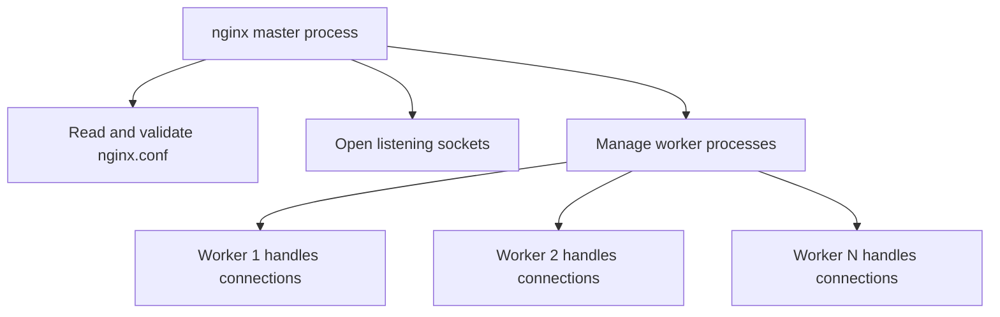

## TL;DR

Nginx is an event-driven web server, reverse proxy, load balancer, TLS terminator, cache, and traffic control point. Its architecture is built around a master process that manages configuration and worker processes that handle client connections efficiently. For an SRE, Nginx matters because it often sits directly on the request path, so configuration mistakes can cause outages, security exposure, bad caching, failed TLS, or misleading observability.

See also: [Webserver overview](webserver_overview.md), [Reverse proxy](reverse_proxy.md), [Load balancer](load_balancer.md), [Caching](caching.md), [Logging](logging.md), [Access control](access_control.md), [HTTP compression](http_compression.md), [Static assets](static_assets.md), [HTTP protocol](http_protocol.md), and [Cryptography](cryptography.md).

## Nginx architecture

Nginx uses a small master process and one or more worker processes. The master process reads and validates configuration, opens listening sockets, manages worker lifecycle, and handles reloads. Worker processes do the actual request processing: accepting connections, reading requests, serving static files, proxying upstream traffic, writing logs, and applying configured modules.

This design is important operationally because reloads can be graceful. A valid config can be loaded by the master, new workers can start, and old workers can drain existing connections. This is one reason Nginx is commonly used for high-traffic edge and internal service proxy workloads.



Common package defaults:

- Configuration file: `/etc/nginx/nginx.conf`
- Runtime user: `nginx`
- Logs: `/var/log/nginx`
- Example RPM: `nginx-1.20.1-1.el7.ngx.x86_64.rpm`
- Example OS: CentOS 7

Use this command to see the master and worker process model.

```bash
# Show the Nginx master process and worker processes.
[root@centos ~]# ps -ef | grep nginx | grep -v grep
root       623     1  0 Mar26 ?        00:00:00 nginx: master process /usr/sbin/nginx
nginx      627   623  0 Mar26 ?        00:00:00 nginx: worker process
[root@centos ~]#
```

### master process

The master process reads and evaluates the configuration file and maintains the worker processes. It runs with the privileges required to bind low ports and manage workers. During reloads, it starts new workers with the new configuration and gracefully retires old workers where possible.

### worker process

Worker processes perform the actual request processing. They use an event loop rather than one thread per connection, which allows Nginx to handle many concurrent connections with relatively low overhead. There can be one or more worker processes depending on configuration and CPU capacity.

The `worker_processes` directive controls how many workers Nginx starts. When set to `auto`, Nginx detects the number of available CPUs and launches worker processes accordingly. Directives such as `error_log` and `pid` define where Nginx writes error logs and stores the master process PID.

Nginx can include additional configuration instead of putting every directive in the main file. For example, `include /usr/share/nginx/modules/*.conf;` loads module configuration snippets. This keeps the main file smaller and makes packaged modules easier to manage.

The `worker_connections` directive sets the maximum number of simultaneous connections that can be opened by a worker process. Total capacity is not just `worker_processes * worker_connections`; it also depends on file descriptor limits, upstream connections, keepalive behavior, kernel tuning, and available CPU/memory.

## contexts

The Nginx configuration file is divided into contexts, also called sections. Each context contains directives that control a specific aspect of Nginx. Understanding context scope matters because a directive may be valid in one context and invalid or ignored in another.

Any directive that exists entirely outside a named context is in the `main` context. The main context configures details that affect the whole Nginx application, such as worker count, user, PID file, error log, and module loading.

Common top-level contexts include:

- `main`: global Nginx process settings.
- `events`: connection processing settings, such as worker connection limits.
- `http`: HTTP and HTTPS server behavior.
- `mail`: mail proxy behavior.

Use this command to inspect the main Nginx configuration.

```nginx
# Example top-level Nginx contexts from /etc/nginx/nginx.conf.
cat /etc/nginx/nginx.conf
<snip>
events {
    worker_connections 1024;
}

http {
    log_format  main
}
<snip>
```

### http

The `http` context contains the directives and nested contexts necessary to handle HTTP and HTTPS connections. It usually includes MIME types, default content type, logging format, access log location, sendfile behavior, keepalive settings, compression, and `server` blocks from `/etc/nginx/conf.d/*.conf`.

This context is where most web server, reverse proxy, TLS, caching, and routing behavior begins. For SREs, this is also where many production mistakes happen: incorrect includes, inherited settings, wrong log format, missing timeouts, and broad defaults.

```nginx
# Example HTTP context with logging, file serving, keepalive, and included server configs.
http {
    include       /etc/nginx/mime.types;
    default_type  application/octet-stream;

    log_format  main  '$remote_addr - $remote_user [$time_local] "$request" '
                      '$status $body_bytes_sent "$http_referer" '
                      '"$http_user_agent" "$http_x_forwarded_for"';

    access_log  /var/log/nginx/access.log  main;

    sendfile        on;
    #tcp_nopush     on;

    keepalive_timeout  65;

    #gzip  on;

    include /etc/nginx/conf.d/*.conf;
}
```

### custom config

You can create a custom config file under `/etc/nginx/conf.d/`. This is commonly how teams add one site, reverse proxy, or service route without editing the main `nginx.conf`. Change the `location` and document root to match your application.

Use this example to serve a default static site from `/usr/share/nginx/html`.

```nginx
# Example default server block serving static files from the Nginx document root.
[root@centos conf.d]# pwd
/etc/nginx/conf.d
[root@centos conf.d]# cat default.conf  | grep -v '#'
server {
    listen       80;
    server_name  localhost;
    location / {
        root   /usr/share/nginx/html;
        index  index.html index.htm;
    }
    error_page   500 502 503 504  /50x.html;
    location = /50x.html {
        root   /usr/share/nginx/html;
    }
}
```

Always run `nginx -t` before reload or restart. Syntax validation is cheap and catches many mistakes before they hit live traffic.

### Configure multiple websites or domains

Multiple sites are usually configured with separate `server` blocks. Each server block can listen on a different port, bind to different names with `server_name`, write to different logs, and serve content from different roots. This pattern is also used for virtual hosts, internal tools, tenant-specific routing, and lab environments.

Use this example to configure a second site on port `8080`.

```nginx
# Configure a second server block, restart Nginx, test it with curl, and inspect its access log.
[root@centos conf.d]# cat /etc/nginx/conf.d/dexter.conf
server {
    listen       8080;
    server_name  localhost;

    access_log  /var/log/nginx/dexter.access.log  main;

    location / {
        root   /usr/share/nginx/html/dexter;
        index  index.html;
    }
}
[root@centos conf.d]# systemctl restart nginx
[root@centos conf.d]# curl http://192.168.56.10:8080/index.html
this is an multiple site configured at nginx for domain dexter
[root@centos conf.d]#


[root@centos conf.d]# ls /var/log/nginx/dexter.access.log
/var/log/nginx/dexter.access.log
[root@centos conf.d]# cat /var/log/nginx/dexter.access.log
192.168.56.1 - - [27/Mar/2024:10:45:26 +0000] "GET /index.html HTTP/1.1" 200 63 "-" "Mozilla/5.0 (Macintosh; Intel Mac OS X 10_15_7) AppleWebKit/537.36 (KHTML, like Gecko) Chrome/123.0.0.0 Safari/537.36" "-"
192.168.56.10 - - [27/Mar/2024:10:45:40 +0000] "GET /index.html HTTP/1.1" 200 63 "-" "curl/7.29.0" "-"
192.168.56.10 - - [27/Mar/2024:10:46:27 +0000] "GET /index.html HTTP/1.1" 200 63 "-" "curl/7.29.0" "-"
[root@centos conf.d]#
```

For production, prefer `systemctl reload nginx` after a successful syntax test when only configuration changed. Restarting is sometimes necessary, but reloads usually reduce disruption.

## nginx cli

The Nginx CLI is used for version checks, syntax validation, alternate config testing, and operational control. SREs should make `nginx -t` part of every deployment pipeline or runbook before reloading Nginx.

```bash
# Show version, build details, validate config, test alternate config, and display help.
nginx -v
nginx -V
nginx -t
nginx -c new_nginx.conf
nginx -h
```

## modular architecture

Modular architecture refers to a system composed of separate components that can be connected together. Nginx extends functionality through modules for features such as SSL/TLS, gzip, HTTP/2, stream proxying, image filtering, headers manipulation, and third-party capabilities. Modules are powerful, but they also affect upgrade risk and supportability.

### static modules

Static modules are compiled into the Nginx server binary at build time. They are packaged as part of a single binary and work out of the box. The tradeoff is operational flexibility: if one module has a bug or needs an upgrade, you may need to rebuild or replace the whole binary.

### dynamic modules

Dynamic modules are built or downloaded as separate module files and loaded with the `load_module` directive. They make it easier to add or remove functionality without compiling everything into the main binary. The module must still be compatible with the Nginx version and build options.

### install using source module

Building from source is useful for learning, lab work, and specialized module requirements. In production, prefer vendor packages or reproducible builds because source-built binaries need their own patching and security lifecycle.

Use this example to download Nginx source, install build dependencies, configure paths, compile with a third-party module, and prepare runtime directories.

```bash
# Download Nginx source, install dependencies, configure build paths, and prepare the nginx user/runtime directories.
http://nginx.org/en/download.html

wget http://nginx.org/download/nginx-1.16.0.tar.gz
tar -xzvf nginx-1.16.0.tar.gz
yum -y install gcc make zlib-devel pcre-devel openssl-devel wget nano

./configure --prefix=/usr/share/nginx --sbin-path=/usr/sbin/nginx --modules-path=/usr/lib64/nginx/modules --conf-path=/etc/nginx/nginx.conf --error-log-path=/var/log/nginx/error.log --http-log-path=/var/log/nginx/access.log --http-client-body-temp-path=/var/lib/nginx/tmp/client_body --pid-path=/var/run/nginx.pid --lock-path=/var/lock/subsys/nginx --user=nginx --group=nginx --with-http_mp4_module --add-module=../nginx-hello-world-module

useradd Nginx
mkdir -p /var/lib/nginx/tmp/
chown -R nginx.nginx /var/lib/nginx/tmp/

SystemD file

https://www.nginx.com/resources/wiki/start/topics/examples/systemd/
```

### build dynamic module

Dynamic modules are loaded from the global section of the configuration, usually before the `events` and `http` blocks. After loading the module, its directives can be used in the appropriate context.

Use this example to build and load a dynamic hello-world module.

```bash
# Install git, clone a sample module, build it as a dynamic module, load it, and test its endpoint.
yum -y install git
git clone https://github.com/perusio/nginx-hello-world-module
./configure --add-dynamic-module=../nginx-hello-world-module

vim /etc/nginx/conf.d/nginx.conf
load_module /etc/nginx/modules/something.so

server {
    listen 8080;

    location = /test {
        hello_world;
    }
}

curl -i http://example.com/test
```

Reference: https://github.com/perusio/nginx-hello-world-module

### build static module

Static modules do not use the `load_module` directive. They are compiled directly into the Nginx binary by passing `--add-module` during source configuration.

Use this example to compile a static hello-world module, install it, configure a server block, and test the endpoint.

```bash
# Build Nginx with a statically compiled module, install it, configure a route, and test it.
./configure --prefix=/usr/share/nginx --sbin-path=/usr/sbin/nginx --modules-path=/usr/lib64/nginx/modules --conf-path=/etc/nginx/nginx.conf --error-log-path=/var/log/nginx/error.log --http-log-path=/var/log/nginx/access.log --http-client-body-temp-path=/var/lib/nginx/tmp/client_body --pid-path=/var/run/nginx.pid --lock-path=/var/lock/subsys/nginx --user=nginx --group=nginx --with-http_mp4_module --add-module=../nginx-hello-world-module

make
make install


server {
listen 8080;

location / {
     hello_world;
  }
}


systemctl restart nginx
curl localhost:8080
```

## web application firewall(waf)

A Web Application Firewall (WAF) is a security control designed to protect web applications by monitoring, filtering, and potentially blocking HTTP traffic between a web application and the internet. WAFs provide an additional layer of defense against common application-layer attacks, but they do not replace secure application code, authentication, authorization, patching, and input validation.

Nginx can sit near WAF controls in several ways: behind a cloud WAF, in front of an application with ModSecurity/NGINX App Protect-style modules, or as part of a layered ingress stack. For SREs, the operational risk is false positives and silent blocking, so WAF rules need logging, tuning, alerting, and clear rollback.

Common attack classes WAFs help detect or block include:

- SQL Injection (SQLi)
- Cross-Site Scripting (XSS)
- Cross-Site Request Forgery (CSRF)
- File Inclusion
- Directory Traversal
- Brute Force Attacks
- Denial-of-Service (DoS)
- Distributed Denial-of-Service (DDoS)

### Signature-based Detection

WAFs use predefined signatures or patterns to identify known attacks and malicious traffic. This is effective for common exploit strings and known payloads, but signatures can miss novel attacks or create false positives against unusual legitimate traffic.

### Behavioral Analysis

Some advanced WAFs use machine learning or heuristic algorithms to analyze traffic patterns and detect anomalies. This can help identify abuse patterns that do not match a static signature. The tradeoff is that behavioral controls need baselines, tuning, and careful rollout.

### Request Inspection

WAFs inspect HTTP requests and responses by analyzing parameters, headers, payloads, and other attributes. This helps detect suspicious activity such as malformed input, unexpected methods, or payloads targeting known vulnerabilities.

### Traffic Filtering

WAFs can filter and block traffic based on predefined rules, such as IP addresses, user agents, request methods, paths, or payloads. These controls are useful for emergency mitigation, but broad filters can block legitimate clients if they are not scoped carefully.

### Protocol Validation

WAFs validate incoming requests against HTTP standards and application-specific expectations. This can block malformed or malicious requests before they reach the application. Protocol validation is especially useful at internet-facing edges.

### Logging and Reporting

WAFs provide logs and reports detailing detected threats, blocked requests, and security events. These logs are essential during incident response because they show what was blocked, what was allowed, and whether a rule is causing customer impact.

## Common Pitfalls

- Reloading or restarting Nginx without running `nginx -t`. Syntax validation should be a reflex.
- Forgetting that directive scope matters. A directive in the wrong context may fail validation or behave differently than expected.
- Setting worker limits without checking file descriptor limits, upstream connection counts, and keepalive behavior.
- Using source-built Nginx in production without a patching and rebuild process.
- Loading third-party modules without version compatibility checks.
- Treating a WAF as a complete security solution. It is one layer, not a substitute for secure application design.
- Restarting instead of gracefully reloading during routine config changes.

## Interview Questions

- Explain the Nginx master/worker process model.
- What does `worker_connections` control?
- What are Nginx contexts, and why do they matter?
- What is the difference between a `server` block and a `location` block?
- How would you configure multiple sites on one Nginx instance?
- What is the difference between `nginx -v`, `nginx -V`, and `nginx -t`?
- Compare static and dynamic Nginx modules.
- What are the operational risks of third-party modules?
- How does a WAF protect a web application?
- How would you safely roll out a risky Nginx configuration change?

## Key Takeaways

Nginx is efficient because the master process manages configuration and workers handle many connections through an event-driven model. Most operational work is about safe configuration, validation, reloads, logging, and understanding directive scope.

Modules and WAF controls extend Nginx significantly, but they also add lifecycle and debugging responsibility. Treat Nginx as production infrastructure: version it, test it, monitor it, and roll it out with the same care as application code.

See also: [Webserver overview](webserver_overview.md), [Reverse proxy](reverse_proxy.md), [Load balancer](load_balancer.md), [Caching](caching.md), [Logging](logging.md), [Access control](access_control.md), [HTTP compression](http_compression.md), [Static assets](static_assets.md), [HTTP protocol](http_protocol.md), and [Cryptography](cryptography.md).
