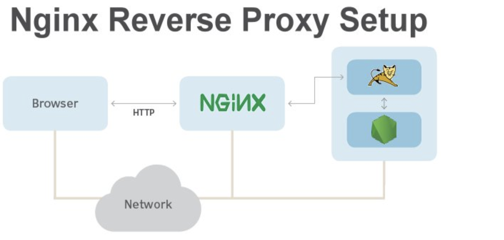
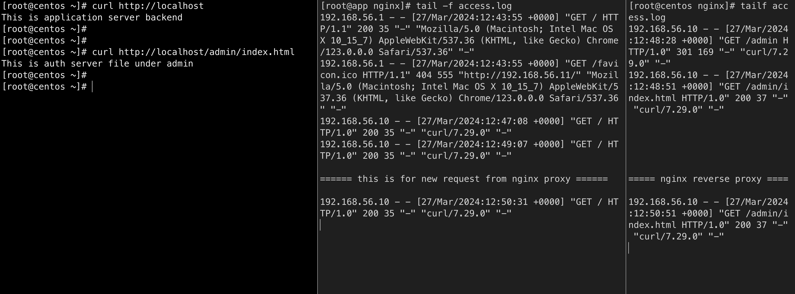

reverse proxy is type of proxy server which retrives resources onbehalf of the coient from one or more servers

**use cases:**

- it hides existance of the original backend servers
- can protect tthe backend server from webbased attacks, DOS etc 
- can provide great caching functionality
- can optimize the content by compressing it 
- can act as SSL terminating proxy
- request routing.. etc 

## Reverse Proxy Setup

**proxy_pass**

directive forwards the request to the proxied servers specified along with the directive. 

1st - Nginx Reverse Proxy(192.168.56.10)
2nd - Application Server(192.168.56.11)
3rd - Authentication Server(192.168.56.12)

**BaseConfigurations for all 3 servers**

yum install -y wget net-tools
wget https://nginx.org/packages/rhel/7/x86_64/RPMS/nginx-1.20.1-1.el7.ngx.x86_64.rpm
yum -y install nginx-1.20.1-1.el7.ngx.x86_64.rpm
systemctl start nginx
systemctl enable nginx
setenforce 0
reboot

**application server:**
cd /usr/share/nginx/html
echo "This is application server backend" > index.html

**auth server:**
mkdir /usr/share/nginx/html/admin
echo "This is auth server file under admin" > /usr/share/nginx/html/admin/index.html

**Proxy server:**

cd /etc/nginx/conf.d
nano proxy.conf
server {
    listen       80;
    server_name  localhost;
 
    location / {
        proxy_pass http://192.168.56.11;
    }
 
    location /admin {
        proxy_pass http://192.168.56.12;
      }
}
nginx -t
systemctl restart nginx

You can now see if the request is made from the client, it would first get to the nginx server and then would reverse proxy the response from the application or the auth server to the client. These are being logged into the application or auth nginx logs..

## X-Real-IP

**Problem statement**

original webservers would require an originating ip address to send response

When the client sends a request to the web server through the reverse proxy, its always as usual that the backend web application would be only knowing the reverse proxy instead of original client server. sometime in the production environment the application servers would require to bind the originating ip address to send the respose. so in that case we need to use x-real-ip so that the reverse proxy would send the ip address of the client to the application server. 

**Configuration**

**Reverse Proxy Side**
vim /etc/nginx/conf.d/proxy.conf
proxy_set_header X-Real-IP $remote_addr;

**Backend Server Side**
vim /etc/nginx/nginx.conf
"$http_x_real_ip"

so now, it would log the remote(original) ip address to the application server along with the proxy.

## proxy host header

**problem statement**
