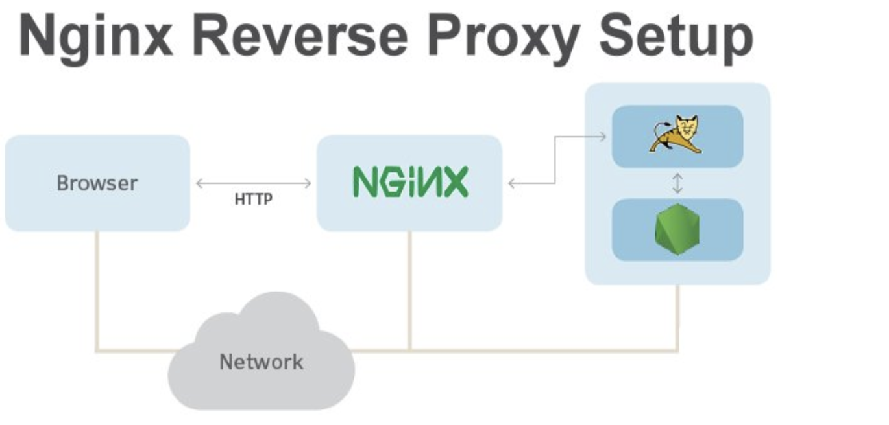
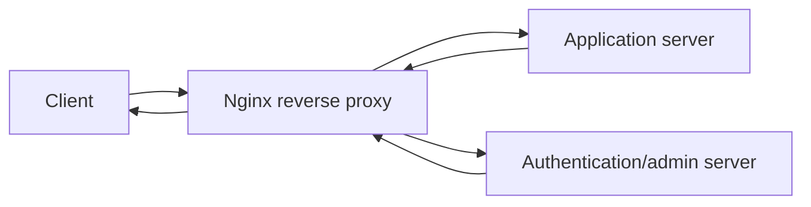
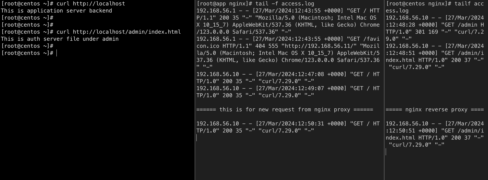

## TL;DR

A reverse proxy receives client requests and retrieves resources on behalf of the client from one or more backend servers. In Nginx, reverse proxying is primarily configured with `proxy_pass`, plus headers, timeouts, buffering, TLS, and logging controls. For an SRE, reverse proxies matter because they sit between users and applications, shaping reliability, observability, security, routing, and failure modes.

See also: [Nginx overview](nginx_overview.md), [Webserver overview](webserver_overview.md), [HTTP protocol](http_protocol.md), [Load balancer](load_balancer.md), [Caching](caching.md), [Access control](access_control.md), [Logging](logging.md), and [Cryptography](cryptography.md).

## Reverse proxy overview

A reverse proxy is a type of proxy server that retrieves resources on behalf of a client from one or more backend servers. The client connects to the proxy, not directly to the backend. The backend sees the proxy as its immediate peer unless the proxy forwards client metadata through headers.




```mermaid
flowchart LR
    A[Client] --> B[Nginx reverse proxy]
    B --> C[Application server]
    B --> D[Authentication/admin server]
    C --> B
    D --> B
    B --> A
```

Use cases:

- It hides the existence and network location of original backend servers. This reduces direct exposure and lets backends live on private networks.
- It can protect backend servers from some web-based attacks and denial-of-service patterns. A reverse proxy can enforce request size limits, rate limits, TLS policy, access controls, and WAF rules before traffic reaches the app.
- It can provide caching functionality. Cacheable responses can be served by Nginx instead of repeatedly hitting upstream services.
- It can optimize content by compressing responses. Compression reduces bandwidth usage and can improve page load time for text-heavy assets.
- It can act as an SSL/TLS terminating proxy. The proxy handles HTTPS from clients and can communicate with backends over HTTP or HTTPS depending on trust boundaries.
- It can perform request routing. Paths, hostnames, headers, and ports can route traffic to different upstream services.

## Reverse Proxy Setup

The `proxy_pass` directive forwards a request to the proxied server specified by the directive. A simple `location` block can proxy all requests to one backend, while additional `location` blocks can route specific paths to different backends.

Example lab topology:

- 1st server: Nginx Reverse Proxy (`192.168.56.10`)
- 2nd server: Application Server (`192.168.56.11`)
- 3rd server: Authentication Server (`192.168.56.12`)

### BaseConfigurations for all 3 servers

Install Nginx and start the service on all three servers.

```bash
# Install Nginx from the official RPM, start it, enable it, and reboot after SELinux mode change.
yum install -y wget net-tools
wget https://nginx.org/packages/rhel/7/x86_64/RPMS/nginx-1.20.1-1.el7.ngx.x86_64.rpm
yum -y install nginx-1.20.1-1.el7.ngx.x86_64.rpm
systemctl start nginx
systemctl enable nginx
setenforce 0
reboot
```

For a real production system, avoid disabling SELinux as a default fix. Instead, inspect denials and configure the correct SELinux context or boolean. It is disabled here only because the original lab is focused on reverse proxy behavior.

### application server

Create a simple static page on the application server so the proxy target is easy to identify.

```bash
# Create a visible response body on the application backend.
cd /usr/share/nginx/html
echo "This is application server backend" > index.html
```

### auth server

Create an `/admin` page on the authentication server.

```bash
# Create a visible response body for the admin/auth backend path.
mkdir /usr/share/nginx/html/admin
echo "This is auth server file under admin" > /usr/share/nginx/html/admin/index.html
```

### Proxy server

Create a proxy config on the reverse proxy host. Requests to `/` go to the application server, while requests to `/admin` go to the authentication server.

```nginx
# Route normal traffic to the app backend and /admin traffic to the auth backend.
cd /etc/nginx/conf.d
nano proxy.conf
server {
    listen       80;
    server_name  localhost;

    location / {
        proxy_pass http://192.168.56.11;
    }

    location /admin {
        proxy_pass http://192.168.56.12;
      }
}
nginx -t
systemctl restart nginx
```

You can now see that a request from the client reaches the Nginx reverse proxy first. Nginx then proxies the request to either the application server or authentication server and returns that backend response to the client. The backend Nginx access logs will show requests from the proxy unless client IP forwarding is configured.



## X-Real-IP

### Problem statement

Original webservers often require the originating client IP address for logging, auditing, rate limiting, fraud detection, geo logic, or application behavior. When a client sends a request through a reverse proxy, the backend application normally sees the reverse proxy IP as the remote address. That is accurate at the TCP layer, but it hides the real client unless the proxy forwards it in a header.

`X-Real-IP` is one common header used to pass the original client IP from Nginx to the backend. In production, also understand `X-Forwarded-For`, `X-Forwarded-Proto`, and trusted proxy configuration, because untrusted clients can spoof these headers if the edge proxy does not sanitize them.

### Configuration

### Reverse Proxy Side

Add `proxy_set_header X-Real-IP $remote_addr;` to the proxied location.

```nginx
# Forward the direct client IP seen by Nginx to the backend in X-Real-IP.
vim /etc/nginx/conf.d/proxy.conf
proxy_set_header X-Real-IP $remote_addr;
```

### Backend Server Side

Update the backend log format to include the forwarded client IP header.

```nginx
# Add $http_x_real_ip to the log format so backend logs include the original client IP sent by the proxy.
vim /etc/nginx/nginx.conf

# append $http_x_real_ip at the end of the line.
log_format  main  '$remote_addr - $remote_user [$time_local] "$request" '
                    '$status $body_bytes_sent "$http_referer" '
                    '"$http_user_agent" "$http_x_forwarded_for" **"$http_x_real_ip"**';

nginx -t
systemctl restart nginx
```

Now the backend logs include both the proxy IP and the original client IP sent in `X-Real-IP`. This is useful during incident response because it lets you identify real callers instead of only seeing the proxy.

## proxy host header

### problem statement

The `Host` header received at the reverse proxy level may not be forwarded to the backend server in the way the application expects. If multiple websites are hosted on the application server, backend virtual host routing may depend on the original `Host` header. If the proxy sends the backend IP as `Host`, the backend may serve the wrong site or return a default response.

The common production pattern is to forward the original host with `proxy_set_header Host $host;`. The original lab uses a custom `Host-Header` header to demonstrate that headers are passed from the reverse proxy to the backend.

### Reverse Proxy Level

Configure the reverse proxy to pass client metadata and a host-related header to the backend.

```nginx
# Configure proxy headers and route traffic to backend servers.
[root@centos ~]# cat /etc/nginx/conf.d/proxy.conf
server {
    listen       80;
    server_name  localhost;

    location / {
        proxy_pass http://192.168.56.11;
        proxy_set_header X-Real-IP $remote_addr;
        proxy_set_header Host-Header $host;
    }

    location /admin {
        proxy_pass http://192.168.56.12;
        proxy_set_header X-Real-IP $remote_addr;
      }
}
[root@centos ~]#systemctl restart nginx

[root@centos ~]# curl localhost
This is application server backend
[root@centos ~]#
```

For real backend virtual hosting, prefer this header unless you have a specific reason to use a custom name:

```nginx
# Preserve the original Host header for backend virtual host routing.
proxy_set_header Host $host;
```

### Backend Server Level

Capture traffic on the backend to prove the proxy forwards the custom header.

```bash
# Capture backend HTTP traffic and inspect forwarded headers.
yum -y install tcpdump
tcpdump -A -vvvv -s 9999 -i eth1 port 80 > /tmp/headers

cat /tmp/headers

GET / HTTP/1.0
X-Real-IP: 127.0.0.1
Host-Header: localhost -> headers are passed from reverse proxy to backend
Host: 192.168.56.11
Connection: close
User-Agent: curl/7.29.0
Accept: */*
```

This capture shows that custom headers added by Nginx are visible to the backend. It also shows why backend logs and packet captures are valuable when debugging proxy behavior: they reveal what the backend actually received, not just what the client originally sent.

## Common Pitfalls

- Forgetting to forward the original `Host` header. This can break backend virtual hosts, redirects, and application-generated URLs.
- Trusting `X-Forwarded-For` from any client. Only trust forwarded headers from known proxies, and overwrite incoming spoofed values at the edge.
- Restarting Nginx without running `nginx -t`.
- Using `systemctl restart nginx` for every config change when graceful reload would be safer.
- Missing timeouts such as `proxy_connect_timeout`, `proxy_read_timeout`, and `proxy_send_timeout` for slow upstreams.
- Assuming the backend sees the real client IP at the TCP layer. It sees the proxy unless forwarded headers and trusted proxy handling are configured.
- Disabling SELinux instead of fixing policy for the proxy-to-backend network connection.

## Interview Questions

- What is a reverse proxy, and how is it different from a forward proxy?
- What does `proxy_pass` do in Nginx?
- Why do backend servers often see the proxy IP instead of the client IP?
- What is the difference between `X-Real-IP` and `X-Forwarded-For`?
- Why does the `Host` header matter for backend routing?
- How would you troubleshoot a `502 Bad Gateway` from Nginx?
- What logs would you check on the proxy and backend?
- How can a reverse proxy improve security?
- What are the risks of trusting client-supplied forwarded headers?
- How would you safely roll out a reverse proxy config change?

## Key Takeaways

Nginx reverse proxying is fundamentally request routing plus metadata preservation. `proxy_pass` chooses the backend, while headers such as `Host`, `X-Real-IP`, and `X-Forwarded-*` preserve information the backend needs.

A reverse proxy is an operational choke point. Configure it carefully, validate changes with `nginx -t`, observe both proxy and backend logs, and treat forwarded headers as security-sensitive data.

See also: [Nginx overview](nginx_overview.md), [Webserver overview](webserver_overview.md), [HTTP protocol](http_protocol.md), [Load balancer](load_balancer.md), [Caching](caching.md), [Access control](access_control.md), [Logging](logging.md), and [Cryptography](cryptography.md).
