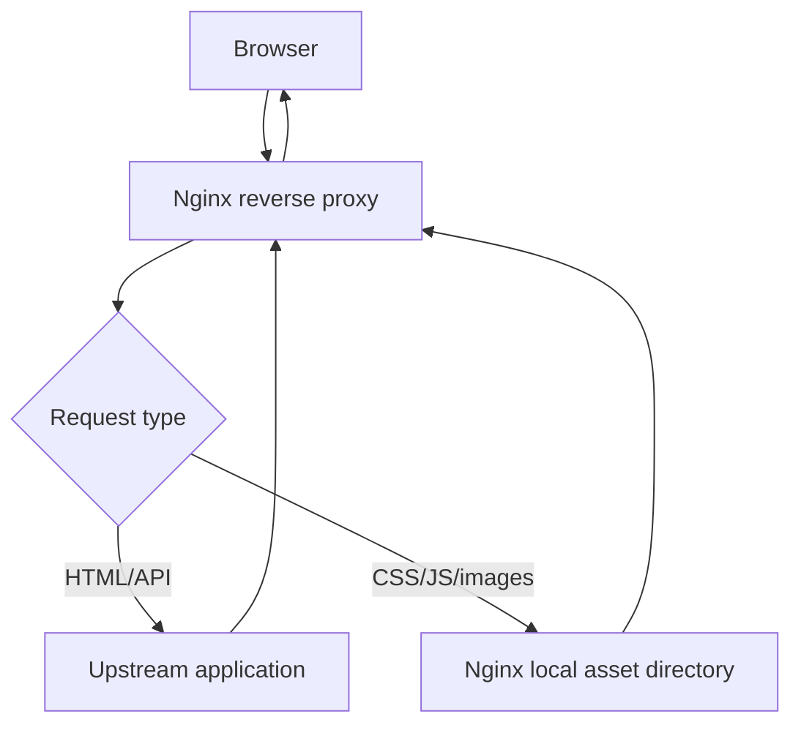

## TL;DR

Static assets are files such as CSS, JavaScript, images, fonts, and downloads that can usually be served directly by Nginx without involving the upstream application. Serving static assets from Nginx reduces upstream load, improves latency, and makes caching easier. For an SRE, static asset handling matters because bad paths, stale assets, missing cache headers, or excessive upstream asset traffic can hurt both performance and reliability.

See also: [Nginx overview](nginx_overview.md), [Webserver overview](webserver_overview.md), [Reverse proxy](reverse_proxy.md), [Caching](caching.md), [HTTP compression](http_compression.md), and [Logging](logging.md).

## Overview

When a client requests a web page, the browser first downloads the HTML document. That HTML usually references many static assets such as `.png`, `.jpg`, `.js`, `.css`, fonts, and icons. If Nginx is only configured as a reverse proxy, those asset requests may be forwarded to the upstream application server, increasing backend request count and resource usage.

If static content is served directly from the Nginx reverse proxy, the upstream application only needs to serve dynamic pages such as `index.html` or API responses. Nginx can serve assets from local disk very efficiently, apply cache headers, compress text assets, and avoid unnecessary upstream calls.



Try to load the application and check the Nginx access logs. Before static asset offload, you may find many GET requests reaching the upstream server for static content. After offload, those requests should be served by the Nginx proxy host instead.

## configure

The example below proxies dynamic requests to the application server and serves static assets from `/var/www/assets` on the Nginx reverse proxy. The regex location matches common static file extensions and uses `try_files` to return the local file if it exists.

```nginx
# Proxy dynamic requests to the app server and serve static assets from local Nginx disk.
vim /etc/nginx/conf.d/proxy.conf

server {
    server_name yourweb.in;

    location / {
        proxy_pass http://192.168.56.10;
        proxy_set_header Host $host;
    }

    # Configure your static assets to load from the Nginx reverse proxy.
    location ~* \.(css|js|jp?g|JPG|png|PNG) {
        root /var/www/assets;
        try_files $uri $uri/;
    }
}

nginx -t
systemctl restart nginx
```

Use `nginx -t` before reload or restart so path or syntax mistakes do not take down the proxy. In production, prefer `systemctl reload nginx` for config-only changes after validation.

On your application server, copy static asset directories to the Nginx server.

```bash
# Copy JavaScript, CSS, and image/static directories from the app server to the Nginx asset directory.
scp -r /var/www/html/js <nginxsverer>@:/var/www/assets/
scp -r /var/www/html/css <nginxsverer>@:/var/www/assets/
scp -r /var/www/html/master <nginxsverer>@:/var/www/assets/
```

Open your application and inspect `/var/log/nginx/access.log`. You should see fewer GET requests on the upstream server because Nginx now serves matching static assets locally.

## Asset path behavior

The `root` directive builds the file path by appending the request URI to the configured root. For example, with `root /var/www/assets;`, a request for `/js/app.js` maps to `/var/www/assets/js/app.js`. This is simple, but the directory layout on disk must match the URL path.

If your URL path should map differently than the filesystem path, consider `alias` instead of `root`. Misunderstanding `root` versus `alias` is a common cause of `404 Not Found` for static assets.

## Caching and compression

Static assets are usually good candidates for caching. Versioned or fingerprinted assets such as `app.3f4a9c.js` can be cached for a long time because deployments create new filenames. Non-versioned files such as `/app.js` should use shorter cache lifetimes or conditional validation.

```nginx
# Serve common static assets with a seven-day cache lifetime.
location ~* \.(css|js|jpg|jpeg|png|gif|svg|ico)$ {
    root /var/www/assets;
    expires 7d;
    add_header Cache-Control "public";
    try_files $uri =404;
}
```

Text assets such as CSS, JavaScript, SVG, and JSON often benefit from gzip or Brotli compression. Images such as PNG and JPEG are already compressed, so compressing them again usually provides little value.

## Operational checks

Use these commands to validate static asset behavior from the client and server side.

```bash
# Check headers, status, content type, and cache policy for a static asset.
curl -I http://yourweb.in/js/app.js

# Confirm the asset exists at the expected local filesystem path.
ls -l /var/www/assets/js/app.js

# Watch Nginx access logs while loading the page.
tail -f /var/log/nginx/access.log
```

If the browser page loads but styling or JavaScript is broken, inspect the browser network tab and Nginx logs for `404`, wrong `Content-Type`, caching mistakes, or mixed HTTP/HTTPS asset URLs.

## Common Pitfalls

- Copying assets to a path that does not match the URL layout expected by `root`.
- Forgetting `nginx -t` before reloading.
- Serving stale assets after deployment because filenames are not versioned.
- Applying long cache lifetimes to non-versioned assets.
- Proxying all asset requests to the upstream app and overloading it unnecessarily.
- Returning the wrong MIME type because `mime.types` is not included.
- Using case-sensitive extension patterns that miss real asset filenames.

## Interview Questions

- Why serve static assets directly from Nginx instead of an upstream app?
- What is the difference between `root` and `alias` in Nginx?
- How do static assets affect upstream load?
- Which assets are good candidates for long cache lifetimes?
- Why are fingerprinted filenames useful?
- How would you debug missing CSS or JavaScript after an Nginx change?
- What logs would you check to confirm asset offload is working?
- Why should images usually not be gzip-compressed again?

## Key Takeaways

Static asset offload is a simple performance win: let Nginx serve files it can handle efficiently and keep upstream application capacity for dynamic work. The main risks are incorrect paths, stale cache rules, and deployment drift between the application and asset directory.

For production, combine local static serving with correct MIME types, cache headers, compression for text assets, access logs, and a repeatable asset deployment process.

See also: [Nginx overview](nginx_overview.md), [Webserver overview](webserver_overview.md), [Reverse proxy](reverse_proxy.md), [Caching](caching.md), [HTTP compression](http_compression.md), and [Logging](logging.md).
