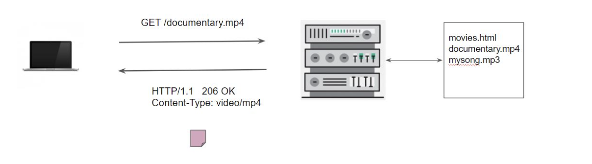

## introduction

webserver is a program that uses HTTP to serve the web pages to users in response to their request. 
e.g Apache, nginx, IIS

**How web server works?**



**Client Request**: When a user wants to access a web page or resource, they send a request from their web browser to the web server. This request includes the URL (Uniform Resource Locator) of the desired resource.

**Routing and Processing:** The web server receives the request and determines which resource the client is asking for based on the URL provided. It then processes the request, which may involve executing scripts, querying databases, or accessing files.

**Resource Retrieval:** If the requested resource is a static file (such as an HTML, CSS, or image file), the web server retrieves it directly from its file system and sends it back to the client. If the resource is dynamic (generated by a script or retrieved from a database), the web server executes the necessary code to generate the content.

**Response Generation:** Once the requested resource has been processed or retrieved, the web server generates an HTTP (Hypertext Transfer Protocol) response. This response includes headers with metadata about the resource and a body containing the actual content.

**Sending Response:** The web server sends the HTTP response back to the client over the internet.

**Client Rendering:** The client's web browser receives the response and renders the content to display it to the user. This may involve parsing HTML, applying CSS styles, executing JavaScript, and rendering images.

nginx is more than a webserver and it can accomplish like

- reverse proxy
- load balancing
- HTTP caching

## installation 

CentOS 7/8

```
yum install epel-release -y
yum install nginx -y
systemctl start nginx
systemctl enable nginx
nginx -V
```