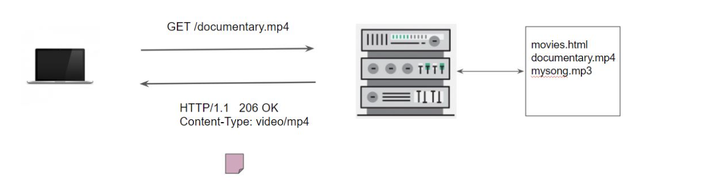
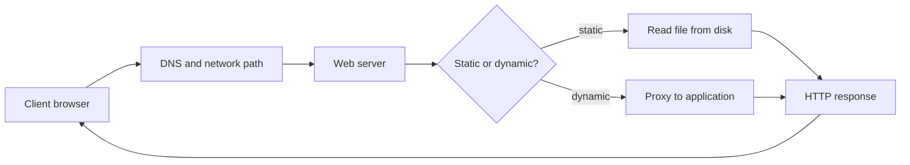

## TL;DR

A web server accepts client HTTP requests, maps each request to content or an upstream application, and returns an HTTP response. Nginx can serve static files directly, proxy dynamic requests, terminate TLS, compress responses, cache content, and balance traffic across backends. For an SRE, webserver fundamentals matter because availability, latency, security, and observability are all shaped at this layer.

See also: [Nginx overview](nginx_overview.md), [HTTP protocol](http_protocol.md), [Reverse proxy](reverse_proxy.md), [Load balancer](load_balancer.md), [Static assets](static_assets.md), [Caching](caching.md), and [Logging](logging.md).

## introduction

A webserver is a program that uses HTTP to serve web pages or resources to users in response to their requests. Common examples include Apache HTTP Server, Nginx, and Microsoft IIS. A webserver may serve files from disk, forward requests to an application process, apply TLS, write logs, enforce access rules, and return errors when a resource or upstream service is unavailable.

In production, the webserver is often the first service a client reaches after DNS and load balancing. That makes it a critical control point for request routing, static asset delivery, redirects, rate limiting, TLS policy, caching, and incident diagnostics.

### How web server works?




```mermaid
flowchart LR
    A[Client browser] --> B[DNS and network path]
    B --> C[Web server]
    C --> D{Static or dynamic?}
    D -- static --> E[Read file from disk]
    D -- dynamic --> F[Proxy to application]
    E --> G[HTTP response]
    F --> G
    G --> A
```

### Client Request

When a user wants to access a web page or resource, their browser sends a request to the webserver. This request includes a URL, HTTP method, headers, cookies, and sometimes a request body. From an SRE perspective, the request metadata is important because it explains what the user asked for and often appears in access logs.

### Routing and Processing

The webserver receives the request and determines which resource the client is asking for based on the URL, host header, port, and configured routing rules. It may choose a static file, rewrite or redirect the request, apply authentication, or pass the request to an upstream application. Incorrect routing is a common cause of 404s, redirect loops, and traffic reaching the wrong service.

### Resource Retrieval

If the requested resource is a static file, such as HTML, CSS, JavaScript, or an image, the webserver retrieves it directly from the filesystem and sends it back to the client. If the resource is dynamic, the webserver usually forwards the request to an application server that executes code, queries databases, or calls other services. This split is why Nginx is often used in front of application frameworks.

### Response Generation

Once the requested resource has been processed or retrieved, the webserver generates an HTTP response. The response includes a status code, headers, and a body containing the actual content when appropriate. Headers can control caching, compression, content type, cookies, security policy, and connection behavior.

### Sending Response

The webserver sends the HTTP response back to the client over the network. If TLS is enabled, the payload is encrypted on the wire. Operationally, response time includes not only application processing but also network latency, upstream latency, filesystem access, buffering, TLS overhead, and client behavior.

### Client Rendering

The browser receives the response and renders the content for the user. This may involve parsing HTML, applying CSS, executing JavaScript, loading images, and making additional HTTP requests for assets or APIs. A page can return HTTP `200` and still feel broken if dependent assets, APIs, or JavaScript fail later.

Nginx is more than a webserver. It can also act as:

- A reverse proxy that forwards requests to internal application servers.
- A load balancer that distributes traffic across multiple backends.
- An HTTP cache that stores reusable responses to reduce upstream load.
- A TLS termination point for HTTPS.
- A static asset server for files such as CSS, JavaScript, images, and downloads.
- A traffic control point for rate limiting, access control, redirects, and request normalization.

## installation

The following example installs Nginx on CentOS 7/8 from EPEL, starts it, enables it at boot, and prints build details. For production systems, prefer a documented package source and track the Nginx version, module set, and security patch process.

```bash
# Install Nginx from EPEL on CentOS, start it, enable boot startup, and print build details.
yum install epel-release -y
yum install nginx -y
systemctl start nginx
systemctl enable nginx
nginx -V
```

After installation, validate that Nginx is listening on the expected port and that logs are being written.

```bash
# Check service status, listening sockets, and recent Nginx logs.
systemctl status nginx
ss -ltnp | grep nginx
journalctl -u nginx --no-pager -n 50
```

## Common Pitfalls

- Treating the webserver as only a file server. In production, it is often also the TLS, routing, caching, logging, and proxy layer.
- Debugging application code before checking webserver routing and access logs.
- Forgetting that a successful `200` response for HTML does not guarantee all assets and API calls succeeded.
- Installing Nginx without tracking the package source and module set.
- Restarting Nginx without validating configuration first.

## Interview Questions

- What does a webserver do when it receives an HTTP request?
- What is the difference between serving static content and proxying dynamic content?
- Why is Nginx commonly placed in front of application servers?
- What information is useful in webserver access logs?
- What are common causes of 404, 502, 503, and 504 responses?
- How would you verify that Nginx is installed, running, and listening?

## Key Takeaways

A webserver is a request handling layer, not just a process that returns HTML files. It decides where traffic goes, how responses are shaped, and what evidence is available during incidents.

Nginx is valuable because it combines efficient static serving with reverse proxy, load balancing, TLS, caching, and traffic control capabilities. Learn the request path first; the rest of the Nginx features make more sense once that flow is clear.

See also: [Nginx overview](nginx_overview.md), [HTTP protocol](http_protocol.md), [Reverse proxy](reverse_proxy.md), [Load balancer](load_balancer.md), [Static assets](static_assets.md), [Caching](caching.md), and [Logging](logging.md).
