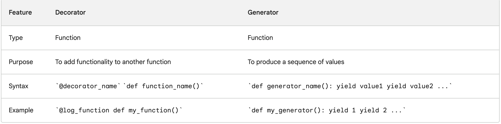

### property decorator

The @property decorator in Python is used to define methods that are accessed like attributes, providing a way to implement computed properties or control access to class attributes. It allows you to define a method that can be accessed as if it were an attribute, without the need to explicitly call it as a method.

```python
class Circle:
    def __init__(self,radius):
        self.radius = radius

    @property
    def diameter(self):
        return self.radius

    @diameter.setter
    def diameter(self,value):
        if value > 0:
             self.radius=value

    @diameter.deleter
    def diameter(self):
        del self.radius

    @property
    def area(self):
        return 3.14 * self.radius**2

mycircle=Circle(2)
mycircle.diameter=10  # you can use method as an attribute.
print(mycircle.diameter)

print("setter")

mycircle.diameter=0  
print(mycircle.diameter) # Output: 10, since the value is set to 0, it would output the previous value associated in the object.

print("deleter")
del mycircle.diameter
print(mycircle.diameter)  # raise an exception as the circle object has deleted the 'radius' attribute
```

### abstract classes

Abstract classes are those classes that can't be instantiated directly, it would only serve as a blue print. They are always designed to be `subclassed` and they would contain `abstractmethod` that must be implemented by their subclass. 

```python
from abc import ABC, abstractmethod

class Animal(ABC):
    @abstractmethod
    def make_sound(self):
        pass
```

When you are trying to instantiated `animal=Animal()`, it would throw an error.

```Error: Can't instantiate abstract class Animal with abstract methods make_sound```

Now, you would have an subclass of `Animal` that uses an `abstractmethod` 

```python
class Dog(Animal):
    def make_sound(self):
        print("Woof")

class Cat(Animal):
    def make_sound(self):
        print("Meow")

dog=Dog()
dog.make_sound() # Output: Woof

cat=Cat()
cat.make_sound() # Output: Meow
```

### first class functions
If a function can be assigned to a variable or passed as object/variable to other function, that function is called as `first class function` 

example-1

```python
def square(x):
    return x*x 

def cube(x):
    return x*x*x

# Receives a function, executes and returns result. You will provide as an list here
def mymap(func,args):
    result = []
    for each_item in args:
        result.append(func(each_item))

    return result 

sqr=mymap(square,[1,2,3]) # Output: [1,4,9]
cub=mymap(cube,[1,2,3]) # Output: [1,8,27]

# provide a single value to get the result.
def print_result(x, func):
    """recieve a function and execute it and return result"""
    return func(x)

do_square = square     # assigning square function to a variable
do_cube = cube         # assigning cube function to a variable

res = print_result(5, do_square)   # passing function to another function
```

example-2

We would use first-class function to create an html tag

```python
def create_html(tag):
    def wrap_text(text):
        print(f"<{tag}>{msg}/<{tag}>")
    return wrap_text
```

`create_html` would return the fucntion(`wrap_text`), we would use that function to call our msg wrapped in the html msg. 

```python
print_h1=create_html("h1")
print_h1("Heading1") # Output: <h1>Heading1</h1> 
```

### decorator

A decorator is a function that takes another function as an argument and returns a modified version of the function. Decorators are often used to add functionality to functions, such as logging, timing, or error handling.

```python
def log_function(func):
  def wrapper(*args, **kwargs):
    print("Calling function:", func.__name__)
    result = func(*args, **kwargs)
    print("Function returned:", result)
    return result
  return wrapper

@log_function
def my_function(x, y):
  return x + y

print(my_function(1, 2))
```

```python
def my_decorator(func):
    def wrapper():
        print("Something is happening before the function is called.")
        func()
        print("Something is happening after the function is called.")
    return wrapper

@my_decorator
def say_hello():
    print("Hello!")

say_hello()
```

A generator is a function that produces a sequence of values, one at a time. Generators are created using the yield keyword. Generators are useful for a variety of tasks, such as filtering a sequence of values, transforming a sequence of values, or iterating over a large sequence of values without storing the entire sequence in memory.

```python
def read_file(filename):
  with open(filename, 'r') as f:
    for line in f:
      yield line

for line in read_file('my_file.txt'):
  print(line)
```




```python
def timeit(func):
    def wrapper(*args, **kwargs):
        start = time.time()
        result = func(*args, **kwargs)
        end = time.time()
        print("Time taken to execute function:", end - start)
        return result
    return wrapper

@timeit
def factorial(n):
  print("Without using cache decorator")
  return n*factorial(n-1) if n else 1 

print(factorial(5))
```

### closures

example-1

Python closure is a nested function that allows us to access variables of the outer function even after the outer function is closed.

```python
def outer_function():
messge="Hi"

def inner_function():
    print(messge) # you would be able to access the variable of outer function.

return inner_function()

hi=outer_function() # Output: Hi
```

example-2

let's modify the code and we could store the `inner_function` as variable and then call return value

```python
def outer_function(message):
	messge=message

	def inner_function():
		print(messge) # you would be able to access the variable of outer function.

	return inner_function

print_hi=outer_function("hi")
print_hello=outer_function("hello")

print(print_hi.__name__) # Output: inner_function
print(print_hello.__name__) # Output: inner_function

print_hi() # Output: hi
print_hello()  # Output: hello
```

example-3

let's use closure to add and subtract example, additionally while doing so, we could log it in the file `example.log`

```python
import logging
logging.basicConfig(filename="example.log",level=logging.DEBUG)

def logger(func):
	def log_func(*args):
		logging.info(f"logging {func.__name__} with arguments {args}")
		print(func(*args))
	return log_func

def add(x,y):
    return x+y

def sub(x,y):
    return x-y

add_logger=logger(add)
sub_logger=logger(sub)

print(add_logger.__name__) # Output: log_func  
print(sub_logger.__name__) # Output: log_func

add_logger(4,5) # Output: 9
sub_logger(20,10) # Output: 10
```

### shallow & deep copy

A shallow copy creates a new object but references the same elements as the original object. In other words, it creates a new container object and fills it with references to the same elements as the original. The references point to the same memory addresses as the original elements. If any of the referenced elements are mutable, changes made to them will be reflected in both the original and the shallow copy.

You can think of "hardlink" in linux prespective. 

```
import copy

list1 = [1, 2, [3, 4]]
list2 = copy.copy(list1)

list2[0] = 5
list2[2].append(5)

print(list1)  # Output: [1, 2, [3, 4, 5]]
print(list2)  # Output: [5, 2, [3, 4, 5]]
```

#### Usecase of shallow copy 

**Cloning mutable objects:** Shallow copy is often used when you want to create a new object that shares the internal state with the original object. This can be useful when working with mutable objects like lists or dictionaries, where you want to create a modified version while preserving the original.

**Performance optimization:** Shallow copy can be more efficient in terms of time and memory when dealing with large objects or data structures. Instead of duplicating the entire object, a shallow copy simply creates references to the existing elements.

**Nested data structures:** Shallow copy is appropriate when you have nested data structures, such as a list of lists or a dictionary of dictionaries. It allows you to create a new structure that maintains references to the original nested objects.

**Deep Copy:**

A deep copy creates a new object and recursively copies all the elements from the original object to the new object. It creates a completely independent copy with its own set of elements. Any changes made to the copied elements will not affect the original object.

softlink from linux prespective. 

```python
import copy

list1 = [1, 2, [3, 4]]
list2 = copy.deepcopy(list1)

list2[0] = 5
list2[2].append(5)

print(list1)  # Output: [1, 2, [3, 4]]
print(list2)  # Output: [5, 2, [3, 4, 5]]
```

#### usecase of deep copy

**Creating independent copies:** Deep copy is used when you want to create a completely independent copy of an object and its internal state. This is useful when you need to modify the copied object without affecting the original object.

**Avoiding unintended side effects:** Deep copy ensures that any modifications made to the copied object or its nested elements do not impact the original object. This can be important when dealing with complex data structures or when multiple objects need to maintain their own separate state.

**Immutable objects:** Deep copy is suitable for creating copies of immutable objects, such as strings or tuples, where modifying the object is not possible. Deep copy allows you to create a new object with the same value.

### iter and generators

**Iterator:**
An iterator is an object that allows sequential access to elements in a collection (e.g., lists, tuples, sets) without exposing the underlying structure.

It operates on the principle of "lazy evaluation," meaning it fetches the next element only when requested. This saves memory and improves performance when dealing with large collections.

Iterators use two primary methods:
__iter__: Returns the iterator object itself.
__next__: Retrieves the next element from the collection. If there are no more elements, it raises the StopIteration exception.

Iterators are typically used with a for loop or the built-in next() function.

```python
my_list = [1, 2, 3, 4]
my_iterator = iter(my_list)

print(next(my_iterator))  # Output: 1
print(next(my_iterator))  # Output: 2
print(next(my_iterator))  # Output: 3
print(next(my_iterator))  # Output: 4
# print(next(my_iterator)) # Raises StopIteration because no more elements.

```

**Generator:**

A generator is a special type of iterator that is created using a function with one or more yield statements.
It allows you to define an iterative algorithm by suspending the execution state and yielding values one at a time, instead of returning the entire collection at once.

Generators are memory-efficient because they produce elements on-the-fly and don't store the entire collection in memory.

They are usually implemented using a for loop or by calling the generator function directly.

```python
def my_generator():
    yield 1
    yield 2
    yield 3
    yield 4

gen = my_generator()

print(next(gen))  # Output: 1
print(next(gen))  # Output: 2
print(next(gen))  # Output: 3
print(next(gen))  # Output: 4
# print(next(gen)) # Raises StopIteration because there are no more elements.
```

**iterators** are objects that provide sequential access to elements in a collection, whereas **generators** are a type of iterator that allows you to define a sequence using a function with yield statements, offering memory-efficient and lazy evaluation behavior.

## *args and **kwargs

*args allows you to pass a variable number of non-keyword arguments to a function. It is used to handle scenarios where the exact number of arguments is not known in advance.

**kwargs allows you to pass a variable number of keyword arguments. It is used when you want to handle named arguments in a function.

```python
def my_function(*args, **kwargs):
    print("Arguments:", args)
    print("Keyword arguments:", kwargs)

my_function(1, 2, 3, name="John", age=30)
```

## Python manage memory?

Python uses a private heap that stores all objects and data structures. The memory management is handled by Python's memory manager, which ensures that memory is allocated efficiently and that the interpreter doesn't run out of memory. Python also has an in-built garbage collector, which reclaims memory by deallocating objects that are no longer in use. The primary mechanism for garbage collection is reference counting, but Python also uses a cycle detector to deal with reference cycles.

## @staticmethod and @classmethod

@staticmethod: Defines a method that doesn’t require access to the instance (self) or class (cls). It behaves like a plain function but belongs to the class’s namespace.

@classmethod: Defines a method that receives the class (cls) as its first argument instead of the instance (self). It can modify the class state that applies across all instances of the class.

```python
class MyClass:
    @staticmethod
    def static_method():
        print("This is a static method.")

    @classmethod
    def class_method(cls):
        print(f"This is a class method of {cls.__name__}")

MyClass.static_method()
MyClass.class_method()
```

## is and ==

`is`: Checks whether two **references** point to the same object (identity)
`==`: Checks whether the **values** of two objects are equal (equality).


