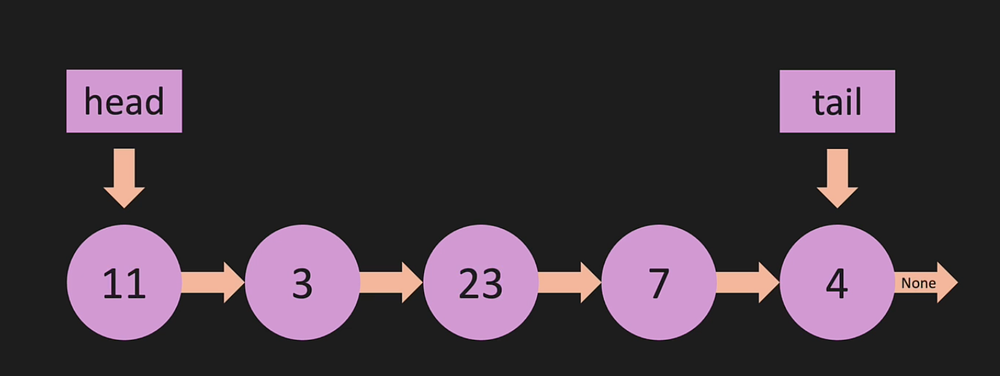

## O(linked list operations)

There are few of the operations that which we do in the linked list, below snapshot describes you about the Big-O cases. 

## linked list under the hood. 

linked list appears to be as below, however in the memory they are scarattered in the different locations, but they are always connected with the pointer. There is **head** which is the start of the node and the **tail** which is the end of the node in the list. the connection elements between the nodes are the **pointers** which are connected

Under the hood, its nothing but a dictionary, which can be used as a variable to set and iterate the values.  

