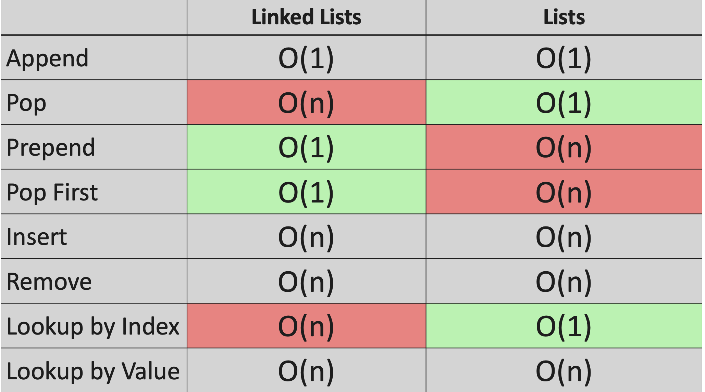
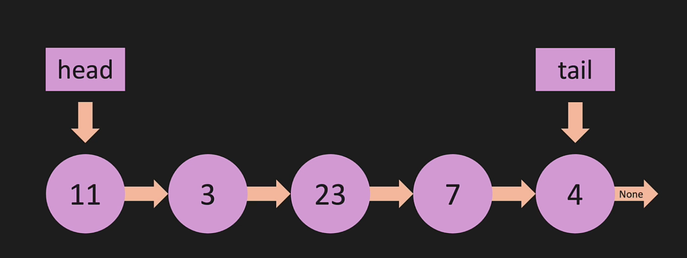
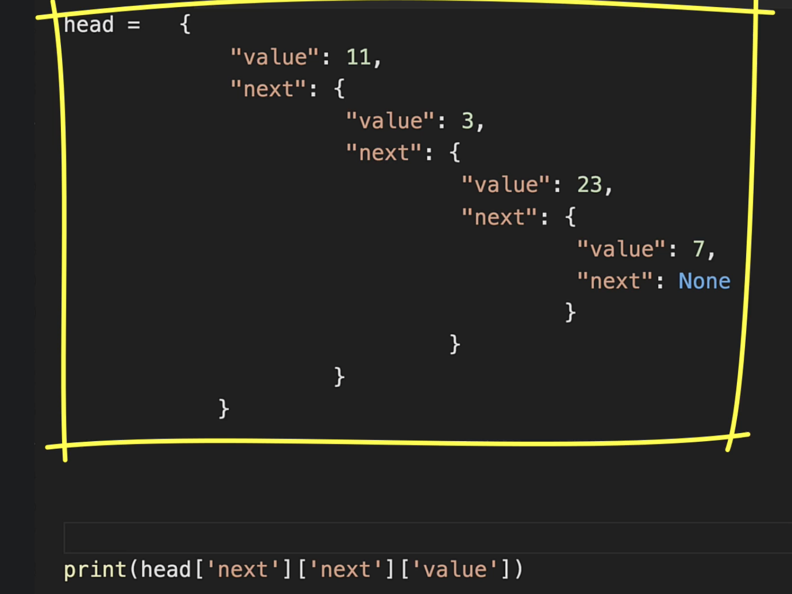

# linked list

## O(linked list operations)

There are few of the operations that which we do in the linked list, below snapshot describes you about the Big-O cases. 



## linked list under the hood. 

linked list appears to be as below, however in the memory they are scarattered in the different locations, but they are always connected with the pointer. There is **head** which is the start of the node and the **tail** which is the end of the node in the list. the connection elements between the nodes are the **pointers** which are connected



Under the hood, its nothing but a dictionary, which can be used as a variable to set and iterate the values.  



## Singly linked list (sll)

Methods that are used in the linked list class. 

### Constructor

```python
class Node:
    def __init__(self,value):
        self.value = value
        self.next = None

class LinkedList:
    def __init__(self,value):
        new_node = Node(value)
        self.head = new_node
        self.tail = new_node
        self.length = 1

my_linked_list = LinkedList(1)
```

### print sll

```python
def print_list(self):
    temp = self.head 
    while temp is not None:
        print(temp.value,end=' ')
        temp = temp.next
```

### append sll

```python 
def append(self,value):
    new_node=Node(value)
    if self.length==0:
        self.head = new_node.head
        self.tail = new_node.tail 
    else:
        self.tail.next = new_node
        self.tail = new_node
    self.length+=1
    return True
```

### prepend node list

```python
def prepend(self,value):
    new_node=Node(value)

    if self.length == 0:
        self.head = new_node
        self.tail = new_node
    else:
        new_node.next = self.head
        self.head = new_node
        
    self.length+=1
    return True
```

### get node using index

```python
def get(self,index):
    if index < 0 or index >= self.length:
        return None 
    temp = self.head 
    for _ in range(index):
        temp = temp.next 
    return temp
```

### insert node in list

```python
def insert(self,index,value):
    if index< 0 or index>self.length:
        return False 
    if index == 0:
        return self.prepend(value)
    if index==self.length:
        return self.append(value)
    new_node=Node(value)
    temp = self.get(index-1) # get index from above function
    new_node.next= temp.next 
    temp.next = new_node
    self.length+=1
    return True
```

### set value using index

```python
def set_value(self,index,value):
    temp = self.get(index)
    if temp:
        temp.value=value
        return True 
    return False
```

### remove node in list

```python
def remove(self,index):
    if index < 0  or index>=self.length:
        return None 
    if index == 0:
        return self.pop_first()
    if index == self.length:
        return self.pop()
    pre = self.get(index-1)
    temp = pre.next 
    pre.next = temp.next 
    temp.next = None
    self.length-=1
    return temp   
```

### remove node list

```python
def pop(self):
    # if node is empty
    if self.length == 0:
        return None
    else:
        # more than two nodes 
        temp=self.head 
        pre=self.head
        while(temp.next):
            pre=temp
            temp=temp.next
        self.tail = pre
        self.tail.next=None
        self.length-=1
        # if node is 0 after decrementing
        if self.length==0:
            self.head = None 
            self.tail = None
    return temp.value
```

### remove first node in list

```python
def pop_first(self):
    if self.length == 0:
        return None 
    else:
        temp = self.head 
        self.head = self.head.next 
        temp.next = None 
        self.length-=1
        if self.length==0:
            self.tail = None
    return temp
```

### reverse node in list

```python
def reverse(self):
    # swap head and tail of the list
    temp=self.head
    self.head = self.tail
    self.tail = temp 

    after = temp.next 
    before = None 

    for _ in range(self.length):
        after = temp.next 
        temp.next = before 
        before = temp
        temp = after
```


## Doubly linked list(dll)

### Constructor 

```python
class Node:
    def __init__(self,value):
        self.value = value 
        self.next = None
        self.prev=None

class LinkedList:
    def __init__(self,value):
        new_node = Node(value)
        self.head = new_node
        self.tail = new_node
        self.length = 1

doubly_linked_list = DoublyLinkedList("10")
```

### print dll

```python
def print_list(self):
    temp = self.head 
    while temp:
        print(f"{temp.value}")
        temp = temp.next
```

## Interview Questions

