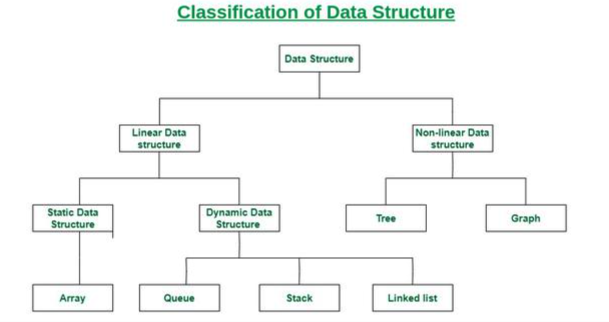
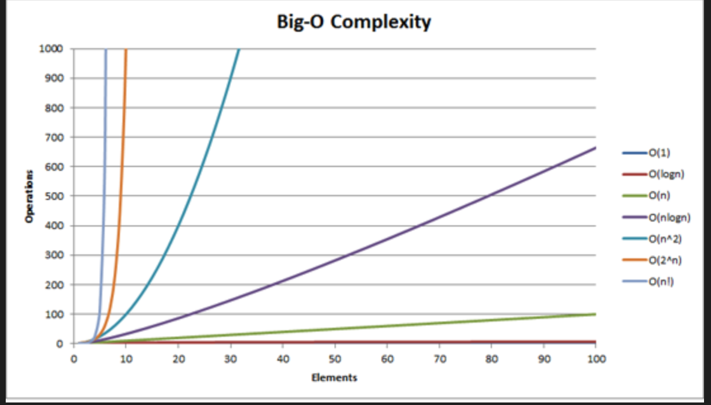
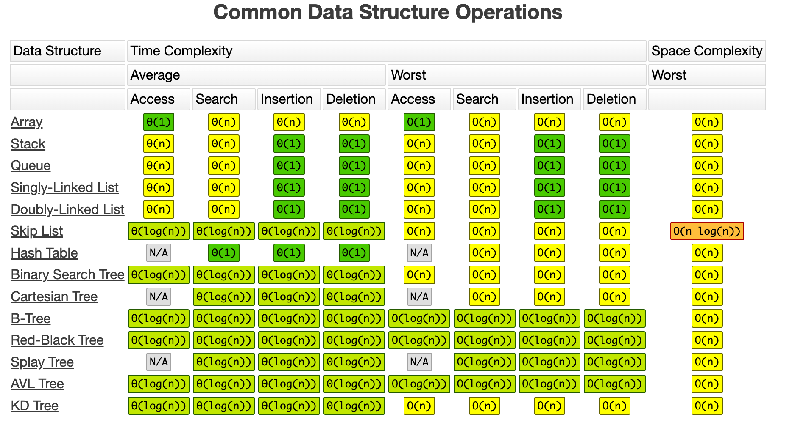
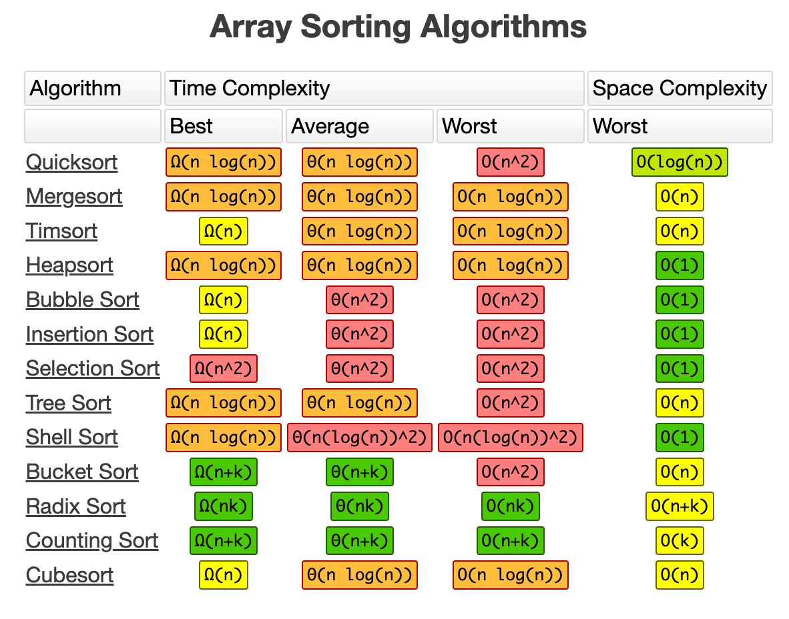

A data structure is a storage that is used to store and organize data. It is a way of arranging data on a computer so that it can be accessed and updated efficiently.


## Classification of DS



**Linear data structure** data elements are arranged sequentially or linearly, where each element is attached to its previous and next adjacent elements

**Static**: it has a fixed memory size. It is easier to access the elements in a static data structure. e.g arrary

**Dynamic**: the size is not fixed. It can be randomly updated during the runtime which may be considered efficient concerning the memory (space) complexity of the code. e.g queue, stack 


**Non-linear data structure**: Data structures where data elements are not placed sequentially or linearly are called non-linear data structures. In a non-linear data structure, we can’t traverse all the elements in a single run only. e.g trees and graphs

## Big-O Complexities 

Big-O notation is a way to describe the time and space complexity of a given algorithm. Big-O notation tells you the number of operations an algorithm will make. Big-O establishes a worst-case run time. 

### **Time complexity**

The amount of time take to execute the operations per second.

### **Space complexity**

The amount of RAM or memory taken to execute. however, this would depend on the performance on the system. the higher the capacity of the machine, space complexity would be differing. 



## Big-O notations

### O(1)

The O(1) is also called constant time, it will always execute at the same time regardless of the input size.

```python 
x=10
print(x)

# The input array could be 1 item or 1,000 items, 
# but this function would still just require one step.

for i in range(10):
    print(i[0])
```

### O(n)

This function runs in O(n) time (or "linear time"), where n is the number of items in the array. If the array has 10 items, we have to print 10 times. If it has 1000 items, we have to print 1000 times.

```python
for i in range(10):
    print(i)
```

### O(n^2)

```python
for i in range(10):
    for j in range(10):
        print(i,j)
```

Here we're nesting two loops. If our array has n items, our outer loop runs n times and our inner loop runs n times for each iteration of the outer loop, giving us n*n total prints. Thus this function runs in O(n2) time (or "quadratic time"). If the array has 10 items, we have to print 100 times. If it has 1000 items, we have to print 1000000 times.

### O(2n)

```python
def fib(n):
    if n<=1: return n;
    return fib(n-1)+fib(n-2)
```

An example of an O(2n) function is the recursive calculation of Fibonacci numbers. O(2n) denotes an algorithm whose growth doubles with each addition to the input data set. The growth curve of an O(2n) function is exponential - starting off very shallow, then rising meteorically.


### Drop less significant terms

```python
for i in range(10):
    for j in range(10):
        print(i,j)

for k in range(10):
    print(k)
```

we would re-iterate i and j i.e n^2 along with 'k' would be 'n' times. 
hence it would be O(n^2+n), in which we can easily drop the constant(n) as its insignificient.

### Drop constants 

```python
for i in range(10):
    print(i)

for j in range(10):
    print(j)
```

We would be looping 'i' n-times and 'j' n-times i.e O(n+n)=O(2n).

Remember, for big O notation we're looking at what happens as n gets arbitrarily large. As n gets really big, adding 100 or dividing by 2 has a decreasingly significant effect, hence we would drop any constants. 

### Common ds alogs




## References

[bigocheatsheet](https://www.bigocheatsheet.com/)