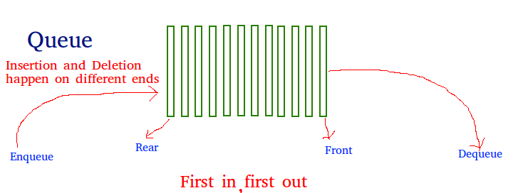

queue is a linear data structure that stores items in First In First Out (FIFO) manner. With a queue the least recently added item is removed first.



## Constructor

```python
class Node:
    def __init__(self,value):
        self.value = value 
        self.next = None 

class Queue:
    def __init__(self,value):
        new_node = Node(value)
        self.first = new_node
        self.last = new_node
        self.length=1

my_queue=Queue(4)
```

## print queue 

```python

def print_queue(self):
    temp =self.first 
    while temp is not None:
        print(temp.value)
        temp = temp.next
```

## enqueue

```python
def enqueue(self,value):
    new_node=Node(value)
    if self.first is None:
        self.first=new_node
        self.last=new_node
    else:
        self.last.next = new_node
        self.last = new_node
    self.length+=1
```

## dequeue

```python
def dequeue(self):
    if self.length==0:
        return None 
    
    temp = self.first
    if self.length==1:
        self.first = None 
        self.last = None 
    else:
        self.first = self.first.next 
        temp.next = None 
    self.length-=1
    return temp 
```