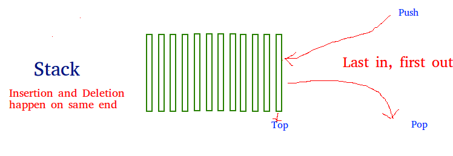

A stack is a linear data structure that stores items in a **Last-In/First-Out (LIFO)** or **First-In/Last-Out (FILO)** manner. In stack, a new element is added at one end(**push**) and an element is removed from that end only(**pop**). 



## Constructor

```python
class Node:
    def __init__(self,value):
        self.value = value 
        self.next = None 

class Stack:
    def __init__(self,value):
        new_node = Node(value)
        self.top = new_node 
        self.height=1

my_stack = Stack(4)
```

## print stack

```python

def print_stack(self):
    temp = self.top 
    while temp is not None: 
        print(temp.value)
        temp = temp.next
```

## push

```python
def push(self,value):
    new_node = Node(value)
    if self.height == 0:
        self.top = new_node
    else:
        new_node.next =self.top 
        self.top = new_node
    self.height+=1
```

## pop

```python
def pop_stack(self):
    if self.height==0:
        return None 

    temp = self.top 
    self.top = self.top.next 
    temp.next = None
    self.height-=1
    return temp
```