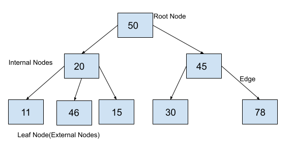

A tree consists of a root node, leaf nodes, and internal nodes. Each node is connected to its child via a reference, which is called an edge.



**Root Node:** The root node is the topmost node of a tree. It is always the first node created while creating the tree and we can access each element of the tree starting from the root node. e.g the node containing element 50 is the root node

**Parent Node:** The parent of any node is the node that references the current node. e.g 50 is the parent of 20 and 45, and 20 is the parent of 11, 46, and 15. Similarly, 45 is the parent of 30 and 78.

**Child Node:** Child nodes of a parent node are the nodes at which the parent node is pointing using the references. In the example above, 20 and 45 are children of 50. The nodes 11, 46, and 15 are children of 20 and 30 and 78 are children of 45.

**Edge:** The reference through which a parent node is connected to a child node is called an edge. In the above example, each arrow that connects any two nodes is an edge.

**Leaf Node:** These are those nodes in the tree that have no children. In the above example, 11, 46, 15, 30, and 78 are leaf nodes.

**Internal Nodes:** Internal Nodes are the nodes that have at least one child. In the above example, 50, 20, and 45 are internal nodes.

## Binary Search Tree(BST)

If the value of the node is lesser than the root, it would be alligned to **left** or else **right** to the node of the tree. 

### BST Big-O

When you want to access or search for particular node in the tree, you start from **root** if the value is lesser than the root, you would search from left of it, which means you would get rid of the **right** side of the tree. Similary vide versa for the value greater than the root node. 

The input number of nodes directs the output time resulting in an average time complexity of **O(log(n))**.

Let's take the wrost case scenerio, the value of the node you are searching is greater, then you need to go to the end of the right of the tree, which is similar to the **list**. In such case, it would be **O(n)**

Summary, 

---
| Operations |     stack     |      BST      |    Big-O     |
| ---------- | :-----------: | :-----------: | :----------: |
| lookup     | Not preferred |   Preferred   |  O(log(n))   |
| insert     |   Preferred   | Not preferred | O(n) or O(1) |
| remove     | Not preferred |   Preferred   |  O(log(n))   |

### Constructor 

```python
class Node:
    def __init__(self,value):
        self.value = value 
        self.left = None 
        self.right=None

class BinarySearchTree:
    def __init__(self):
        self.root=None

my_tree=BinarySearchTree()
print(my_tree.root)
```

### insert

```python
def insert(self,value):
    new_node = Node(value)
    if self.root is None:
        self.root=new_node
        return True 
    temp = self.root
    while(True):
        # if the node of same value already exists
        if new_node.value==temp.value: 
            return False

        # if the node value is less then root value, add to left
        if new_node.value < temp.value:
            if temp.left is None:
                temp.left = new_node
                return True
            temp = temp.left
        else:
            # if the node value is greater then root value, add to right
            if temp.right is None:
                temp.right = new_node
                return True
            temp=temp.right

my_tree=BinarySearchTree()
my_tree.insert(2)
my_tree.insert(1)
my_tree.insert(3)
print(my_tree.root.value) # root 
print(my_tree.root.left.value) # left of root
print(my_tree.root.right.value) # right of root
```

### search

```python
def search(self,value):
    if self.root == None:
        return None
    temp = self.root 
    while temp is not None:
        if value < temp.value:
            temp = temp.left 
        elif value > temp.value:
            temp = temp.right
        else:
            return True 
    return False
```

## Tree Traversals

### Breadth-First Search(BFS)

Breadth-First Search (BFS) is a graph traversal algorithm used to explore all the nodes in a graph, starting from a specific source node and visiting its neighbors before moving on to their neighbors, and so on

```python
def BFS(self):
    current_node = self.root
    queue=[]
    results = []
    queue.append(current_node)
    while len(queue) > 0:
        current_node=queue.pop(0)
        results.append(current_node.value)
        if current_node.left is not None:
            queue.append(current_node.left)
        if current_node.right is not None:
            queue.append(current_node.right)
    return results
```

### Depth-First Search(DFS) 

DFS explores nodes in depth-first fashion, meaning it goes as deep as possible along a branch before backtracking to explore other branches.

#### pre-order 

First, append the root node and traverse all the way to the left and add the node value, and then back track until the root node and then move from right

```python
def dfs_pre_order(self):
    results = []

    def traverse(current_node):
        results.append(current_node.value)

        if current_node.left is not None:
            traverse(current_node.left)

        if current_node.right is not None:
            traverse(current_node.right)

    traverse(self.root)

    return results
```

#### post-order

First, move to the left of the root node and append the value. 

```python

def dfs_post_order(self):
    results = []

    def traverse(current_node):
        if current_node.left is not None:
            traverse(current_node.left)

        if current_node.right is not None:
            traverse(current_node.right)

        results.append(current_node.value)

    traverse(self.root)
    
    return results 
```

#### in-order

```python
def dfs_in_order(self):
    results = []

    def traverse(current_node):
        if current_node.left is not None:
            traverse(current_node.left)

        results.append(current_node.value)

        if current_node.right is not None:
            traverse(current_node.right)

    traverse(self.root)
    
    return results 
```

#### output

```python

my_tree=BinarySearchTree()
my_tree.insert(47)
my_tree.insert(21)
my_tree.insert(76)
my_tree.insert(18)
my_tree.insert(27)
my_tree.insert(52)

print("root node = ", my_tree.root.value)
print("pre order = ",my_tree.dfs_pre_order())
print("post order = ",my_tree.dfs_post_order())
print("in order = ",my_tree.dfs_in_order())

root node =  47
pre order =  [47, 21, 18, 27, 76, 52]
post order =  [18, 27, 21, 52, 76, 47]
in order =  [18, 21, 27, 47, 52, 76]
```