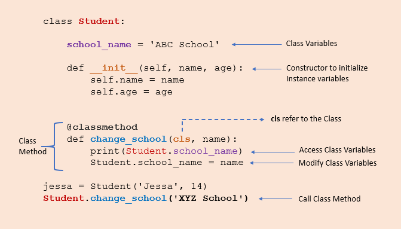

## Programming terms

## Object Oriented Programming

### Encapsulation & Abstraction

Bundling data and methods within a single unit.
when you create a class, it means you are `implementing encapsulation`

encapsulation allows us to restrict accessing variables and methods directly and prevent accidental data modification by creating private data members and methods within a class. 

**public** : accessable anywhere form outside the class. 

**private** : Accessible within the class

**Protected** : within the class and its sub-classes(inheritance)


#### Getters and Setters

getter method to access data members and the setter methods to modify the data members

private variables are not hidden fields like in other programming languages. The getters and setters methods are often used when:

When we want to avoid direct access to private variables
To add validation logic for setting a value

```python
class Employee:

    def __init__(self,name,salary,age):
        # public members
        self.name = name

        # private members
        self.__salary=salary
        self.__age=age

        # protected members
        self._project="Oracle pvt ltd"

    # getters
    def get_age(self):
        print(self.__age)

    # setters
    def set_age(self,age):
        # you can use the logic before changing 
        # the object
        if age > 130:
            print("not sure anyone is alive.. please submit proof of living!")
        self.__age = age

    def show(self):
        print(f"{self.name}'s age is {self.__age} drawing salry of {self.__salary}")


class EmployeeDepartment(Employee):
    def __init__(self,name):
        Employee().__init__(self)
        self.name = name

    def show(self):
        print(f"{self.name} employee working in project {self._project}")


emp=Employee("employee",100000,33)
emp.show()

emp.set_age(29) #Private members can be accessed by using public methods.
emp.get_age()
print(emp._Employee__age) #Name mangling.

print(f"Employee project details: {emp._project}")


sunil=Employee("Sunil",100000,34)
sunil.set_age(32)
```

### Constructors

Special method used to create and initialize an object of a class. The primary use of a constructor is to declare and initialize data member/instance variables of a class.

#### Constructor Types

- **Default Constructor** - It does not perform any task but initializes the objects
  
- **Non-parametrized constructor** - A constructor without any arguments is called a non-parameterized constructor. 

- **parametrized constructor** - A constructor with defined parameters or arguments is called a parameterized constructor.

```python
class Employee:
    # class variable 
    count=0
    # Parameterized Constructor with default values
    def __init__(self,name="Raghu",age=12):
        self.name = name
        self.age=age
        Employee.count+=1

    # Non Parametrized Constructor.
    # def __init__(self):
    #    self.name="Raju"
    #    self.age=18"

    # when there is no __init__ method, its default constructor

    def display(self):
        print(f"employee {self.name} is around {self.age} years old")


emp1=Employee("Ram",18)
emp1.display() # Output: employee Ram is around 18 years old

# Object created with default values
emp2=Employee()
emp2.display() # Output: employee Raghu is around 12 years old

print(f"Total number of employees: {Employee.count})
```

#### Constructor Chaining 

Constructor chaining is the process of calling one constructor from another constructor. Constructor chaining is useful when you want to invoke multiple constructors, one after another, by initializing only one instance. constructor chaining is convenient when we are dealing with inheritance.

```python
class Vehicle:
    def __init__(self,engine):
        self.engine = engine 

class Car(Vehicle): 
    def __init__(self,engine, max_speed):
        super().__init__(engine)
        self.max_speed=max_speed

class ElectricCar(Car):
    def __init__(self,engine,max_speed,km):
        super().__init__(engine,max_speed)
        self.km=km

ev = ElectricCar('1500cc', 240, 750)
print(f"{ev.engine} is having max speed {ev.max_speed} travelling distance of {ev.km}")
```

### Polymorphism

Polymorphism in Python is the ability of an object to take many forms. Polymorphism is mainly used with inheritance. 

#### Polymorphism With Inheritance

Using method overriding `polymorphism` allows us to defines methods in the child class that have the same name as the methods in the parent class. This `process of re-implementing the inherited method in the child class` is known as **Method Overriding**.


```python
class Vehicle:
    def __init__(self,name,color):
        self.name = name
        self.color = color

    def show(self):
        print(f"{self.name} is having color of {self.color}")


    def max_speed(self):
        print("Vehicle max speed is 150")

    def change_gear(self):
        print('Vehicle change 6 gear')

class Car(Vehicle):

    # due to polymorphism, max_speed() and change_gear() 
    # methods are overridden for the car object.

    def max_speed(self):
        print("car max speed is 250")

    def change_gear(self):
        print('car change 7 gear')


car = Car('Benz', 'Red')
car.show() # this method isin't overridden.
car.max_speed()

vehicle = Vehicle('Volvo', 'Yello')
vehicle.show()
vehicle.max_speed()
```

#### Polymorphism class methods

```python
class StudentASection:
    def students(self):
        print("A section students")

    def class_teacher(self):
        print("Mohan")

class StudentBSection:
    def students(self):
        print("B section students")

    def class_teacher(self):
        print("Mohana")

a_section_student=StudentASection()
b_section_student=StudentBSection()

# you can create function and pass as objects
#def some_function(obj):
#    obj.call_methods

for students in (a_section_student,b_section_student):
    students.students()
    students.class_teacher()
```

You could also pass as a single object to the above `objects into the function`


```python
def get_student_details(obj):
    obj.students()
    obj.class_teacher()

get_student_details(a_section_student)
get_student_details(b_section_student)
```

### Class & static methods

`class and static methods` are special types of methods that have different behaviours and use cases when compared to `regular instances methods`


#### regular/instance method

these are bound to regular object instance. they can access and modify the object's state and can be called on an object instance. 

```python
class Person:
    def __init__(self, name, age):
        # instance variables
        self.name = name
        self.age=age 

    # instance methods
    def get_name(self):
        return self.name

    # instance methods
    def get_age(self):
        return self.age

    # instance methods
    def set_name(self,newname):
        self.name = newname

    # instance methods
    def set_age(self, newage):
        self.age = newage


person1 = Person("Sunil", 30)   
print(person1.get_name())
print(person1.get_age())
person1.set_name("Kumar")
print(person1.get_name())
```

#### class methods

class methods are bound to class itself and they can access only class variables. It can only allow to change the class variable state across all the class objects.

Class methods are used when we are dealing with factory methods. factory methods are those which returns the class object for different purposes.

They are always called using `ClassName.method_name()`



```python
from datetime import date 

class Student:
    collage_name = "ABC Collage"
    def __init__(self,name,age):
        self.name = name
        self.age = age 

    @classmethod
    def calculate_age(cls,name,birthyear):
        # calulate age and set it as age, then 
        # return a new object
        return cls(name,date.today().year-birthyear)


    def show(self):
        print(f"{self.name} age is: {self.age} studying in colleage: {Student.collage_name}")


sunil = Student("Sunil",39)
sunil.show()
 
shiva=Student.calculate_age("Shiva",1983) # invoke a new clas
shiva.show()
```

Explanation of above code. 

- we created two objects, one using the constructor and the second using the `calculate_age()`
  
- The constructor takes two arguments name and age. On the other hand, class method takes cls, name, and birth_year and `returns a class instance which nothing but a new object`
  
- The `@classmethod` decorator is used for converting `calculate_age() method to a class method.`
  
- The `calculate_age()` method takes Student class (cls) as a first parameter and `returns constructor by calling Student(name, date.today().year - birthYear), which is equivalent to Student(name, age).`

#### static method

Any method we create in a class will automatically be created as an instance method. We must explicitly tell Python that it is a static method using the `@staticmethod`

```python
class Student:
    @staticmethod
    def student_greeting(greeting_msg):
        print(f"Hello {greeting_msg}")


Student.student_greeting("Welcome Students !")

sunil=Student()
sunil.student_greeting('Welcome Sunil !')
```

```python
class Employee:
    def __init__(self,name,project_name):
        self.name = name 
        self.project_name=project_name

    # instance method
    def work(self):
        requirements = self.gather_requirements(self.project_name)
        for task in requirements:
            print(f"Completed: {task}")


    @staticmethod
    def gather_requirements(project_name):
        if project_name == "ABC":
            requirements = ["task1", "task2"]
        else:
            requirements = ["task1"]

        return requirements

emp = Employee("Sunil","ABC")
emp.work()
```

**output:**

```
Completed: task1
Completed: task2
```

#### Access Class Variables in Class Methods

```
@classmethod
def change_collage(cls, newcollname):
    # change class variable
    cls.collage_name=newcollname

Student.change_collage("New coll")
sunil.show()
```
