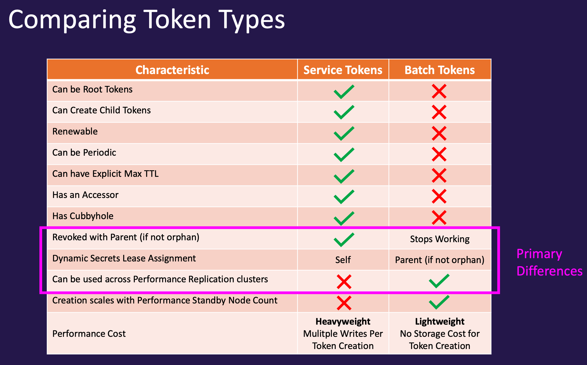
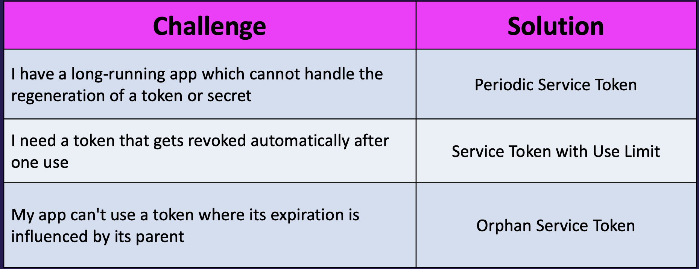
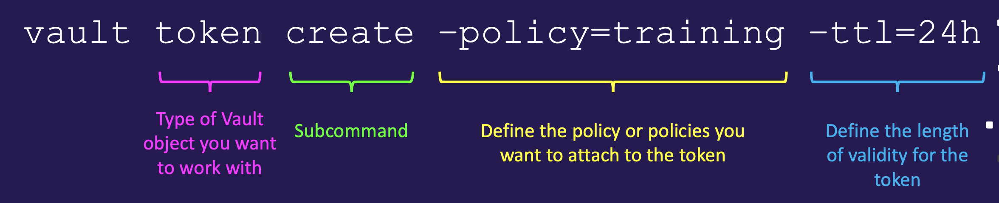
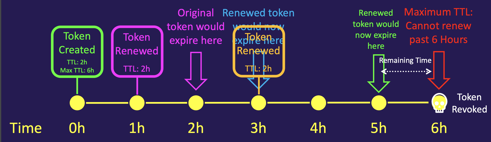
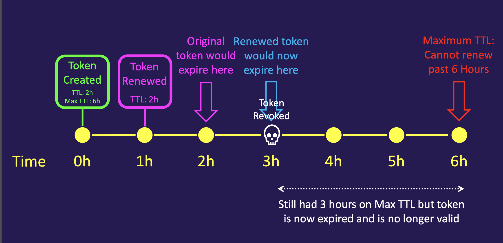

## vault interfaces

when user is authenticated to vault in any form, vault would generate the token based on the policies that's being set and would return back the token for usage. We could use that token for any future authenticate again. 

tokens are the core method of authetication, most of the operations in vault require an existing token. 

- The token auth method is responsible for creating and storing tokens
- The token auth method cannot be disabled
- Tokens can be used directly, or they can be used with another auth method
- Authenticating with an external identity (e.g. LDAP) dynamically generate tokens
- Tokens have one or more policies attached to control what the token is allowed to perform

## types of tokens

**service tokens** are the default token type in Vault

- They are persisted to storage (heavy storage reads/writes)
- Can be renewed, revoked, and create child tokens

**batch tokens** are encrypted binary large objects (blobs)

- Designed to be lightweight & scalable
- They are NOT persisted to storage but they are not fully-featured
- Ideal for high-volume operations, such as encryption
- Can be used for DR Replication cluster promotion as well



Tokens carry information and metadata that determines how the token can be used, what type of token, when it expires, etc.

- Accessor
- Policies
- TTL
- Max TTL
- Number of Uses Left
- Orphaned Token
- Renewal Status

```
vault token lookup s.d1BCdhug8buTgAnSZhtPm8Hp
```

## token heirarchy

Each token has a time-to-live (TTL), except root token.

Tokens are revoked once reached its TTL unless renewed

- Once a token reaches its max TTL, it gets revoked
- May be revoked early by manually revoking the token
- When a parent token is revoked, all of its children are revoked as well.


## controlling token life cycle



### Periodic token life cycle 

- Root or sudo users have the ability to generate periodic tokens
- Periodic tokens have a TTL, but no max TTL
- Periodic tokens may live for an infinite amount of time, so long as they are renewed within their TTL

```
vault token create -policy=training -period=24h
```

### Service token with use limit 

When you want to limit the number of requests coming to Vault from a particular token:
- Limit the token's number of uses in addition to TTL and Max TTL
- Use limit tokens expire at the end of their last use, regardless of their remaining TTLs
- Use limit tokens expire at the end of their TTLs, regardless of remaining uses.

```
vault token create -policy="training" -use-limit=2
vault token lookup <token>
```

### Orphan service token

When the token hierarchy behavior is not desirable:

- Root or sudo users have the ability to generate orphan tokens
- Orphan tokens are not children of their parent; therefore, do not expire when their parent does
- Orphan tokens still expire when their own Max TTL is reached

```
vault token create -policy="training" -orphan
vault token lookup <token> 
```

## Set token types

```
vault token create -policy="training" -period="24h"
```

configure the AppRole auth method to generate batch tokens

```
vault auth enable approle
vault write auth/approle/role/training policies="training" token_type="batch" token_ttl="60s"
```

configure the AppRole auth method to generate periodic tokens:

```
vault write auth/approle/role/jenkins policies="jenkins" period="72h"
```

## Managing Tokens in Vault


### CLI



```
vault token create –display_name=jenkins –policy=training,certs –ttl=24h –explicit-max-ttl = 72h

vault token create -ttl=5m -policy=training
vault token lookup s.12VNpg4OA9tTdCd4V6ODuDRK
vault token revoke s.12VNpg4OA9tTdCd4V6ODuDRK
Success! Revoked token (if it existed)
```


Look up the capabilities of a token on a particular path

```
vault token capabilities s.dhtIk8VsE3Mj61PuGP3ZfFrg kv/data/apps/webapp
vault token lookup s.dhtIk8VsE3Mj61PuGP3ZfFrg   # know ttl for this token
vault token renew s.dhtIk8VsE3Mj61PuGP3ZfFrg
```

### UI

skipping

### API

parse the output for `.auth.client_token` thats the client token you need to read

```
curl --request POST --data @payload.json http://127.0.0.1:8200/v1/auth/userpass/login/sunil | jq
```

store the token in a variable

```
token = $(curl --request POST --data @payload.json http://127.0.0.1:8200/v1/auth/userpass/login/bryan |
jq -r ".auth.client_token")
echo $token
```

Get the complete output and set into ENV variable

```
OUTPUT=$(curl --request POST --data @payload.json http://127.0.0.1:8200/v1/auth/userpass/login/sunil)
VAULT_TOKEN=$(echo $OUTPUT | jq '.auth.client_token' -j)
echo $VAULT_TOKEN
```

Client token must be sent in the X-Vault-Token HTTP header and put into KV store

```
curl --header "X-Vault-Token: s.dhtIk8VsE3Mj61PuGP3ZfFrg" --request POST --data '{ "apikey": "3230sc$832d" }'https://vault.example.com:8200/v1/secret/apikey/splunk


curl --header "X-Vault-Token: s.dhtIk8VsE3Mj61PuGP3ZfFrg" --request GET https://vault.example.com:8200/v1/secret/data/apikey/splunk 

```

## Root token

Root token is a superuser that has unlimited access to Vault

- It does NOT have a TTL – meaning it does not expire
- Attached to the root policy
- Note: Root tokens can create other root tokens that DO have a TTL


Root tokens should NOT be used on a day-to-day basis

- In fact, rarely should a root token even exist
- Once you have used the root token, it should be revoked.

**Where Do Root Tokens Come From?**

Initial root token comes from Vault initialization

- Only method of authentication when first deploying Vault
- Used for initial configuration – such as auth methods or audit devices
- Once your new auth method is configured and tested, the root token should be revoked

```
vault token revoke s.dhtIk8VsE3Mj61PuGP3ZfFrg
```

**Create a root token from an existing root token**

You can authenticate with a root token and run a vault token create.

Now you have 2 root tokens

```
vault login s.lmmOCfNH1HZvvBwxnLErWrhK
vault token create
```

**Create a root token using unseal/recovery keys**

- Helpful if you need to generate a root token in an emergency or a root token is needed for a particular task
- A quorum of unseal key holders can generate a new root token
  - Enforces the "no single person has complete access to Vault"
  
There are few steps to generate recovery root keys or unseal keys

```
vault operator generate-root -init # Generates the OTP
vault operator generate-root # keep repeating until threshold is met and copy **Encoded Token**
vault operator generate-root -otp="hM9q24nNiZfnYIiNvhnGo4UFc3" -decode="G2NeKUZgXTsYYxILAC9ZFBguPw9ZXBovFAs"
```

## token accessors

Every token has a token accessor that is used as a reference to the token

Token accessors can be used to perform limited actions
- Look up token properties
- Look up the capabilities of a token
- Renew the token
- Revoke the token

```
vault login s.cbC7GJ6U6WJaDuDSgkyVcKDv
vault token create -policy=training -ttl=30m
vault token lookup -accessor gFq2UwnJ0jo87kESKwUcl1Ub
vault token create -policy=training -ttl=30m # you can use token_accessor
vault token revoke 2ogWa36gDH5wsO8VbuxroByx
vault token renew -accessor gFq2UwnJ0jo87kESKwUcl1Ub
```


Cannot Use an Accessor to Perform Traditional Vault Actions

```
set VAULT_TOKEN=gFq2UwnJ0jo87kESKwUcl1Ub
vault kv get secret/apps/training
Error making API request.
URL: GET
http://127.0.0.1:8200/v1/sys/internal/ui/mounts/secret/apps/training
Code: 403. Errors:
* permission denied
```

## TTL explanation

Every non-root token has a TTL, which is the period of validity (how long it's good for)

TTL is based on the creation (or renewal) time:
- Example: New token was created - valid for 30 minutes from now
- Example: token was just renewed for 30 min = has a new 30m TTL

When a token's TTL expires, the token is revoked and is no longer valid and cannot be used for authentication.
- Renewal must take place before the TTL expires

**ttl examples**





Vault has a default TTL of 768 hours (which is 32 days), This can be changed in the Vault configuration file
**default_lease_ttl = 24h**

```
vault token create –policy=training –ttl=60m
vault write auth/approle/role/training-role token_ttl=1h token_max_ttl=24h
vault token create –policy=training
```
