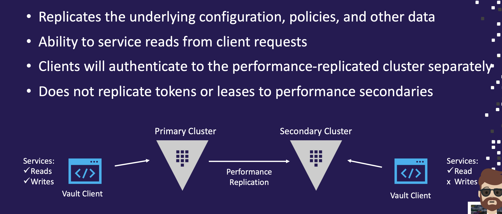
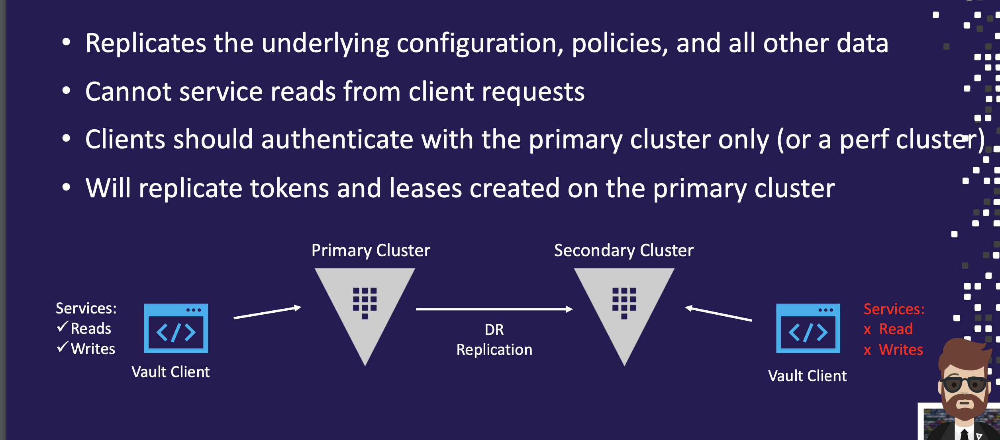
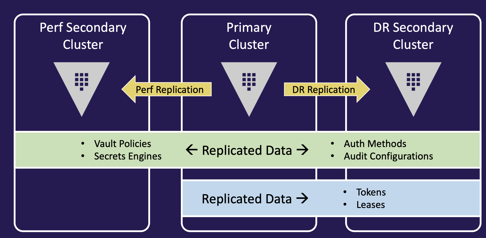
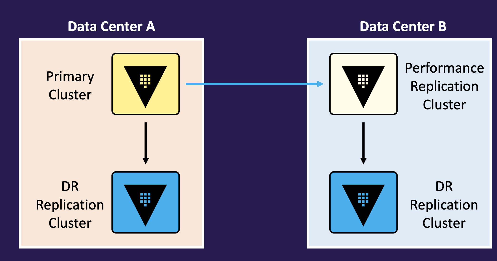
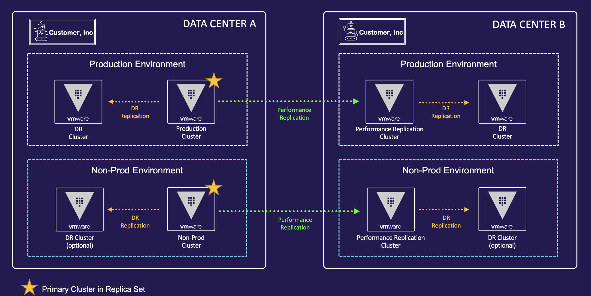
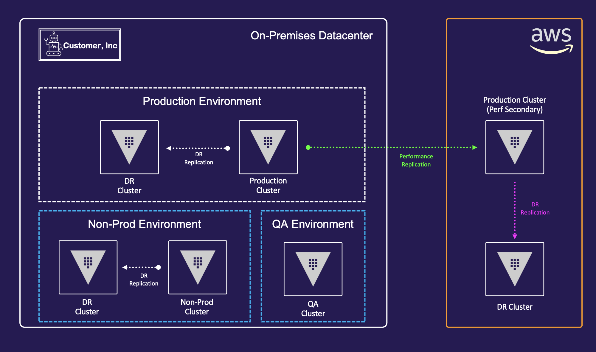
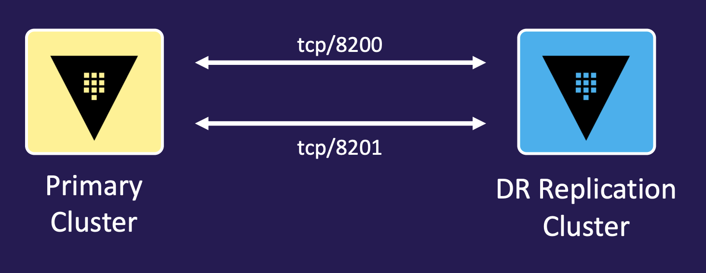
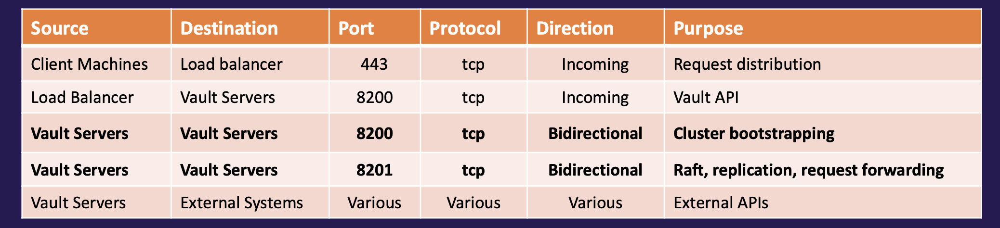
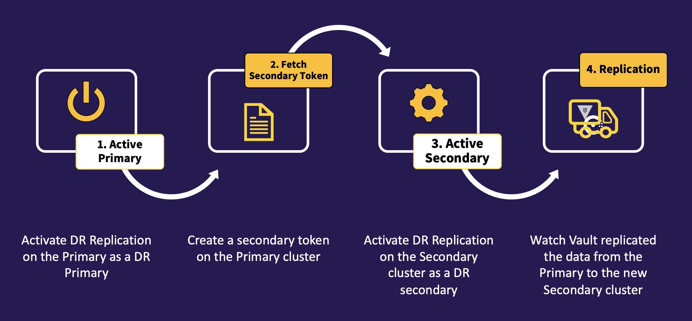
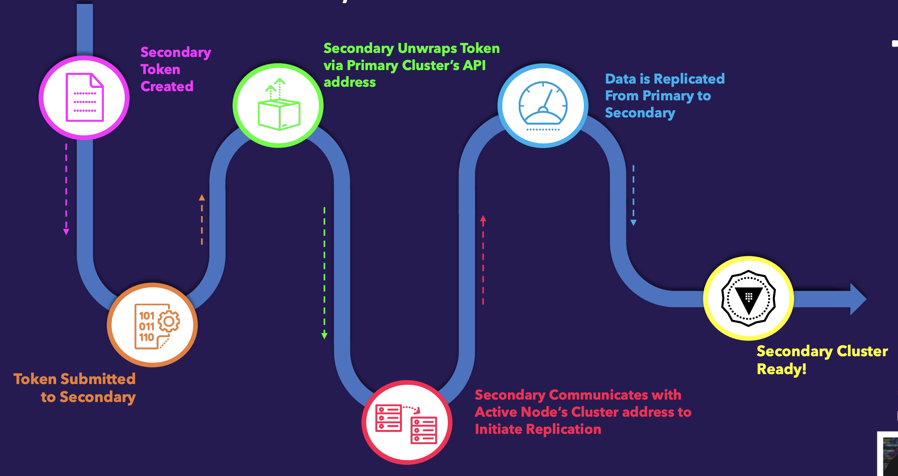

## replication

Organizations usually have infrastructure that spans multiple datacenters

- Vault needs to be highly-available for application access
- Needs to scale as organizations continue to add use cases and apps
- Common set of policies that are enforced globally
- Consistent set of secrets and configurations available to applications that need them regardless of data center
- Only available in Vault Enterprise
- Replication operates on a leader-follower model (primaries and secondaries)
- The primary cluster acts as the system of record and replicates most Vault data asynchronously
- All communication between primaries and secondaries is end-to-end encrypted with mutually-authenticated TLS sessions

### Performance Replication



### DR replication 

- Provides a warm-standby cluster where EVERYTHING is replicated to the DR secondary cluster(s)
- DR clusters DO NOT respond to clients unless they are promoted to a primary cluster
- Even as an admin or using a root token, most paths on a secondary cluster are disabled, meaning you can't do much of anything on a DR cluster



### replication comparisions



### replication architecture



**Real world examples**





### replication networking

- Communication between clusters must be permitted to allow replication, RPC forwarding, and cluster bootstrapping to work as expected.
- If using DNS, each cluster must be able to resolve the name of the other cluster






## setup



### Activating DR Replication

- Replication is NOT enabled by default, so you must enable it on each cluster that will participate in the replica set
- Enables an internal root CA on the primary Vault cluster - creates a root certificate and client cert
- Vault creates a mutual TLS connection between the nodes using self-signed certificates and keys from the internal CA – NOT the same TLS configured for the listener
- If Vault sits behind a load balancer that is terminating TLS, it will break the mutual TLS between the nodes if inter-cluster traffic is forced through the load balancer

### Secondary Token

- A secondary token is required to permit a secondary cluster to replicate from the primary cluster
- Due to its sensitivity, the secondary token is protected with response wrapping
- Multiple people should “have eyes” on the secondary token once it’s been issued until it is submitted to the secondary cluster
- Once the token is successfully used, it is useless (single-use token)
- The secondary token includes information such as:
  - The redirect address of the primary cluster
  - The client certificate and CA certificate



## Configure replication 

```
primary$ vault write -f sys/replication/dr/primary/enable
primary$ vault write sys/replication/dr/primary/secondary-token id=<id> # provide meaningful name
secondary$ vault write sys/replication/dr/secondary/enable token=<token> #Provide token from primary cluster (command above)
```