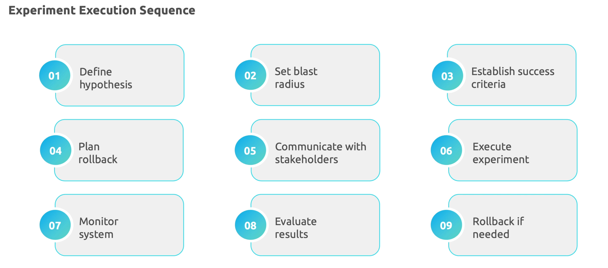
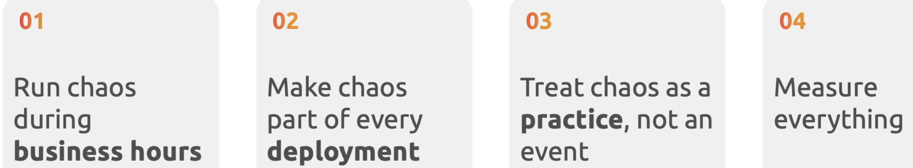

## Chaos engineering

instead of measuring, failing, and fixing, what if we simulate all these ?

- Create failures
- Find weakness
- fix proactively

intentionally introduce system failure
identify vulnerable before users raise issues

Chaos engg - shows your system works under real world chaos

**Resiliebce testing**

- kill a pod and verify failover works
- disconnect db to check fallback
- simulate latency to test timeout

**chaos engineering**

- Introduce network paritions during peak traffic 
- Memory pressure with database slowdown
- Multiple small failures cascading into big ones

Safe Chaos experiments in stages

Chaos key insights

Chaos principles

Chaos maturity model 

## cost of realibility

Cost efficiency and realibility

if SLO wants to move from 99.9 to 99.99%, the cost would be 100x more than current. find the below reasons 
i.e if SLO is stricter, the more budget goes into reliability

Autoscaling strategies

SLO budget framework

why does SLO budget matters ?

