## TL;DR

Chaos engineering is the practice of intentionally injecting failures into a system to discover weaknesses before they cause real incidents. Instead of waiting for production to break and then firefighting, chaos engineering lets you proactively find and fix vulnerabilities in a controlled setting. It is the difference between discovering that your database failover doesn't actually work during a Tuesday maintenance window vs. discovering it during a Black Friday outage. This document covers chaos engineering principles, the difference between resilience testing and chaos engineering, safe experimentation stages, and the often-overlooked economics of reliability — because reliability is a business decision as much as a technical one.

See also: [SRE Overview](./overview.md) | [Manage Complexity](./manage_complexity.md) | [Incident Management](./incident_management.md) | [SRE Measurements](./sre_measure.md)

---

## Chaos Engineering

Instead of measuring, failing, and fixing reactively, chaos engineering asks: *what if we simulate failures before they happen?*

The core loop is: **create controlled failures → find weaknesses → fix proactively**. You intentionally introduce system failures in a controlled way, identify vulnerabilities before users raise support tickets, and build confidence that the system can survive real-world chaos. Chaos engineering does not create problems — it reveals problems that already exist and were just waiting for the wrong moment to surface.

**Why does this matter for an SRE?** The assumptions embedded in system design are almost always wrong in at least one way. A database failover that works in staging may fail in production because the production replica is 30 seconds behind and the application doesn't handle the brief connection error gracefully. A circuit breaker that trips correctly in isolation may not trip correctly when two dependencies fail simultaneously. Chaos engineering is the only way to verify that your resilience mechanisms actually work at runtime, not just in theory.

### Resilience Testing vs. Chaos Engineering

These terms are often used interchangeably but represent different levels of maturity and scope:

**Resilience testing** verifies known failure modes in isolation, typically in a staging environment. It is deterministic and scripted:

- Kill a pod and verify that the load balancer routes traffic to healthy replicas within the expected time
- Disconnect the database and verify that the application falls back to the cache or returns a graceful error
- Simulate latency on a downstream API and verify that the circuit breaker trips and the timeout fires before the request thread is exhausted

**Chaos engineering** goes further: it introduces compound, realistic, and sometimes unexpected failures in production (or a production-like environment) to discover emergent behaviours that scripted tests cannot predict:

- Introduce network partitions during peak traffic to see how the distributed consensus protocol behaves under real load
- Combine memory pressure on the application tier with database slowdown to see if the failure cascades or is contained
- Inject multiple small failures (slow disk, noisy neighbour CPU, dropped DNS packet) simultaneously to discover interactions that single-fault tests miss

The key distinction: resilience testing verifies that known fixes work; chaos engineering discovers unknown weaknesses.

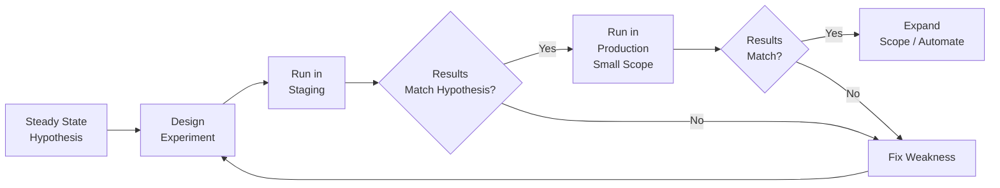
```mermaid
graph LR
    A[Steady State\nHypothesis] --> B[Design\nExperiment]
    B --> C[Run in\nStaging]
    C --> D{Results\nMatch Hypothesis?}
    D -- Yes --> E[Run in\nProduction\nSmall Scope]
    D -- No --> F[Fix Weakness]
    F --> B
    E --> G{Results\nMatch?}
    G -- Yes --> H[Expand\nScope / Automate]
    G -- No --> F
```

### Safe Chaos Experiments in Stages

Chaos experiments should always follow a staged approach. Running a chaos experiment that takes down production without a rehearsed recovery plan is not chaos engineering — it is just an outage.

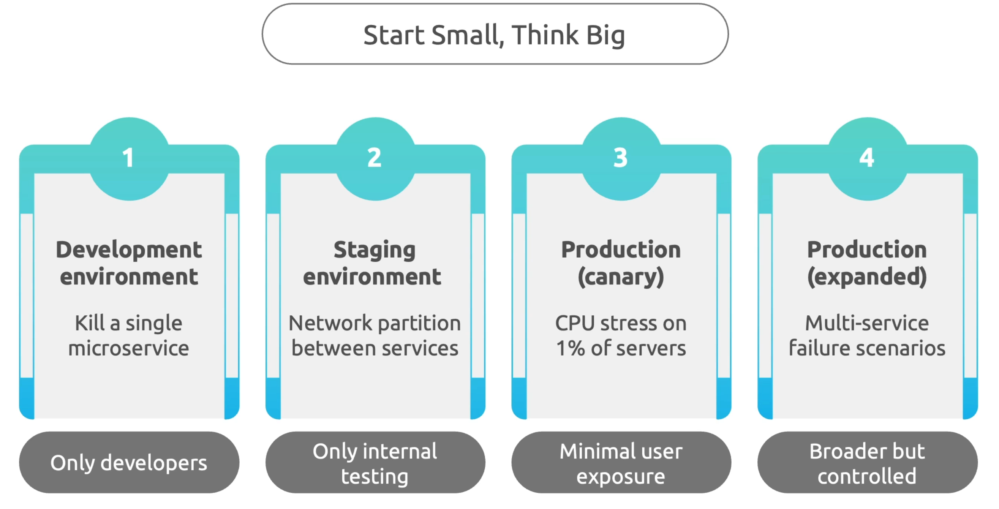

**Stage 1: Hypothesis first.** Before running any experiment, define the steady-state hypothesis: "Under normal conditions, the service processes X requests per second with a p99 latency below Y ms and an error rate below Z%." The experiment is only valid if you can measure whether steady state was maintained or violated.

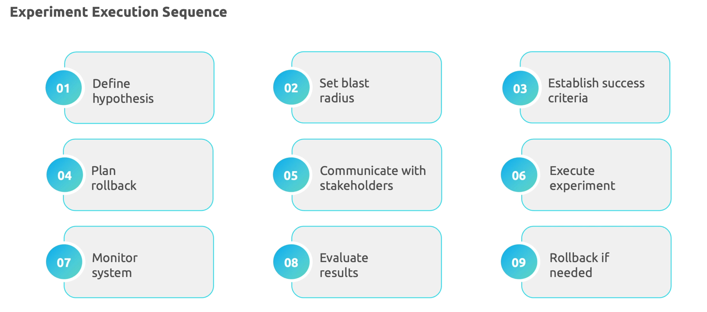

**Stage 2: Start in staging, minimise blast radius.** Run experiments first in a staging environment that mirrors production topology. Limit the scope: start with a single pod, a single availability zone, or a single user cohort. Always have a kill switch — a mechanism to immediately stop the experiment and restore normal state.

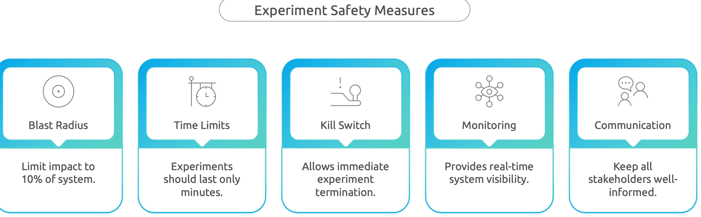

**Stage 3: Automate and schedule.** Once an experiment is proven safe and the weakness it was designed to test has been fixed (or confirmed absent), automate it as part of a regular chaos schedule. Netflix's Chaos Monkey runs continuously in production; most teams start with scheduled weekly game days and evolve from there.

```bash
# Example: Using chaos-mesh to inject pod failure in Kubernetes
# This experiment kills a random pod in the 'payment' namespace every 60 seconds
# for a 5-minute window, to test pod restart and load balancer failover.

cat <<EOF | kubectl apply -f -
apiVersion: chaos-mesh.org/v1alpha1
kind: PodChaos
metadata:
  name: payment-pod-kill
  namespace: chaos-testing
spec:
  action: pod-kill
  mode: one                  # Kill one pod at a time
  selector:
    namespaces:
      - payment
  scheduler:
    cron: '@every 60s'       # Run every 60 seconds
  duration: '5m'             # Total experiment duration
EOF

# Monitor SLIs during the experiment:
# kubectl top pods -n payment
# Watch the Grafana dashboard for error rate and latency spikes
```

### Chaos Key Insights

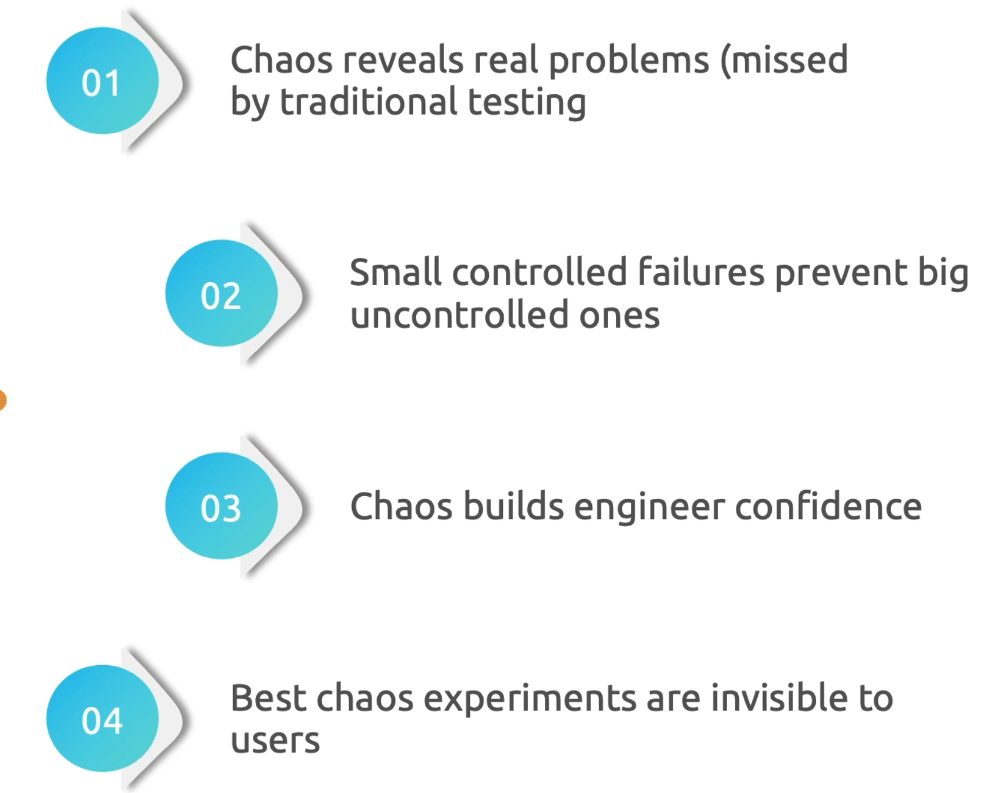

### Chaos Principles

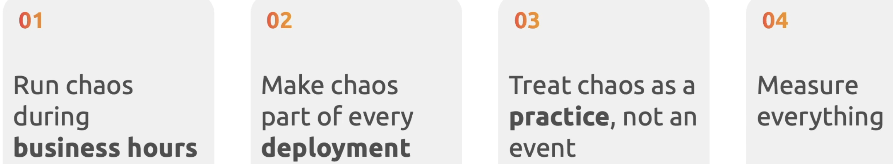

The principles of chaos engineering, originally published by Netflix as the [Principles of Chaos Engineering](https://principlesofchaos.org):

1. **Build a hypothesis around steady-state behaviour** — define what "normal" looks like before you break things.
2. **Vary real-world events** — experiment with failure modes that actually happen in production (hardware failures, network partitions, traffic spikes), not purely theoretical ones.
3. **Run experiments in production** — staging environments never perfectly mirror production. Real resilience can only be verified with real traffic.
4. **Automate experiments to run continuously** — a one-time chaos experiment gives you a point-in-time answer; continuous experiments give you ongoing confidence.
5. **Minimise blast radius** — always scope experiments to the smallest population necessary to get valid results. Don't affect all users when 1% will do.

### Chaos Maturity Model

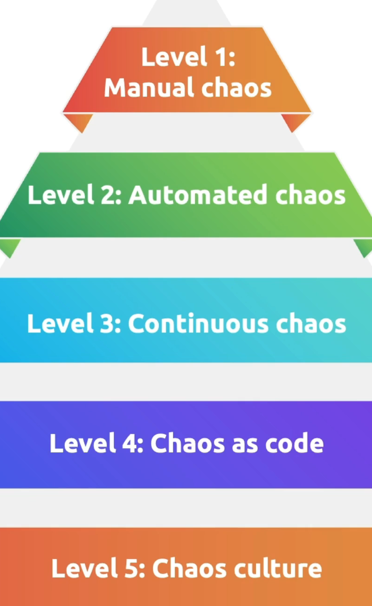

Most organisations start at Level 1 (manual, ad-hoc experiments in staging) and progress toward Level 4 (automated, continuous experiments in production with automated rollback). Jumping to Level 4 without the foundational observability and rollback infrastructure of earlier levels is dangerous. The maturity model is a roadmap, not a shortcut.

| Level | Description | Prerequisite |
|-------|-------------|-------------|
| 1 | Manual experiments in staging | Basic observability |
| 2 | Scheduled game days in staging | Runbooks, SLOs defined |
| 3 | Automated experiments in staging | CI/CD integration, automated rollback |
| 4 | Continuous experiments in production | Production observability, blast-radius controls |

---

## Cost of Reliability

Cost efficiency and reliability are in tension, and understanding that tension is one of the most important skills an SRE can develop. Reliability is not free — and neither is unreliability.

If an SLO needs to move from 99.9% to 99.99%, the engineering cost is dramatically higher than the 0.09 percentage point difference suggests. Achieving each additional nine of reliability typically requires redundancy at every layer, automated failover, global load balancing, more rigorous change management, larger on-call teams, and more sophisticated monitoring — costs that compound multiplicatively, not additively.

**When would you use this?** When a product manager asks "can we just make it five nines?" or when a customer demands a higher SLA. The answer is almost always: "yes, but here's what it costs and here's the plan." SREs who can articulate the cost of a reliability target in terms of engineering investment and infrastructure spend are infinitely more valuable than those who can only say "it's complicated."

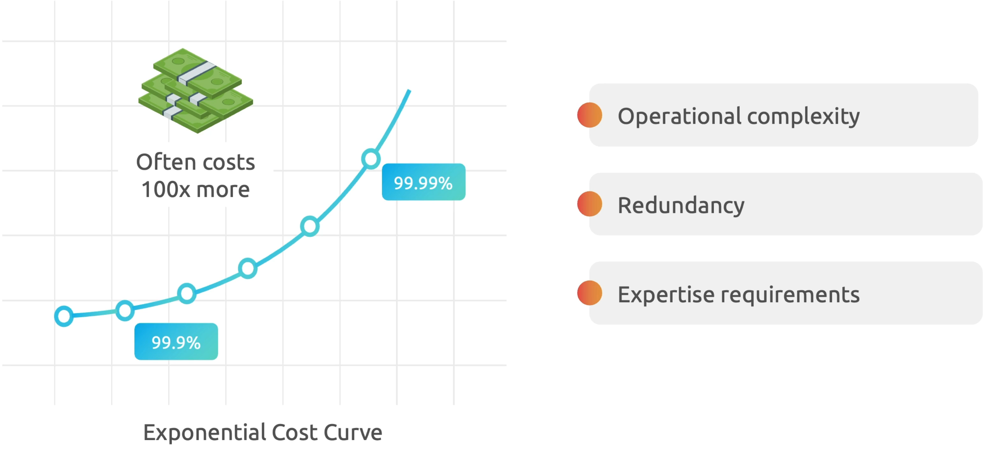

```
# Illustrative cost curve for adding nines
#
# 99%    (2 nines) — Base infrastructure, single-region, basic monitoring
# 99.9%  (3 nines) — +Multi-AZ deployment, basic auto-scaling, SLO monitoring
# 99.99% (4 nines) — +Multi-region active/passive, automated failover,
#                      chaos engineering, on-call 24/7, capacity planning
# 99.999%(5 nines) — +Multi-region active/active, zero-downtime deploys,
#                      custom hardware, dedicated SRE team, massive investment
#
# The jump from 3 nines to 4 nines is roughly 10x the engineering cost.
# The jump from 4 nines to 5 nines is roughly 10x again.
# Ask: does the business value justify the investment?
```

### Autoscaling Strategies

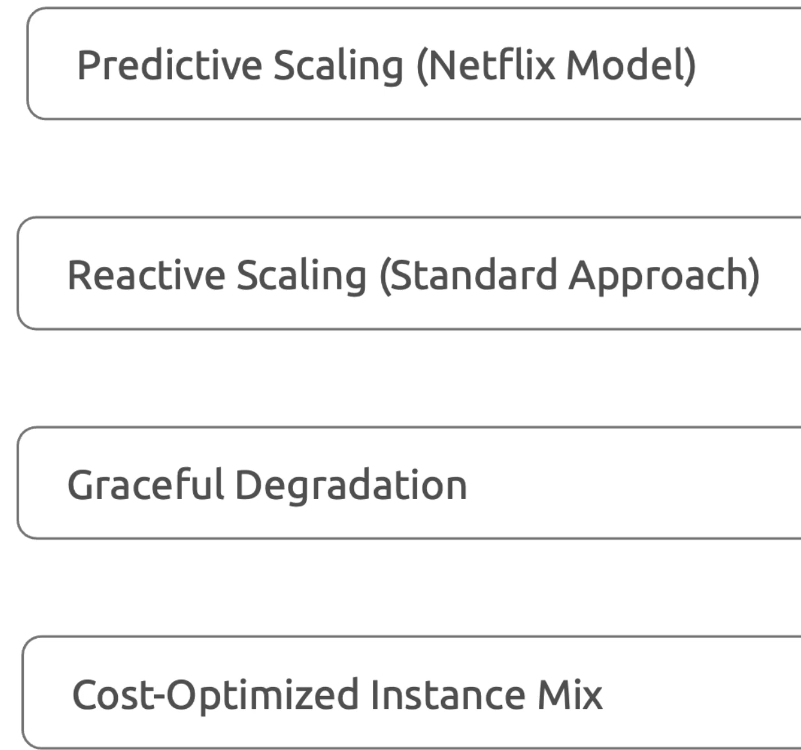

Autoscaling is one of the primary mechanisms for achieving reliability under variable load without permanently over-provisioning. There are three main autoscaling patterns in modern infrastructure:

**Horizontal Pod Autoscaler (HPA)** — Adds or removes pod replicas based on CPU, memory, or custom metrics. This is the most common Kubernetes autoscaling pattern. The scaling lag (time to spin up a new pod and pass health checks) means HPA works best for gradual traffic growth, not instantaneous spikes.

**Vertical Pod Autoscaler (VPA)** — Adjusts the CPU and memory requests of existing pods based on observed usage. Useful for right-sizing pods that are consistently over- or under-provisioned, but requires pod restarts to apply changes — less suitable for latency-sensitive services.

**Cluster Autoscaler** — Adds or removes nodes from the cluster based on unschedulable pods (scale-out) or underutilised nodes (scale-in). Works in conjunction with HPA: HPA requests more pods; Cluster Autoscaler provides the nodes to run them on.

For traffic spikes that are predictable (e.g., business hours patterns, scheduled batch jobs), **predictive autoscaling** — pre-scaling before the spike rather than reacting to it — eliminates the scaling lag problem entirely.

### SLO Budget Framework

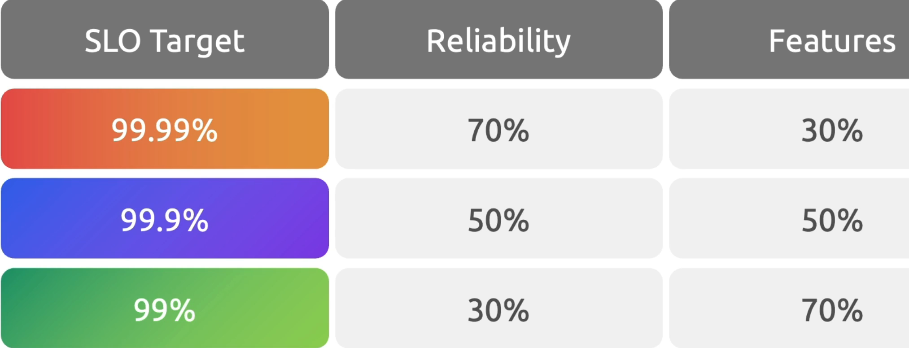

The SLO budget framework connects reliability targets to business decisions. The error budget is not just a technical metric — it is a negotiated agreement between the engineering team and the business about how much unreliability is acceptable in exchange for development velocity.

### Why Does the SLO Budget Matter?

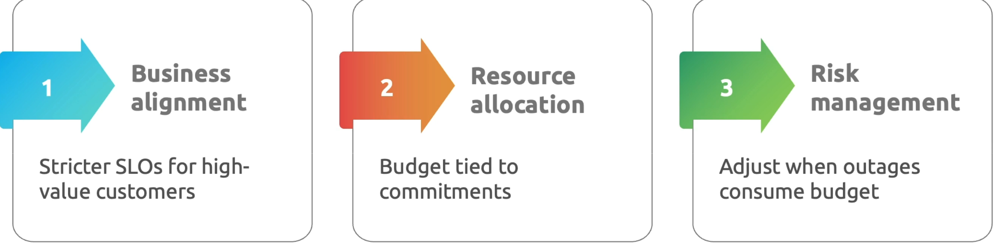

The error budget serves three critical functions:

1. **Release gate** — When the error budget is depleted, releases are frozen until the next measurement window. This creates a direct, automatic consequence for shipping bugs that impact reliability, without requiring a manual escalation process.

2. **Prioritisation signal** — A depleting error budget is an unambiguous signal that reliability work should be prioritised over feature work. Without a budget, these conversations are subjective; with one, they're data-driven.

3. **Shared accountability** — The error budget belongs to both the product team (who introduces change) and the SRE team (who maintains stability). This shared ownership model prevents the adversarial dynamic of "engineering wants to ship, SRE wants to freeze" by replacing it with a shared constraint that both teams must manage together.

---

## Common Pitfalls

**Running chaos experiments without observability.** If you can't measure steady state before the experiment, you can't know whether the experiment violated it. Chaos engineering requires solid observability as a prerequisite, not an afterthought.

**Starting in production.** Even with blast-radius controls, the first time you run a new chaos experiment should never be in production. Start in staging, verify the experiment behaves as expected, then graduate to production with a limited scope.

**No rollback mechanism.** Every chaos experiment must have an explicitly defined, tested rollback mechanism. "We'll just restart the pods" is not a plan. Automated rollback that fires when a predefined SLI threshold is breached is the gold standard.

**Targeting a five-nine SLO without the cost conversation.** The most expensive thing an SRE can do is agree to a 99.999% SLO for a service that doesn't need it. Have the cost conversation first: quantify what each additional nine requires in infrastructure, engineering, and operational investment, then let the business decide if it's worth it.

**Treating chaos engineering as a one-time exercise.** Systems change continuously — new services, new dependencies, new deployment patterns. A chaos experiment that passed six months ago may not pass today. Automate experiments and run them on a schedule.

---

## Interview Questions

1. **What is the difference between resilience testing and chaos engineering? Give a concrete example of each for a payment processing service.**

2. **Describe the five principles of chaos engineering. Why is "run experiments in production" a principle rather than a red line?** (Because staging never perfectly mirrors production; the principle includes blast-radius minimisation as a safeguard.)

3. **A product manager asks why moving from 99.9% to 99.99% SLO will take 6 months and cost $500k in engineering. How do you explain this?** (Tests: ability to articulate the non-linear cost of reliability.)

4. **You want to introduce chaos engineering at a company that has never done it before. What is your first experiment and why?** (Start small: kill one pod, verify recovery. Build confidence before expanding scope.)

5. **What is an error budget, and how does it change the conversation between a product team that wants to ship features and an SRE team that wants to freeze releases?** (Error budget depoliticises the conversation by replacing "SRE says no" with "the data says no.")

6. **What observability prerequisites must be in place before running a chaos experiment in production?**

---

## Key Takeaways

- **Chaos engineering reveals weaknesses that already exist** — it does not create new problems. It is the only way to verify that resilience mechanisms work under real conditions, not just in design documents.
- **Resilience testing verifies known failure modes; chaos engineering discovers unknown ones.** You need both.
- **Always define a steady-state hypothesis before running an experiment.** Without a baseline, you cannot tell whether the experiment caused a violation.
- **Start small, minimise blast radius, automate rollback.** These are non-negotiable safety properties for any chaos experiment.
- **Each additional nine of reliability costs roughly 10x more** than the previous one. Reliability targets are business decisions that must be made with full awareness of their cost.
- **The error budget is a shared contract** between product and SRE teams. It converts a subjective argument ("should we ship or freeze?") into an objective, data-driven decision.
- **Chaos maturity is a journey.** Start with manual game days in staging and evolve toward automated, continuous experiments in production as your observability and rollback infrastructure matures.