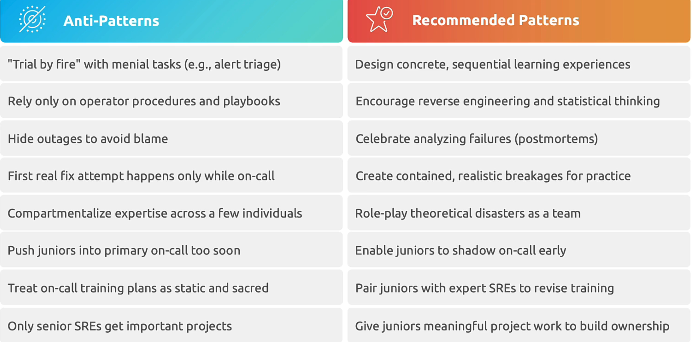
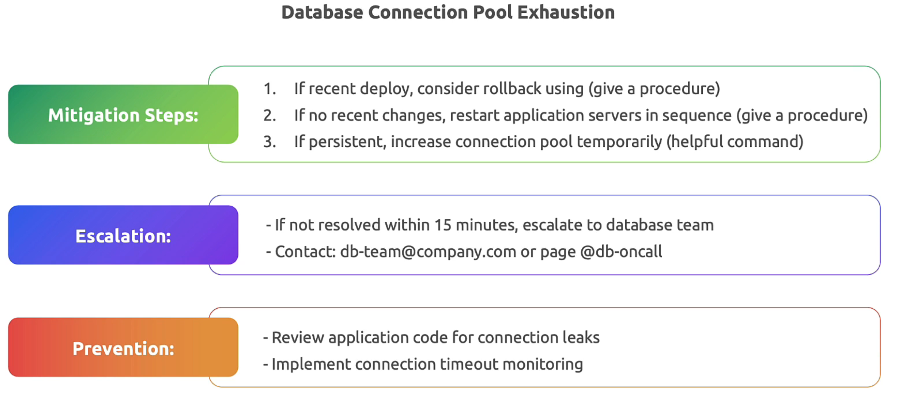
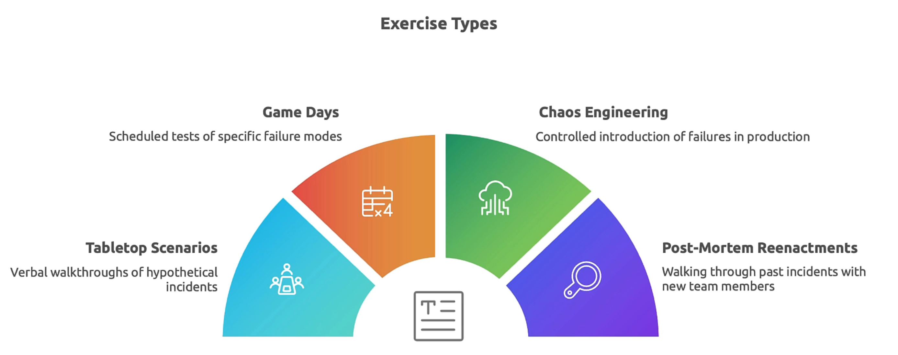
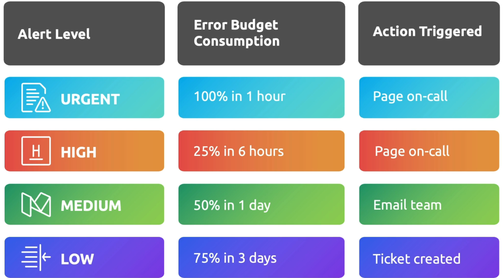
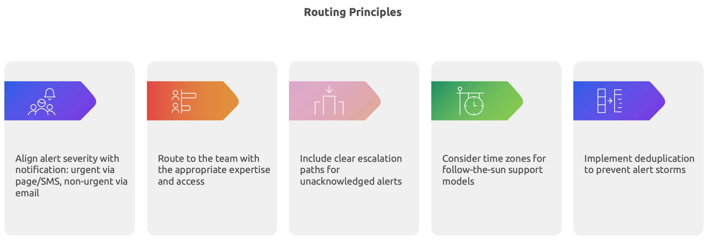
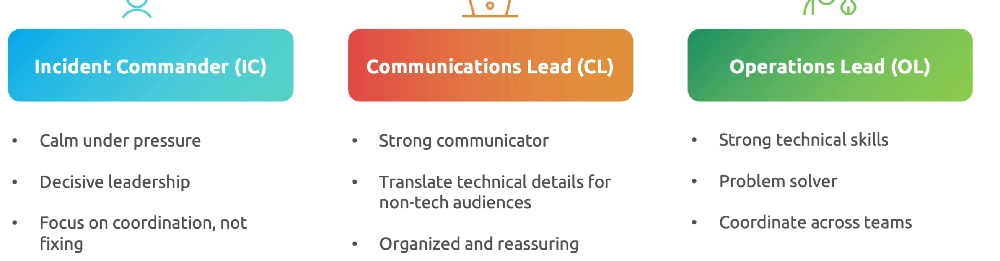
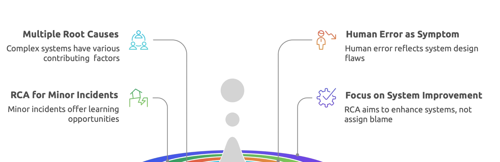
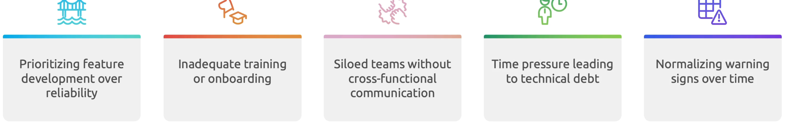

## Incident preparations

Why preparation matters 

what involves preparation 

preparation approach

Mitigation steps for above playbook 

Simulation and training

Regular practice involves incident response capabilities

Google's "wheel of misfortune"

## Design effective alerts

actionable critical alerts

![alert_example]./images/alert_example.png)

**system based **is always on the user focus, where as **cause based** is always on the internal 

proper alert routing ensures the right people receive notification at the right time

## Incident response structure and response level

IMAG - Incident Management At Google - it would address the challenge

- Establish clear roles and responsibilities
- Porcess that scale with incident complexity

key principles

Incident management common proactices

traits under role

Incident severity levels

Incident classification

**P levels** for incidents for immediate reponse

**Sev levels** - Categorizes incident by severity

Incident reposnse tooling

## Blameless postmorterm cluture

instead of asking **who did **?, infact ask **what caused** the issue.. thats about blameless postmorterm. 

postmorterm templates can be found here https://github.com/dastergon/postmortem-templates

## RCA

These are RCA misconceptions

Root cause Vs contributing factors

RCA 6 stages 

Common patterns in root causes

- techincal patterns

- process patterns

- organization patters

