## TL;DR

Incident management is the structured discipline of detecting, responding to, learning from, and preventing service disruptions. Done well, it is the difference between a 10-minute outage that users barely notice and a 4-hour crisis that makes the news. This document covers the full lifecycle: preparation (on-call readiness, playbooks, simulation), effective alerting, structured response (IMAG roles, severity levels), blameless post-mortems, and root cause analysis. Master this, and you will handle production incidents with calm, speed, and a system that gets more reliable with every failure.

See also: [SRE Overview](./overview.md) | [Observability](./observability.md) | [SRE Measurements](./sre_measure.md) | [Manage Complexity](./manage_complexity.md)

---

## Incident Preparation

Why preparation matters:

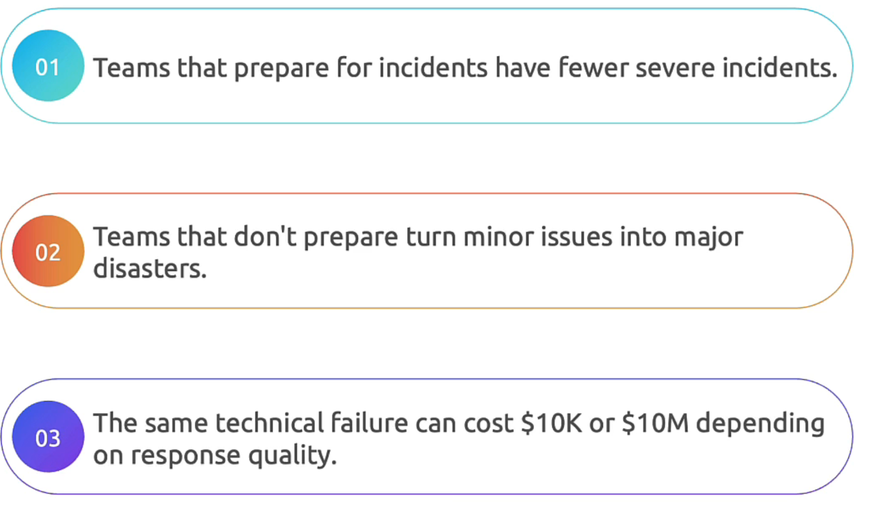

The best time to prepare for an incident is before one happens. An unprepared team facing a production outage will waste the first 20–30 minutes just establishing who is doing what, where to look, and who needs to be notified. These are minutes during which users are being impacted. Preparation compresses that chaos into a practised routine.

**Why does this matter for an SRE?** Your Mean Time to Recover (MTTR) is directly correlated with preparation quality. Teams with documented playbooks, clear on-call rotations, and regular simulation exercises consistently recover 2–3x faster than teams relying on tribal knowledge and improvisation.

What preparation involves:

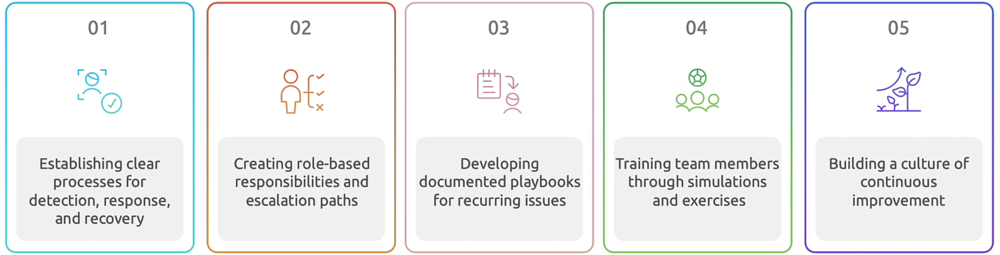

Preparation approach:

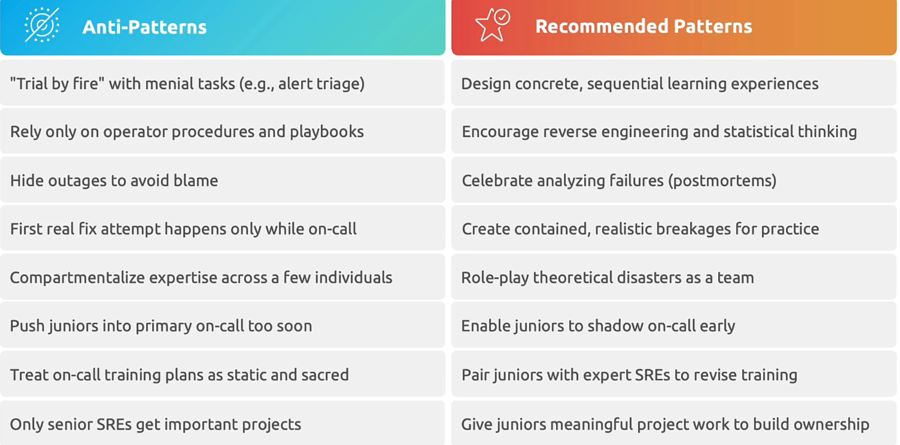

### On-Call Principles

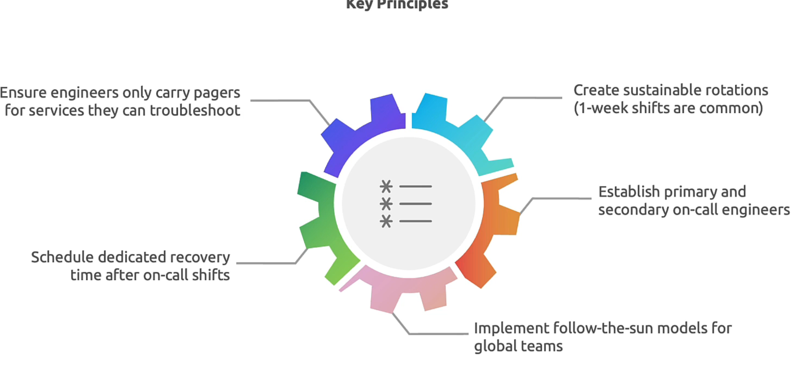

A healthy on-call rotation has three non-negotiable properties: it is **sustainable** (no one is burned out), **effective** (alerts are actionable, not noise), and **equitable** (the burden is distributed fairly). An on-call engineer who is woken up 5 times a week by noise alerts will eventually stop investigating carefully — alert fatigue is a reliability risk, not just a morale issue.

On-call engineers should have the following at their fingertips: a link to the service's runbook, access to the primary dashboard, the escalation path for when they are stuck, and clear criteria for when to declare a major incident vs. handle it quietly. Without these, every incident starts with a scavenger hunt.

### Playbook Development

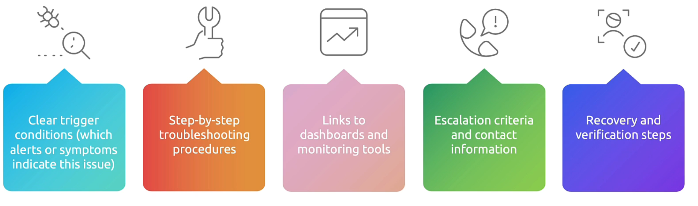

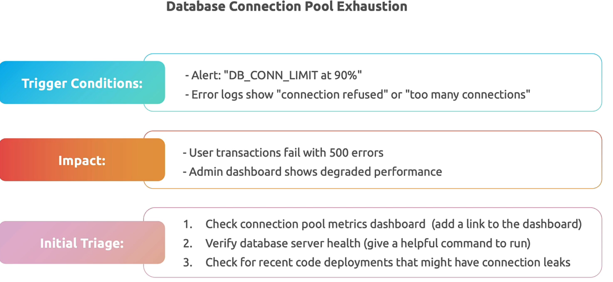

A good playbook is not a wall of prose — it is a decision tree. It starts from an alert or symptom, walks through diagnostic steps, and leads to a mitigation action. Each step should answer: "What do I check?" and "What do I do if the check shows X?" The best playbooks can be followed by a junior engineer at 3 AM without needing to escalate.

Playbooks should be versioned alongside the service code and updated after every incident where the runbook was insufficient. If the on-call engineer had to invent a diagnostic step that wasn't in the playbook, that step goes in the playbook before the post-mortem is closed.

Mitigation steps for a sample playbook:

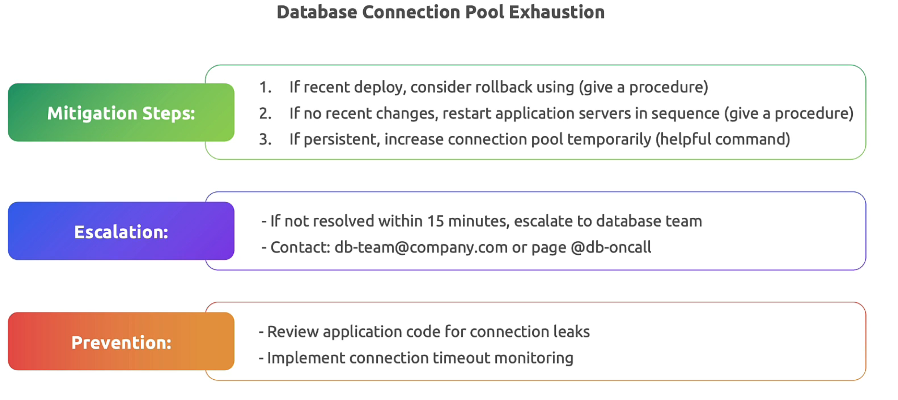

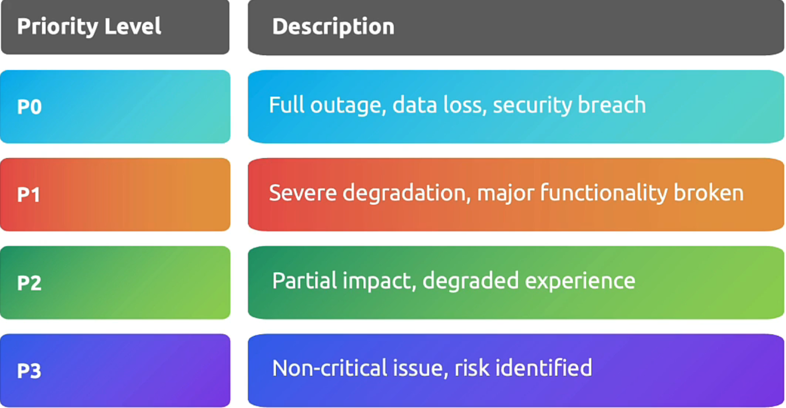

### Simulation and Training

Regular practice improves incident response capabilities — the same way fire drills improve evacuation speed. Incident response is a perishable skill; a team that only practices during real incidents will be slower and more error-prone than one that rehearses regularly.

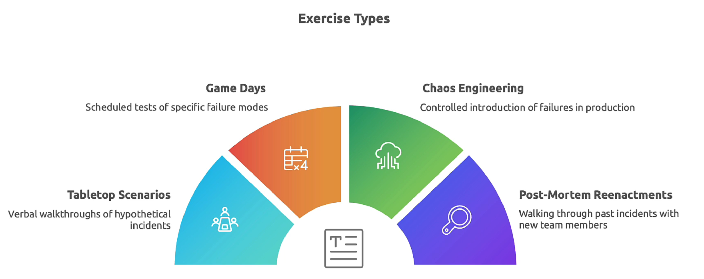

**Google's "Wheel of Misfortune"** is a structured game day exercise where an SRE is put in the role of on-call responder for a simulated historical incident. The scenario is drawn from past post-mortems (hence the "wheel"), and the engineer must diagnose and mitigate it using only the tools and runbooks available to the real on-call team. The exercise reveals gaps in runbooks, tooling, and training without risking production.

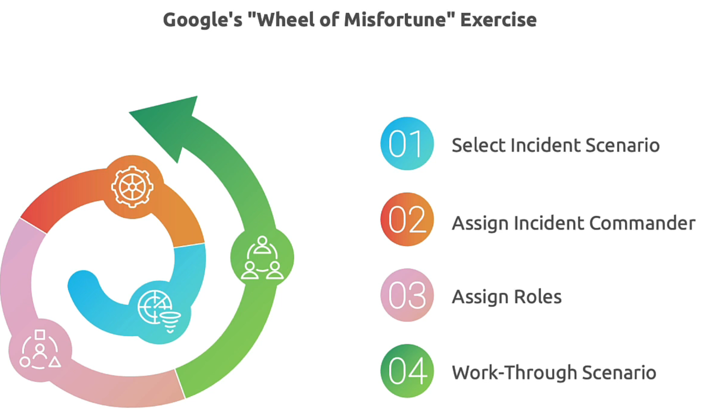

```
# Running a simple game day session
# 1. Pick a past incident from your post-mortem archive
# 2. Assign roles: Incident Commander, Responder, Observer
# 3. Present symptoms only (not the root cause) and start the clock
# 4. Responder works through diagnosis using only available tooling
# 5. Debrief: what was missing? what slowed them down? update playbooks.
```

---

## Designing Effective Alerts

Actionable, critical alerts:

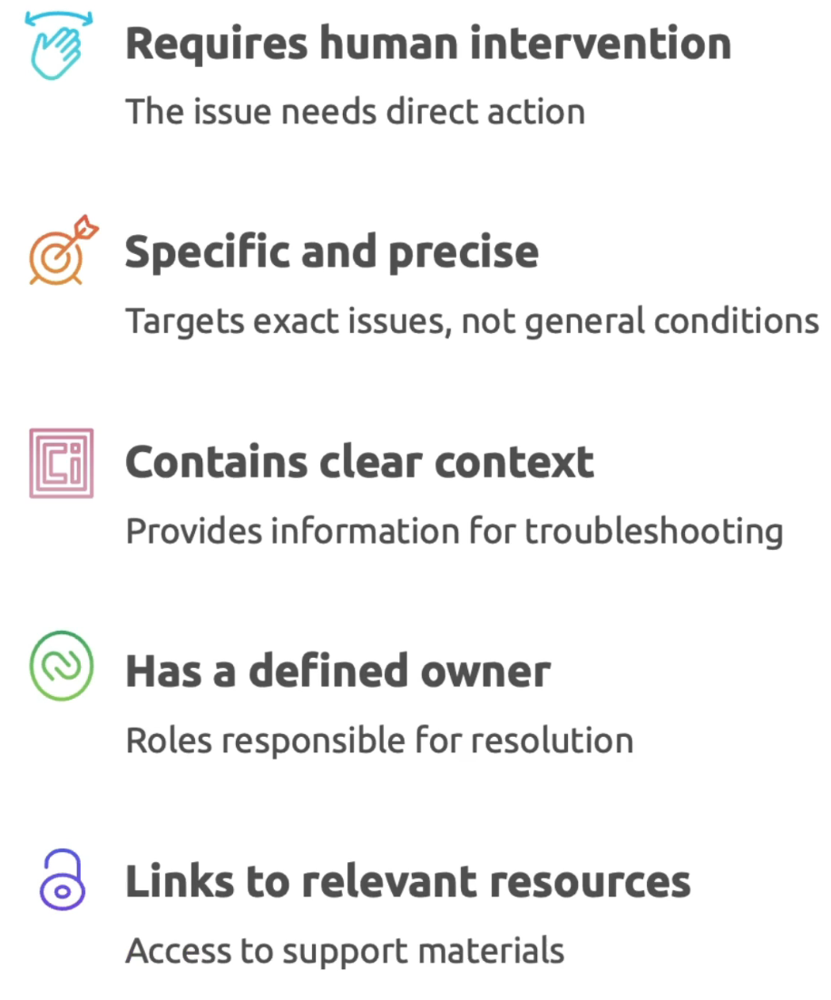

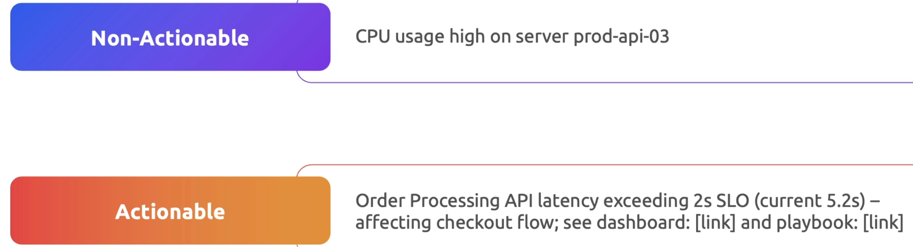

An alert should answer one question clearly: "Something is wrong that requires a human to act right now." If the alert does not require immediate human action, it should not be a page — it should be a dashboard warning or a ticket. Every unnecessary page degrades trust in the alerting system.

### Symptom-Based vs. Cause-Based Alerting

**Symptom-based alerting** is always focused on the user experience — what is the user observing? **Cause-based alerting** is focused on internal system state. The right approach is to alert primarily on symptoms and use dashboards and traces to investigate causes.

| Type | Example Alert | When to Use |
|------|--------------|-------------|
| **Symptom-based** | `HTTP 5xx rate > 1% for 5 minutes` | Primary on-call page — user-impacting |
| **Symptom-based** | `p99 latency > 2s for 10 minutes` | Primary on-call page — user-impacting |
| **Cause-based** | `CPU utilization > 85% for 15 minutes` | Warning ticket — investigate soon |
| **Cause-based** | `DB connection pool > 90%` | Warning — may lead to a symptom |

The reason to prefer symptom-based alerting: a high CPU alert tells you *something might be wrong*; a high error rate tells you *users are experiencing failures right now*. The former is noise most of the time; the latter demands action every time.

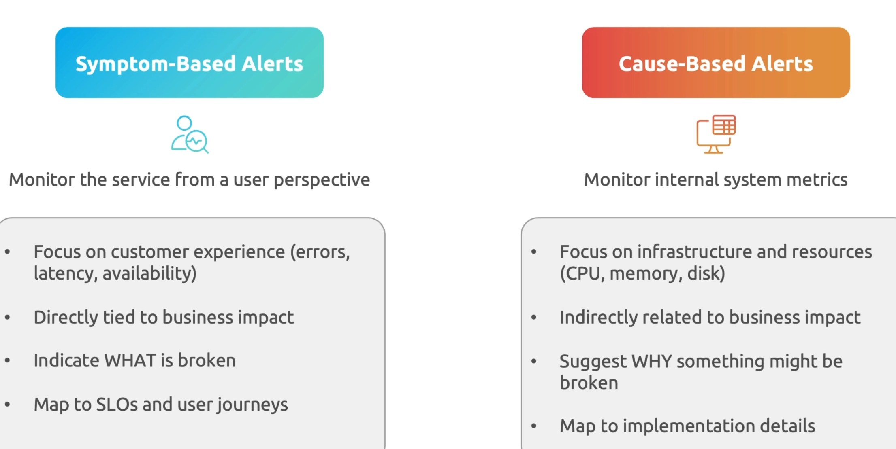

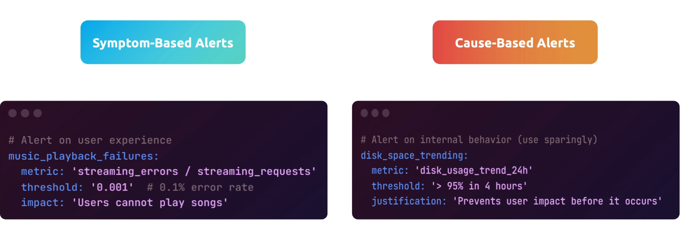

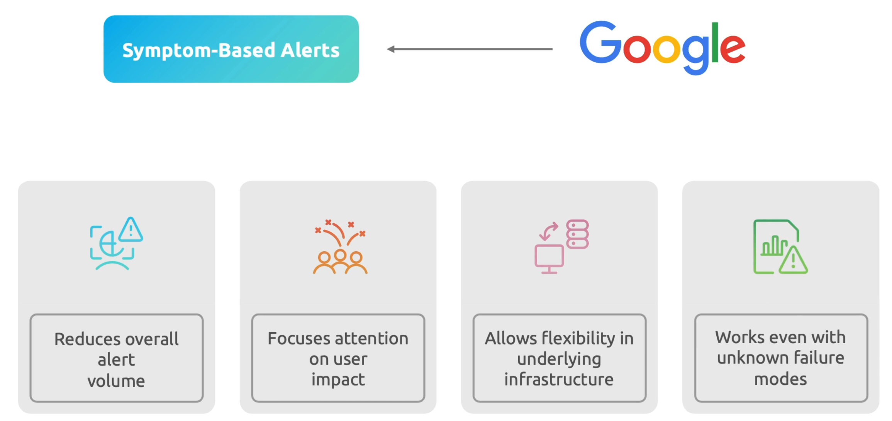

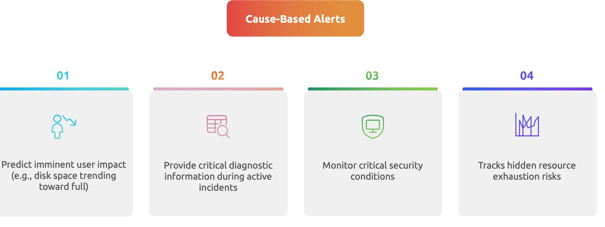

### SLO-Based Alerting

The most mature alerting strategy is to alert based on error budget burn rate rather than individual metric thresholds. A burn rate alert fires when the service is consuming its error budget faster than the SLO window can sustain, giving the team time to act before the SLO is actually breached.

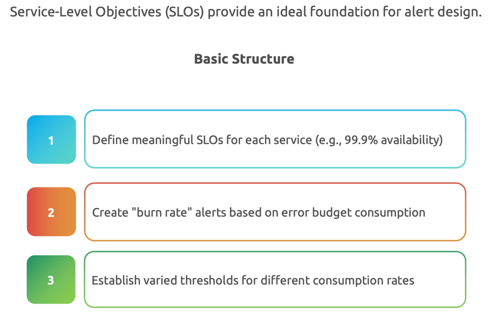

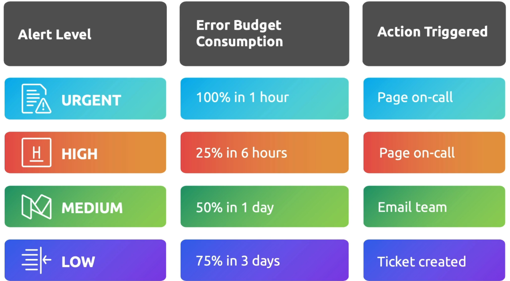

```
# Burn rate alerting concept
# SLO: 99.9% availability over 30 days (error budget = 43.2 minutes)
#
# A burn rate of 1x = consuming budget at exactly the sustainable rate
# A burn rate of 14.4x = will exhaust budget in 2 hours
#
# Google recommends a two-window, two-threshold approach:
#   Fast burn (1h window, 14.4x burn rate) -> page immediately
#   Slow burn (6h window, 6x burn rate)   -> page but lower urgency
```

### Alert Routing

Proper alert routing ensures the right people receive notification at the right time. An alert that pages the entire engineering org creates confusion and diffuses responsibility. Routing should follow the principle of minimal escalation: send the alert to the smallest team that can resolve the issue.

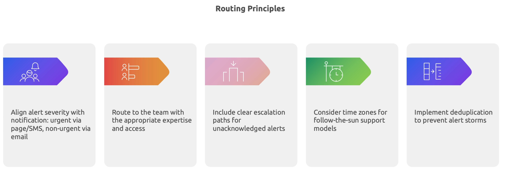

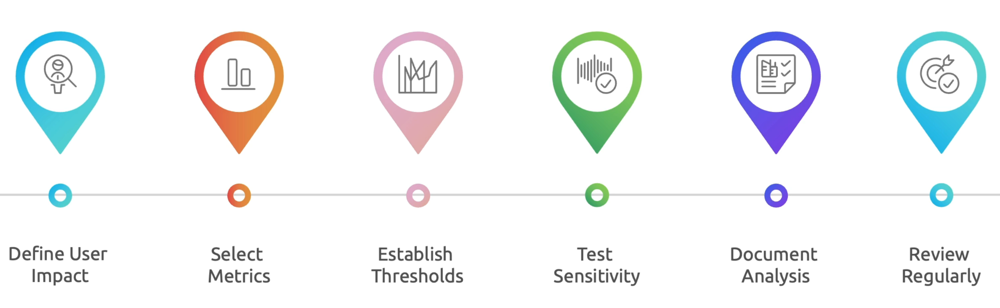

---

## Incident Response Structure

IMAG (Incident Management At Google) is Google's framework for structured incident response. It was designed to address two specific failures that plague ad-hoc incident response: lack of clear ownership (everyone investigates, no one coordinates) and processes that break down as incident complexity grows.

IMAG addresses these by establishing:

- **Clear roles and responsibilities** — every participant knows their job and defers to the Incident Commander for coordination decisions.
- **Processes that scale with incident complexity** — a P3 incident has a lightweight process; a P0 incident activates the full structure including communications and executive updates.

Key principles:

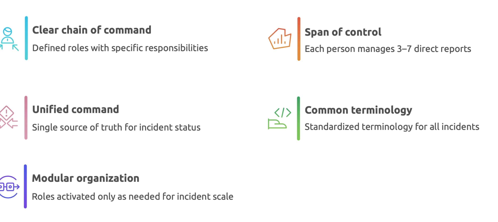

Incident management common practices:

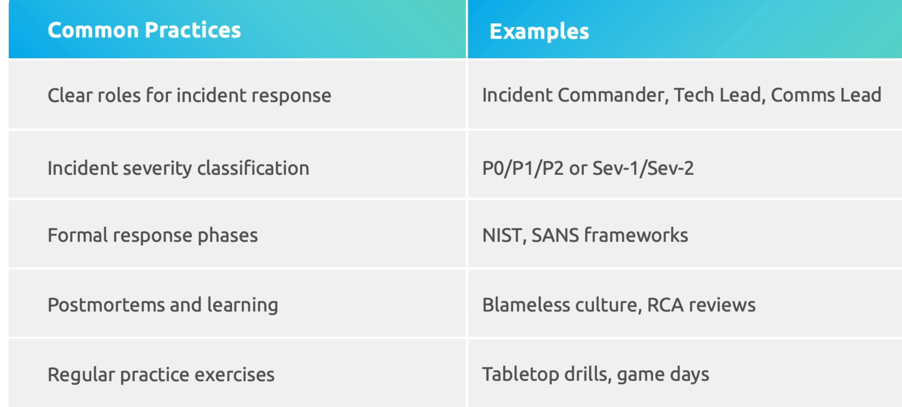

### Incident Response Roles

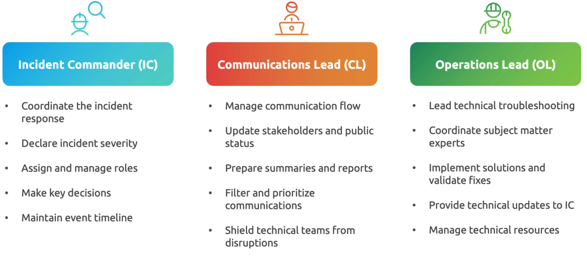

Traits under each role:

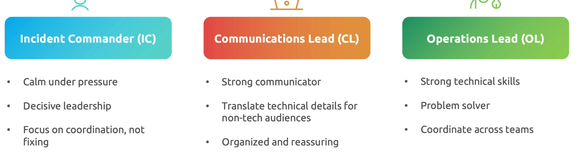

The three core roles in any incident:

**Incident Commander (IC)** — Owns the incident end-to-end. Makes decisions about escalation, resource allocation, and when to declare resolution. Does *not* personally diagnose or fix the issue — their job is to coordinate the people who do. The IC is the single point of truth about what is happening, what is being done, and what the current status is.

**Communications Lead (CL)** — Owns all external and internal communications: status page updates, Slack updates, executive summaries, and customer communications. This role exists to free the IC and technical responders from the distraction of answering "what's the status?" every five minutes.

**Subject Matter Expert (SME)** — The technical responder(s) who diagnose and implement the fix. There may be multiple SMEs for different subsystems. They report findings to the IC; they do not make unilateral decisions about mitigation steps during a major incident.

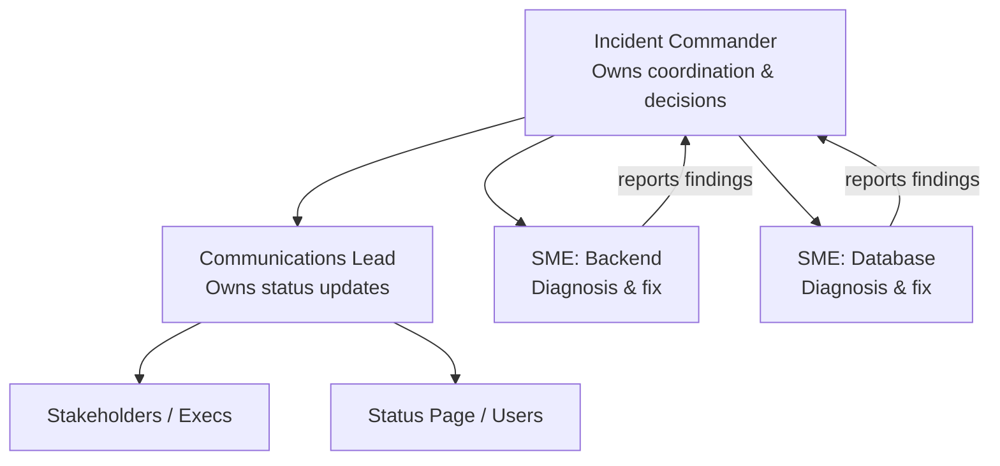
```mermaid
flowchart TD
    IC[Incident Commander\nOwns coordination & decisions]
    CL[Communications Lead\nOwns status updates]
    SME1[SME: Backend\nDiagnosis & fix]
    SME2[SME: Database\nDiagnosis & fix]
    Stakeholders[Stakeholders / Execs]
    Users[Status Page / Users]

    IC --> CL
    IC --> SME1
    IC --> SME2
    CL --> Stakeholders
    CL --> Users
    SME1 -- reports findings --> IC
    SME2 -- reports findings --> IC
```

### Incident Severity Levels

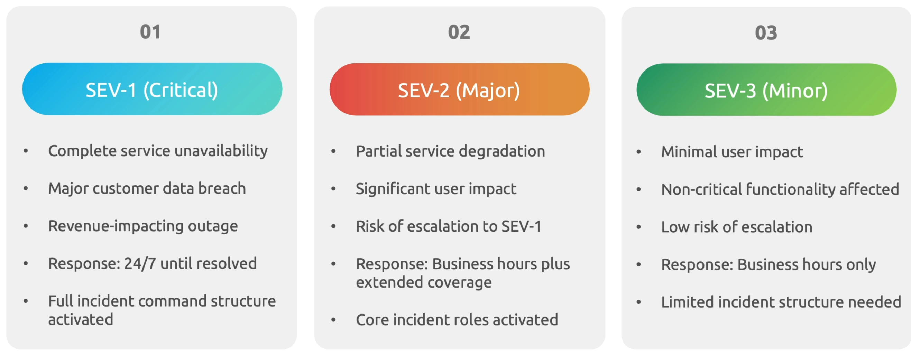

Incident classification uses two overlapping systems depending on the organisation:

**P levels (P0–P3)** are used for immediate response triage — P0 is "everything is on fire", P3 is "annoying but contained". P levels drive who gets paged and how fast.

**Sev levels (SEV1–SEV4)** categorise incidents by their business and customer impact — SEV1 means customers cannot use the product; SEV4 means an internal tool is degraded with a workaround available.

| Severity | User Impact | Response Time | Who is Notified |
|----------|------------|---------------|-----------------|
| P0 / SEV1 | Complete outage — all users affected | Immediate (< 5 min) | On-call + IC + Execs + Comms |
| P1 / SEV2 | Major degradation — large % of users | < 15 minutes | On-call + IC |
| P2 / SEV3 | Partial degradation — subset of users | < 1 hour | On-call team |
| P3 / SEV4 | Minor issue — workaround exists | Next business day | Ticket only |

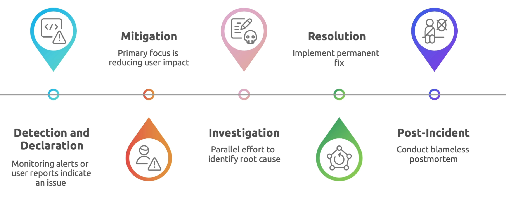

### Incident Response Tooling

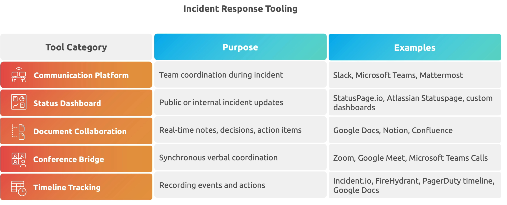

A production incident toolkit typically includes: a communication channel (dedicated Slack incident channel, Zoom war room), an incident tracking tool (PagerDuty, Incident.io, FireHydrant), observability access (Grafana, Datadog, Jaeger), and a shared incident doc (Google Doc or Confluence page) where the timeline, hypotheses, and actions are logged in real time. The real-time incident doc is critical — it provides continuity when responders hand off, and it becomes the primary source for the post-mortem.

---

## Blameless Post-Mortem Culture

Instead of asking **"who did this?"**, ask **"what caused this?"** — that is the essence of a blameless post-mortem.

Blameless post-mortems are not about being "nice" to people who make mistakes. They are about building a system that learns. When engineers know they won't be blamed personally, they are willing to share complete and honest information about what went wrong. That information is exactly what is needed to prevent the next incident. Blame-oriented cultures get incomplete post-mortems and repeat incidents; blameless cultures get honest ones and systemic fixes.

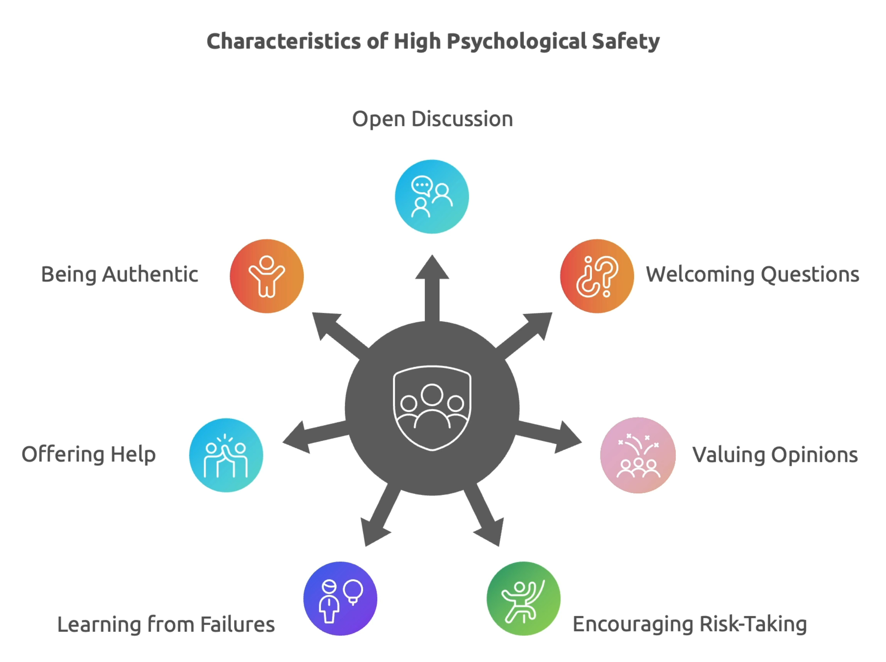

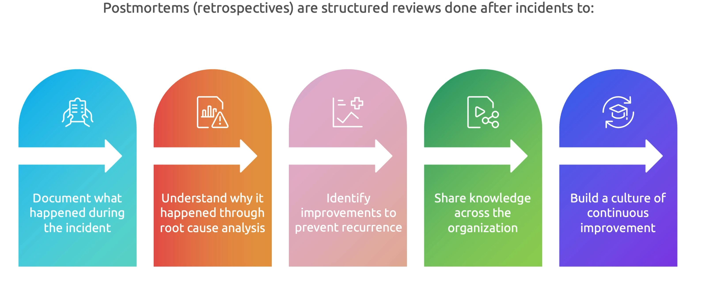

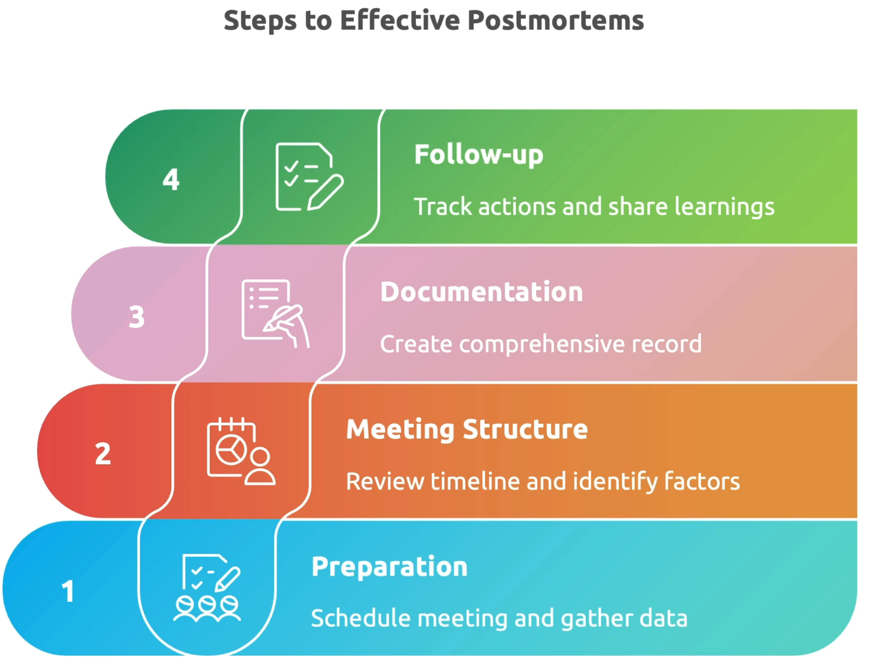

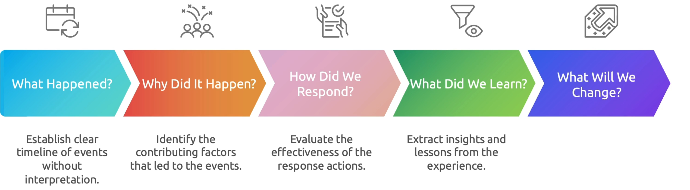

### What Makes a Post-Mortem Effective?

An effective post-mortem has five non-negotiable sections:

1. **Timeline** — A chronological account of what happened, when it was detected, what actions were taken, and when it was resolved. Written from telemetry data (logs, alerts, deployment history), not from memory alone.
2. **Impact** — Quantified user impact: how many users were affected, for how long, what percentage of traffic was degraded, what was the estimated revenue or SLO impact.
3. **Root causes and contributing factors** — What actually caused the incident (see RCA section below). Not "human error" — that is never an acceptable root cause.
4. **What went well** — Explicitly call out what worked during the response. This is not just positive reinforcement — it tells you which practices to replicate.
5. **Action items** — Concrete, assigned, time-bounded tasks that prevent recurrence. Each action item should have an owner and a due date. Unassigned action items never get done.

> Post-mortem templates: [https://github.com/dastergon/postmortem-templates](https://github.com/dastergon/postmortem-templates)

---

## Root Cause Analysis (RCA)

RCA is the process of identifying the underlying cause(s) of an incident rather than just addressing the immediate symptom. Treating symptoms without addressing root causes guarantees you will see the same incident again.

RCA misconceptions:

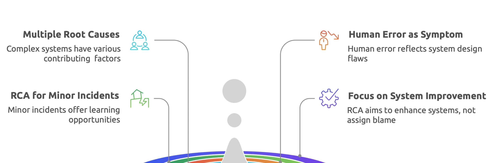

The biggest misconception in RCA is that every incident has a single root cause. Complex systems have complex failures — most significant incidents are the product of multiple contributing factors that aligned at an unfortunate moment. The goal of RCA is not to find *the* cause but to find *all* the causes and understand how they interacted.

### Root Cause vs. Contributing Factors

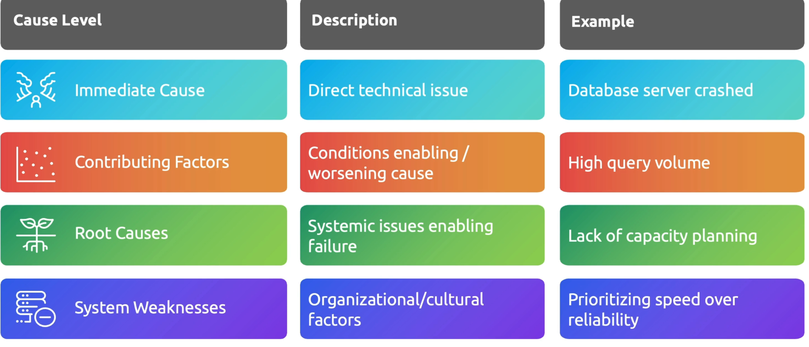

A **root cause** is the deepest systemic factor that, if corrected, would prevent the incident class from recurring. A **contributing factor** is a condition that made the incident more likely, more severe, or harder to detect — but removing it alone would not prevent recurrence.

Example: A service crashes under high load (symptom). The root cause is a memory leak in a new code path (fix: patch the leak). Contributing factors include: no memory utilisation alert (fix: add alert), load test did not catch the leak (fix: improve load testing coverage), and no circuit breaker to shed load gracefully (fix: add circuit breaker). Addressing only the root cause without the contributing factors means the next bug that causes high memory usage will also cause a crash.

### The 5 Whys Technique

The 5 Whys is a simple but powerful RCA technique: ask "why?" repeatedly until you reach a systemic cause rather than a proximate one.

```
# Example: 5 Whys for a payment service outage

Symptom: Payment service returned 503s for 12 minutes

Why? The service ran out of database connections
Why? The connection pool was exhausted
Why? A slow query was holding connections open for 30+ seconds
Why? A new index was dropped during a routine migration
Why? The migration script was not reviewed against the production query plan

Root cause: No production query plan review gate in the CI/CD pipeline
Fix: Add automated EXPLAIN ANALYZE check as a migration pre-flight step
```

### RCA 6-Stage Process

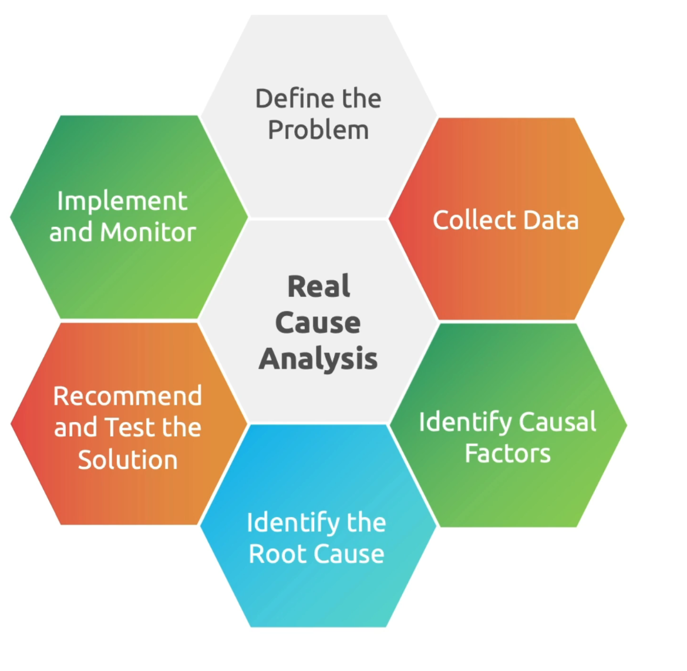

### Common Root Cause Patterns

Technical patterns:

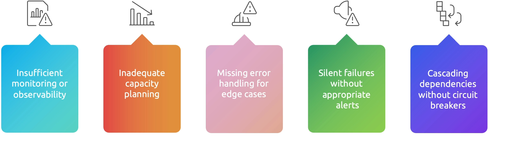

Process patterns:

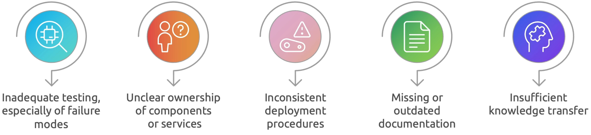

Organisational patterns:

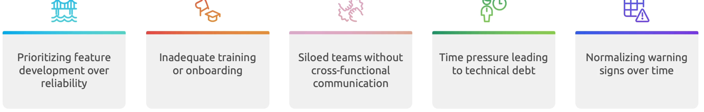

Organisational patterns are the most important and the most neglected. Technical root causes ("the bug") are usually easy to find. Organisational root causes ("we had no process to catch this class of bug before production") are harder to admit but more valuable to fix. A strong post-mortem culture surfaces organisational patterns over time and drives process improvements that make the entire engineering organisation more reliable.

---

## Common Pitfalls

**No defined Incident Commander.** When everyone is in charge, no one is in charge. The first 60 seconds of a major incident should establish who the IC is. If that is unclear, establish it before doing anything else.

**Diagnosing while communicating.** Responders who are simultaneously investigating, updating stakeholders, and answering questions in five different Slack channels are doing all three things poorly. The Communications Lead role exists precisely to separate these concerns.

**Post-mortem action items with no owner or deadline.** "We should add better monitoring" written in a post-mortem and assigned to "the team" with no deadline will not happen. Every action item needs a named owner and a date.

**Treating "human error" as a root cause.** Humans make mistakes. A system that relies on humans never making mistakes is fragile. When an engineer's mistake caused an incident, the real question is: what system, process, or tooling failed to catch or prevent the mistake?

**Not practising before a real incident.** Game days and wheel-of-misfortune exercises feel like overhead until your team handles a real SEV1 in 20 minutes instead of 3 hours because they've practised the motions.

**Alert fatigue from non-actionable pages.** If an alert does not require immediate action, it should not page someone. Every false positive trains engineers to treat pages as noise, which means they'll be slower to respond when a real incident fires.

---

## Interview Questions

1. **Walk me through how you would handle a P0 incident from detection to resolution.** (Tests: role assignment, communication cadence, hypothesis-driven debugging, escalation judgment.)

2. **What is a blameless post-mortem and why does it produce better outcomes than a blame-oriented one?** (Tests: understanding of psychological safety and systemic thinking.)

3. **What is the difference between a root cause and a contributing factor? Give an example.** (Tests: depth of RCA thinking.)

4. **Your on-call is being paged 15 times per week by non-actionable alerts. What do you do?** (Tests: alert hygiene, symptom vs. cause, burn rate alerting.)

5. **How do you write a post-mortem action item so that it actually gets done?** (Named owner, specific scope, measurable outcome, deadline.)

6. **What is IMAG and how does the Incident Commander role differ from a technical SME during an incident?**

---

## Key Takeaways

- **Preparation is the multiplier.** Teams with practised playbooks, clear on-call setups, and simulation exercises recover faster and with less stress than those improvising in the moment.
- **Alert on symptoms, investigate causes.** Symptom-based alerting keeps pages actionable and reduces fatigue. Cause-based signals belong on dashboards, not in pagers.
- **Structure scales; heroics don't.** The IMAG model of IC, CL, and SME allows a single framework to handle both a minor degradation and a full platform outage. Ad-hoc response works until it doesn't.
- **Severity levels are a coordination protocol.** They determine who gets paged, how fast, and what communication is required — not just how bad the incident feels.
- **Blameless post-mortems are an investment.** They produce honest timelines, real root causes, and action items that make the system more reliable. Blame produces cover stories and repeat incidents.
- **"Human error" is never a root cause.** It is always a signal that a system, process, or check failed to catch or prevent the mistake. Fix the system.
- **RCA finds the entire causal chain**, not just the most recent mistake. Address root causes and contributing factors together to prevent the incident class from recurring.