## System design simplicity

Simplicity is a design goal

One rule of managing complex systems is to ensure they're actually necessary.

Complex systems are:

- Harder to understand 
- Harder to maintain
- prone to undexpected failures

Realibility cost complexity

Reason for increased complexties

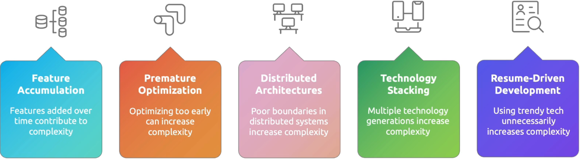

Simplification strategies

## Managing dependency

Dependency types:

- Direct deps - Componet A calls component B
- Indirect deps - Comp A relies on B through intermediary 
- Runtime deps - External services, db and caches
- Build time deps - libs, framework, tools

Blast Radius

measures how widely a failure spead across systems, knowing a components blast radius guides realibility priorities

Factors afftecting blast radius

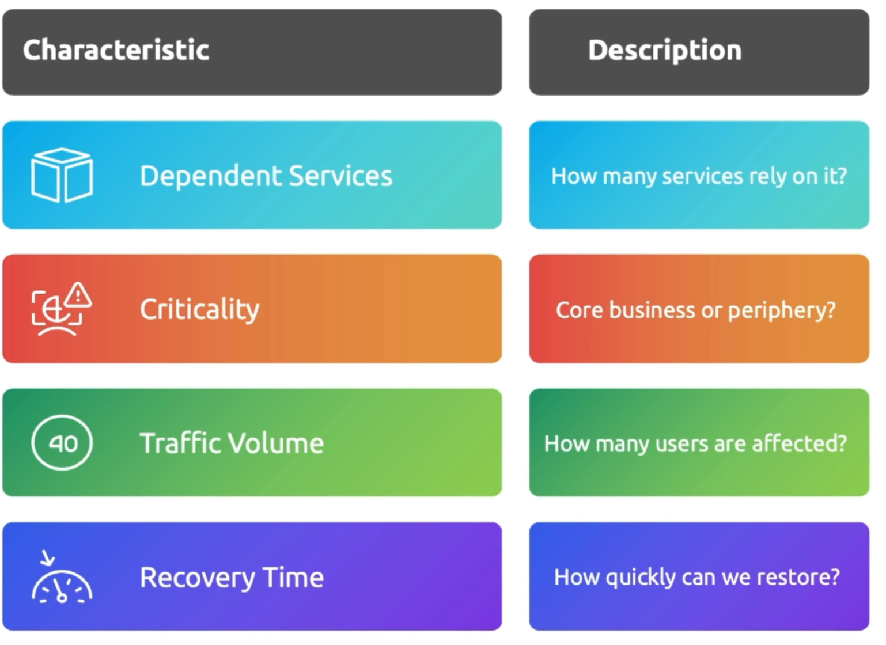

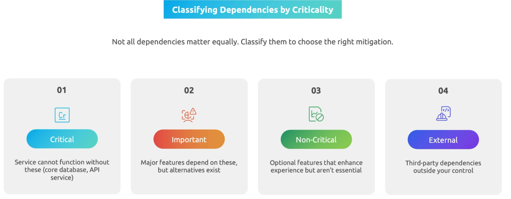

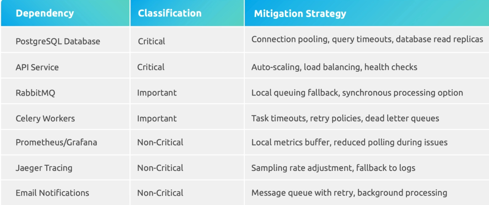

## Change Management

Common failures 

SRE needs to balance between **velocity and the stability** for the change. 

small, frequent, validated code changes actually leads to :

- Better learning
- Greater system resilience
- Faster recovery 
- Tighter feedback loops 

Safe deployments strategies

- Blue green deployment
- Canary 
- Feature flags

Monitoring is crtutial during changes after deployments ..

After change request 

Error rate - is it increasing after change ?
latency - us system responding more slowly ?
traffic - are users able to access the service ?
saturation - are resources under pressure ?
Deployment progress - is the chg expected as per plan

Deployment verfiication process

smoke tests - basic functionality checks
integrration tests - validates component interactions
performance tests - verified system performance
canary test - real users test new version
gradual traffic testing - increases traffic with monitoring

## capacity planning

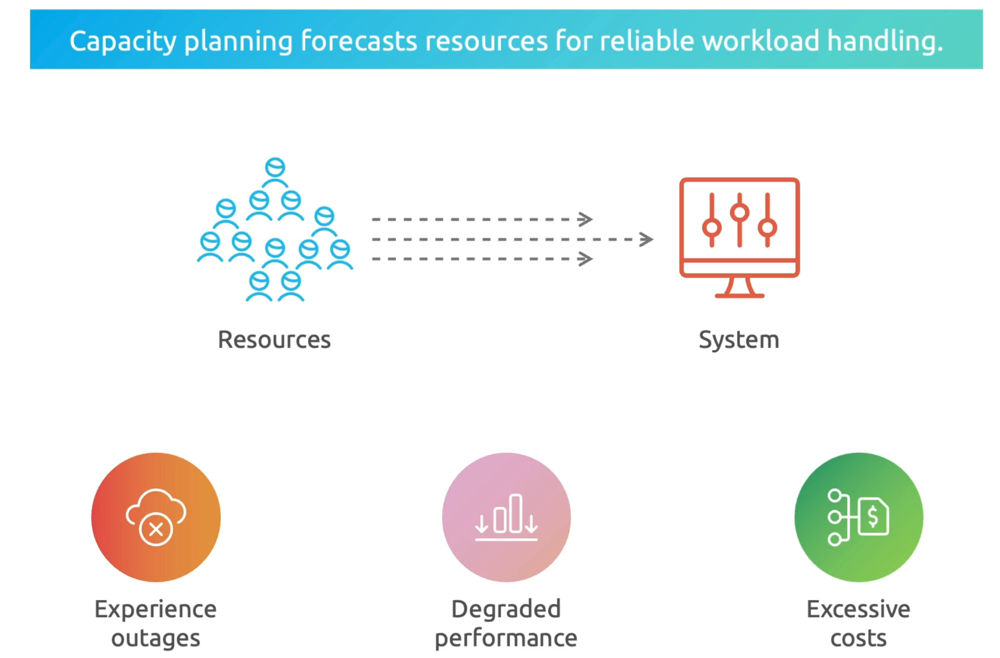

Key components of capacity planning

Benefits:

- Prevents outages 
- reduce costs by right sizing infra
- supports business growth with adequate capacity
- improves user experiance by maintaining performance 
- enables more predicatable and planning

resource measurement 

Forecating models

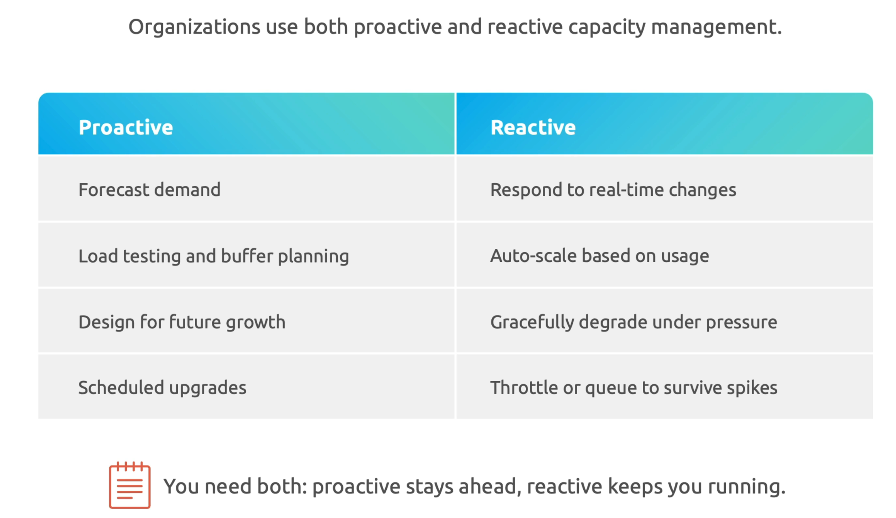

threshold types

## Managing operation toil

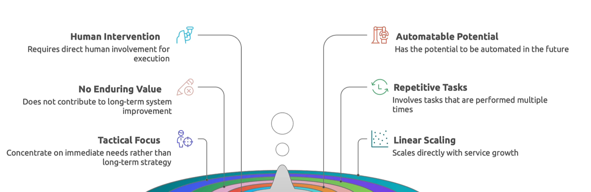

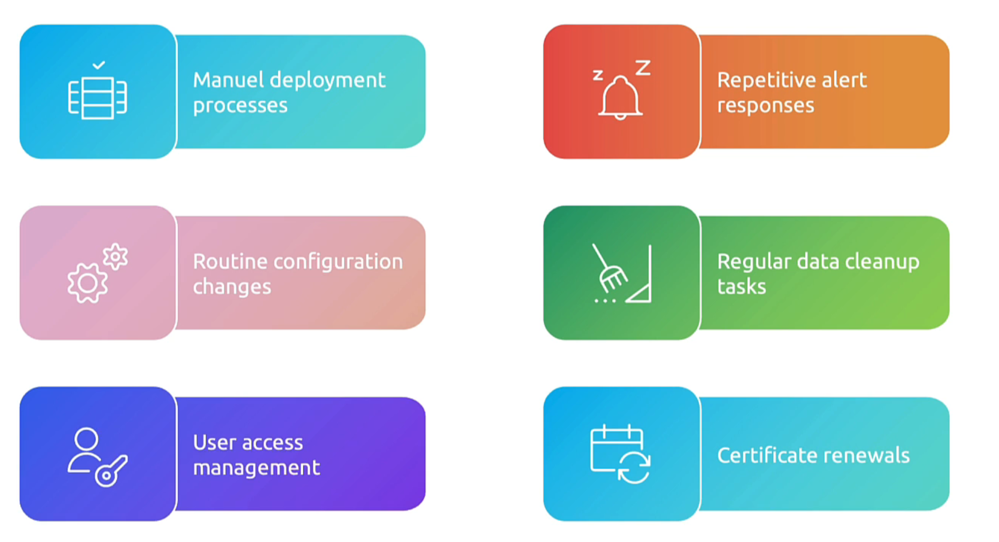

toil impact from enginner presepective

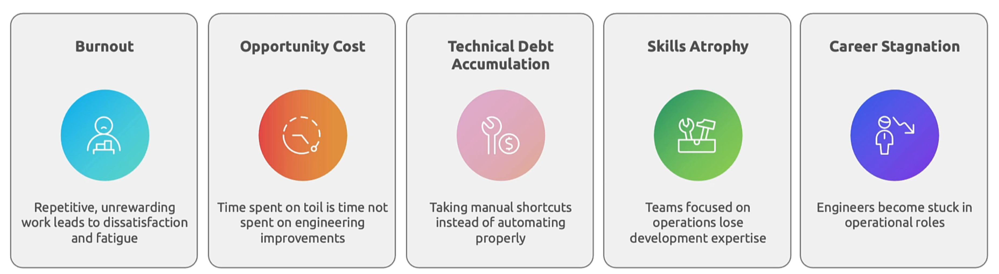

toil impact from Business prespective

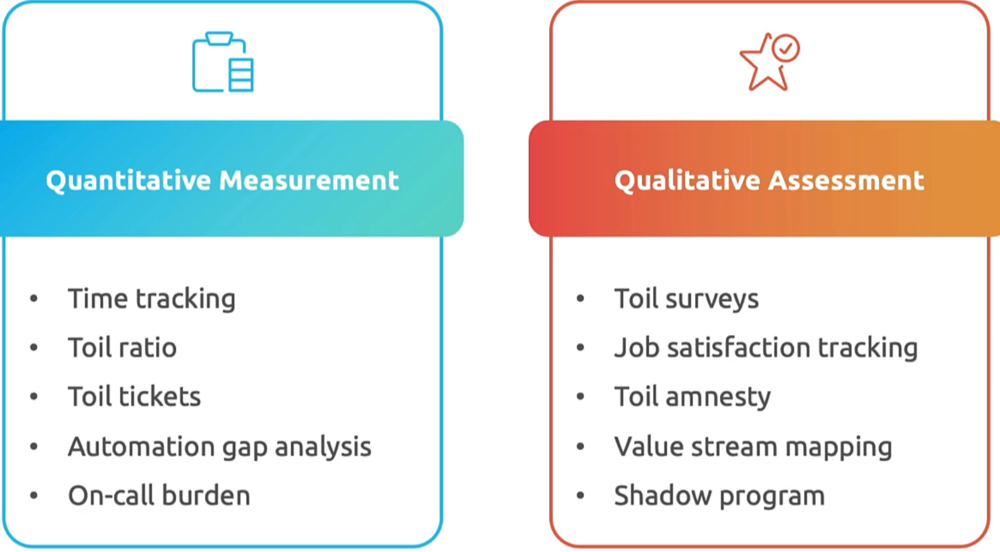

Direct cost

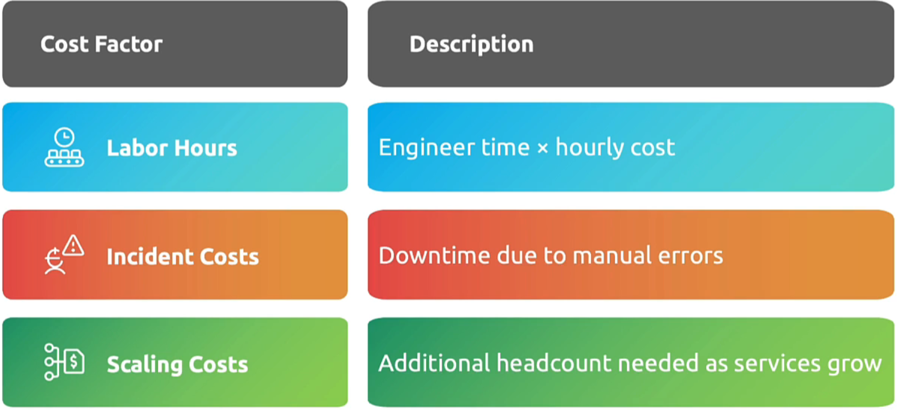

Indirect costs

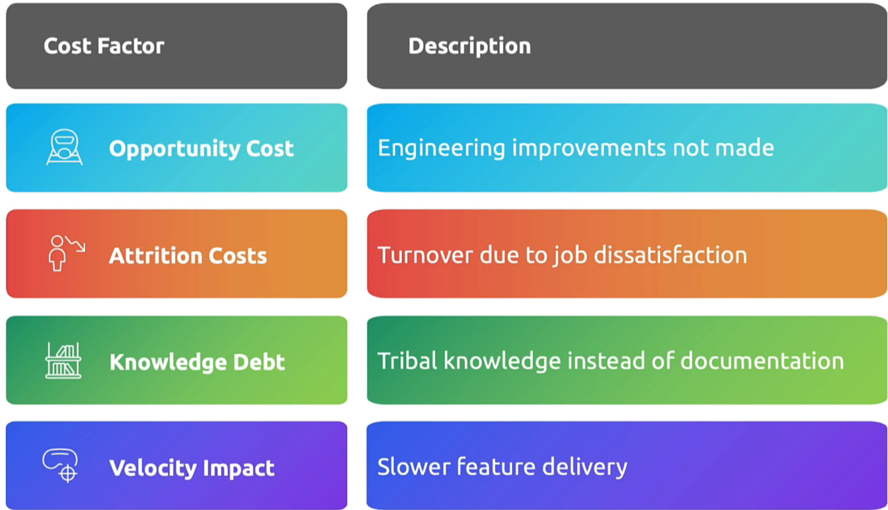