## TL;DR

Managing complexity is one of the most important — and least glamorous — parts of SRE work. Every new service, dependency, or configuration option you add increases the surface area for failure. This document covers the four levers SREs use to keep systems manageable: simplifying system design, managing dependencies carefully, controlling change safely, planning capacity proactively, and eliminating operational toil. If you master these, you'll spend less time firefighting and more time engineering.

See also: [SRE Overview](./overview.md) | [Incident Management](./incident_management.md) | [Observability](./observability.md)

---

## System Design Simplicity

Simplicity is a design goal, not just a nice-to-have.

One rule of managing complex systems is to ensure that their complexity is actually necessary. Before adding a new component, a new abstraction layer, or a new dependency, an SRE should ask: "What reliability or operational problem does this solve, and is the added complexity worth the trade-off?" More often than not, a simpler solution exists.

Complex systems fail in complex ways. The more moving parts a system has, the harder it is to predict how failures will cascade. A distributed system with 10 microservices has exponentially more failure modes than a well-structured monolith — and unless you have the operational maturity to manage that complexity (tracing, circuit breakers, runbooks for each service), you've traded one set of problems for a harder one.

**Why does this matter for an SRE?** Complexity is the silent tax on reliability. A new feature that "only adds one more API call" might introduce a latency tail, a new failure mode, and a new dependency to monitor. SREs are the natural check on accidental complexity — they see the full blast radius of every addition.

Complex systems are:

- **Harder to understand** — A new on-call engineer cannot build a mental model of the system quickly, increasing MTTR during incidents.
- **Harder to maintain** — Every dependency needs to be upgraded, patched, monitored, and supported. The carrying cost compounds over time.
- **More prone to unexpected failures** — Interactions between components produce emergent failure modes that no single team predicted.

Reliability costs complexity.

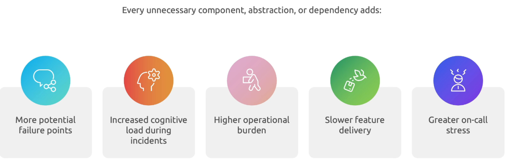

Reasons for increased complexity:

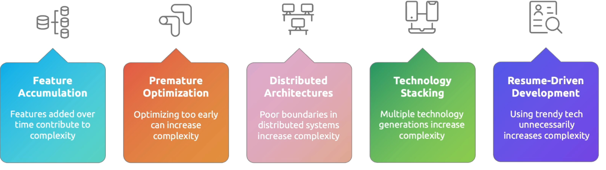

Simplification strategies:

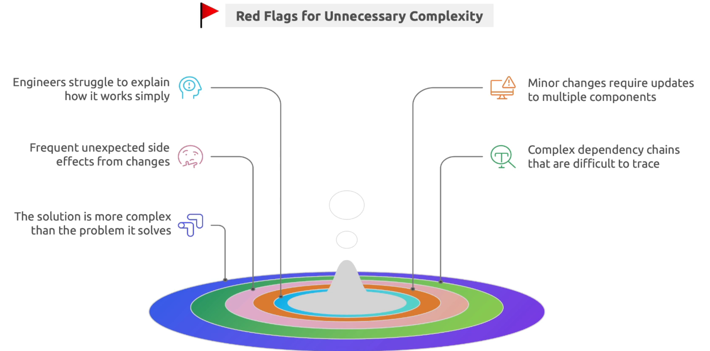

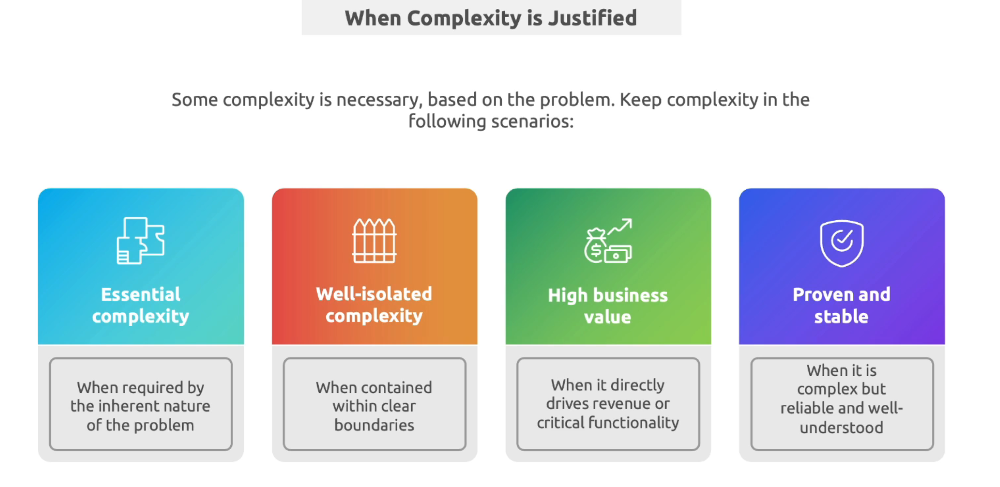

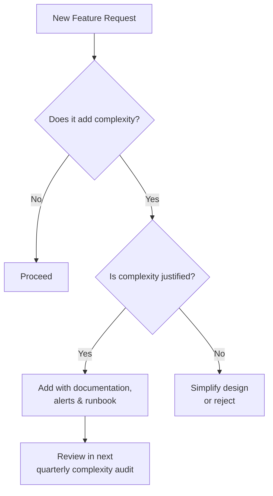
```mermaid
graph TD
    A[New Feature Request] --> B{Does it add complexity?}
    B -- No --> C[Proceed]
    B -- Yes --> D{Is complexity justified?}
    D -- Yes --> E[Add with documentation,
alerts & runbook]
    D -- No --> F[Simplify design
or reject]
    E --> G[Review in next
quarterly complexity audit]
```

---

## Managing Dependencies

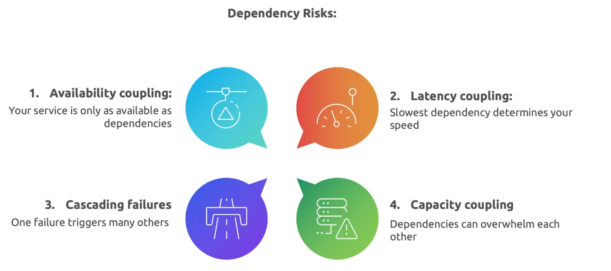

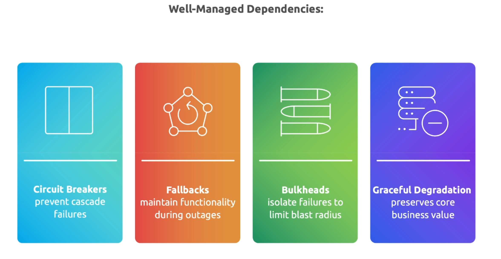

Every service you call is a liability as well as an asset. Dependencies are the primary way that a failure in one part of the system becomes a failure in a completely different part — and the primary way that a simple incident becomes a multi-team, multi-hour outage.

### Dependency Types

Understanding what kind of dependency you have determines the right reliability pattern to apply:

- **Direct dependencies** — Component A calls Component B synchronously. If B is slow or unavailable, A is directly impacted. These require circuit breakers and timeouts.
- **Indirect dependencies** — Component A relies on Component B through an intermediary (e.g., a message queue or service mesh). Failures are buffered but can still propagate if the intermediary itself fails.
- **Runtime dependencies** — External services, databases, and caches that a service needs at request time. These are the most dangerous because they sit on the critical path of every user request.
- **Build-time dependencies** — Libraries, frameworks, and build tools. These don't affect runtime reliability directly, but a compromised build-time dependency (supply chain attack) can introduce vulnerabilities into your production artifacts.

### Blast Radius

Blast radius measures how widely a failure spreads across systems. Knowing a component's blast radius guides reliability priorities — a shared authentication service has a massive blast radius (everything breaks if auth is down), while a recommendation engine has a small one (the page still loads, just without personalized results).

Factors affecting blast radius:

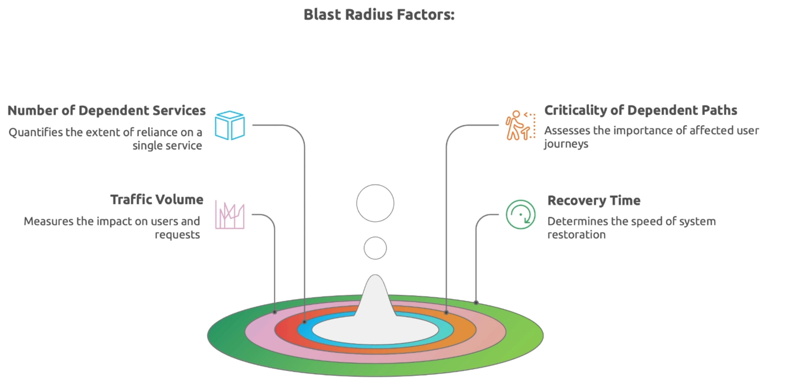

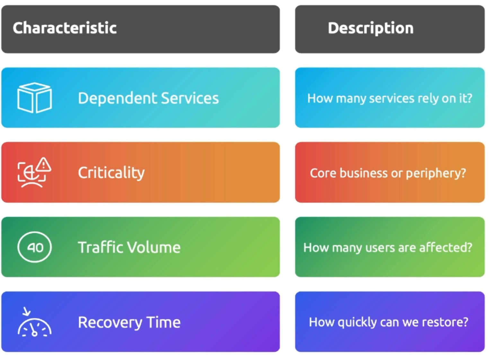

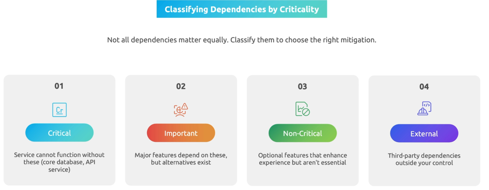

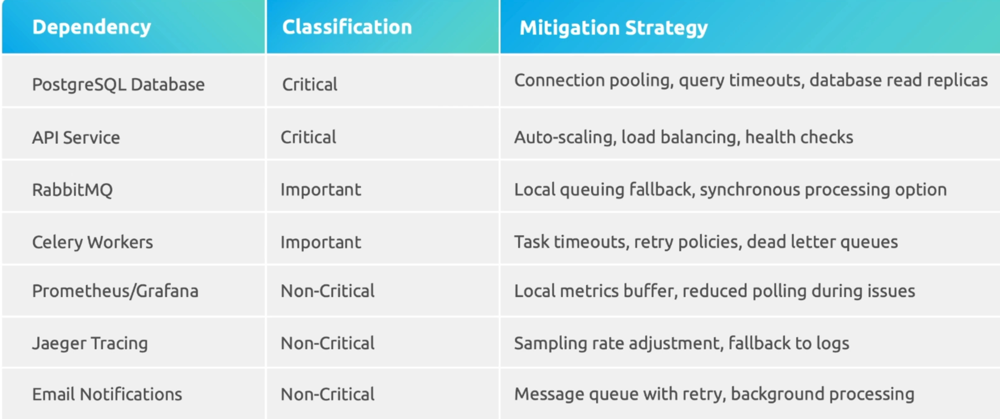

### Resilience Patterns

The following patterns are the SRE toolkit for limiting blast radius when dependencies fail:

**Circuit Breaker** — Wraps calls to a dependency. If the error rate or latency exceeds a threshold, the circuit "trips" and subsequent calls fail fast (return a cached response or an error immediately) rather than waiting for a slow dependency to time out. This prevents one slow dependency from consuming all request-handling threads and cascading into a full outage.

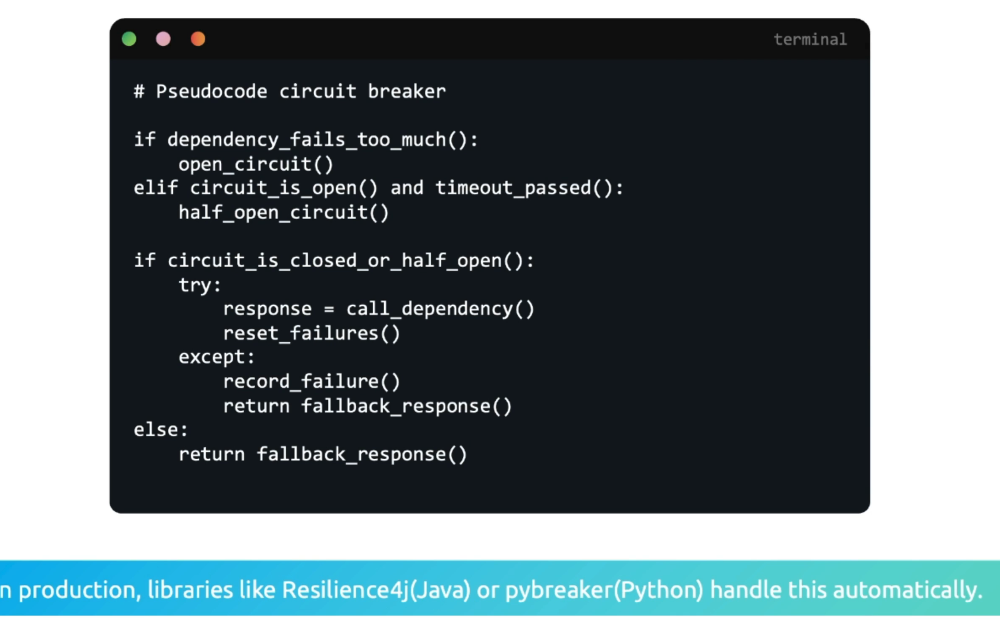

**Fallback and Graceful Degradation** — When a dependency is unavailable, serve a degraded but functional response instead of failing completely. A product page can display without personalised recommendations; a checkout flow can proceed without real-time fraud scoring (flagging for later review). The key design question is: *what is the minimum viable response this endpoint can return?*

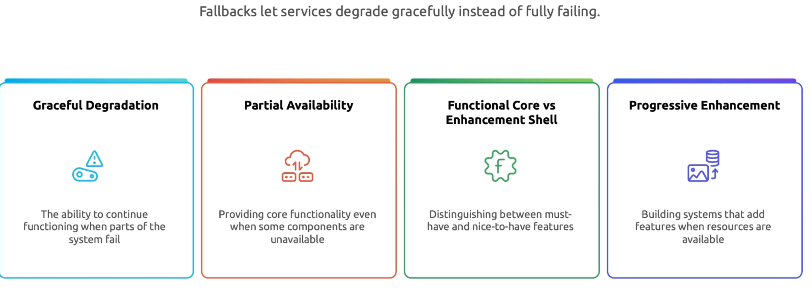

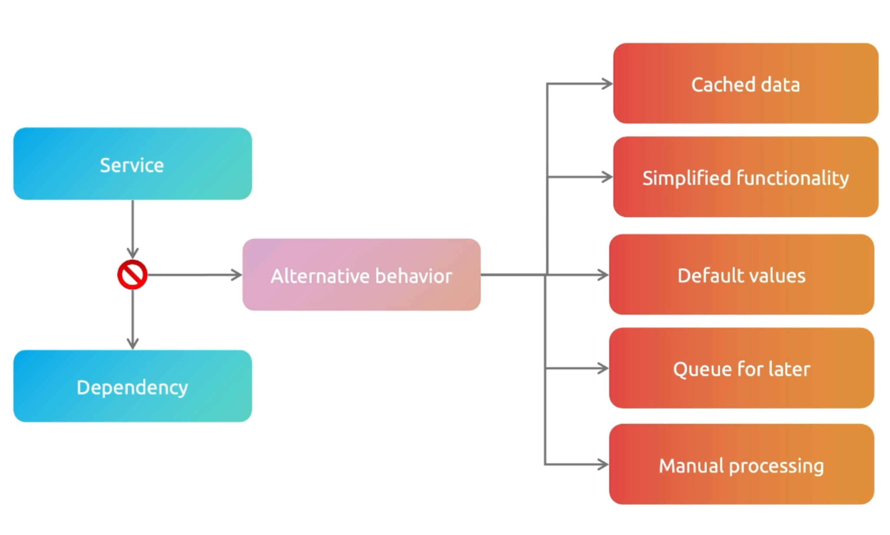

**Bulkheads** — Isolate resource pools (thread pools, connection pools, memory) per dependency so that exhaustion in one pool cannot starve requests that depend on a healthy service. The name comes from the watertight compartments in a ship's hull — if one compartment floods, the others stay dry.

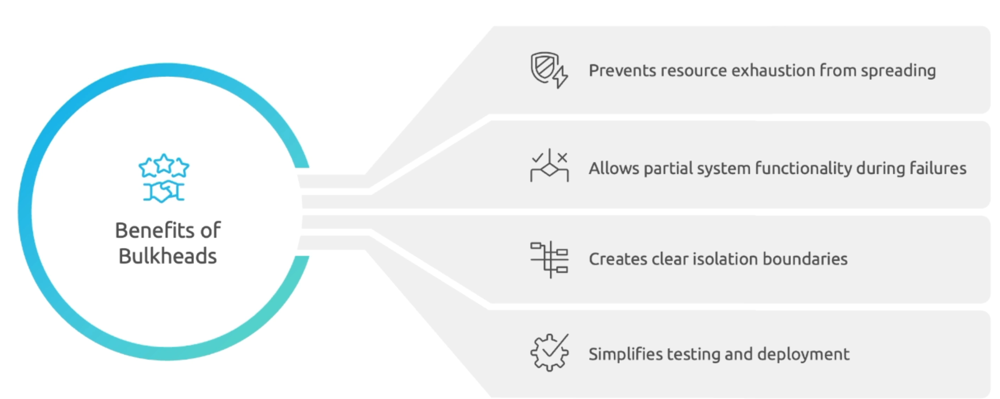

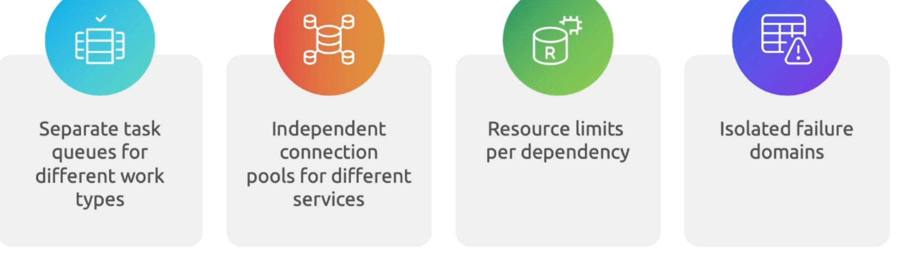

---

## Change Management

Most production incidents are caused by changes — a new deployment, a configuration update, a database migration, or a dependency upgrade. Change management is the set of practices that reduce the probability and blast radius of change-induced failures.

Common change-related failures:

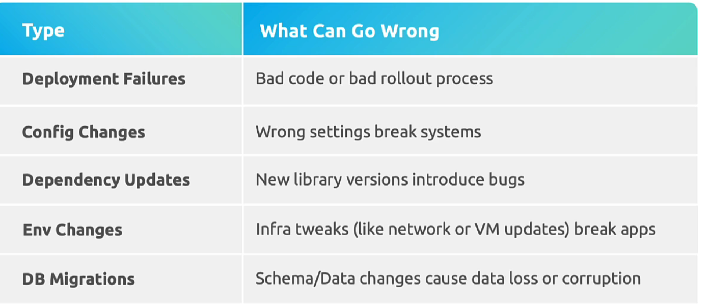

SREs need to balance **velocity and stability** for every change. The instinct to slow down all changes to protect stability is wrong — it builds up a backlog of undeployed code, which paradoxically increases risk (large batched deployments are harder to roll back and harder to debug). The correct answer is: small, frequent, validated changes deployed with automated rollback capability.

Small, frequent, validated code changes lead to:

- **Better learning** — Smaller changes are easier to reason about; post-mortems are more actionable because the signal-to-noise ratio is higher.
- **Greater system resilience** — The system gets regular exercise in the deployment pipeline, which surfaces integration issues before they become critical.
- **Faster recovery** — Rolling back a one-line config change takes seconds; rolling back a 200-commit release takes hours and often isn't possible without data migration concerns.
- **Tighter feedback loops** — Monitoring anomalies are correlated with a specific change within minutes, not days.

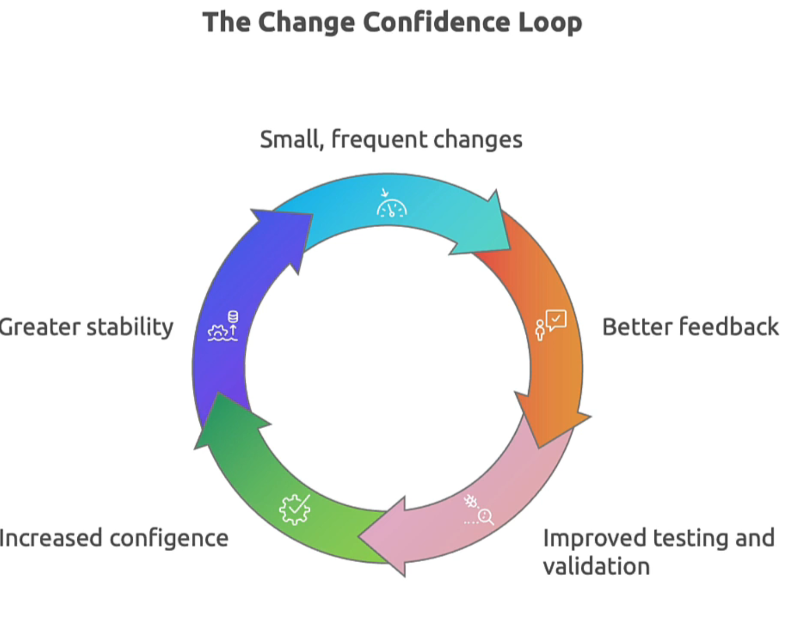

### Safe Deployment Strategies

**Blue/Green deployment** — Maintain two identical production environments (blue = current, green = new). Deploy to green, run validation, then switch traffic atomically. Rollback is instant: flip traffic back to blue. The cost is double the infrastructure during the switchover window.

**Canary deployment** — Route a small percentage of production traffic (e.g., 1–5%) to the new version before a full rollout. Monitor SLIs on the canary cohort vs. the stable cohort. If error rates or latency are statistically worse on the canary, halt the rollout automatically. Netflix and Google both rely heavily on canary analysis for this reason.

**Feature flags** — Deploy code to production in a disabled state, then enable it for specific user segments (internal users, beta testers, a percentage of traffic) via a configuration change. This decouples deployment from release, making rollback a configuration toggle rather than a code deployment.

### Post-Deployment Monitoring Checklist

Monitoring is critical during and after deployments. These are the four golden signals to watch (using the RED / USE framework applied to changes):

```
# Post-deployment signal checklist — check each for at least 15 minutes post-deploy

Error rate     — Is the HTTP 5xx/4xx rate increasing vs. pre-deploy baseline?
Latency        — Is p50/p95/p99 response time degrading?
Traffic        — Are requests still reaching the service (no misconfigured routing)?
Saturation     — Are CPU, memory, DB connections, or thread pools under elevated pressure?
Deployment     — Is the rollout progressing as planned (% of pods on new version)?
```

### Deployment Verification Process

Verification happens in layers — each layer catches a different class of regression:

- **Smoke tests** — Basic functionality checks immediately after deployment. "Can the service start, respond to health checks, and process a minimal request?" These should complete in under 2 minutes.
- **Integration tests** — Validate that component interactions work correctly end-to-end. Run in a staging environment that mirrors production topology.
- **Performance tests** — Verify that the system meets its latency and throughput SLIs under representative load. Catches regressions that only appear under pressure.
- **Canary analysis** — Real users exercise the new version at low traffic percentage; statistical comparison against the stable cohort determines whether to proceed.
- **Gradual traffic shifting** — Increment traffic to the new version in steps (1% → 10% → 50% → 100%), with automated SLI checks at each step gating progression.

---

## Capacity Planning

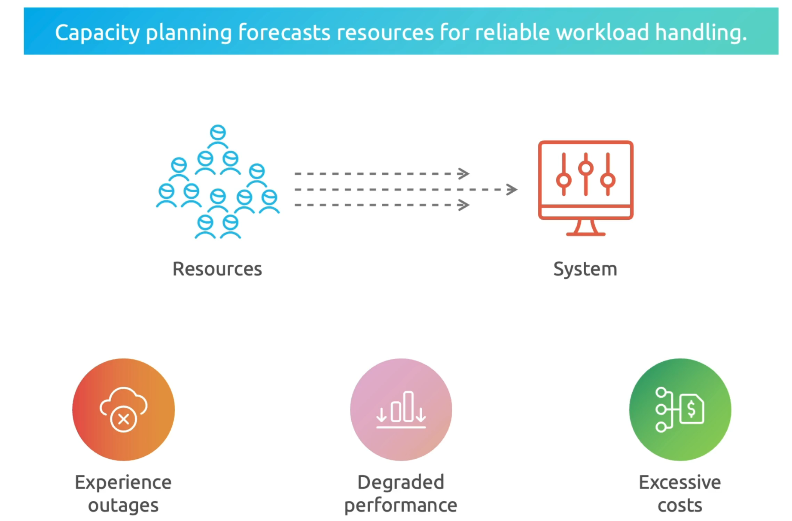

Capacity planning is the practice of ensuring that your system has sufficient resources — compute, storage, network, database connections — to handle current and projected future load, without over-provisioning to the point of wasteful spending. It is one of the most under-invested SRE practices, and one of the most impactful: most "mystery" outages at scale are capacity problems in disguise.

**When would you use this?** Any time you are preparing for a product launch, a seasonal traffic spike (Black Friday, tax season, end-of-quarter), or a major feature release. Capacity planning is also triggered by changes in growth trajectory — if monthly active users double, your capacity assumptions need revisiting.

Key components of capacity planning:

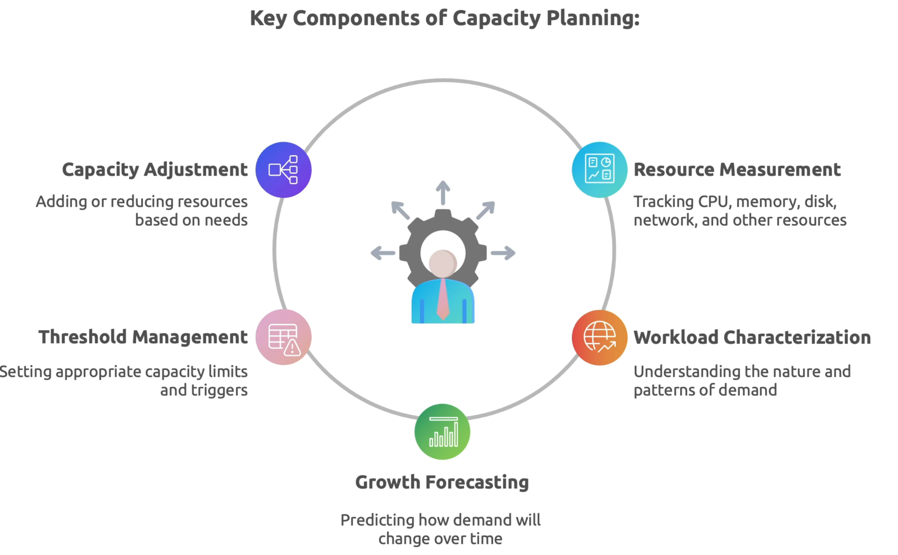

### Benefits of Proactive Capacity Planning

- **Prevents outages** caused by resource exhaustion — the most preventable category of incident.
- **Reduces costs** by right-sizing infrastructure rather than over-provisioning "just in case." AWS Reserved Instances and Committed Use Discounts require accurate forecasts to realise their savings.
- **Supports business growth** by ensuring the platform can absorb new customers without degradation, removing reliability as a blocker to commercial goals.
- **Improves user experience** by maintaining performance headroom; a system running at 90% capacity has much worse tail latency than one running at 60%.
- **Enables more predictable planning** — finance and product teams can make roadmap commitments with confidence that infrastructure capacity will be available.

### Resource Measurement

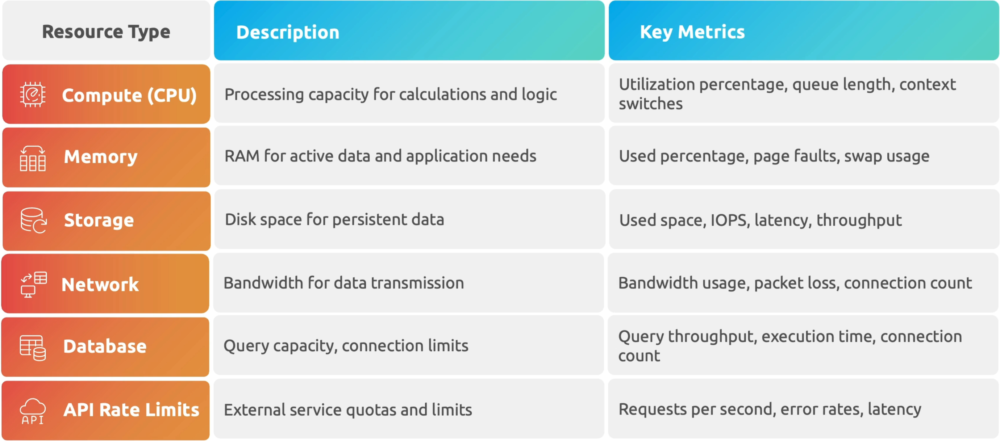

```
# Key capacity metrics to track per service

CPU utilization         — Target < 60% at peak (headroom for spikes)
Memory utilization      — Target < 70%; watch for memory leaks over time
DB connection pool      — Active connections / pool size; alert at 80%
Request queue depth     — Proxy for whether workers can keep up
Storage growth rate     — Project time-to-full based on trailing 90-day trend
Network throughput      — Egress/ingress vs. NIC capacity
```

### Forecasting Models

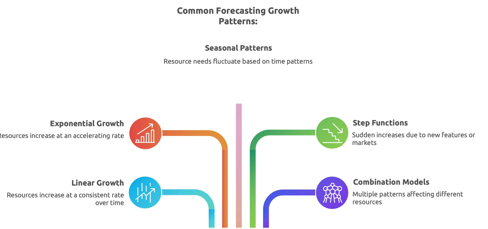

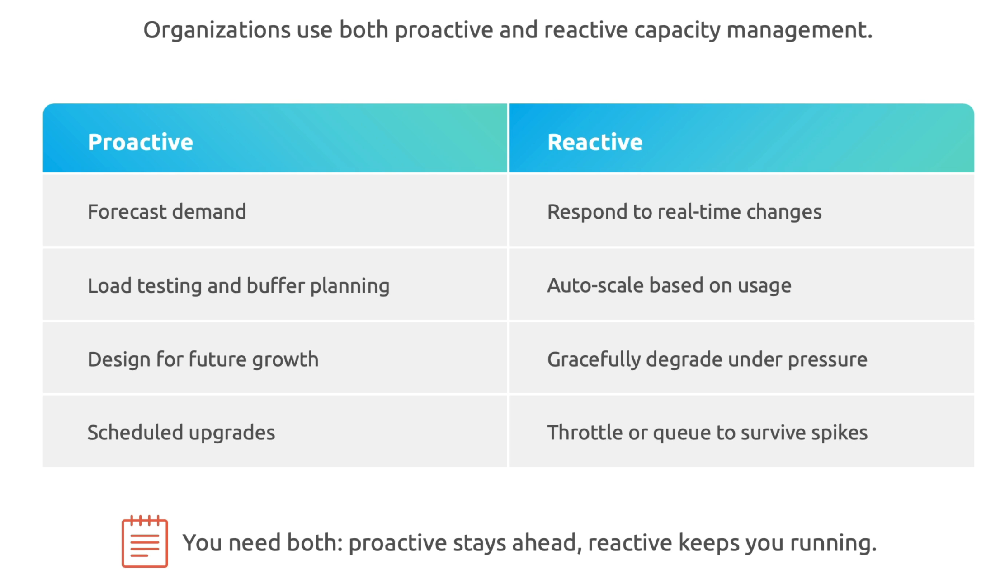

Proactive forecasting uses historical growth trends, business projections, and load testing data to predict future capacity needs. Reactive forecasting ("we ran out, add more") is a sign of an immature SRE practice — by the time you're adding capacity reactively, you've already had an incident.

### Threshold Types

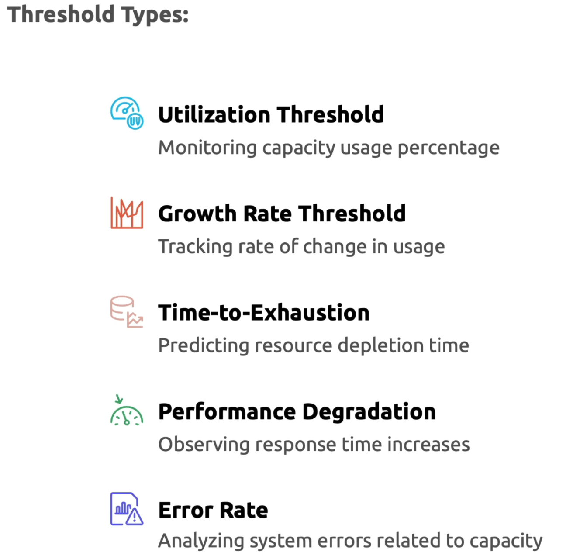

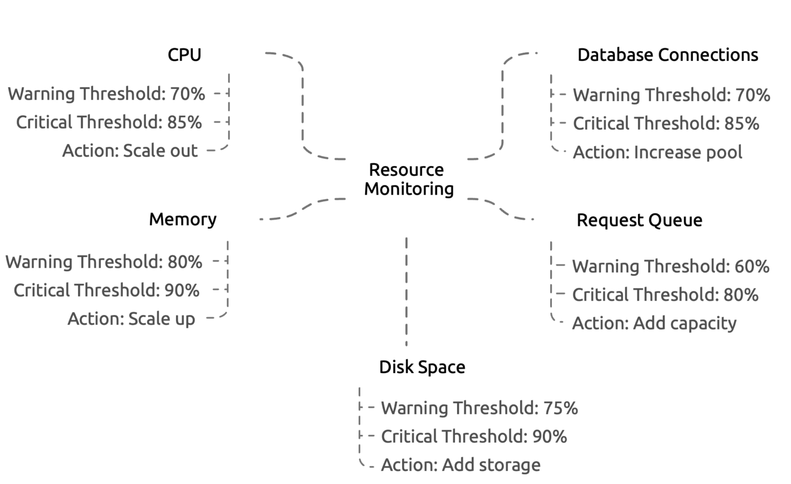

Setting thresholds requires understanding the difference between **soft limits** (warnings that give you time to act) and **hard limits** (the point at which the system degrades or fails). Good capacity management means you never hit the hard limit in production.

---

## Managing Operational Toil

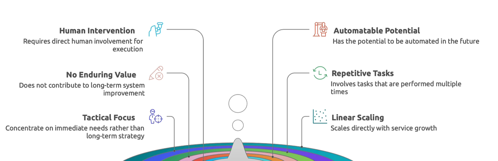

Toil is the SRE-specific term for operational work that has the following properties: it is **manual** (a human performs it), **repetitive** (it recurs regularly), **automatable** (a machine could do it), **tactical** (it reacts to events rather than driving improvement), and **without enduring value** (completing it does not make the system better — just maintains the status quo).

Google's SRE model has a firm rule: SREs should spend no more than **50% of their time on toil**. The remaining 50% must be engineering work — automation, improving observability, hardening systems, reducing complexity — that creates durable improvement. If the toil ratio consistently exceeds 50%, the team is operating as an ops team with a fancy name, not an SRE team.

**Why does this matter?** Toil is correlated with engineer attrition. Experienced SREs who spend most of their time on toil burn out and leave; the remaining toil is then split among fewer people, accelerating the cycle. Measuring and reducing toil is therefore both a reliability investment and a talent retention strategy.

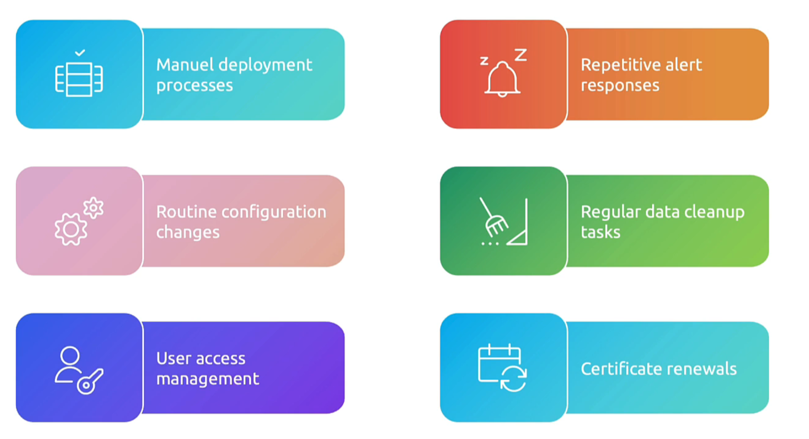

### Toil Impact: Engineer Perspective

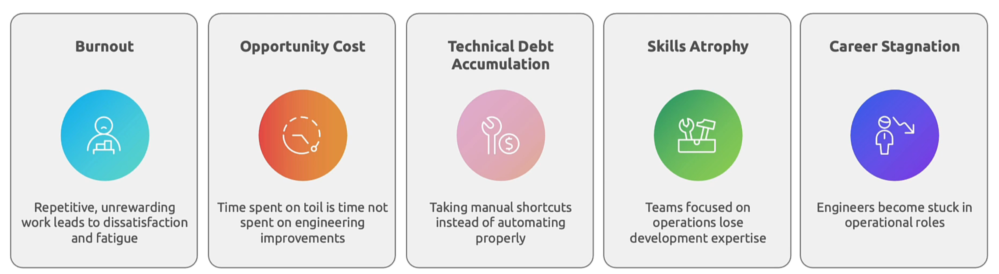

From an engineer's perspective, high toil means less time for skill development, reduced sense of ownership ("I'm just a ticket monkey"), and lower job satisfaction. Engineers hired to do reliability engineering find themselves manually restarting pods and responding to noisy alerts instead — a mismatch between job description and reality that drives turnover.

### Toil Impact: Business Perspective

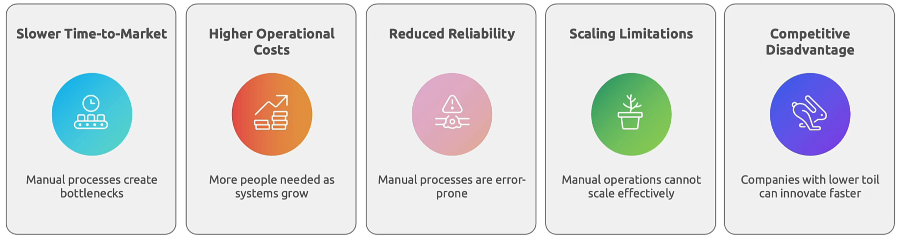

From a business perspective, every hour spent on toil is an opportunity cost: the SRE team could have spent that hour building the automation that eliminates the toil permanently, or improving the on-call handoff that reduces MTTR. Toil also scales linearly with the number of services — as the company grows, toil grows with it unless actively managed.

### Measuring Toil

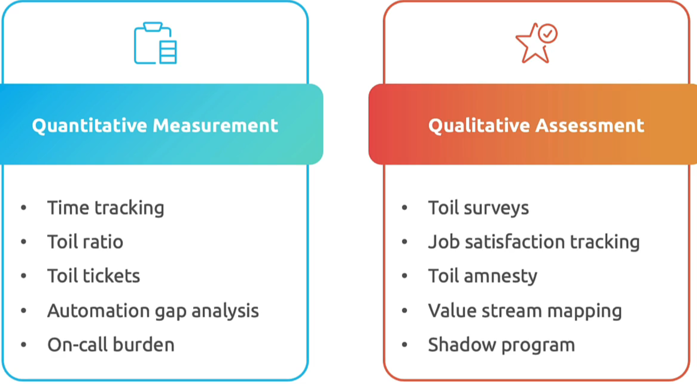

```
# Simple toil tracking — add to your weekly team sync

For each recurring operational task, record:
  Task name          — What did you do?
  Time spent (hours) — How long did it take?
  Frequency          — How often does it recur?
  Automatable?       — Yes / Partially / No
  Owner              — Who owns automating this?

# Calculate weekly toil %:
  Toil hours / Total working hours × 100

# Red flag: > 50% for two consecutive weeks
# Action: escalate to engineering manager and create toil-reduction tickets
```

### Toil Reduction Methods

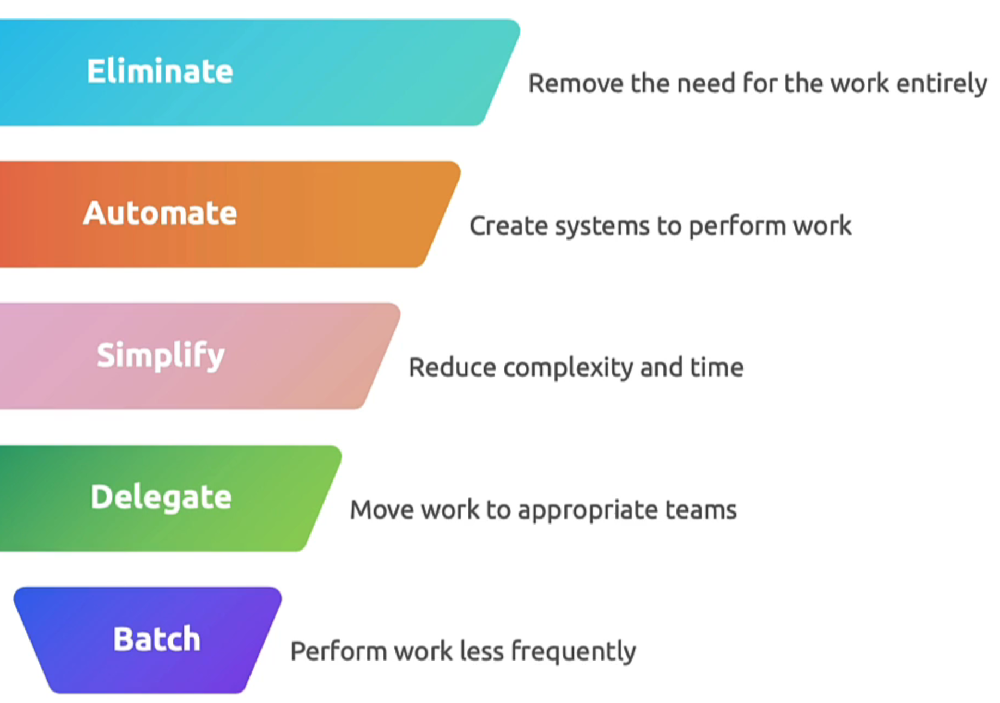

The most effective toil reduction strategies, in order of impact:

1. **Automate it** — Write a script, a controller, or a pipeline that performs the task without human intervention. This is the gold standard.
2. **Fix the root cause** — If you're restarting a pod every week because it leaks memory, the fix is fixing the memory leak, not automating the restart.
3. **Eliminate the need** — Sometimes the task exists because of a design decision that can be revisited. A manual certificate rotation can be eliminated by adopting cert-manager.
4. **Delegate to self-service** — If the task is being done on behalf of another team, give them the tools to do it themselves (e.g., a self-service deployment portal).
5. **Document and hand off** — If the task is unavoidably manual and low-risk, document it and have the owning product team perform it, freeing SRE time for higher-leverage work.

### Cost of Toil

Direct costs:

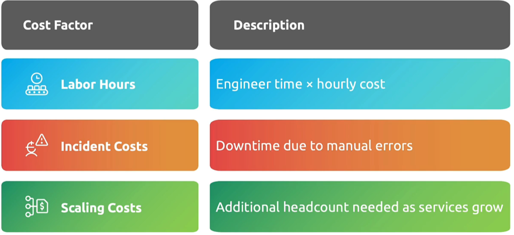

Indirect costs:

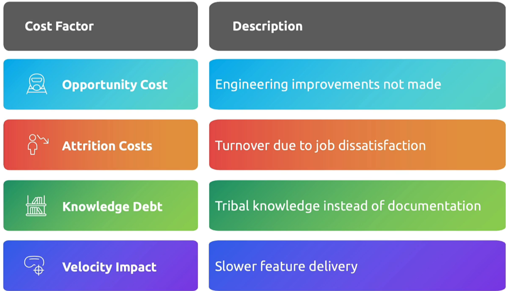

---

## Common Pitfalls

**Adding complexity without a sunset plan.** "Temporary" workarounds become permanent fixtures. When adding a complex workaround, create a ticket to remove or replace it and set a calendar reminder to follow up. If the ticket stays open for more than two quarters, escalate.

**Treating all dependencies equally.** A dependency on an internal service you own is very different from a dependency on a third-party SaaS with a 99.9% SLA. Map your dependencies by tier — critical path vs. non-critical — and apply different resilience patterns accordingly.

**Change management theatre.** Having a change advisory board (CAB) approval process that rubber-stamps everything without real review is worse than having nothing — it creates false confidence. If you're going to have a change management process, make it lightweight, automated, and focused on high-risk changes.

**Capacity planning as a one-time exercise.** Capacity plans go stale quickly. Product pivots, unexpected viral growth, and new features all invalidate assumptions. Revisit capacity plans quarterly and after any significant business event.

**Measuring toil hours but not acting on them.** Toil tracking is only valuable if it drives action. Assign ownership of toil reduction items to individuals, include them in sprint planning, and review toil ratios in team retrospectives.

---

## Interview Questions

1. **What is the difference between complexity that is accidental vs. essential? Give a real example of each.** (Essential: distributed consensus in a database cluster. Accidental: six separate config files that could be one.)

2. **Walk me through how you would analyse the blast radius of a shared authentication service going down. What would you check, and what resilience patterns would you recommend?**

3. **Your team's toil ratio is 70%. What do you do?** (Measurement, escalation, engineering sprints, possible service handback.)

4. **How do you choose between blue/green, canary, and feature flag deployment strategies for a database schema migration?** (Hint: schema migrations are especially tricky — they need to be backward compatible during the dual-version window.)

5. **You are asked to capacity plan for a service ahead of a 10x traffic event (e.g., a Super Bowl ad). Walk me through your process.** (Load testing, identifying bottlenecks, pre-scaling, circuit breakers, graceful degradation paths, war room plan.)

6. **What is a circuit breaker, and how does it differ from a timeout? Why do you need both?** (Timeouts bound per-request latency; circuit breakers prevent sending requests to a known-unhealthy dependency. You need both.)

---

## Key Takeaways

- **Complexity is the enemy of reliability.** Every addition should be justified by the reliability or business value it delivers, not by technical interest alone.
- **Dependencies are liabilities.** Map them, classify them by criticality, and apply the right resilience pattern — circuit breaker, bulkhead, or graceful degradation — based on blast radius.
- **Most incidents are caused by changes.** Small, frequent, validated deployments with automated rollback are safer than large, infrequent ones.
- **Capacity planning is incident prevention.** Reactive capacity management means you've already had the outage. Invest in quarterly forecasting and load testing.
- **Toil > 50% is a team health emergency.** Measure it, track it in sprints, and treat toil reduction as engineering investment, not overhead.
- **The best toil is eliminated toil** — automate, fix the root cause, or redesign the system so the task is no longer necessary.
- **Resilience patterns (circuit breaker, bulkhead, graceful degradation) work together**, not in isolation. A production-ready service implements all three for its critical dependencies.