## TL;DR

Observability is the property of a system that lets you understand its internal state from its external outputs — logs, metrics, and traces. Monitoring tells you *that* something is broken; observability helps you figure out *why* and *where*. In modern distributed systems where a single user request might touch 20 services, observability is not optional — it is the foundation of everything else in SRE: incident detection, RCA, capacity planning, and SLO measurement all depend on it. This document covers the three pillars of observability, data sources, dashboard design, alerting implementation, performance monitoring, and advanced visualisation strategies.

See also: [SRE Measurements](./sre_measure.md) | [Incident Management](./incident_management.md) | [SRE Overview](./overview.md)

---

## Observability Overview

The three pillars of observability map to three questions:

```
Metrics  (what)  — What is the system doing at this moment?
Logs     (how)   — How did it get to this state? What happened step by step?
Traces   (where) — Where in the call chain did the latency or error originate?
```

Observability is fundamentally different from classical monitoring in its philosophy:

- **Assume unknown failures** — Classical monitoring watches for known bad states ("alert if CPU > 80%"). Observability assumes you don't know what will break next and instruments the system to answer arbitrary questions about its behaviour, including questions you haven't thought of yet.
- **Enable unexpected questions** — A well-instrumented system lets you ask "why did the p99 latency for users in the EU spike at 14:23 on Tuesday for requests containing a specific product category?" without having pre-built a dashboard for that exact question.
- **Understand behaviour, not just health** — "Is the service healthy?" is a binary question. "How is the service behaving under this specific traffic pattern for this specific user cohort?" is the observability question.

**Why does this matter for an SRE?** Without observability, you are flying blind. You will only discover problems when users report them, your MTTR will be dominated by manual log-grepping, and your post-mortems will have gaps because the data doesn't exist to reconstruct what happened.

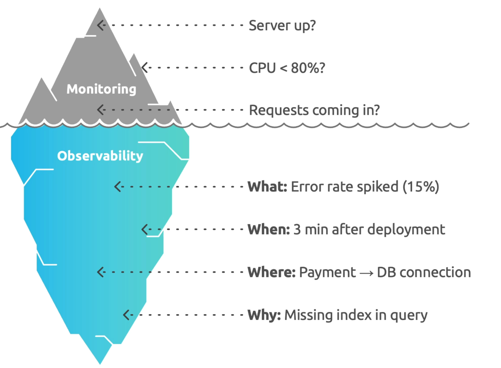

### Structured Logging

Structured logs are logs emitted as machine-parsable key-value pairs (JSON) rather than free-form text strings. They are the foundation of effective log-based observability.

Benefits of structured logging:

- **Machine parsable for analysis** — Log aggregation systems (ELK, Loki, CloudWatch Insights) can filter, aggregate, and query structured logs instantly. Parsing free-form text requires fragile regex patterns that break when the message format changes.
- **Consistent fields across services** — When every service emits `trace_id`, `user_id`, `service_name`, and `duration_ms` as top-level fields, you can join logs from 10 different services to reconstruct a single user request.
- **Rich context for debugging** — A structured log entry can carry the full request context (HTTP method, path, status code, response time, upstream service, correlation ID) rather than a single text string, massively reducing the time needed to diagnose an issue.
- **Correlation with traces and metrics** — A shared `trace_id` in logs allows you to jump from a metric spike on a Grafana dashboard directly to the relevant log lines and distributed trace in one click.

```json
// Bad: free-form log (hard to parse, no correlation)
"ERROR: Failed to process payment for user after 3 retries"

// Good: structured log (machine-parsable, correlated, actionable)
{
  "level": "error",
  "message": "payment_processing_failed",
  "trace_id": "abc123",
  "user_id": "u-789",
  "payment_id": "pay-456",
  "attempt": 3,
  "error": "upstream_timeout",
  "upstream_service": "stripe-api",
  "duration_ms": 5023,
  "timestamp": "2025-08-01T14:23:45Z"
}
```

---

## Data Sources and Visualisation

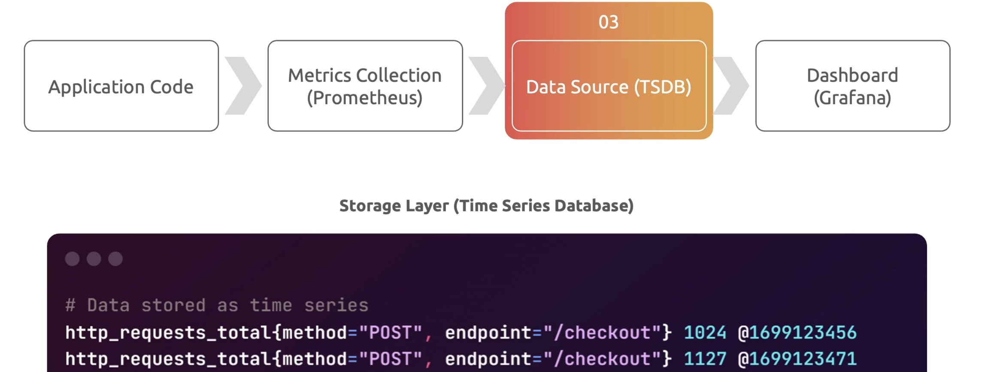

The observability data flow in a typical SRE stack:

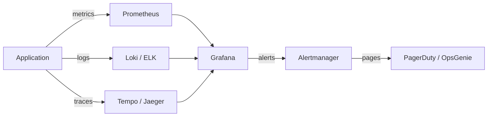

**Prometheus** is the de facto standard for metrics collection in cloud-native environments. It scrapes metrics from instrumented applications and infrastructure on a pull model, stores them as time-series data, and exposes a powerful query language (PromQL) for aggregation and alerting. Grafana reads from Prometheus (and many other data sources) to build dashboards.

**Grafana data source configuration:**

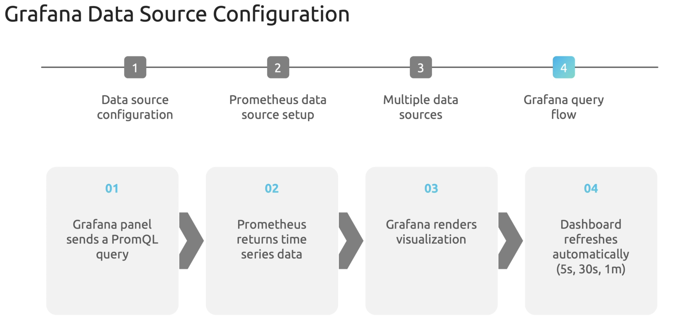

### Laws of SRE Dashboards

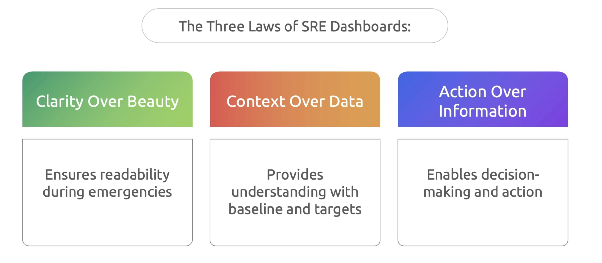

Effective SRE dashboards are organised in a hierarchy that matches how engineers use them during an incident:

**Level 1 — Service health overview ("Is everything OK?")** This is the first dashboard an on-call engineer opens. It should answer in under 5 seconds whether the service is healthy or degraded. It shows SLO compliance status, current error rate vs. threshold, p99 latency vs. SLO, and traffic volume. It does not show CPU, memory, or any internal metric — those are Level 2.

**Level 2 — Service performance details ("Investigate trends and issues")** Opened when Level 1 shows a problem. This dashboard allows the engineer to drill into specific subsystems, time ranges, and dimensions (region, endpoint, user cohort) to form a hypothesis about the root cause.

### Chart Types and When to Use Them

Choosing the right chart type is not aesthetic — it determines how quickly a responder can extract signal during an incident.

**Time series — Line chart** is the default for any metric that changes over time. Use for request rates, latency percentiles, and error rates. The line chart's primary value is showing trends and sudden spikes, which are the visual signature of most production incidents. Always plot multiple percentiles (p50, p95, p99) — a rising p99 with a flat p50 is a tail latency problem, not a general degradation.

**Status/health — Stat panel** for single values that communicate immediate status. Use for current SLO compliance percentage, remaining error budget, or service health. The stat panel gives an engineer an instant yes/no answer without requiring them to read a graph.

**Distribution data — Heatmap / histogram** for response time distributions. A heatmap of response times over time reveals whether you have a bimodal distribution (two populations of requests with very different latency) or a long tail — both of which are invisible on a p99 line chart but immediately obvious on a heatmap.

**Comparative data — Bar chart** for comparing a metric across categories (error rate by service, latency by region, request volume by endpoint). Bar charts make ranking and outlier identification instant — the longest bar is the problem.

**Dashboard creation best practices:**

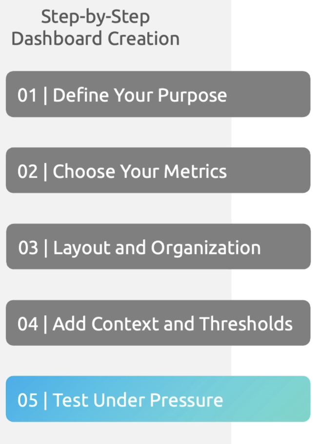

---

## Alert Design and Implementation

Alerting principles:

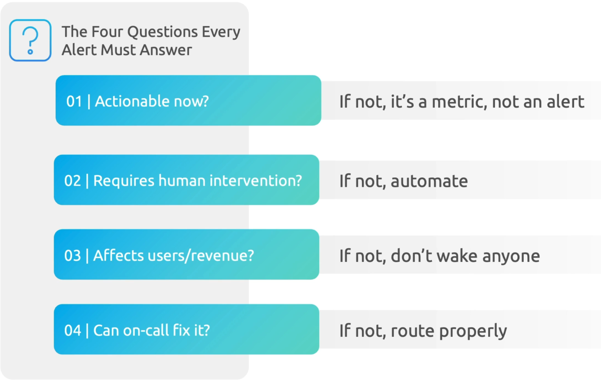

Alerting is the bridge between observability data and human action. A poorly designed alert wastes an engineer's time; a missing alert means users are experiencing failures while the on-call team is asleep. Good alerting is precise (fires only when action is required), sensitive (fires before the problem is severe), and informative (includes enough context to start diagnosis immediately).

The four alerting strategies in order of maturity:

- **SLO-based alerting** — Alert when error rate or latency crosses the threshold defined in the SLO. This is symptom-based and user-facing, the most actionable type of alert.
- **Error budget alerting** — Alert based on burn rate (how fast the error budget is being consumed) rather than instantaneous error rate. This gives advance warning before the SLO is actually breached. See the burn rate alerting section in [Incident Management](./incident_management.md).
- **Alert routing strategy** — Different alerts should go to different channels based on severity. A P0 alert wakes someone up; a P2 alert creates a ticket. The routing logic should be encoded in Alertmanager or PagerDuty routing rules, not manual triage.
- **Time-based routing** — Business-hours alerts can follow different routing rules than off-hours alerts. A non-critical alert that fires at 2 PM can go to a Slack channel; the same alert at 2 AM should probably wait until morning unless it escalates.

```yaml
# Example: Prometheus alerting rule for high error rate (symptom-based)
# This fires when more than 1% of requests return 5xx over a 5-minute window.

groups:
  - name: sre_slo_alerts
    rules:
      - alert: HighErrorRate
        expr: |
          sum(rate(http_requests_total{status=~"5.."}[5m]))
          /
          sum(rate(http_requests_total[5m])) > 0.01
        for: 5m                    # Must be true for 5 min before firing
        labels:
          severity: critical
          team: payments
        annotations:
          summary: "High error rate on payment service"
          description: "Error rate is {{ $value | humanizePercentage }} — SLO threshold is 1%"
          runbook_url: "https://wiki.internal/sre/payments/runbook#high-error-rate"
```

---

## Performance Monitoring

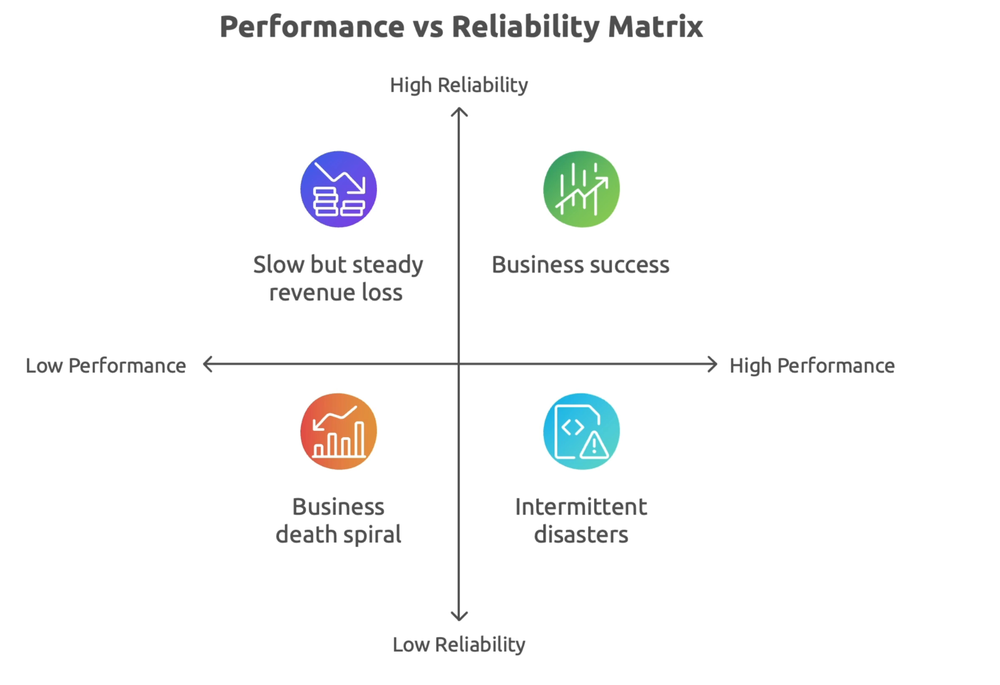

Performance monitoring is the continuous measurement of system behaviour under real load. It differs from capacity planning (which is forward-looking) in that it focuses on current system behaviour and identifies regressions or degradations as they occur.

**When would you use this?** Post-deployment monitoring to catch performance regressions, ongoing SLI measurement, and bottleneck identification during incident response.

Essential performance metrics:

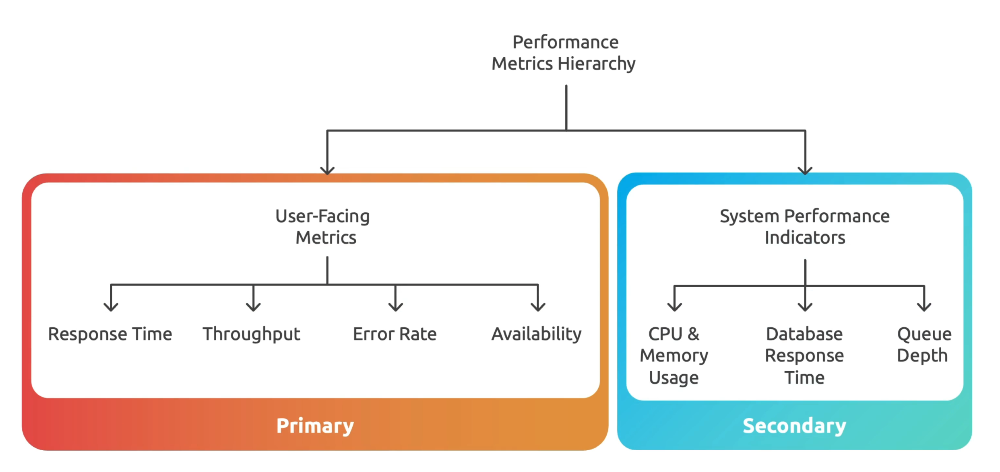

The metric hierarchy for a typical web service, from user-facing to internal:

```
User-facing (SLI candidates):
  ├─ Availability      : successful_requests / total_requests
  ├─ Latency p50/p95/p99: histogram_quantile(0.99, http_request_duration)
  └─ Error rate        : rate(http_errors_total[5m]) / rate(http_requests_total[5m])

Application layer:
  ├─ Request queue depth    : pending requests waiting for a worker
  ├─ Thread/goroutine count : proxy for concurrency saturation
  └─ Upstream call latency  : time spent waiting for dependencies

Infrastructure layer:
  ├─ CPU utilisation        : container_cpu_usage_seconds_total
  ├─ Memory utilisation     : container_memory_working_set_bytes
  ├─ Network bytes in/out   : container_network_transmit_bytes_total
  └─ Disk I/O              : node_disk_read_bytes_total
```

### Common Bottlenecks

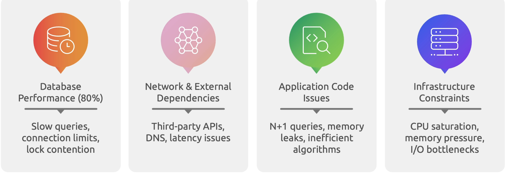

Bottlenecks in distributed systems follow predictable patterns. Understanding these patterns helps you navigate from a symptom ("p99 latency is high") to a hypothesis ("the database connection pool is saturated") quickly.

Identifying where the bottleneck is:

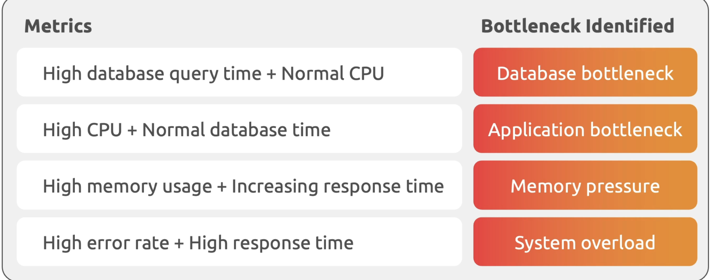

```
# Bottleneck identification flowchart
#
# Symptom: High p99 latency
#
# Step 1: Is it the application or a dependency?
#   Check: upstream call latency vs. total request latency
#   If upstream >> total: bottleneck is in a dependency (DB, cache, API)
#   If upstream << total: bottleneck is in your own application code
#
# Step 2 (if dependency): Which dependency?
#   Check: per-dependency latency histograms
#   Look for: connection pool exhaustion, slow queries, cold cache
#
# Step 3 (if application): CPU, memory, or I/O?
#   CPU saturated: scale horizontally or optimise hot code paths
#   Memory pressure: look for leaks, right-size pod memory
#   I/O bound: check disk throughput, network saturation
```

---

## Advanced Visualisation

The same system requires different dashboard views for different audiences. Despite the underlying data being the same, a dashboard designed for a senior SRE debugging an incident looks nothing like the dashboard a VP of Engineering uses to review quarterly reliability trends.

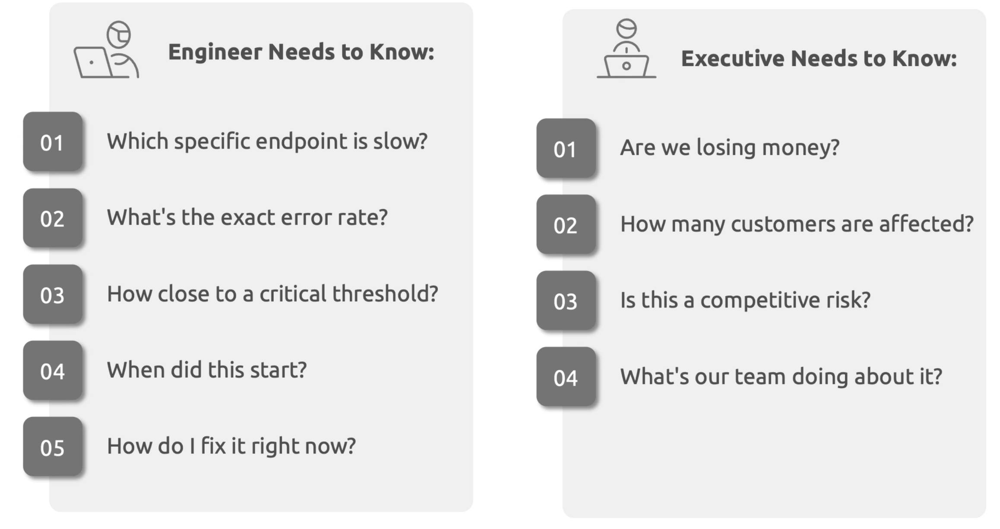

### Engineer Dashboards

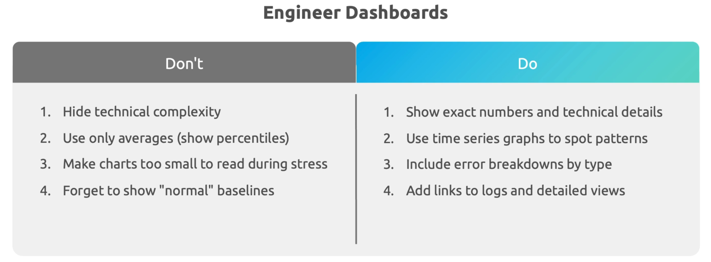

Engineer dashboards are optimised for speed of diagnosis during an incident. They prioritise density of information, multiple time resolutions (zoom in/out), raw metric values alongside thresholds, and direct links to related dashboards and runbooks. They are not designed to be pretty — they are designed to answer questions under pressure.

**Do:** Include multiple SLI panels on one screen. Use time-synced panels so zooming in on one chart zooms all of them. Add deployment markers as vertical annotations so you can immediately see if a metric changed after a deploy. Include links to relevant runbook sections.

**Don't:** Use donut charts (they're beautiful but terrible for reading precise values). Use auto-refreshing intervals shorter than 10 seconds (it distracts the eye). Omit Y-axis labels (engineers need to know if a value is 0.01% or 10%).

### Executive Dashboards

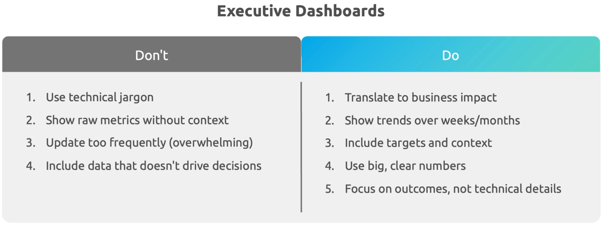

Executive dashboards are optimised for monthly/quarterly review cycles. They show SLO compliance trends over time, incident count and duration, error budget consumption vs. target, and mean time to recover. They use large, high-contrast numbers and clear colour coding (green = meeting SLO, red = not). They have no PromQL, no raw metric names, and no infrastructure graphs.

**Do:** Show percentage compliance rather than raw error counts. Use rolling 30/90-day windows. Include business context (e.g., this month's reliability vs. the same month last year). Add a one-sentence executive summary at the top.

**Don't:** Show CPU or memory graphs (not actionable at this level). Use technical metric names in panel titles. Include incident details that belong in a separate post-mortem report.

---

## Common Pitfalls

**Monitoring without observability.** Having Prometheus and Grafana set up but using only pre-built dashboards without distributed tracing or structured logs gives you monitoring, not observability. You can tell when something is wrong but not why. Add Jaeger or Tempo for tracing, and enforce structured logging across all services.

**Not correlating the three pillars.** If your logs don't share a `trace_id` with your traces, and your traces don't correlate with the metrics that fired the alert, you have three separate silos instead of a unified observability layer. Enforce correlation IDs from the first request hop.

**Alerting on averages.** Average latency hides tail behaviour. A service with p50 latency of 50ms and p99 of 5000ms has an "average" around 100ms — which looks fine on a graph but means 1% of users wait 5 seconds. Always alert on percentiles, never averages.

**Dashboard sprawl.** A team with 200 Grafana dashboards has the same problem as a team with zero: you can't find the right one under pressure. Maintain a small set of canonical dashboards (one per service, one executive), archive the rest.

**Retaining too much data at full resolution.** Storing 1-second resolution metrics for 2 years is expensive and rarely useful. Use tiered retention: high resolution (15s) for 2 weeks, medium resolution (1m) for 3 months, low resolution (5m) for 1 year.

---

## Interview Questions

1. **Explain the three pillars of observability. What question does each one answer, and how do they work together during an incident?**

2. **What is the difference between monitoring and observability? Can you have one without the other?** (Yes: you can monitor a system without it being observable, and a highly observable system may have no alerts configured. Both are needed.)

3. **Why should you alert on symptoms rather than causes? Give an example of a cause-based alert that generates noise and a symptom-based replacement that is actionable.**

4. **What is structured logging and why is it preferred over free-form text logs in a microservices environment?**

5. **Design a Grafana dashboard for the on-call engineer for a payment API. What panels would you include, and in what order?** (Level 1: error rate, p99 latency, SLO compliance. Level 2: breakdown by endpoint, upstream latency, DB connection pool.)

6. **What is error budget burn rate alerting and why is it superior to threshold-based alerting for SLO management?**

---

## Key Takeaways

- **Observability is a system property, not a tool.** Prometheus + Grafana is an observability stack, but a system is only observable if it emits the right signals — structured logs, meaningful metrics, and distributed traces with correlation IDs.
- **The three pillars answer different questions.** Metrics tell you *what* is happening; logs tell you *how* it got there; traces tell you *where* in the call chain the problem originated. You need all three for effective incident response.
- **Structured logging is the foundation of log-based observability.** Free-form text logs are a liability; structured logs with consistent fields and correlation IDs are a force multiplier.
- **Dashboard hierarchy matters.** Level 1 dashboards answer "is everything OK?" in 5 seconds. Level 2 dashboards support investigation. Mixing these on a single dashboard creates confusion under pressure.
- **Choose chart types deliberately.** Line charts for trends; stat panels for status; heatmaps for distributions; bar charts for comparisons. The wrong chart type hides the signal you need.
- **Alert on symptoms, not causes.** Symptom alerts are actionable; cause alerts are noisy. Burn rate alerting on error budgets is the most mature form of symptom-based alerting.
- **Different audiences need different dashboards.** Engineer dashboards are optimised for incident speed; executive dashboards are optimised for business comprehension. A single dashboard that tries to serve both serves neither.