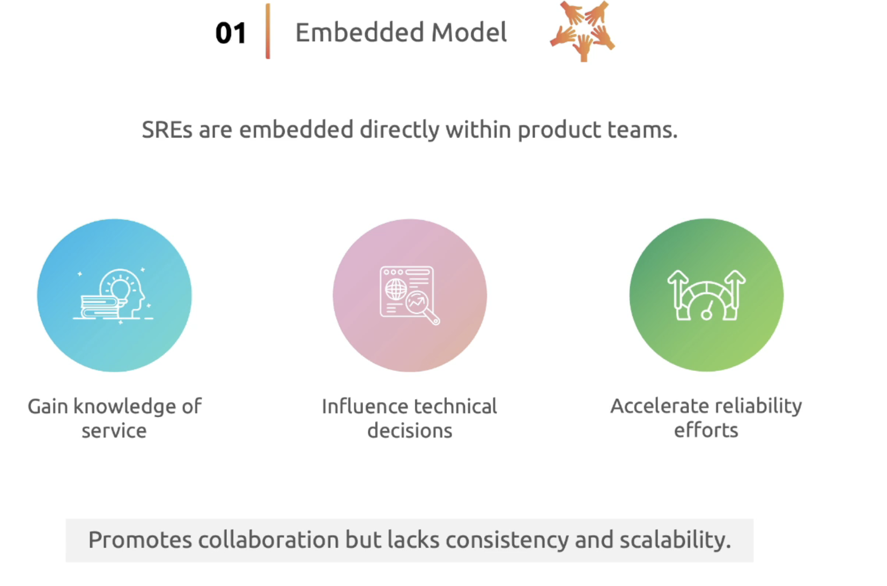

## Introduction

SRE is considered a specific implementation of DevOps principles, focusing on reliability engineering and providing concrete practices.

- Intersection of traditional IT and devops engineeer
- Brdiges design and runtime reality
- Ensures realibility and performance at any scale
- Embraces risk and anticipates failures
- realies on automation to build resilitant systems

Questions for SRE to ask.

- How can this application break ?
- What should we do when it breaks ?
- What does an acceptable level of service looks like ?
- How will we know if app is not working ?
- What actions should i need to take and what context do i need to respond effectively.

Devops: cultural mindset and philosphy for delivering software systems faster and more collaboratively. It mainly about "what" and "why" 

SRE: Concentre implementation focussed on the realibility through engineering process. Its mainly on "how" on scalibility and realibility. It puts things in practice. 

### SRE Team models

## Fundamenrals

## SLO & Measurements

## Manage complexties/risk/toil

## Incident management

## Release Enginerring

## Observability & Monitoring

## Advance Realibility

