## TL;DR

Site Reliability Engineering (SRE) is Google's answer to the age-old tension between "move fast" and "don't break things." It treats operations as a software engineering problem: instead of tribal knowledge and manual toil, SRE teams write code to automate reliability, define quantitative targets for service health (SLOs), and use those targets to make data-driven decisions about how much risk to accept. If you're an SRE, this document is your philosophical north star — everything else in this wiki builds on these foundations.

---

## Fundamentals

SRE is considered a specific implementation of DevOps principles, focusing on reliability engineering and providing concrete practices.

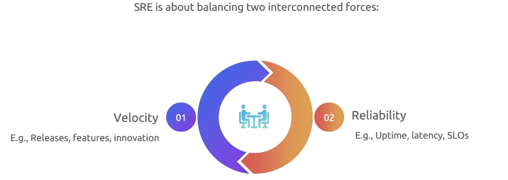

SRE sits at the intersection of traditional IT operations and software engineering. Where a classic ops team might manage infrastructure through runbooks and manual procedures, an SRE team treats the operational problem as a software problem — writing automation, building self-healing systems, and instrumenting everything to make failures visible before users notice them.

SREs bridge the gap between what developers design and what actually happens at runtime under real-world load. A service might pass every unit test and load test in staging, then fall over at production scale due to a thundering-herd cache miss or a noisy neighbour on a shared host. The SRE's job is to anticipate those gaps and engineer them away before they become incidents.

Reliability and performance at scale are not properties you bolt on at the end — they must be designed in from the start. SREs participate in design reviews, review architecture proposals for single points of failure, and push back on launches when an error budget is already depleted. This proactive posture is what separates SRE from a traditional on-call rotation that only reacts after things break.

SRE embraces risk rather than trying to eliminate it entirely. A system with 100% uptime is either unused or over-engineered to the point of slowing down all feature development. Instead, SREs accept a calculated level of risk (quantified as an error budget) and treat reliability as a shared responsibility between product and engineering teams.

Automation is the SRE's primary tool for building resilient systems. Every manual, repetitive operational task — restarting a service, rotating a certificate, scaling a fleet — is a candidate for automation. The goal is to reduce toil (work that is manual, repetitive, automatable, and without enduring value) so the team can spend time on engineering that improves the system permanently.

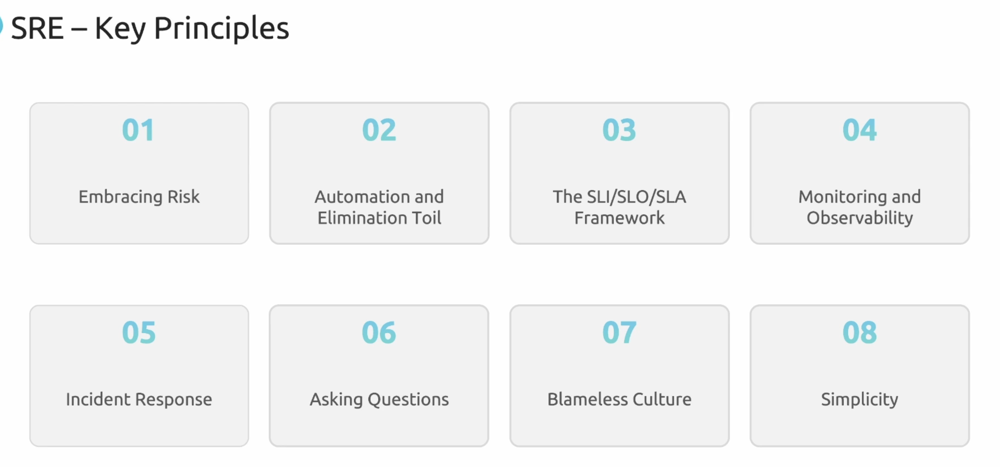

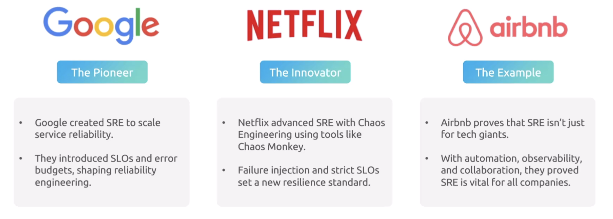

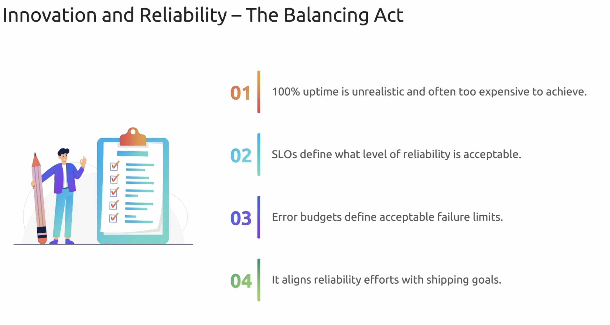

### The Five Questions Every SRE Must Answer

Before taking on any service, an SRE should be able to answer these five questions. If you can't answer them, you don't yet have enough observability and runbook coverage to own the service reliably.

**How can this application break?** This question drives failure mode analysis — mapping every dependency (database, cache, downstream API, DNS) to what happens when it becomes slow, returns errors, or disappears entirely. The output is a failure mode and effects analysis (FMEA) or a game day scenario list.

**What should we do when it breaks?** The answer lives in runbooks and incident response playbooks. A good runbook is not a wall of text — it is a decision tree that a sleepy on-call engineer can follow at 3 AM without making things worse. Runbooks should be tested regularly, ideally through chaos engineering exercises.

**What does an acceptable level of service look like?** This defines your SLO (Service Level Objective). "Acceptable" is a business conversation, not a technical one — a payment API and an internal analytics dashboard have very different uptime expectations, and those expectations should be written down and agreed upon with stakeholders.

**How will we know if the app is not working?** This drives your alerting and observability strategy. Alerts should fire on symptoms (user-facing error rate is elevated) not just causes (CPU is high). If you are not alerted until a user files a ticket, your monitoring is insufficient.

**What actions do I need to take, and what context do I need to respond effectively?** This is about reducing mean time to detect (MTTD) and mean time to recover (MTTR). The SRE should be able to correlate a spike in error rate with a recent deployment, a saturated database connection pool, or a misconfigured load balancer — all from a single dashboard — without having to SSH into boxes and grep through logs.

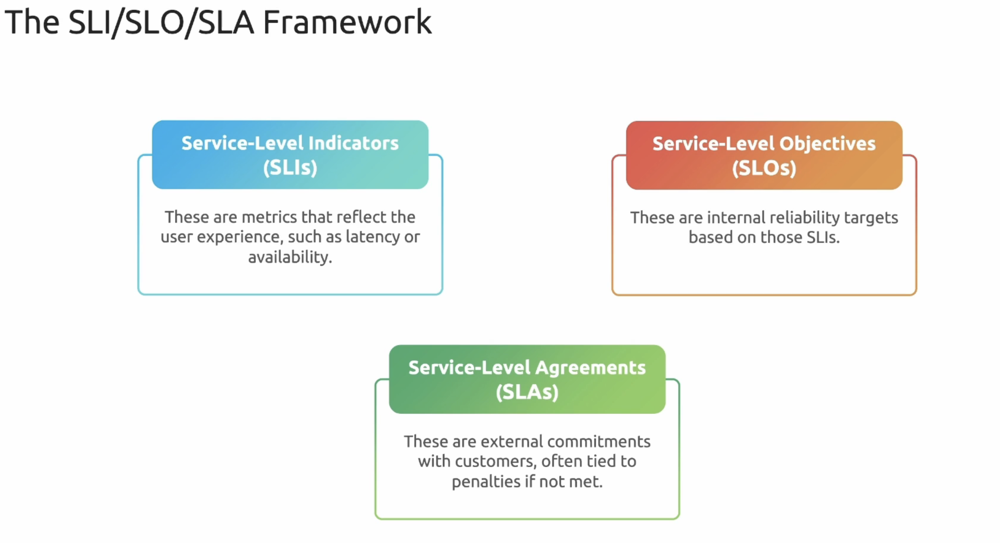

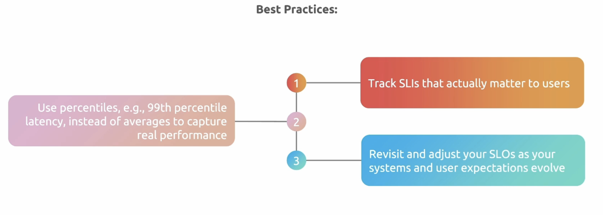

### SLIs, SLOs, and SLAs — A Quick Reference

| Term | What it is | Who owns it | Example |
|------|-----------|-------------|--------|
| **SLI** (Service Level Indicator) | A quantitative metric that measures one dimension of service health | SRE / Engineering | 99th-percentile latency of the checkout API |
| **SLO** (Service Level Objective) | An internal target range for an SLI | SRE + Product | p99 latency < 300 ms, measured over a rolling 28-day window |
| **SLA** (Service Level Agreement) | An external contract with consequences (refunds, credits) for breach | Legal + Business | 99.9% monthly uptime, or customers receive a 10% credit |
| **Error Budget** | `1 - SLO` expressed as allowable downtime or failure volume | Shared by SRE + Product | 0.1% of requests can fail per month ≈ 43 minutes of total downtime |

A well-chosen SLI measures something the user actually experiences — not internal system metrics like CPU or memory, which don't directly translate to user pain. The most common SLI categories are **availability** (% of successful requests), **latency** (request response time at various percentiles), **throughput** (requests/sec the system can handle), and **error rate** (% of requests returning 5xx or equivalent).

```
# Error budget calculation example
# SLO = 99.9% availability over 30 days

Total minutes in 30 days     = 30 * 24 * 60 = 43,200 min
Allowable downtime (0.1%)    = 43,200 * 0.001 = 43.2 minutes
Error budget remaining       = (43.2 - minutes_already_down)

# If you've already burned 30 minutes this month, you have
# only 13.2 minutes left before you should freeze releases.
```

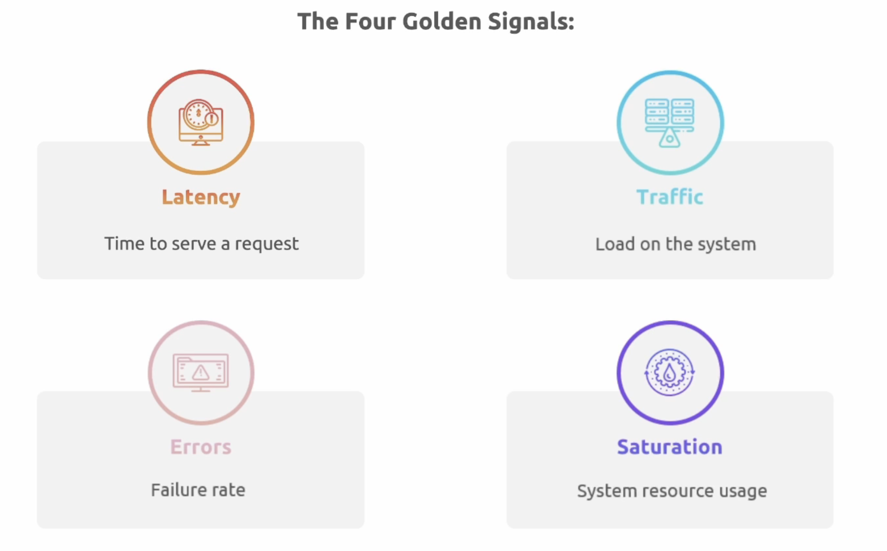

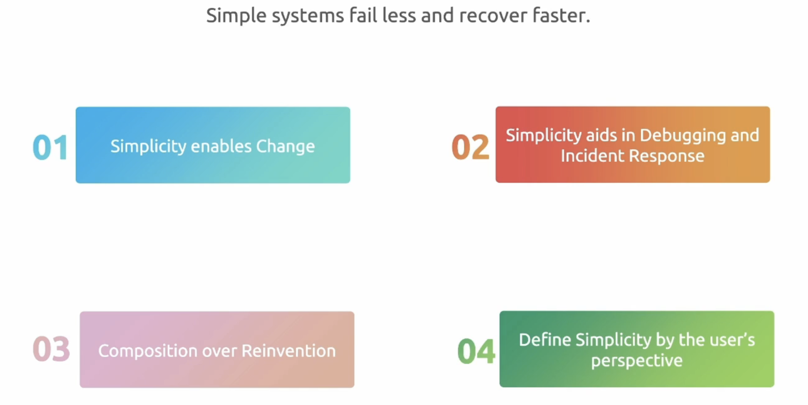

---

## DevOps vs. SRE — Understanding the Relationship

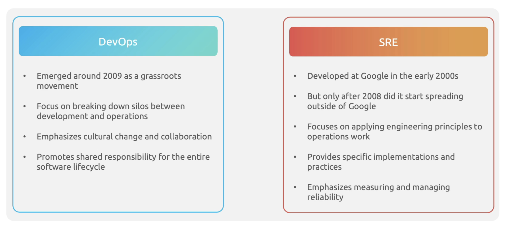

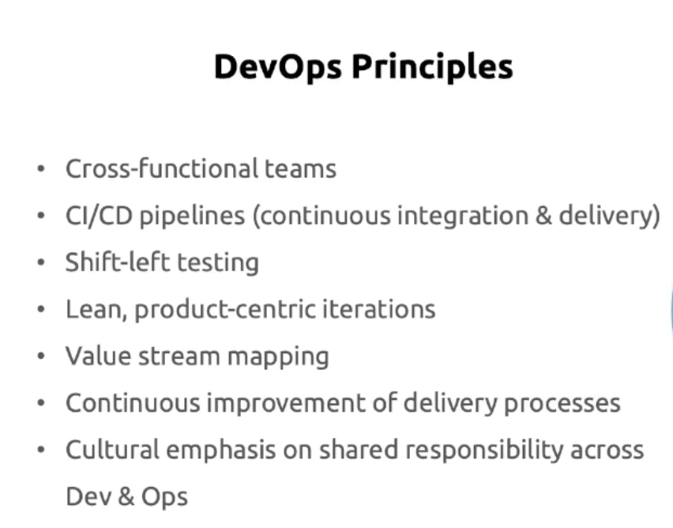

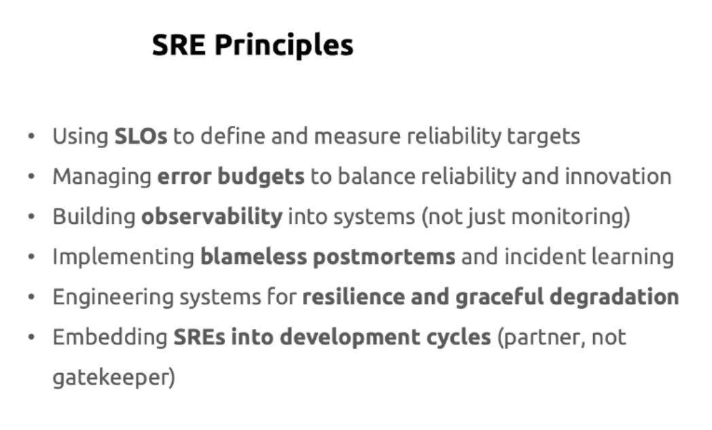

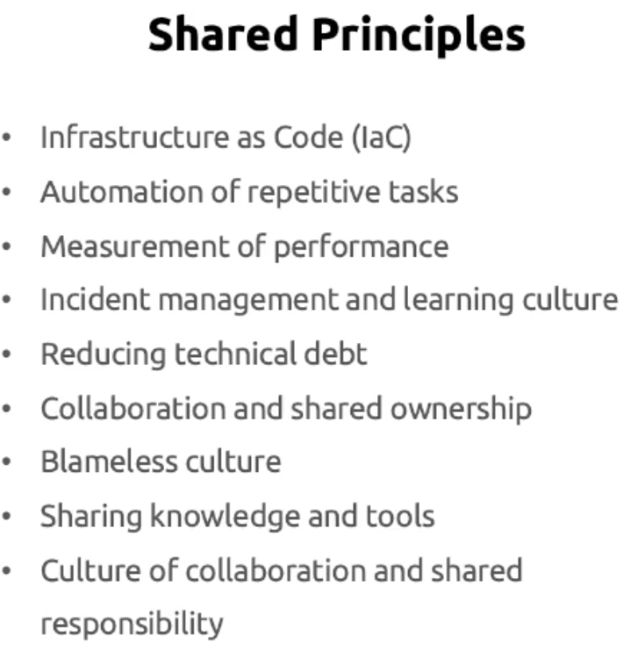

These two terms are often used interchangeably, but they operate at different levels of abstraction.

**DevOps** is a cultural mindset and philosophy for delivering software systems faster and more collaboratively. It breaks down the wall between development ("throw it over the fence") and operations ("not my code, not my problem"). DevOps answers the *what* and the *why*: what should the collaboration model look like, and why does it produce better outcomes? Practices like CI/CD pipelines, infrastructure-as-code, and blameless post-mortems are DevOps artifacts.

**SRE** is a concrete implementation of DevOps principles, focused on reliability through an engineering process. It answers the *how*, specifically around scalability and reliability. SRE takes the DevOps aspiration — "developers and ops work together" — and turns it into accountable engineering work: error budgets, SLO reviews, toil budgets, and production readiness reviews (PRRs). At Google, the phrase used internally is "SRE is what happens when you ask a software engineer to do what used to be called operations."

In practice: a company can adopt DevOps culture without having SRE teams. But SRE teams inherently embody DevOps values, because the entire SRE model depends on developers and SREs sharing responsibility for production.

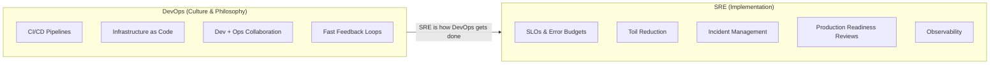
```mermaid
graph LR
    subgraph DevOps ["DevOps (Culture & Philosophy)"]
        CI[CI/CD Pipelines]
        IaC[Infrastructure as Code]
        Collab[Dev + Ops Collaboration]
        Feedback[Fast Feedback Loops]
    end

    subgraph SRE ["SRE (Implementation)"]
        SLO[SLOs & Error Budgets]
        Toil[Toil Reduction]
        IM[Incident Management]
        PRR[Production Readiness Reviews]
        OB[Observability]
    end

    DevOps -->|"SRE is how DevOps gets done"| SRE
```

---

### SRE Team Models

Not every organisation runs SRE the same way. Google itself experimented with multiple models before settling on what works at its scale. Understanding the trade-offs helps you advocate for the right structure at your company.

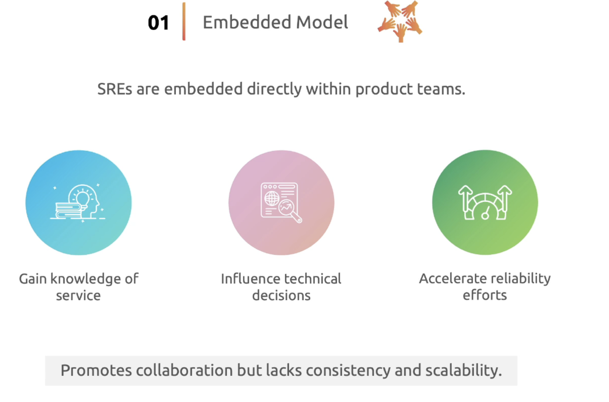

**Embedded model:** SREs are embedded directly within product engineering teams. They sit in team standups, attend sprint planning, and have deep context on the service they support. The trade-off is that embedded SREs can become de facto ops engineers for that team, gradually losing the cross-cutting engineering perspective that makes SRE valuable. This model works best at early-stage companies or for particularly complex, high-stakes services.

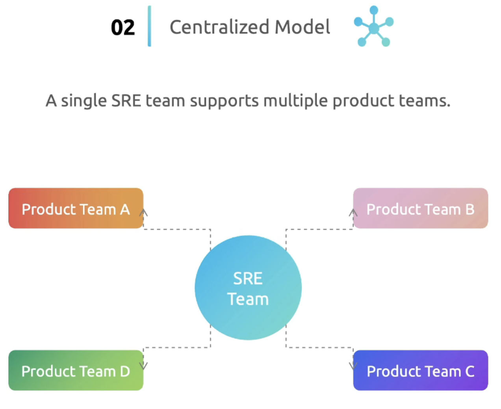

**Centralized model:** A single SRE team supports multiple product teams, often through a formal engagement model (Service Level Agreements between the SRE team and the product teams). This promotes consistency in standards and tooling across the organisation but can create distance between SREs and the services they support. Knowledge transfer requires more deliberate effort. This is the classic Google SRE model.

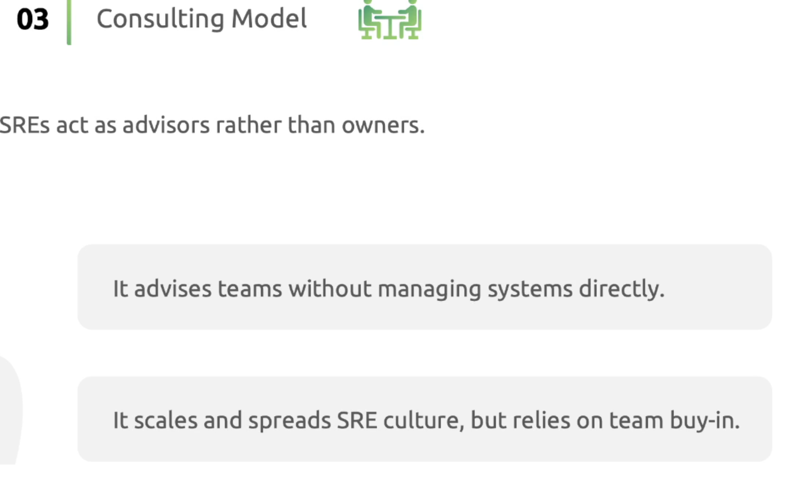

**Consulting model:** SREs act as an internal consulting service — they help product teams build reliable systems but do not own on-call rotations or production operations directly. This is sometimes called a "reliability enablement" model. It scales well but requires strong documentation and self-service tooling, because SREs won't be available for every production question.

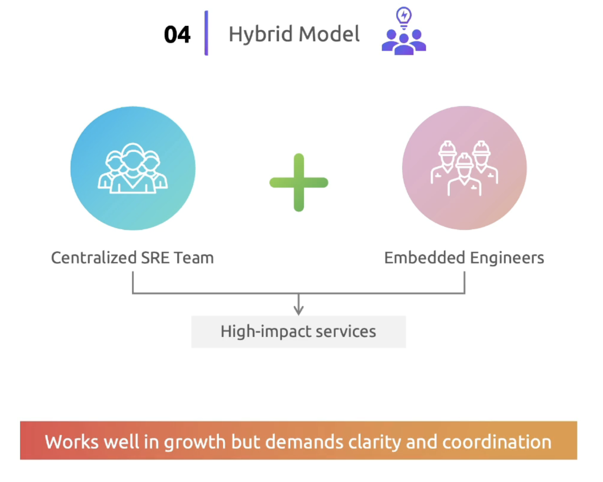

**Hybrid model:** Combines elements of the above — typically a centralized SRE team that provides platform and tooling, with embedded SREs for the highest-criticality services. Most large enterprises land here after iterating through the other models.

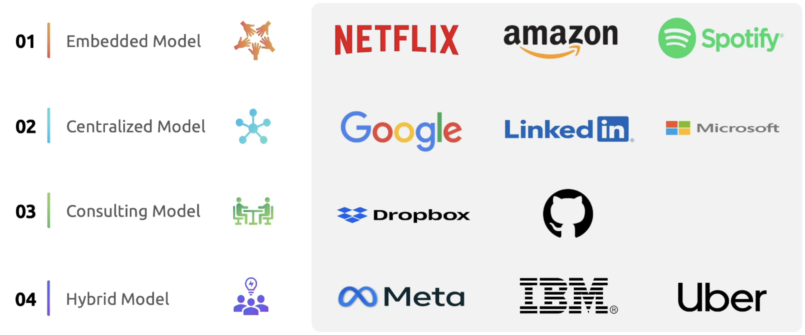

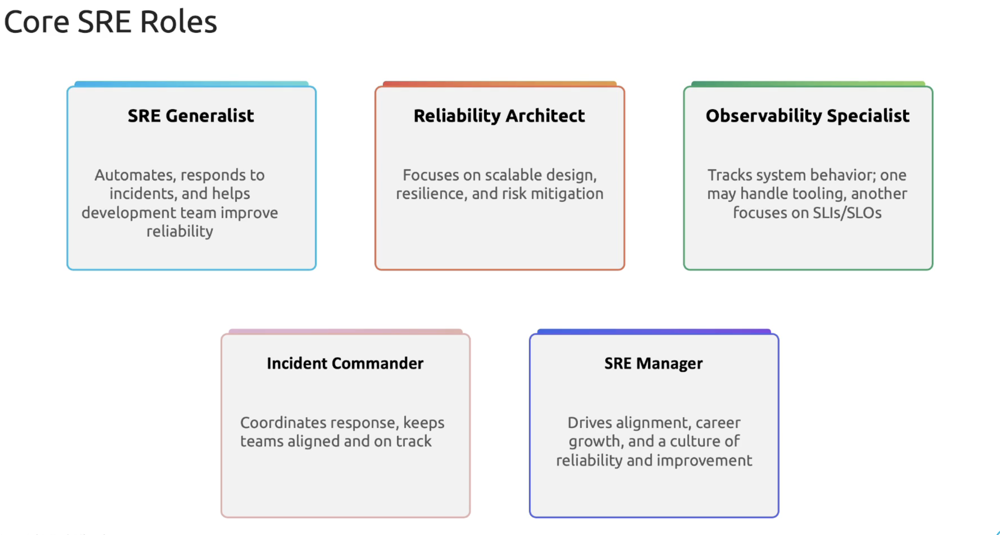

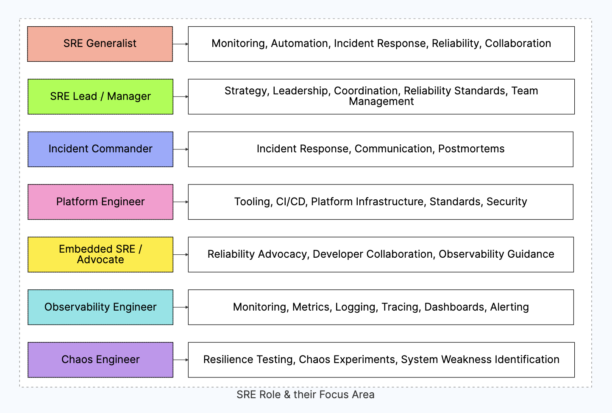

---

## Manage Complexity, Risk, and Toil

See also: [Manage Complexity](./manage_complexity.md)

One of the most underappreciated aspects of SRE is active complexity management. Every new feature, every new service, every new dependency adds complexity to the system — and complexity is the enemy of reliability. SREs push back against unnecessary complexity through design reviews, by championing service mesh abstractions, and by advocating for reducing the number of moving parts wherever possible.

Toil is the SRE-specific term for operational work that is manual, repetitive, automatable, tactical, and devoid of enduring value. Google's SRE book recommends that SREs spend no more than 50% of their time on toil — the remaining 50% should be engineering work that permanently improves the system. If toil exceeds 50%, it is a signal that the team is understaffed, the service is under-engineered for its scale, or the team needs to hand back operational responsibility to the product team.

---

## Incident Management

See also: [Incident Management](./incident_management.md)

Incident management is the structured process for detecting, responding to, and learning from service disruptions. A well-run incident response includes a clear severity framework (SEV1–SEV4 or P0–P3), defined roles (Incident Commander, Communications Lead, Subject Matter Expert), and a blameless post-mortem process that focuses on systemic causes rather than individual mistakes.

---

## Release Engineering

See also: [Release Engineering](./release_engineering.md)

Release engineering is the discipline of ensuring that software can be built, tested, and deployed reliably and repeatably. From an SRE perspective, a deployment is one of the highest-risk moments in a service's lifecycle — most incidents are caused by changes. SREs advocate for progressive delivery patterns (canary releases, blue/green deployments, feature flags) that limit the blast radius of a bad deployment.

---

## Observability & Monitoring

See also: [Observability](./observability.md)

Observability is the property of a system that allows you to understand its internal state from its external outputs (logs, metrics, traces). Monitoring tells you *that* something is wrong; observability helps you figure out *why*. Modern SRE practice treats the three pillars — metrics, logs, and distributed traces — as a unified telemetry layer, not three separate tools.

---

## Advanced Reliability

See also: [Chaos Engineering](./chaos_engineering.md), [SRE Measurements](./sre_measure.md)

Advanced reliability topics include chaos engineering (deliberately injecting faults to find weaknesses before they become incidents), load shedding and backpressure patterns, multi-region active/active architectures, and the use of game days to rehearse incident response. These are the techniques that separate a team that survives incidents from one that prevents them.

---

## Common Pitfalls

**Setting SLOs too tight.** A 99.999% (five-nines) SLO sounds impressive but gives you only ~5 minutes of downtime per year. Unless your service genuinely requires that (think: pacemaker firmware update servers), it will drain your error budget with every minor blip and paralyse your release velocity. Start with 99.9% and tighten based on data.

**Confusing SLOs with SLAs.** SLOs are internal targets; SLAs are external contracts. Your SLO should always be stricter than your SLA — if your SLA promises 99.9% uptime, your SLO should target 99.95% so you have a buffer before breaching the contractual threshold.

**Alert fatigue from symptom-agnostic alerts.** Alerting on every CPU spike or disk I/O metric creates noise that trains engineers to ignore alerts. Alert on user-facing symptoms (error rate, latency) and let those drive investigation into causes.

**Treating toil as unavoidable.** "We've always done it this way" is the enemy of SRE. Every time an SRE performs a manual task, the instinct should be: "How do I make it so I never have to do this again?"

**No error budget policy.** An error budget without an associated policy ("if we burn 100% of budget, we freeze releases until the next window") is just a metric. The policy is what gives the budget teeth and makes it a useful negotiation tool between product and engineering.

**Skipping production readiness reviews (PRRs).** Launching a new service without a PRR is like deploying to production without testing. A PRR checklist should cover: SLOs defined, runbook written, dashboards built, on-call rotation staffed, rollback plan documented, capacity estimate done, and dependencies mapped.

---

## Interview Questions

These are common SRE interview questions based on this material. Try answering them out loud before your next interview.

1. **Explain the difference between an SLI, SLO, and SLA. Give a concrete example for a payment service.** (Expect a follow-up: *How do you choose which SLIs to measure?*)

2. **Your team's error budget is 80% depleted with 10 days left in the month. What do you do?** (Tests whether you know the error budget policy and can balance reliability vs. velocity.)

3. **What is toil, and how do you measure it? What is an acceptable toil percentage for an SRE team?** (The answer is ≤50%; anything higher needs escalation.)

4. **Walk me through the difference between the embedded, centralized, and consulting SRE team models. Which would you recommend for a startup with 3 engineers vs. a company with 500 engineers?**

5. **How do you write a good alert? What is the difference between alerting on causes vs. symptoms?** (Symptoms: "HTTP 5xx rate > 1% for 5 minutes." Causes: "CPU > 80%" — the latter is usually noise.)

6. **What is the relationship between SRE and DevOps? Can you have one without the other?**

---

## Key Takeaways

- SRE treats operations as a **software engineering problem** — automation, code, and measurement replace tribal knowledge and heroics.
- The SLI → SLO → Error Budget chain is the **central feedback loop** of SRE: it quantifies reliability, allocates acceptable risk, and creates a shared language between product and engineering.
- DevOps is the *philosophy*; SRE is the *implementation*. SRE gives DevOps concrete, measurable practices.
- Choose your **team model** (embedded, centralized, consulting, hybrid) based on your organisation's size, maturity, and the criticality of the services involved.
- The five diagnostic questions (how can it break, what do we do, what is acceptable, how do we know, what context do we need) are a **practical checklist** for assessing whether a service is production-ready.
- Toil is a **leading indicator** of SRE team health. If the team spends more than 50% of time on toil, something is broken — either the service, the staffing, or the engagement model.
- Reliability is a **feature**, not an afterthought. Budget for it in roadmaps, staff for it in on-call rotations, and measure it with SLOs.

