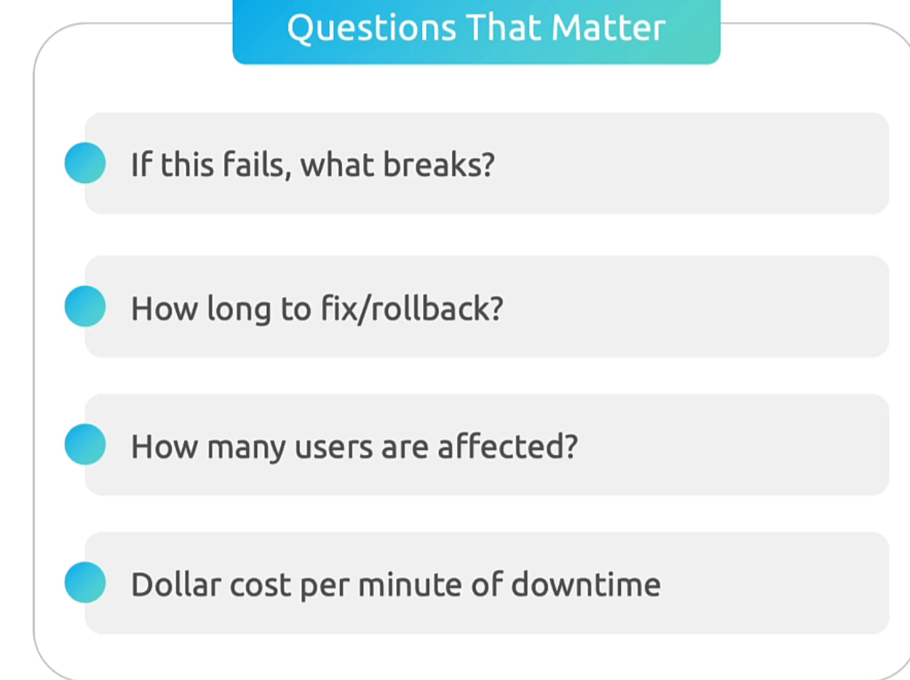
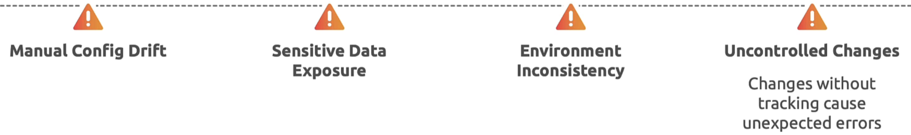
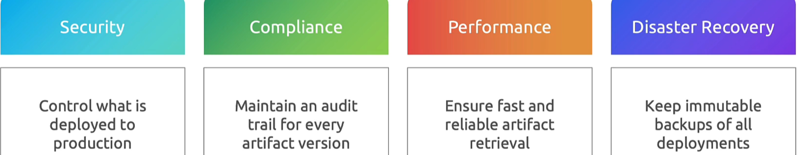

## production readiness

real readiness meaning 

- ready for real users
- withstand real load
- handles real problems
- avoids costly failures

Observability .. 

Metrics: is it slow ?

logs: why is it slow ?

traces: where is the slow ?

**Readiness Questions:**

- would your service be healthy in 30 seconds ?
- Can you identigy problem in 5 minutes ?
- Can you wake up the right person automatically ?

# Configuration Management

Overcome these pitfalls 

- Env promotion

- Create env specific configs

env.dev.properties
env.stage.properties
env.prod.properties

## Secure software releases

Security scanning

- Token auth 
- Automated scanning
- SBOM tracking
- leaast privilege
- environment controls 
- container scanning

## release engineering best practices

Deployment strategies

why do you need artifact ?

CICD plan

CICD best practices

Communication and learning

