## TL;DR

Release engineering is the discipline of ensuring that software moves from a developer's laptop to production safely, repeatably, and with confidence. From an SRE perspective, deployments are the single highest-risk moment in a service's lifecycle — the majority of production incidents are caused by changes. This document covers production readiness reviews (what makes a service truly ready to ship), configuration management, security in the CI/CD pipeline, deployment strategies, and the practices that make release engineering a reliability multiplier rather than a reliability risk.

See also: [SRE Overview](./overview.md) | [Manage Complexity](./manage_complexity.md) | [Observability](./observability.md) | [Incident Management](./incident_management.md)

---

## Production Readiness

"Production ready" does not mean "it passes CI." Real readiness means the service is:

- **Ready for real users** — Not just synthetic test traffic. Real users have unexpected usage patterns, edge-case inputs, and latency requirements that staging traffic rarely exercises.
- **Able to withstand real load** — Load tested at 2x expected peak to give headroom for traffic spikes without degradation.
- **Able to handle real problems** — The service degrades gracefully when its dependencies fail. Operators know how to respond when it misbehaves.
- **Designed to avoid costly failures** — Security vulnerabilities are scanned, secrets are managed properly, and the rollback path is tested before launch.

**Why does this matter for an SRE?** The cost of finding a reliability problem in production is 10–100x higher than finding it before launch. A production readiness review (PRR) is the structured investment that prevents that cost.

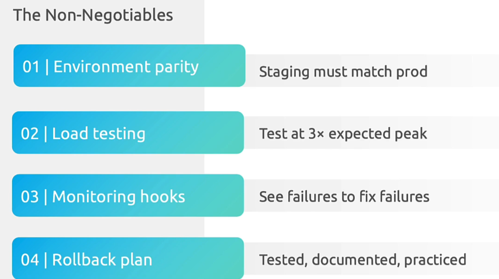

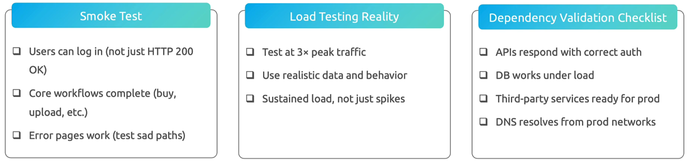

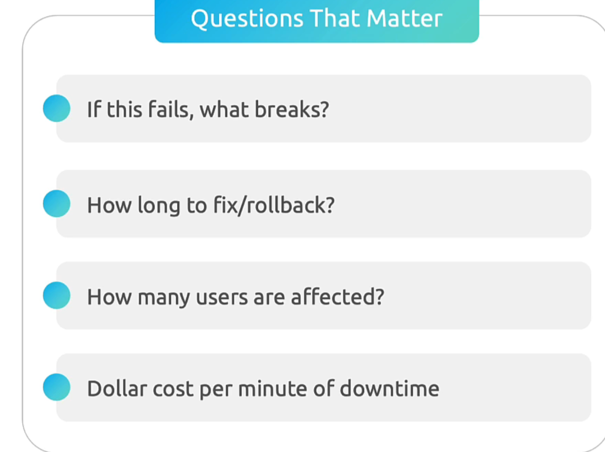

### Observability Readiness

A service is not ready for production if you cannot observe it. The three pillars of observability map to three specific questions that an on-call engineer must be able to answer in real time:

- **Metrics: Is it slow?** — The service must emit latency histograms, request rates, and error rates that feed into a dashboard and SLO calculations. Without metrics, you cannot tell whether the service is healthy or degraded.
- **Logs: Why is it slow?** — Structured logs with correlation IDs allow you to reconstruct what the service was doing at the time of a latency spike or error. Without structured logs, you are guessing.
- **Traces: Where is the slow?** — Distributed traces show you which service in the call chain is contributing the most latency. Without traces, you cannot tell whether the bottleneck is in your service or a dependency.

### Production Readiness Checklist

These are the three questions that determine whether a service is ready to go live:

```
Readiness Gate 1: Recovery speed
  ■ Would your service restart and be healthy in under 30 seconds?
    (Tests: container health checks, dependency retry logic, startup probes)

Readiness Gate 2: Problem visibility
  ■ Can you identify a production problem within 5 minutes of it occurring?
    (Tests: SLO dashboard exists, alerts are configured and tested,
     structured logging with trace IDs is enabled)

Readiness Gate 3: Escalation path
  ■ Can the system automatically wake up the right person when it breaks?
    (Tests: PagerDuty/OpsGenie routing rules are configured,
     on-call rotation is staffed, escalation policy is defined)
```

A service that fails any of these three gates is not production-ready, regardless of how many unit tests pass.

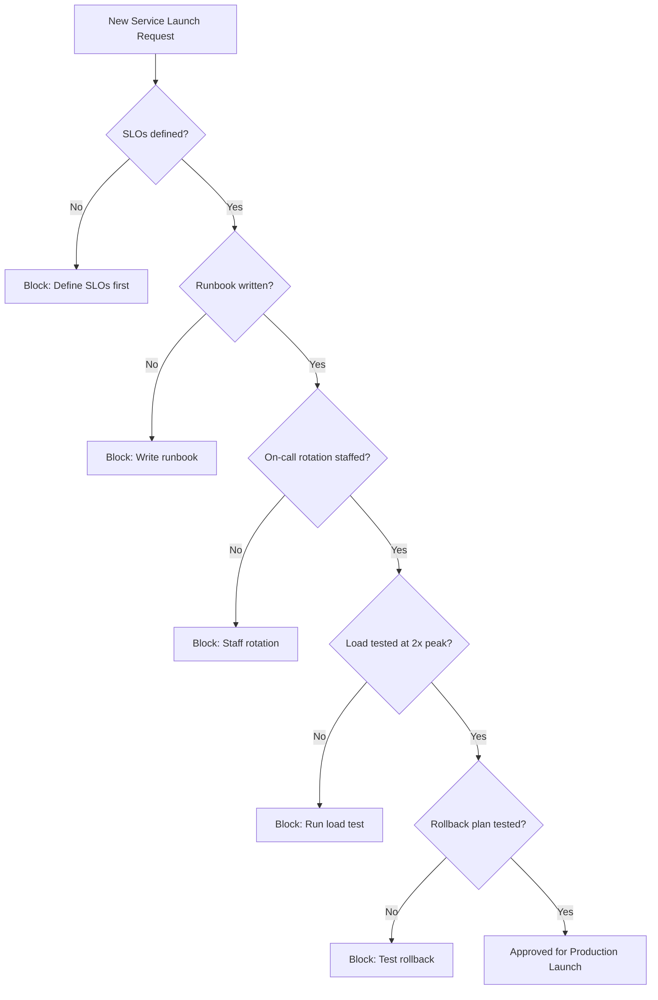
```mermaid
flowchart TD
    A[New Service Launch Request] --> B{SLOs defined?}
    B -- No --> Z1[Block: Define SLOs first]
    B -- Yes --> C{Runbook written?}
    C -- No --> Z2[Block: Write runbook]
    C -- Yes --> D{On-call rotation staffed?}
    D -- No --> Z3[Block: Staff rotation]
    D -- Yes --> E{Load tested at 2x peak?}
    E -- No --> Z4[Block: Run load test]
    E -- Yes --> F{Rollback plan tested?}
    F -- No --> Z5[Block: Test rollback]
    F -- Yes --> G[Approved for Production Launch]
```

---

## Configuration Management

Configuration management is one of the most common sources of production incidents. The pattern is always the same: a configuration that was valid in staging breaks in production because of an environment-specific difference that was never explicitly managed.

Configuration management pitfalls:

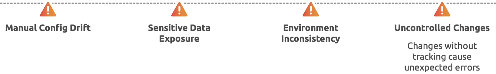

The most dangerous configuration anti-pattern is **configuration drift**: where production configuration diverges from what is checked into source control, either through manual edits ("just a quick fix") or automated systems that update configuration without committing the change. Drifted configuration means your source of truth is wrong, which means your rollback procedure is unreliable.

### Overcoming Configuration Pitfalls

**Environment promotion** is the practice of promoting configuration through a chain of environments (dev → staging → production) rather than maintaining separate configuration files per environment. The configuration value changes, but the structure and schema remain identical across environments. This makes it impossible to have a field in production config that doesn't exist in staging.

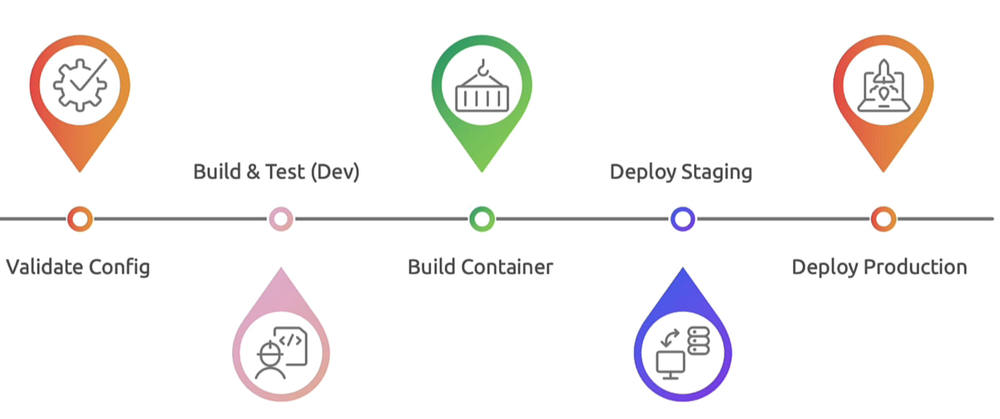

Environment-specific configuration files follow a consistent naming convention:

```
# Environment-specific configuration files
# All files have the same structure; only values differ

env.dev.properties       — Development values (local DB, debug logging, mock APIs)
env.stage.properties     — Staging values (staging DB, verbose logging, real-but-test APIs)
env.prod.properties      — Production values (prod DB, info logging, real APIs)

# Key principle: if a key exists in prod, it must exist in dev and stage too.
# Undocumented production-only config is a ticking time bomb.
```

Best practices for configuration management:

- **Never hardcode values** that differ across environments (database URLs, API endpoints, feature flags). These belong in config files or environment variables, never in source code.
- **Version control all configuration** alongside the application code. A configuration change should go through the same PR review process as a code change.
- **Use secret management tools** (HashiCorp Vault, AWS Secrets Manager) for credentials. Never store passwords, API keys, or tokens in config files that are checked into source control.
- **Validate configuration at startup.** The application should fail fast with a descriptive error if required configuration is missing or malformed, rather than failing silently at runtime.

```python
# Good: validate configuration at startup and fail fast with a clear error
import os
import sys

REQUIRED_CONFIG = ['DATABASE_URL', 'API_KEY', 'LOG_LEVEL', 'MAX_CONNECTIONS']

def validate_config():
    """Validates all required environment variables are set at startup.
    Exits with a descriptive error if any are missing — prevents silent failures.
    """
    missing = [key for key in REQUIRED_CONFIG if not os.environ.get(key)]
    if missing:
        print(f"FATAL: Missing required configuration: {', '.join(missing)}",
              file=sys.stderr)
        sys.exit(1)
    print(f"Configuration validated: {len(REQUIRED_CONFIG)} variables OK")

validate_config()  # Call before any other initialization
```

---

## Secure Software Releases

Security in the release pipeline is not a separate concern from reliability — a security vulnerability that is exploited causes an availability incident. SREs who own the CI/CD pipeline own the security posture of the artifact production process.

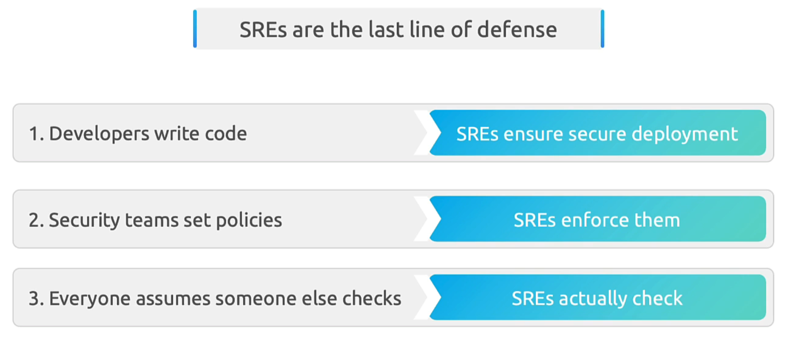

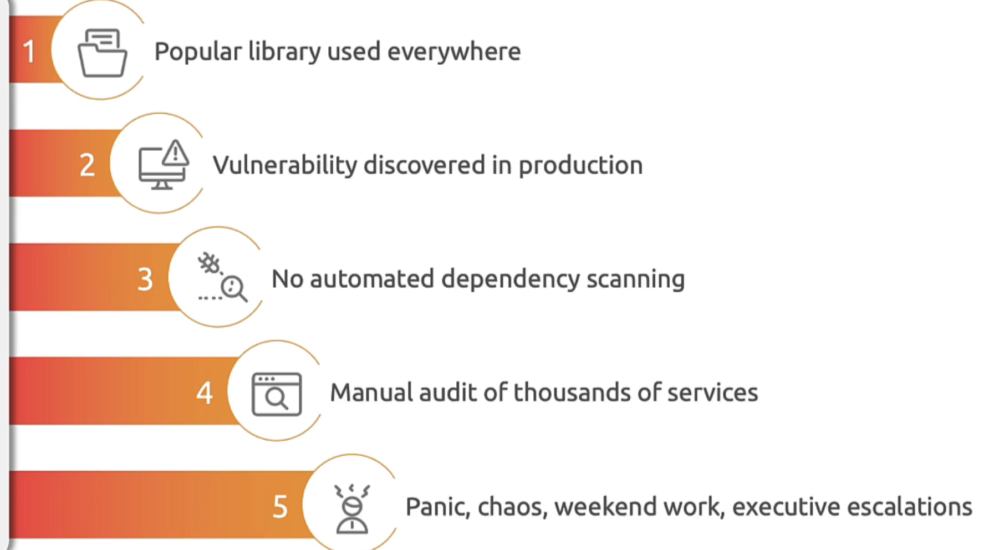

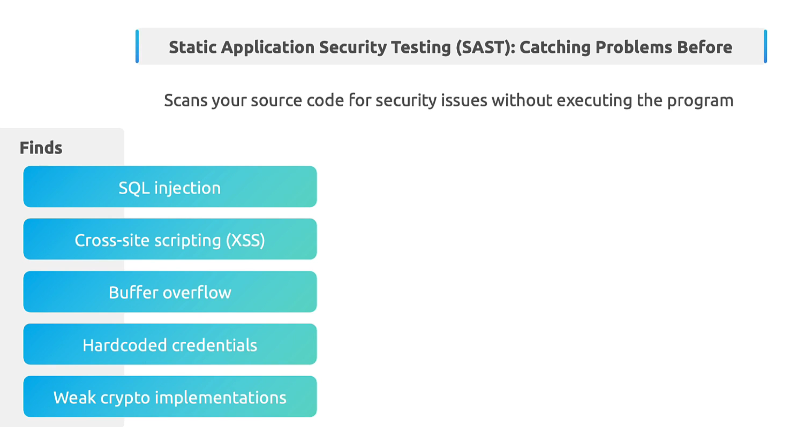

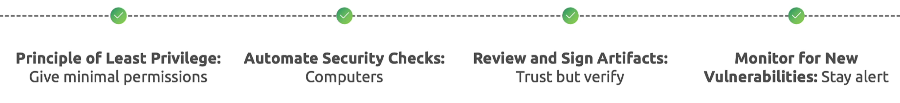

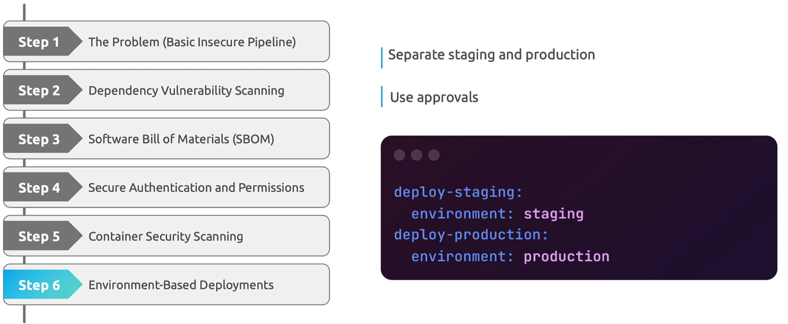

### Security Scanning in the Pipeline

Every security check should be automated as a pipeline gate — not a manual review that is skipped under time pressure. The checks run in order of speed (fast checks first, slow checks later in the pipeline):

- **Token authentication** — Pipeline jobs authenticate to registries, secret stores, and cloud APIs using short-lived tokens (OIDC) rather than long-lived credentials. A leaked long-lived secret is a persistent vulnerability; a leaked OIDC token expires in minutes.
- **Automated scanning** — Static application security testing (SAST) runs on every commit to catch common vulnerability patterns (SQL injection, path traversal, hardcoded secrets). Dynamic application security testing (DAST) runs against the deployed staging environment to catch runtime vulnerabilities.
- **SBOM tracking** — A Software Bill of Materials (SBOM) is generated for every build and stored alongside the artifact. This allows rapid identification of which services are affected when a critical CVE is disclosed for a library (e.g., log4shell).
- **Least privilege** — CI/CD jobs run with the minimum IAM permissions required to complete their task. A job that only needs to push to an S3 bucket should not have the permissions to modify IAM roles or read secrets from Vault.
- **Environment controls** — Production deployments require explicit approval (a manual gate or a PR merge to a protected branch). No automated system should be able to push to production without a human action in the approval chain.
- **Container scanning** — Container images are scanned for known CVEs before they are pushed to the registry. Images with critical vulnerabilities are blocked from deployment. Base images are pinned to specific digests, not floating tags, to prevent silent base-image updates.

```yaml
# Example: GitHub Actions security scanning pipeline
# Runs SAST, dependency vulnerability scan, and container scan on every PR

name: Security Gates
on: [pull_request]

jobs:
  sast:
    runs-on: ubuntu-latest
    steps:
      - uses: actions/checkout@v4

      # Static analysis — catch common security patterns in source code
      - name: Run Semgrep SAST
        uses: returntocorp/semgrep-action@v1
        with:
          config: p/owasp-top-ten

  dependency-scan:
    runs-on: ubuntu-latest
    steps:
      - uses: actions/checkout@v4

      # Scan Python dependencies for known CVEs
      - name: Run pip-audit
        run: pip-audit --vulnerability-service=osv -r requirements.txt

  container-scan:
    runs-on: ubuntu-latest
    steps:
      - name: Build image
        run: docker build -t app:${{ github.sha }} .

      # Scan the built container image for CVEs before pushing
      - name: Run Trivy container scan
        uses: aquasecurity/trivy-action@master
        with:
          image-ref: app:${{ github.sha }}
          severity: CRITICAL,HIGH
          exit-code: 1            # Block the pipeline if critical CVEs found
```

---

## Release Engineering Best Practices

### Deployment Strategies

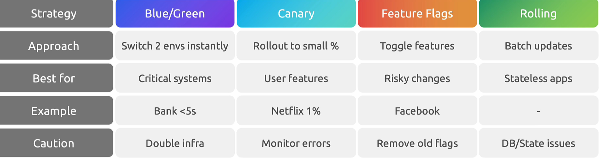

The right deployment strategy depends on three factors: the risk level of the change, the ability to detect problems quickly (observability maturity), and the blast radius if the change breaks something. Here is a decision framework:

| Strategy | Best for | Rollback speed | Infrastructure cost |
|----------|---------|---------------|-------------------|
| **Rolling update** | Low-risk changes, stateless services | Minutes (re-deploy previous version) | Low |
| **Blue/Green** | High-risk changes, need instant rollback | Seconds (flip load balancer) | 2x during cutover |
| **Canary** | Any change where you want data before full rollout | Minutes (shift traffic back) | Low (≤5% extra traffic) |
| **Feature flags** | Features that need to be decoupled from deployment | Milliseconds (toggle off) | Low |

For database schema changes, none of these strategies work cleanly — schema changes are a special case that requires backward-compatible migrations (the expand-contract pattern): add the new column, migrate data, deploy code that uses the new column, remove the old column in a separate migration after all instances are on the new code.

### Why Artifacts Matter

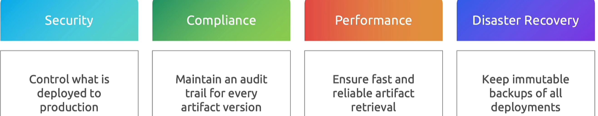

An artifact is the immutable, versioned output of a build process — a container image, a compiled binary, a Python wheel, a Helm chart. Artifacts are what make deployments reproducible. Without artifacts:

- You cannot guarantee that staging and production are running the same code ("works on my machine" applies to environments too)
- Rollback means rebuilding from source, which may produce a different binary if a transient dependency changed
- You cannot audit exactly what code was running at the time of an incident

Every artifact should be: immutably tagged (by git SHA, not a floating tag like `latest`), pushed to a registry before deployment (never build in production), and stored with its SBOM and security scan results.

### CI/CD Plan

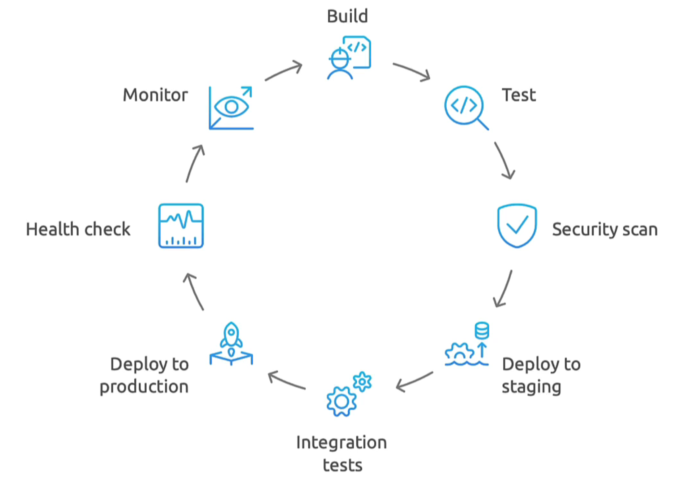

A mature CI/CD pipeline has distinct stages, each with a clear gate:

```
Stage 1: Commit  — lint, unit tests, SAST (< 5 min)
Stage 2: Build   — container build, dependency scan, SBOM generation
Stage 3: Test    — integration tests, performance tests against staging
Stage 4: Stage   — deploy to staging, smoke tests, canary analysis
Stage 5: Approve — human approval gate for production deployment
Stage 6: Prod    — canary deploy to 1%, monitor SLIs, progressive rollout
Stage 7: Verify  — automated SLI check at each traffic increment
```

Each stage is a gate: if stage N fails, stages N+1 onwards do not run. This prevents a broken build from being deployed to production and ensures that every production artifact has passed all earlier gates.

### CI/CD Best Practices

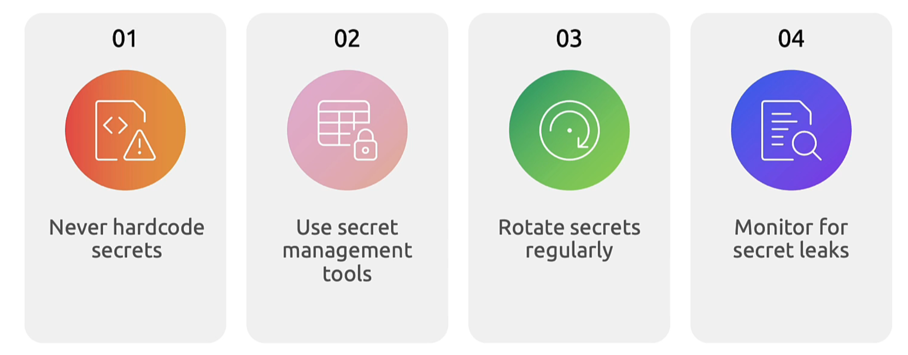

The most impactful CI/CD practices for reliability:

1. **Keep pipelines fast.** A pipeline that takes 45 minutes discourages frequent commits, which leads to large batched changes, which increases deployment risk. Target under 10 minutes for the commit-to-staging-deploy cycle.
2. **Fail fast, fail loudly.** Put the fastest checks first (linting, unit tests). A developer should know within 2 minutes if their commit breaks basic sanity checks.
3. **Immutable artifacts.** Build once, deploy the same artifact everywhere. Never rebuild from source for production deployment.
4. **Automated rollback.** Define a metric condition (e.g., "error rate > 1% for 5 minutes after deploy") that automatically reverts the deployment. Manual rollback under pressure is slow and error-prone.
5. **Pipeline as code.** CI/CD configuration lives in the repository alongside the application code. Changes to the pipeline go through the same review process as application changes.
6. **Environment parity.** Staging should mirror production in topology, configuration structure, and data scale. Surprises that appear only in production are a sign of environment divergence.

### Communication and Learning

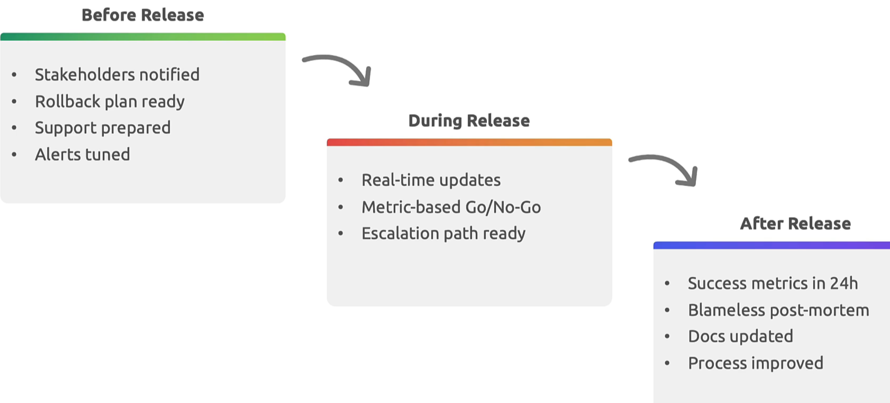

Release engineering is not purely technical — the communication around releases is equally important. A deployment that succeeds technically but surprises the on-call team, customer support, or customers is a poorly managed release.

Before each significant release: communicate the change, its expected impact, the deployment window, and the rollback plan to all stakeholders. After each release: share the deployment summary, any anomalies observed, and lessons learned. This creates a feedback loop that improves the release process over time.

---

## Common Pitfalls

**Skipping the PRR because "it's a small service."** Small services that aren't ready for production create on-call toil when they fail at 3 AM without a runbook or dashboard. No service is too small for a PRR — the PRR can be lightweight, but it must exist.

**Configuration drift between environments.** Manual edits to production configuration that are not committed back to source control will cause the next deployment to overwrite them unexpectedly. Treat configuration changes exactly like code changes: PR, review, commit, deploy.

**Using mutable image tags in production.** The tag `latest` or `main` does not identify a specific image. When a production pod restarts, it may pull a different image than the one that was originally deployed. Always use immutable SHA-based tags in production.

**Security scanning as a manual step.** Security reviews that happen manually before a release are too slow, too inconsistent, and too easy to skip under time pressure. Automate all security gates in the pipeline and make them blocking.

**No automated rollback.** A rollback that requires a human to log in, identify the previous version, and re-deploy manually during an incident is slow and error-prone. Invest in automated rollback as a first-class feature of your deployment system.

**Long-lived feature branches.** Large feature branches that diverge significantly from main accumulate merge conflicts and integration surprises. Prefer trunk-based development with feature flags to keep the codebase integrated at all times.

---

## Interview Questions

1. **What is a production readiness review (PRR) and what should it cover?** (SLOs, runbook, dashboards, on-call rotation, rollback plan, load test results, security scan, capacity estimate.)

2. **Walk me through the expand-contract pattern for database schema migrations. Why is it needed?** (Tests: understanding of backward compatibility during rolling deploys.)

3. **What is the difference between blue/green deployment and canary deployment? When would you choose each?** (Blue/green: instant rollback, full traffic switch; canary: gradual rollout with data-driven promotion.)

4. **A developer wants to use `latest` as the image tag in production. How do you explain why this is a problem?** (Non-deterministic: pod restarts may pull a different image. Immutable SHA tags ensure what is deployed is what was tested.)

5. **How would you design a CI/CD pipeline gate that automatically prevents deployment when the staging canary shows SLI degradation?** (Prometheus metrics from staging, pipeline queries PromQL, fails the stage if error rate or latency exceeds threshold.)

6. **What is SBOM and why does it matter for release engineering?** (Software Bill of Materials: enables rapid identification of affected services when a CVE is disclosed for a dependency.)

---

## Key Takeaways

- **Deployments are the highest-risk moments in a service's lifecycle.** Most incidents are caused by changes. Release engineering is the discipline of making those changes safer.
- **Production readiness is a gate, not a formality.** A service without SLOs, runbooks, dashboards, and a tested rollback path is not ready for production, regardless of feature completeness.
- **Configuration drift is a silent reliability killer.** All configuration should be version-controlled, environment-promoted, and never edited directly in production.
- **Security belongs in the pipeline, not after it.** Automated SAST, dependency scanning, and container scanning as blocking pipeline gates are more effective than manual security reviews.
- **Immutable artifacts are the foundation of reproducible deployments.** Build once, deploy everywhere, tag by SHA, store with SBOM.
- **Choose your deployment strategy by risk level.** Rolling update for low-risk; canary for medium-risk; blue/green for high-risk or critical services where instant rollback is required.
- **Automated rollback is not optional.** A rollback that requires human action under incident pressure is a rollback that will be slow, error-prone, and sometimes skipped.