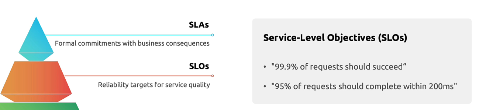
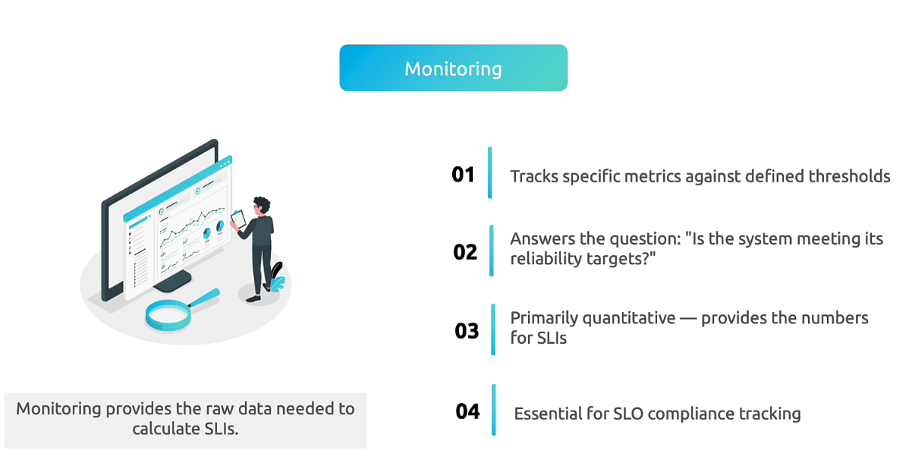
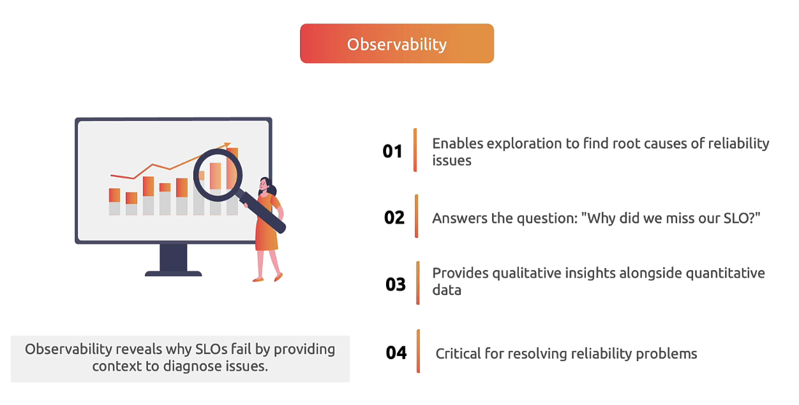
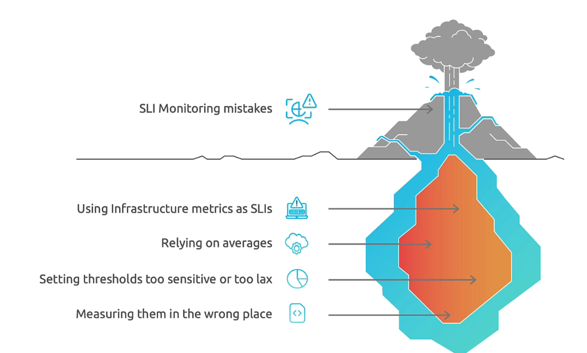
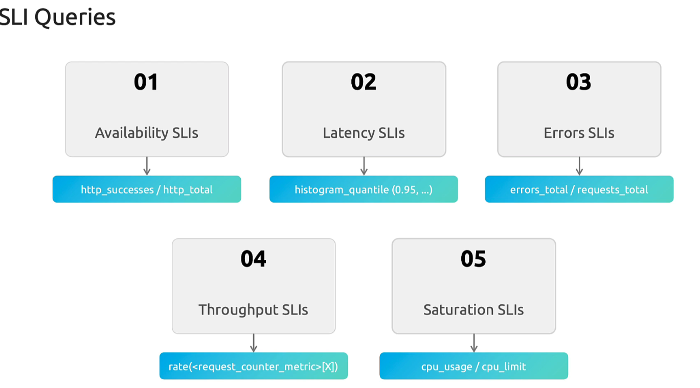
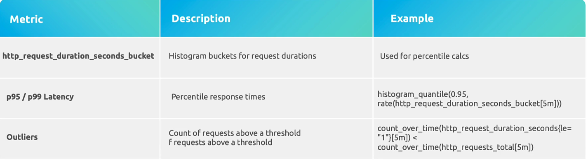
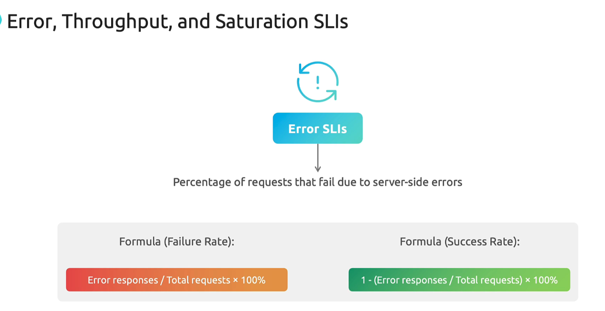
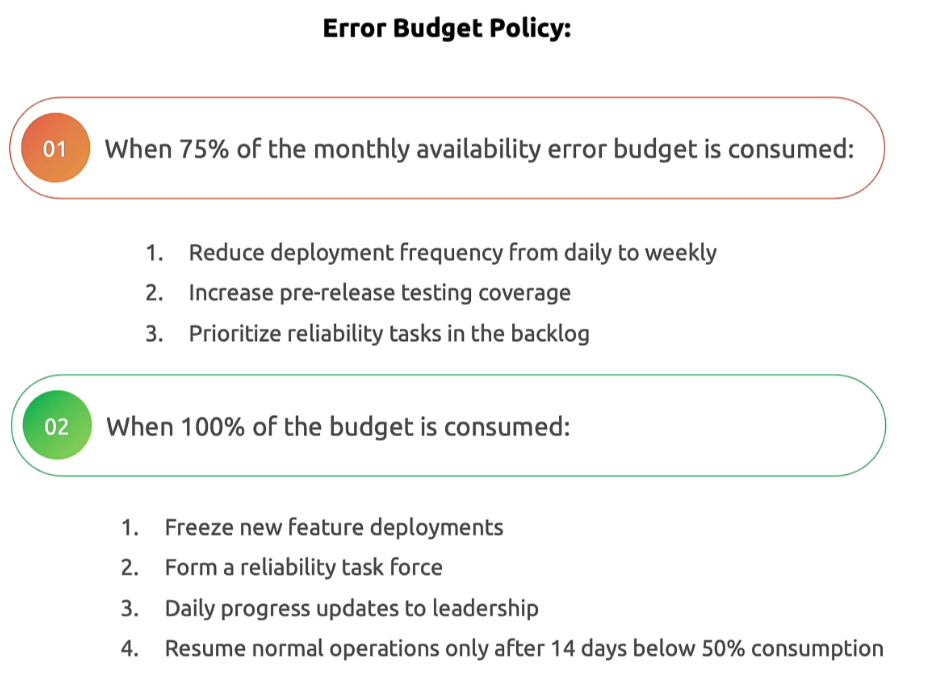
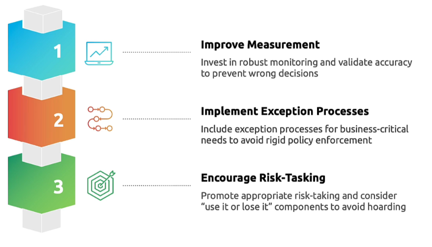

## SRE Measurements

monitoring tells you if you are healthy

 

observability tells you why are you sick 

There are 3 data types for measuring realibility

**Metrics**

whats happening along....

**Traces**

where it went wrong ..

**logs**

what went wrong ... 
Details the information for debug and diagonizes the cause for SLO viloations..

**Golden rules**

## Implementing SLIs

Once you have identified whats SLI you need, you would choose for the queries to get metrics. 

### Availability SLI

# 📊 Availability vs Allowed Downtime — Cheat Sheet

## 🔢 Uptime Targets

| Availability | Allowed Downtime per Day | per Week | per Month (30 days) | per Year |
|--------------|--------------------------|----------|----------------------|----------|
| **99% (Two nines)**      | **14m 24s**        | **1h 40m 48s** | **7h 18m**         | **3 days 15h** |
| **99.9% (Three nines)**  | **1m 26s**         | **10m 4s**     | **43m 12s**        | **8h 45m** |
| **99.99% (Four nines)**  | **8.6 seconds**    | **1 minute**   | **4m 32s**         | **52m 34s** |
| **99.999% (Five nines)** | **0.86 seconds**   | **6 seconds**  | **26 seconds**     | **5m 15s** |

---

## 🧮 Formula

Allowed downtime = (1 - Availability%) × Total period
Allowed downtime(99.99%) = (1-99.99%) i.e 0.0001 × (30 days × 24 × 60 minutes) = 4.32 minutes

### Latency SLI

### Error SLI

### Throughput 

### Satuaration

## SLO Game

## Implementing Error budgets

its just a tradeoff for SLO

## visualization measurements

Effective SLO Dashboard

- Focus on user fist
    - Primary panels show user facing SLIs
    - Clear visual indication of SLO compliance status
    - User journey success rates

- Implement visual hierarchy

- Use color strategically
    - Green: comfortably meeting SLO
    - Red: SLO violation
    - Yellow: within SLO but trending toward threshold.

- Include error budget visuallizations
    - Total error budget for the period
    - Current consyumption percentage
    - Burn rate
    - Projected depletion date at current burn rate

- Include contextual information
    - SLO targets clearly labeled
    - time window of measurement
    - links to incident response procedures
    - service dependencies status

## Takeaways

**Monitoring Implementation:**

- Metrics collection starts at the application level with instrumented code.
- Prometheus acts as the central metrics storage and query engine.
- Grafana provides visualization and dashboarding capabilities.=
- Both metrics collection and visualization require careful configuration for accuracy and relevance.

**Dashboard Best Practices:**

- Prioritize user-experienced metrics when defining SLIs and SLOs.
- Choose appropriate visualization types based on the nature of the metric.
- Set meaningful thresholds aligned with SLO targets.
- Include both real-time and historical views for context and trend analysis.

