## TL;DR

SRE measurements are the quantitative foundation of everything else: you cannot manage what you cannot measure. This document covers the full measurement stack — SLAs, SLOs, SLIs, and error budgets — the three reliability data types (metrics, traces, logs), the four golden signals, and how to implement each SLI category (availability, latency, error rate, throughput, saturation) with real PromQL examples. It also covers how to build SLO dashboards that are actually useful during an incident and during a business review. If you read one document in this SRE wiki, this is it.

See also: [SRE Overview](./overview.md) | [Observability](./observability.md) | [Incident Management](./incident_management.md) | [Chaos Engineering](./chaos_engineering.md)

---

## SRE Measurements

The measurement hierarchy in SRE is a chain: SLIs are the raw data; SLOs are the targets built on SLIs; SLAs are the contractual commitments built on SLOs; and error budgets are derived from SLOs to govern how much risk can be taken.

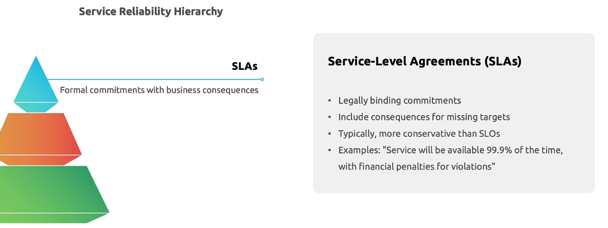

**SLA (Service Level Agreement)** — An external contract between the service provider and the customer, typically with financial consequences for breach (service credits, refunds). SLAs are owned by business and legal teams. The SLA promise is usually weaker than the internal SLO target — if your SLO is 99.95%, your SLA might promise 99.9%, giving you a buffer before the contract is breached.

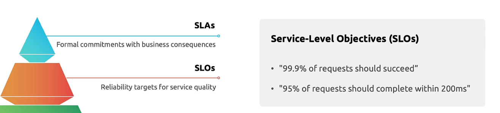

**SLO (Service Level Objective)** — An internal reliability target defined as a range for one or more SLIs, measured over a rolling time window. SLOs are the primary tool SREs use to make decisions: if the SLO is being met comfortably, release velocity can increase; if the error budget is burning fast, releases should slow down or stop. SLOs should be set based on user needs and business requirements, not based on what the system happens to be delivering today.

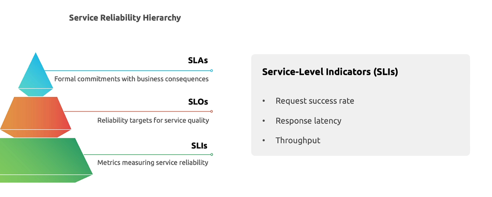

**SLI (Service Level Indicator)** — A quantitative metric that measures one dimension of service health as experienced by users. Good SLIs measure user-facing outcomes ("what percentage of requests succeeded?") rather than internal system state ("what is the CPU utilisation?"). The most common SLI categories are availability, latency, error rate, throughput, and saturation.

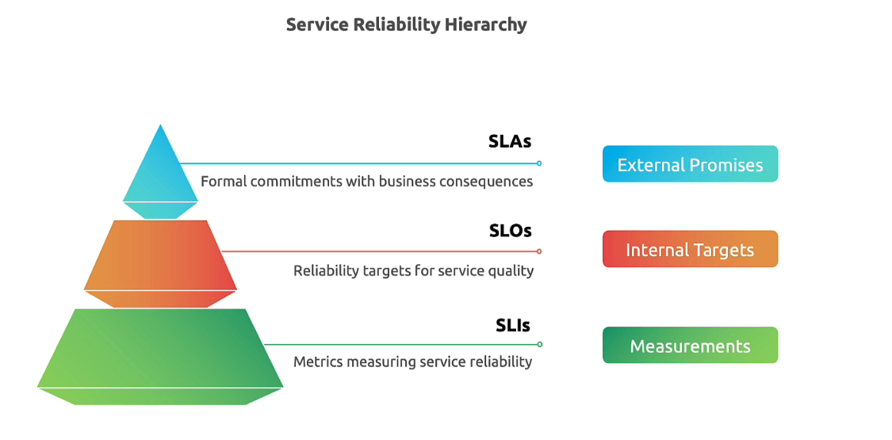

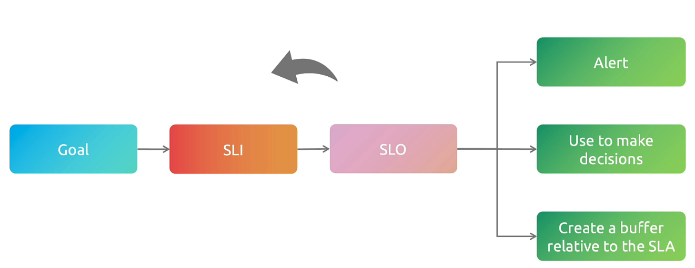

### Monitoring vs. Observability

These terms are often confused, but they address different problems:

**Monitoring** tells you *if* you are healthy. It watches known indicators and fires when they exceed a threshold. Monitoring is backward-looking and dependent on having pre-defined what "healthy" and "unhealthy" look like.

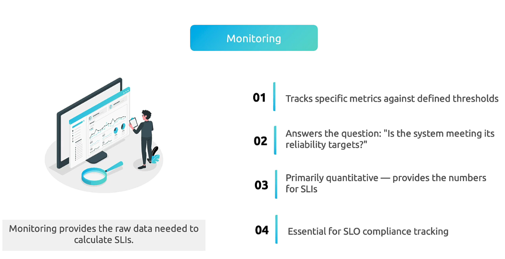

**Observability** tells you *why* you are sick. It provides the tools to ask arbitrary questions about system behaviour, including questions you didn't think to ask before the incident. Observability requires instrumentation that goes beyond pre-defined metrics.

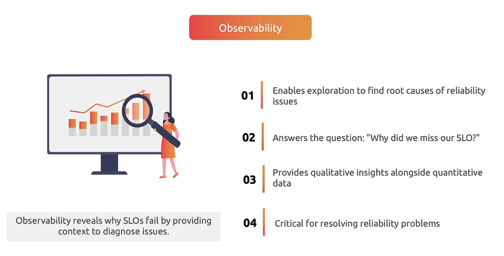

A production system needs both: monitoring for detection and alerting; observability for diagnosis and RCA. Monitoring without observability means you know something is wrong but not why. Observability without monitoring means you have rich data but no one is watching it.

### The Three Data Types for Measuring Reliability

There are three complementary data types that together give you complete visibility into system behaviour:

**Metrics — What's happening right now?**

Metrics are numerical time-series measurements sampled at regular intervals. They are aggregated across instances (all pods, all regions) and stored efficiently for long time ranges. Metrics are the foundation of SLI measurement, SLO dashboards, and capacity planning.

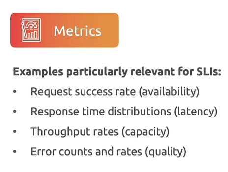

**Traces — Where did it go wrong?**

Distributed traces follow a single request as it travels through multiple services, recording the timing and outcome of each service call. Traces are essential for diagnosing latency issues in microservices architectures, where a slow p99 response might be caused by one slow call in a chain of 10 service hops.

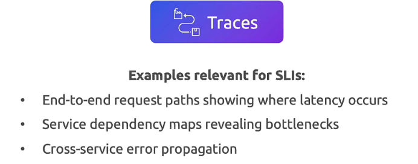

**Logs — What happened, in detail?**

Logs provide the detailed, per-event record of what the system was doing. They are the primary tool for understanding *why* a specific request failed and for diagnosing the cause of SLO violations. Structured logs (JSON with consistent fields and correlation IDs) are dramatically more useful than free-form text logs.

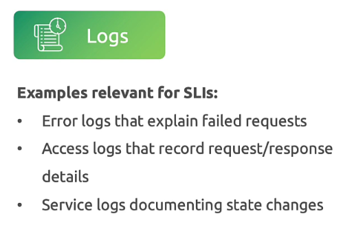

### The Four Golden Signals

The four golden signals, from the Google SRE book, are the minimum set of metrics every service should monitor. If you instrument nothing else, instrument these:

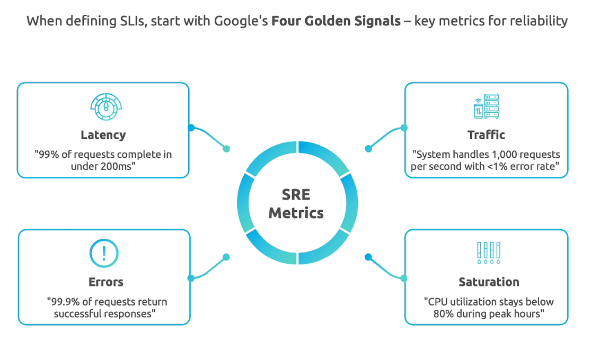

| Signal | What it measures | Typical SLI form | Why it matters |
|--------|-----------------|-----------------|----------------|
| **Latency** | Time to serve a request | p99 < 300ms | Slow != broken, but slow is a user experience failure |
| **Traffic** | Demand on the system | Requests/second | Baseline for all other signals; anomalies indicate problems |
| **Errors** | Rate of failed requests | Error rate < 0.1% | Directly measures user-facing failures |
| **Saturation** | How "full" the service is | CPU/memory/queue utilisation | Leading indicator: high saturation precedes errors and latency |

**Critical note on latency:** Always measure latency at multiple percentiles — never just average. A service with a p50 of 50ms and a p99 of 5000ms has an "average" that looks acceptable but is failing 1% of users severely. Averages hide the tail; percentiles reveal it.

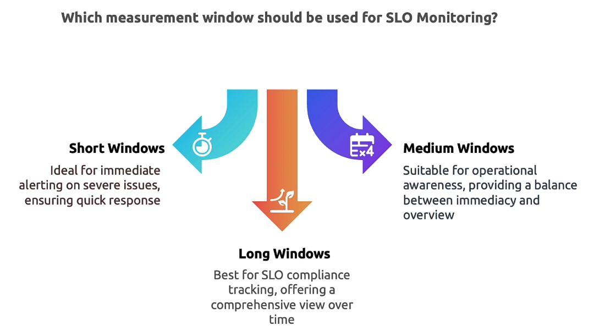

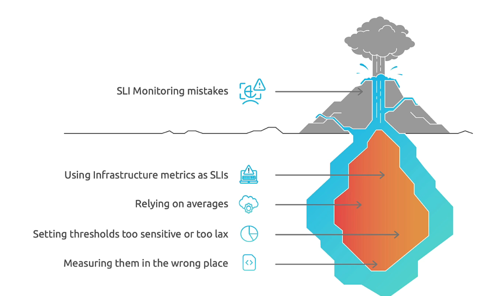

---

## Implementing SLIs

Choosing the right SLIs is more important than choosing the right targets. An SLI that doesn't correlate with user experience is noise — it will fire on things users don't care about and miss things they do.

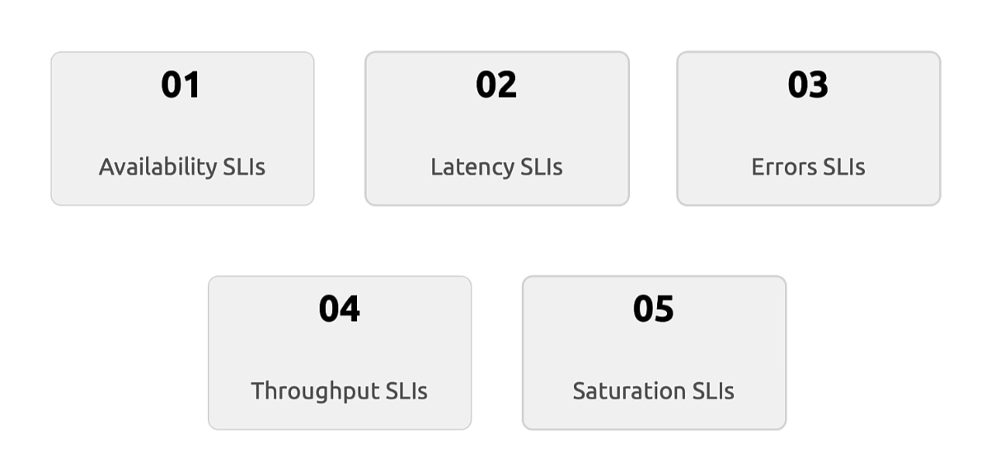

Guidelines for choosing good SLIs:

1. **Measure from the user's perspective** — Measure at the load balancer or API gateway level, not inside the service. Internal metrics (JVM heap, database cache hit rate) are useful for diagnosis, but user-facing metrics are the right SLI basis.
2. **Choose metrics that are stable under normal conditions** — An SLI that fluctuates by 5% naturally will produce noisy SLO burn rate calculations. Use longer averaging windows or more stable metrics.
3. **Cover all user-visible failure modes** — A latency SLI and an availability SLI together catch more user pain than either alone. A service can be "available" but so slow that it's effectively unusable.

Once you have identified which SLI type you need, select the PromQL queries that will measure it:

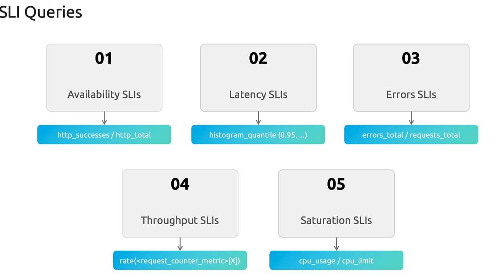

### Availability SLI

Availability measures the proportion of requests that succeeded. It is the most fundamental SLI and is appropriate for almost every service.

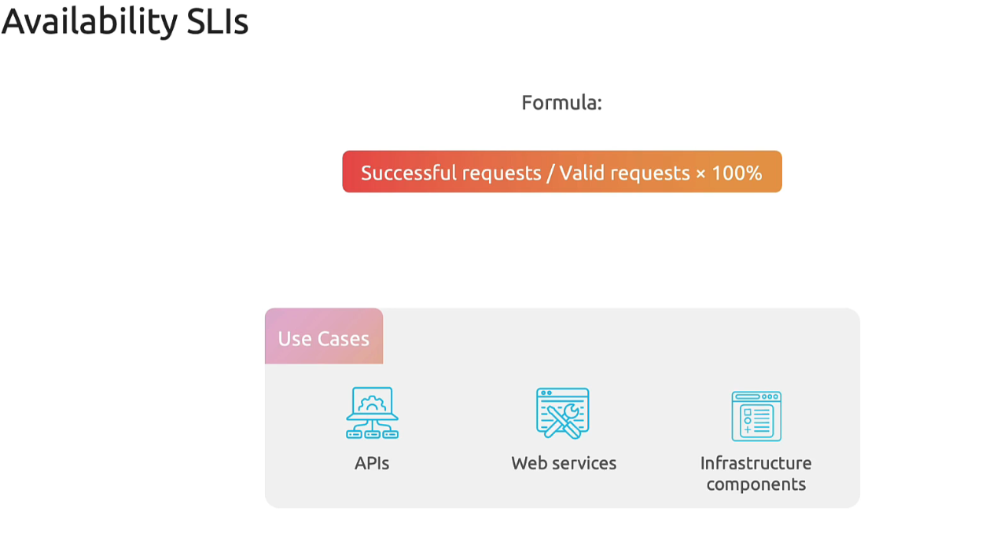

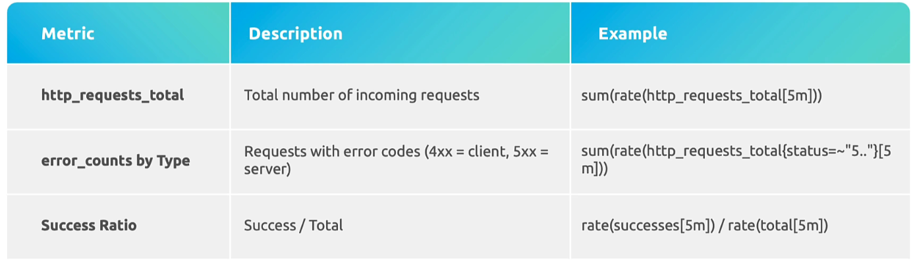

```promql
# PromQL: Availability SLI for HTTP services
# Measures: what % of requests returned a non-5xx status code
# Adjust the 'job' label to match your service's Prometheus labels

availability_sli = 
  sum(rate(http_requests_total{job="payment-api", status!~"5.."}[5m]))
  /
  sum(rate(http_requests_total{job="payment-api"}[5m]))

# Alert when availability drops below 99.9% over a 5-minute window:
# availability_sli < 0.999
```

## Availability vs Allowed Downtime — Reference

| Availability | Allowed Downtime per Day | per Week | per Month (30 days) | per Year |
|--------------|--------------------------|----------|----------------------|----------|
| **99% (Two nines)**      | **14m 24s**        | **1h 40m 48s** | **7h 18m**         | **3 days 15h** |
| **99.9% (Three nines)**  | **1m 26s**         | **10m 4s**     | **43m 12s**        | **8h 45m** |
| **99.99% (Four nines)**  | **8.6 seconds**    | **1 minute**   | **4m 32s**         | **52m 34s** |
| **99.999% (Five nines)** | **0.86 seconds**   | **6 seconds**  | **26 seconds**     | **5m 15s** |

```
# Formula for allowed downtime
Allowed downtime = (1 - Availability%) × Total period in minutes

# Example: 99.99% availability over 30 days
Allowed downtime = (1 - 0.9999) × (30 × 24 × 60) = 0.0001 × 43,200 = 4.32 minutes
```

### Latency SLI

Latency measures how long it takes to service a request. Latency SLIs are typically defined at a specific percentile (p95, p99) to capture the experience of the majority of users, including those in the slow tail.

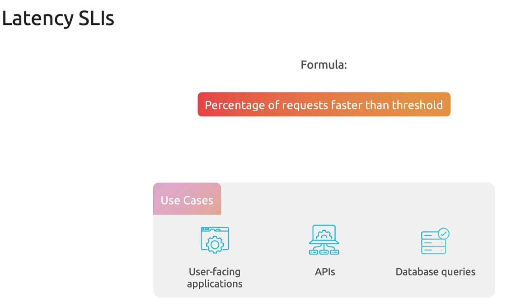

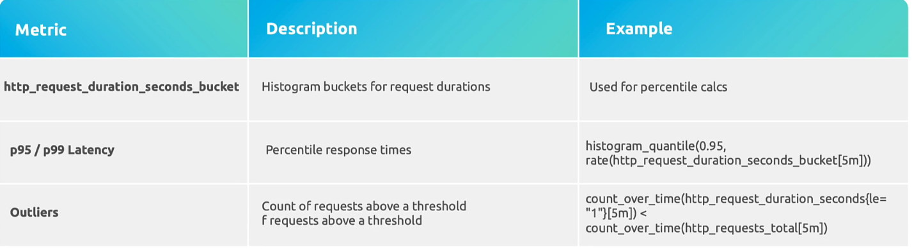

```promql
# PromQL: Latency SLI at the 99th percentile
# Measures: what % of requests were served in under 300ms (the SLO threshold)
# Uses histogram_quantile on the Prometheus histogram metric

latency_sli =
  sum(rate(http_request_duration_seconds_bucket{
    job="payment-api",
    le="0.3"         # 300ms threshold — adjust to your SLO
  }[5m]))
  /
  sum(rate(http_request_duration_seconds_count{job="payment-api"}[5m]))

# Alert when less than 95% of requests are served within the latency SLO:
# latency_sli < 0.95
```

### Error SLI

The error SLI measures the rate of requests that return errors. It is a direct proxy for user-facing failures and is often the most sensitive indicator of a production problem.

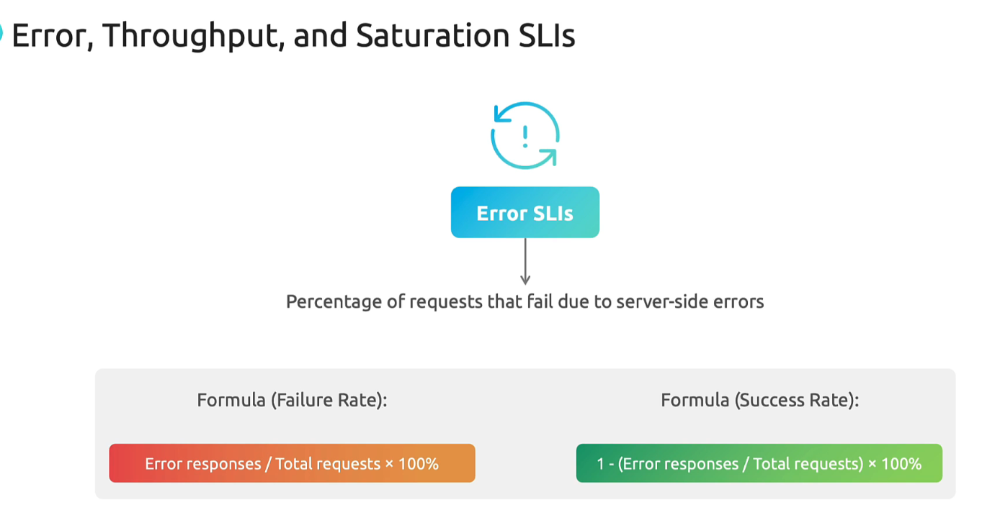

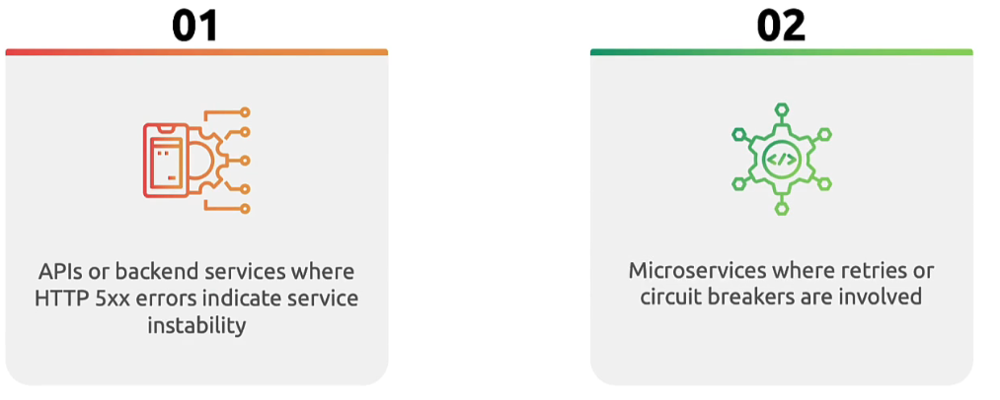

```promql
# PromQL: Error rate SLI
# Measures: what % of requests returned an error (5xx HTTP status)
# A low error rate means most requests are succeeding

error_sli =
  1 - (
    sum(rate(http_requests_total{job="payment-api", status=~"5.."}[5m]))
    /
    sum(rate(http_requests_total{job="payment-api"}[5m]))
  )

# This expresses error rate as a "good request" ratio, same form as availability SLI
# Alert when error_sli < 0.999 (more than 0.1% of requests are errors)
```

### Throughput SLI

Throughput measures whether the system can handle the request volume it is receiving. A throughput SLI is appropriate for batch-processing systems, streaming pipelines, and data ingestion services where the primary concern is whether messages/events are being processed fast enough.

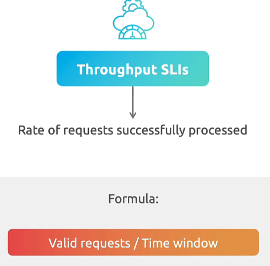

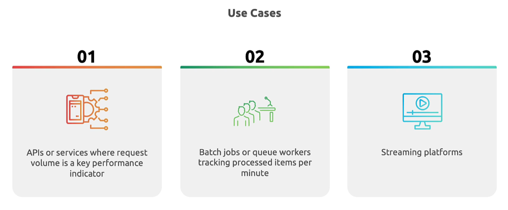

### Saturation SLI

Saturation measures how close the system is to its resource limits. Unlike the other SLIs, saturation is a **leading indicator** — high saturation predicts future errors and latency degradation before they become visible to users. This makes saturation metrics valuable for capacity planning and proactive alerting.

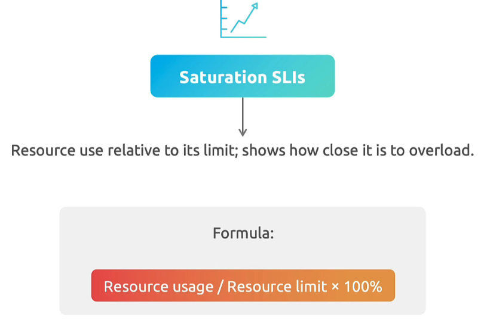

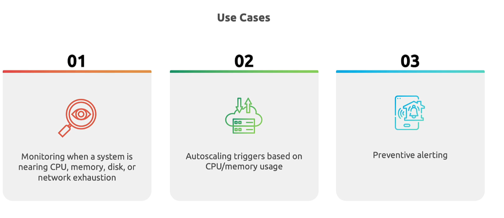

```promql
# PromQL: Thread pool saturation SLI
# Measures: what % of the time is the thread pool below 80% utilisation
# High saturation (>80%) is a leading indicator of queuing and latency growth

saturation_sli =
  sum(rate(thread_pool_active_threads{job="payment-api"}[5m]))
  /
  sum(thread_pool_max_threads{job="payment-api"})

# Alert when saturation > 0.8 for more than 5 minutes
# saturation_sli > 0.8
```

---

## SLO Game

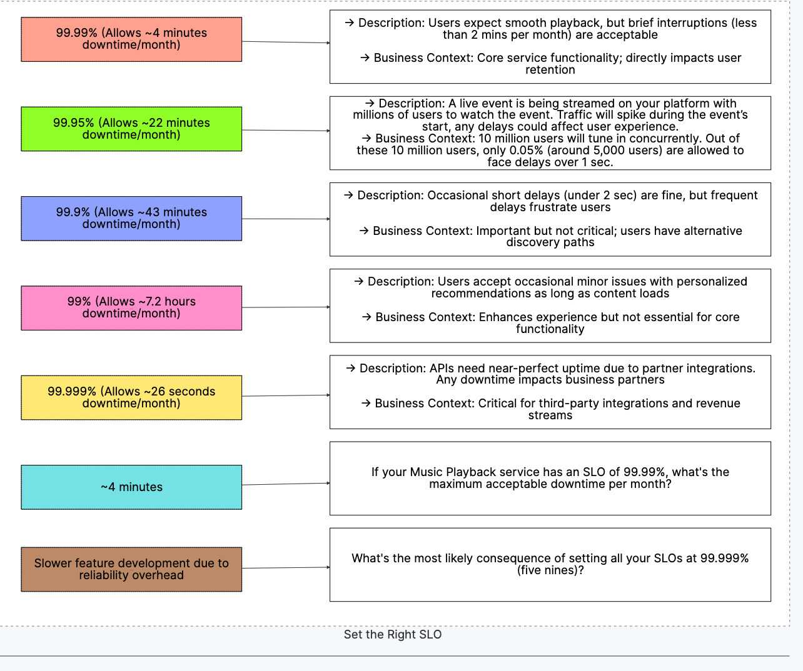

SLO setting is a negotiation, not a calculation. The SLO game involves finding the right point on the reliability-velocity trade-off curve for each service. Setting SLOs too tight freezes engineering velocity; setting them too loose means users experience poor quality without a systematic response. The right SLO is tighter than what users would tolerate for long and looser than what requires unsustainable engineering investment to maintain.

A practical approach: start with the current measured performance, subtract a small margin (e.g., if you're currently at 99.95% availability, start your SLO at 99.9%), and commit to tightening it as the system matures.

---

## Implementing Error Budgets

An error budget is the operationalisation of risk tolerance: it converts the SLO into a quantity of unreliability that is "allowed" over the measurement window. It is the trade-off mechanism between reliability and development velocity.

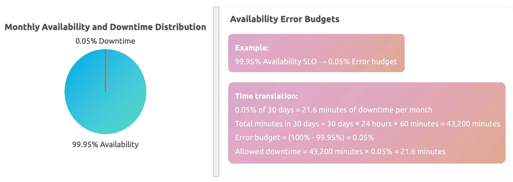

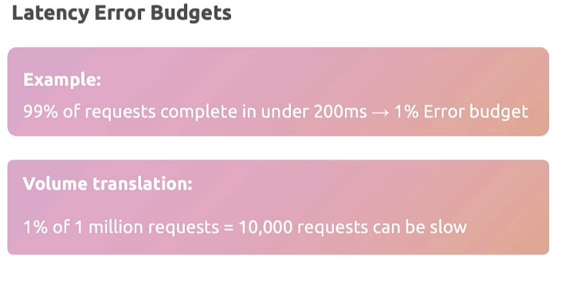

The error budget is calculated as:

```
Error budget = (1 - SLO target) × measurement window

Example: SLO = 99.9% availability, 30-day window
  Error budget = (1 - 0.999) × 30 × 24 × 60 minutes
               = 0.001 × 43,200
               = 43.2 minutes of allowed downtime per month

  If you've already had 30 minutes of downtime this month,
  you have 13.2 minutes remaining.
```

### Error Budget Policy

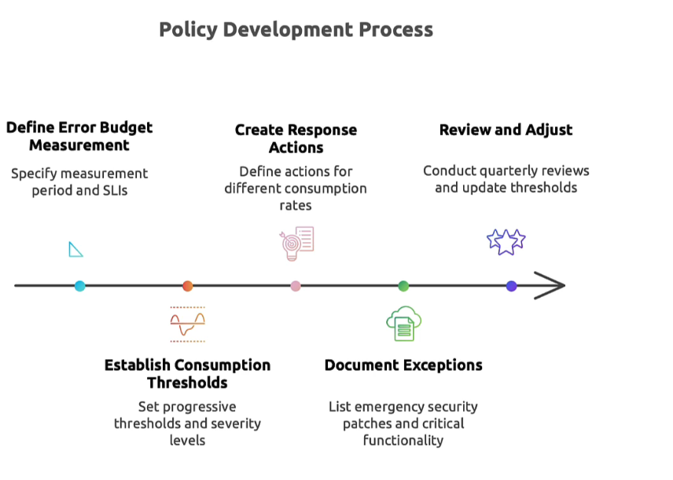

An error budget without a policy is just a metric. The policy is what gives the budget operational meaning. A standard error budget policy defines:

- **If budget is > 50% remaining:** Engineering teams may ship features at normal velocity.
- **If budget is 25–50% remaining:** Increase monitoring cadence; prioritise reliability work in the next sprint.
- **If budget is < 25% remaining:** Freeze non-critical releases; focus engineering time on reliability improvements.
- **If budget is 0% (depleted):** All releases freeze until the next measurement window begins. Engineering resources are redirected to reliability until the root cause is addressed.

This policy should be agreed upon by product and engineering leadership *before* it is needed — making the decision during a budget crisis is too slow and too emotional.

```promql
# PromQL: Error budget burn rate
# Measures how fast the error budget is being consumed
# A burn rate of 1 = exactly on track; 14.4 = will exhaust budget in 2 hours

error_budget_burn_rate =
  (
    1 - sum(rate(http_requests_total{status!~"5.."}[1h]))
        /
        sum(rate(http_requests_total[1h]))
  )
  /
  (1 - 0.999)    # Denominator is (1 - SLO target)

# Alert when burn rate > 14.4 (will exhaust 30-day budget in 2 hours)
# This is the "fast burn" alert from Google's SLO book
```

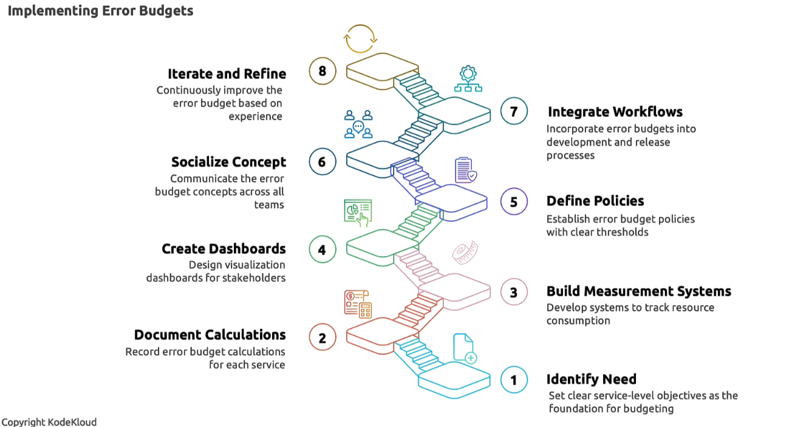

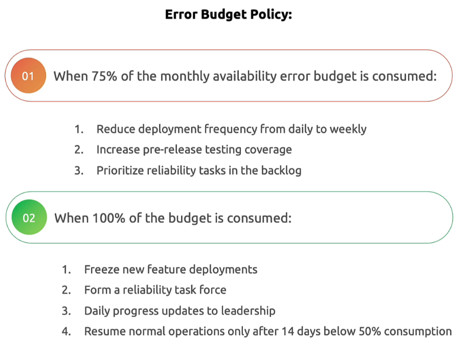

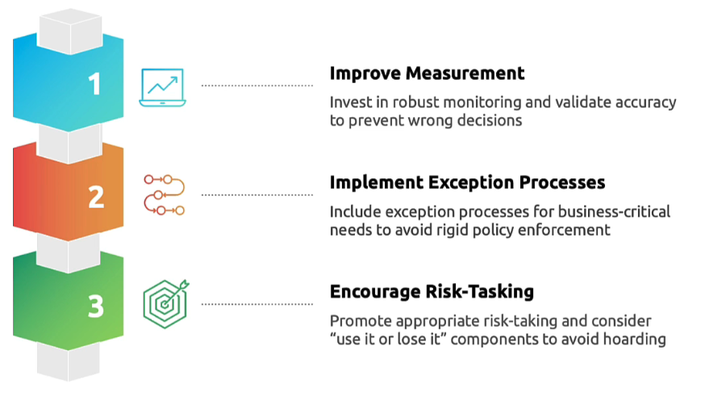

---

## Visualisation Measurements

An effective SLO dashboard is not a wall of metrics — it is a structured view that answers specific questions at a glance, without requiring the viewer to understand PromQL.

### Effective SLO Dashboard Design

**Focus on the user first.** Every panel on the primary SLO dashboard should reflect something a user experiences, not something an engineer monitors:
- Primary panels show user-facing SLIs (error rate, latency percentiles, availability)
- Clear visual indication of SLO compliance status (green/yellow/red at the top)
- User journey success rates for critical paths (e.g., "checkout success rate," "login success rate")

**Implement visual hierarchy:**

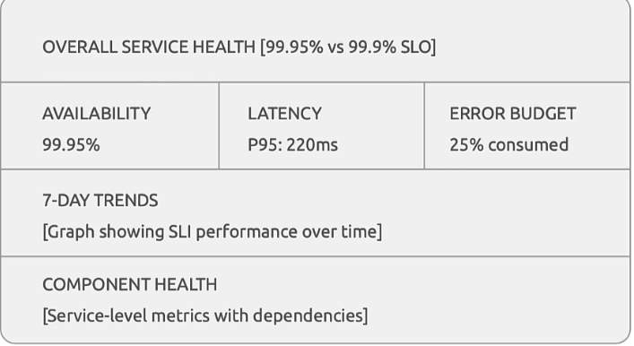

**Use colour strategically.** Colour should encode meaning, not aesthetics:
- **Green:** Comfortably meeting SLO (error budget consumption < 50%)
- **Yellow:** Within SLO but trending toward threshold (budget consumption 50–80%)
- **Red:** SLO violation or budget nearly exhausted (consumption > 80%)

**Include error budget visualisations.** The error budget panel is the most important panel on the SLO dashboard for decision-making:
- Total error budget for the current measurement period
- Current consumption percentage (e.g., "37% consumed, 63% remaining")
- Current burn rate (e.g., "1.2x — on track to exhaust in 28 days")
- Projected depletion date at current burn rate

**Include contextual information:**
- SLO targets clearly labelled on each chart (a horizontal dashed line)
- Time window of measurement ("Rolling 30 days" vs. "Calendar month")
- Links to incident response procedures and runbooks
- Service dependency status (is the database healthy? Is the cache hit rate normal?)

---

## Common Pitfalls

**SLIs that don't correlate with user experience.** An SLI based on internal health check endpoints measures whether the service can respond to a trivial request, not whether it can handle real user traffic correctly. Measure at the load balancer or service mesh level, not at the internal health endpoint.

**Measuring latency with averages.** The average latency of a service with a bimodal distribution (most requests fast, some requests very slow) looks fine even when 1% of users are experiencing 10-second response times. Always use percentiles (p95, p99); never use averages as SLIs.

**Setting the SLO to current performance.** If your service is currently running at 99.7% availability and you set your SLO at 99.7%, you have no error budget — every minor blip consumes the budget. Set the SLO slightly below current performance to give yourself operational headroom.

**No error budget policy.** An error budget without a documented, agreed-upon policy (what happens when it's depleted?) is a number on a dashboard that no one acts on. Write the policy before you need it.

**Measuring SLIs over too-short windows.** A 1-minute error rate SLI will fire on every transient blip. A 30-day rolling window smooths over small incidents. Use short windows for alerting (fast burn detection); use long windows (28–30 days) for SLO compliance measurement.

**Not versioning SLI queries.** SLI queries change over time (metric names are renamed, labels change, new endpoints are added). If the query changes without documentation, your SLO history becomes inconsistent and comparisons across time periods are invalid. Version SLI queries in source control.

---

## Interview Questions

1. **What is the difference between an SLI, SLO, and SLA? Give concrete examples for a ride-sharing service.** (SLI: % of ride-matching requests that succeed within 500ms. SLO: 99.5% of requests meet this threshold over 30 days. SLA: 99% monthly uptime or credits apply.)

2. **What are the four golden signals and why are they the minimum instrumentation for any service?** (Latency, traffic, errors, saturation. Each catches a different class of failure; together they cover the full user experience surface.)

3. **Why is p99 latency a better SLI than average latency?** (Averages hide tail behaviour. 1% of users experiencing 10-second responses is a serious problem that an average of 200ms would mask.)

4. **Explain error budget burn rate alerting. What does a burn rate of 14.4x mean?** (The service is consuming its monthly error budget 14.4x faster than sustainable; at this rate, the monthly budget will be exhausted in 2 hours.)

5. **Your team's error budget is depleted with 10 days left in the month. What happens under your error budget policy?** (Releases freeze, reliability work is prioritised, root cause is investigated and fixed before the next window.)

6. **How do you choose between measuring availability at the load balancer vs. at the application vs. at the client?** (Client-side is most accurate from the user's perspective but harder to instrument. Load balancer is the most practical and captures most failure modes. Internal application metrics miss network failures.)

---

## Key Takeaways

- **SLIs measure user experience; SLOs are targets on SLIs; SLAs are contracts on SLOs.** Each layer adds accountability and consequence.
- **The four golden signals (latency, traffic, errors, saturation) are the minimum instrumentation** for any production service. If you instrument nothing else, instrument these.
- **Metrics, traces, and logs are complementary, not competitive.** Metrics detect and alert; traces locate the bottleneck; logs explain the cause. You need all three for effective observability.
- **Always use percentiles for latency SLIs, never averages.** Averages hide tail behaviour that represents real user pain.
- **The error budget converts reliability targets into an operational tool.** It provides a shared, quantitative basis for the velocity vs. reliability trade-off conversation.
- **Error budget policies must be written before they are needed.** The policy converts the budget from a dashboard metric into an actionable governance mechanism.
- **SLO dashboards should answer business questions, not just display metrics.** "Are we meeting our SLO?" "How much budget remains?" "At the current burn rate, when will the budget be exhausted?" These are the questions the dashboard must answer instantly.

