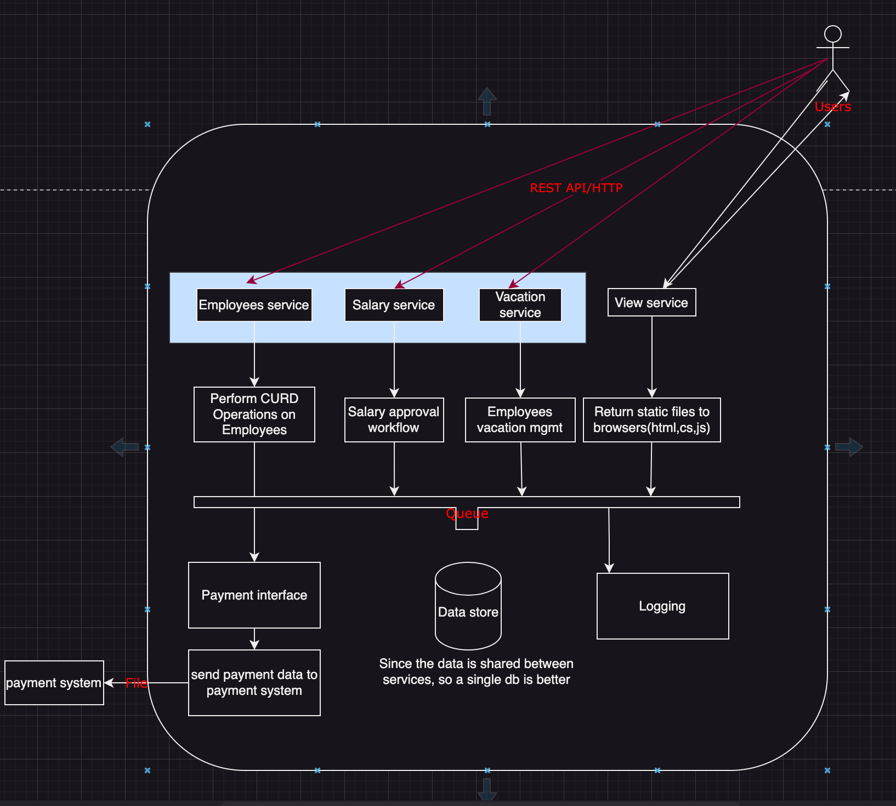

In this we are designing case study for papersource, that sells paper supplies. i.e Printer paper, Envelopes.. etc. They also need a new HR system, which manages salaries, vacation, payments for the employees. 

## Requirements

### Functional 

What system should do ?

- Web based
- CURD operations
- Manage salaries
    - Allow manager to ask for emplyess salary chage
    - Allow HR manager to approve/reject request
- Manage vacation days
- Use external payment systems

### Non functional

what the system should deal with ?

1. what type of system (classic, legacy, cloud)
2. Not a lot of users
3. Not a lot of data
4. Interface to external system (i.e)

**Questions**

You must be getting these details from the customer/users

- how many concurrent users - 10
  
- How many employees ? - 250

- What we know abt external payment system ?
  
    legacy hosted system in company farm received input files monthy once for processing payment informations.

    **Data volume calculations**

    1 Employess = 1MB 
    
    Each employess has ~10scanned documents(contract, reviews, etc) i.e each employee has 51MB docs.
    As company expected to grow, 500 in 5 yrs, 51MB*500 = 25.5GB

- What about criticality of the system ?
  
    HR based system, not very critical

so finally, we have these below as non-functional requirments

```
10 Concurrent users
Manage 500 users
25.5 GB of data volume forcast
Not mission critical 
file-based interface
```

### Component mapping

Based on function requirements, it would be good practice to **map single component to single service** for managing and maintaining. 

```
Entities: Employee, Vacation, Salary
Interface to payment system
```



### logging services

Questions to be asked for logging service.

  - Are there any logging service used in the company at present ? Client: No
  - Any 3rd party ? we can choose, ELK, but its quite complex and resources are needed to operate and maintain.
    since, our application is not being used so much, we can develop our own logging mechanism
  - Should we need to develop our own logging  ?  Architect: Yes

How would you decide for developing own logging mechanism ?

- Application type(what it does)
    - read log records from queue
    - validate the records
    - store in the data store
  
- Alternatives
    - Webapp app or webAPI - No
    - Mobile app - No
    - Console - yes
    - Service - yes
    - Desktop App - No
  
### Technology stack

- what should code do here ?
    - Access Queue API
    - validate the data
    - store the data

**- Architecture**

- 3 layer architecture
- UI/Service interface: Not required for logging
- Business logic: validate the records (polling)
- Data access: saves validated records into data store

- logging redunancy 
if there are any crash for logging, you need to have another service that would detect. 

always have 3 instances of logging service to replicate that helps you to log. (active-active)

we must use method called **is-alive** which will check for the active instances and if it gets reponse it would not log, incase if that doesn't get any reposnse after waiting for some period of time, it would consider that the service is down and new leader would be elected. 


### view service

Get request from end users browsers and return static content (html, css, js) which after that access service like employee, vacation, salary data.

- Applicatio type(what it does)
  - Webapp & Web API - yes
  - Mobile app - No
  - Console - No
  - Service - No
  - Desktop App - No

- Technology stack(For)
  - .NET Core 

- Architecture 

Since this is only service the static content between the user and the service, we would only have UI

UI/Service interface: UI 
Business/application logic: No 
Data access: No

- view service redunancy
we use **load balancer** to view service so it would have balance traffic and security as well.

### Employee service

Allows end users to query employee's data and perform CURD ops, but it does't display as its `view` service.

- Applicatio type(what it does)
  - Webapp & Web API - yes
  - Mobile app - No
  - Console - No
  - Service - No
  - Desktop App - No

- Technology stack(For)
  - .NET Core 
  - Emloyee data(relational db) - Microsoft SQL - since the documents are around(~1MB) it would be good. since we also use .NET
  - Employee documents storage (relational DB, file system,object,cloud storage)
  
- Architecture
  - Employee API : create an **API** for employee service
    - get full emp details by ID `GET /api/v1/employee/{id}`
    - list of employees by parameters `GET /api/v1/employees?name=..&birthdate=..`
    - add employee `POST /api/v1/employee`
    - update employee details `PUT /api/v1/employee/{id}`
    - remove employee(don't remove record, mark it as removed) `DELETE /api/v1/employee/{id}`

  - Document API: get list of docs for the employees
    - Add document `POST /api/v1/employee/{id}/document`
    - Remove document `DELETE /api/v1/employee/{id}document/{docid}`
    - Get document `GET /api/v1/employee/{id}/document/{docid}`
    - Get documents by parameters `GET /api/v1/employees/{id}/documents`

- employee service redunancy
    use **load balancer** for service redunancy

### salary service

- Allow managers to ask for an employee's salary change
- Allows HR to approve/reject the request

- Applicatio type(what it does)
  - Webapp & Web API - yes
  - Mobile app - No
  - Console - No
  - Service - No
  - Desktop App - No

- Technology stack(For)
  - .NET Core 

- Architecture
    Salary **API** request
    - Add salary request ```POST /api/v1/salaryRequest/```
    - Remove salary request ```DELETE /api/v1/salaryRequest{id}```
    - Get salary request `GET /api/v1/salaryRequests`
    - Approve salary request `POST /api/v1/salaryRequest/{id}/approval`
    - Reject salary request `POST /api/v1/salaryRequest/{id}/rejection`

- salary service redunancy
    use **load balancer** for service redunancy

### vacation service
- Allows employees to manage their vacation days
- Allows HR to set available vacation days for employees

- Applicatio type(what it does)
  - Webapp & Web API - yes
  - Mobile app - No
  - Console - No
  - Service - No
  - Desktop App - No

- Technology stack(For)
  - .NET Core 

- Architecture
    Vacation **API** request
    - set available vacation days(HR) `PUT /api/v1/vacation/{empid}`
    - Get available vacation days(Employee) `GET /api/v1/vacation/{empid}`
    - Reduce vacation days(Employee) `POST /api/v1/vacation/{empid}/reduction`

- vacation service redunancy
    use **load balancer** for service redunancy

### payment interface service
- Queries the db once a month for salary data
- passes payment data to the external payment system

- Applicatio type(what it does)
  - Webapp & Web API - No
  - Mobile app - No
  - Console - No
  - Service - Yes
  - Desktop App - No

- Technology stack(For)
  - .NET Core 

- Architecture
    you need to use the **timer** as the application logic for triggering the job. 

- Payment interface redunancy
    use **is-alive** parameter between instance services of payment interface.. 

### Queue - Tech stack
Choose as to which Queue service you need to use for your application. 

- **RabbitMQ**: General purpose message-broker engine, which is easy to setup and use

- **Apache Kafka**: Stream processing platform, which is more used in extensive data intrensic scenerios. 

In our this case, since nothing is involved in the streaming platform, we can choose `RabbitMQ`
