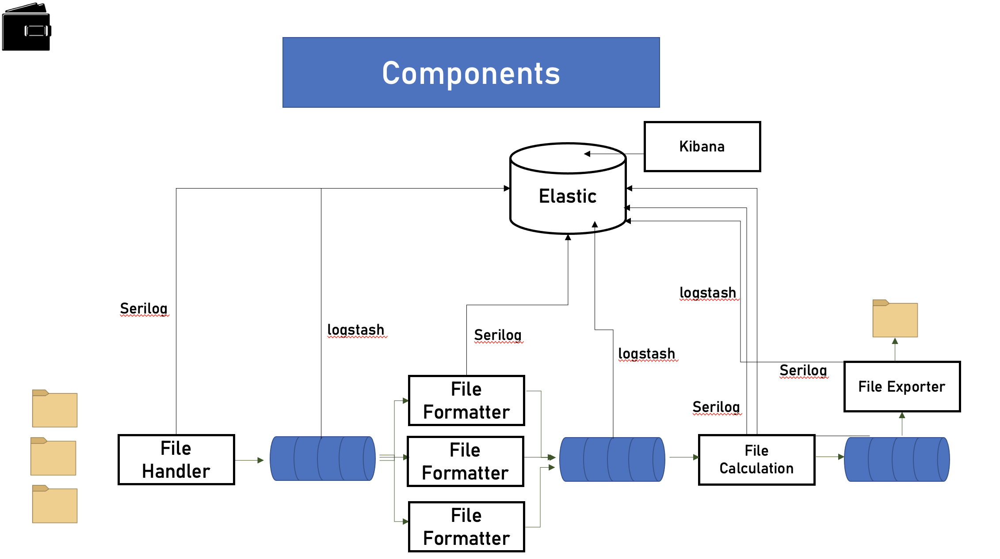
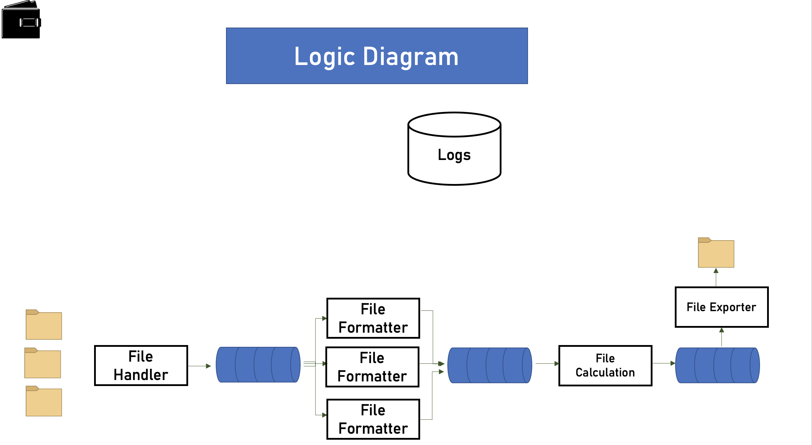
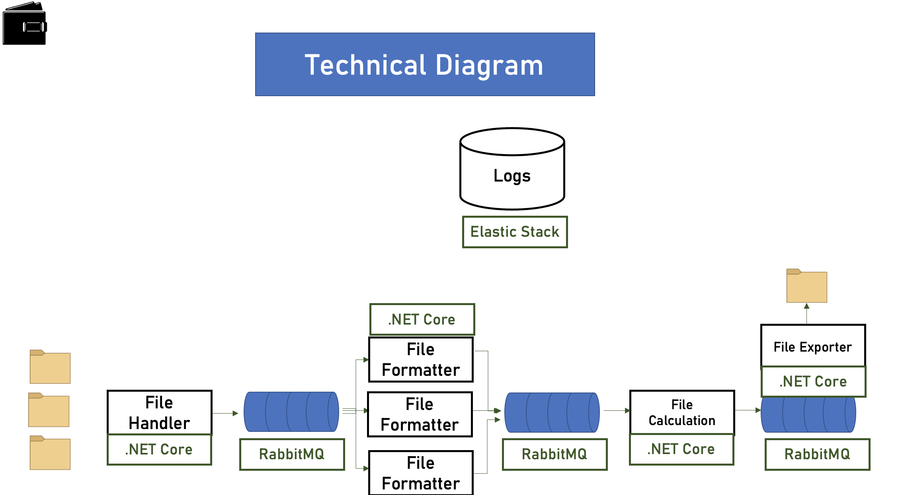
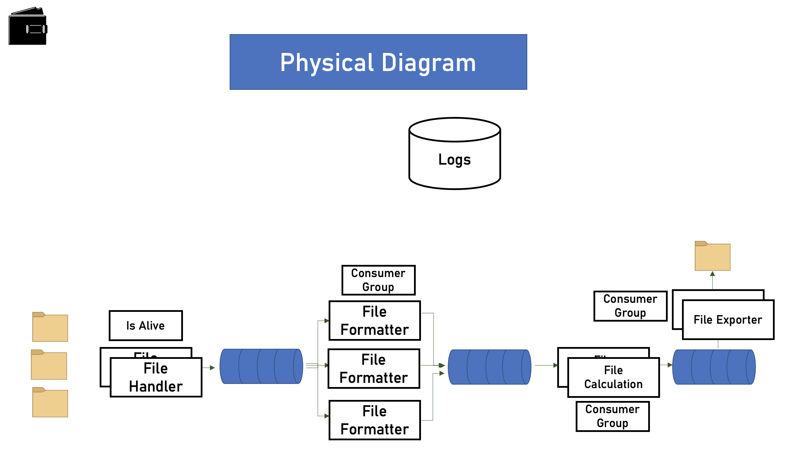

In this case study, we are studying about the payroll. Basically, payroll designs and builds payment processing system and what the system does is it **receives files from various sources**, mainly companies that want to pay their employees. 

The payroll **system validates and processes the files** and then sends instruction files to the banks in order to execute the actual payment. Now, one very important aspect of the payroll system is that it must be fully **automatic**, reliable and very quick. 

Note: there shouldn't be any human interaction while processing the file

## System Requirements

### functional 

What should system do ?

- receives files from various sources
- validates and processes the files
- work with various file formats
- perform various calculations on the file
- create bank payment file 
- put payment file in a designated folder
- keep the log file for 7 years

### non-functional

Questions to ask customers ?

1. How many files are we going to get each day?
sol: 500 

2. Any limitation on the latency of the process?
sol: 1 min

3. what is avg size of file ?
sol: 1MB

4. can we tolerate data loss ?
sol: No

**Data volume**

1 file = MB 
500 file = 500MB 
~182GB/year
~1.3TB/7 years

the space for the log file for 1 min procssing time

~ 500KB log data
~ 500 file/day = 250MB log data/day
~ 91GB log data/year
~ 638GB log data/ 7 years

## Map the components

- Passes payloads from logic unit to another.
- Balances load.
- Persists messages. (Durability!)

**Queue provides async**, since we don't have any UI also the components are not waiting for any response, we would always use queue. 

So there are 2 queues to select 

1. RabbitMQ  - This is Genral purpose and very easy to setup. this is not suitable for streaming services. 

2. Kafka - Great for streaming services, high load systems, but very complex to setup. 

In this scenerio, we would use RabbitMQ as this is not a streaming servies also easy setup..

## File handler

- Pulls payment files from folders
- Put the files in the queue

### Application Type

- Web App & Web API - no
- Mobile App - no
- Console - yes
- Service - yes
- Desktop App - No

### Technology stack 

- Should be able to pull files from folders
- Should be able to connect to queue

Would you want to ask the customer regarding the technology they know or they use or team using etc ..

incase we would want to suggest, here is what it is ..

- performance
- community
- cross platform
- easy to learn 
- evolving
- great threading support

from above, we could either use **java or .net core**

### Architecture

3 layered arch

- service interface: yes
- Business logic : yes
- Data Access: yes 
- Data store: yes

File watcher, topic is selected by the file location, monitor the zip folder, put into the folder. 

### Redunancy

two of the file handler keeps shaking to check for liveness ..etc

## File Formatter

- received files from its specific topic
- validates and formats the file to unified format
- puts the new file in quwue
- new formaters will be developed for new file

### Application Type

- Web App & Web API - no
- Mobile App - no
- Console - yes
- Service - yes
- Desktop App - No

### Technology stack 

Its same as the previous one, java or .net core. no need for any other specifics.

### Architecture

2 layered arch

- Queue receiver: yes
- Business logic: yes, store file in queue

### Redunancy

consure group itself would be availble to deal with traffic, hence no extra work needed to work.

## File calculations

- Receives file from queue
- performs some calculations
- puts new file in queue

### Technology stack 

Its same as the previous one, java or .net core.

### Architecture

2 layered arch

- Queue receiver: yes
- Business logic: yes, store file in queue

### Redunancy

consure group itself would be availble to deal with traffic

## File exporter

- receives file from queue
- put trhe file in bank's folder

### Technology stack 

Its same as the previous one, java or .net core. no need for any other specifics.

### Architecture

2 layered arch

- Queue receiver: yes
- Business logic: yes, store file in queue

### Redunancy

consure group itself would be availble to deal with traffic

## logging service

- write log of records
- allow easy visualizations and analytics
- Preferrably, based on existing platform. 

you can use elk component for log storage and visualizations. 

You can use serilog to transport file to the elastic db. from queue, you can send the data using logstash.
beats or .... would be used to send the data to the elastic. 

## arch diagrams

### logic 

### technical

### physical

