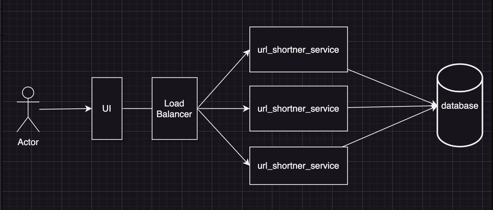

## Functional 

- Get the long url and shortern it
- On clicking, it must be re-directed to the long url

## Non functional 

- very low latency
- HA 

**Questions**

- What's the traffic generated for the long urls 
- what kind of the length should I need to keep for shorturl
- what's the duration of the shorturl ?

let's say you have 'x' requests for a year, then you would have traffic around 

x*60*60*24*365 days = y 
based on the value of 'y' you would then be required to choose the length of the short url which contains 
A-z, a-z, 0-9 which are 62 characters.. 

i.e 62^5 or 62^6 would provide around 3.5billion combinations..

since you have LB, the request can be moved to any of the services.. which ideally means our short url can be duplicated with the same alpha numbers.. i.e ideally you could have 2 same short urls for the long ones which is incorrect..

so we can use an `redis` so that it would assign a unique way of assigning the requests.. but what if the redis goes down, it would forget the tokens that are created and will start from afresh which defeats our purpose.  

so we are using `service token` in sitting on the mysql.. we could be assigning some range for every url_shortner_node so that it would assign token starting from their defaults, solving our problems..

## logging

Implement the logger service for analytics.. once we get response from the user, we would can add additional fields to the reponse like, country orgin, platform, ip address etc which can be used for tracking purpose.. 

we can send the log to write into kafka async where it would miss few of the requests, but since this is not payment related it should be okay gradually .. we still should avoid kafka as it is IO bound ops and we could lose the latency as we stated in the non-functional requirement. Instead we could use a local logger and aggregate all the logs and write at once to kafka, which improves IO but if the service is gone, we would lose all the logs at once. it would be better to check with the customer on this design requirement. 

