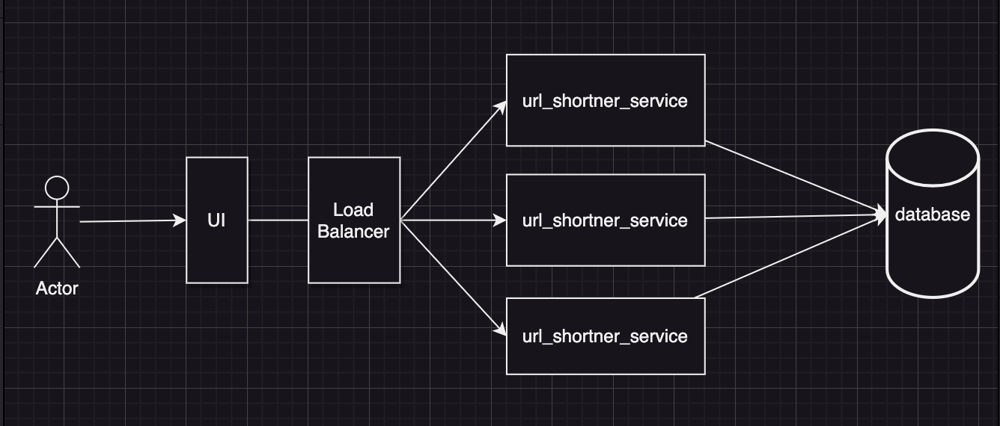
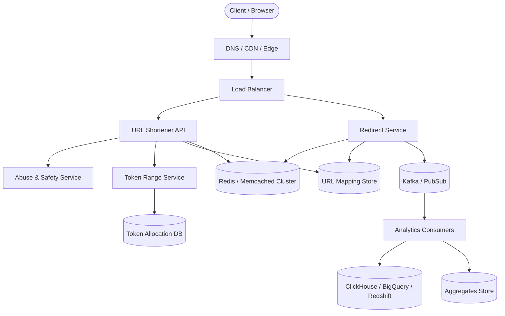
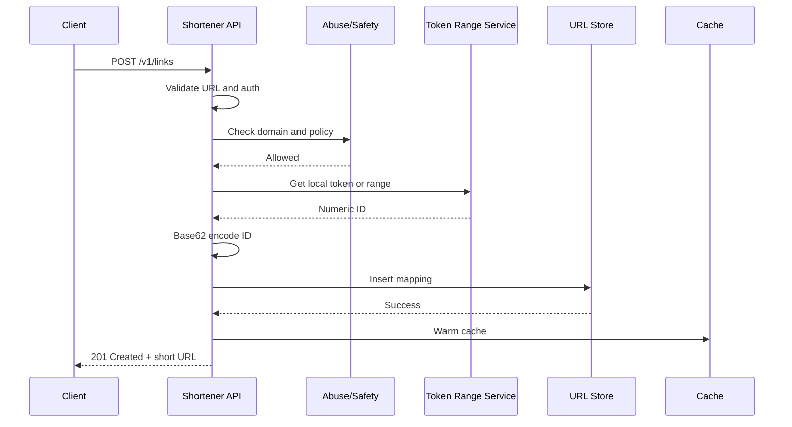
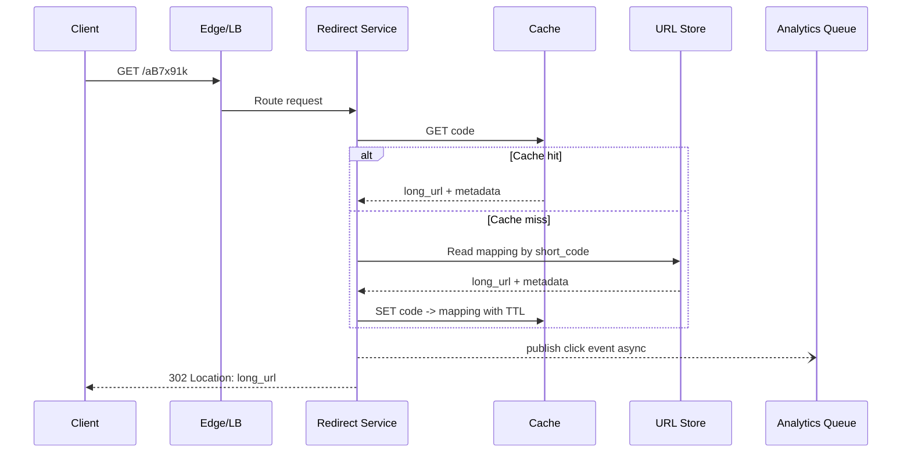
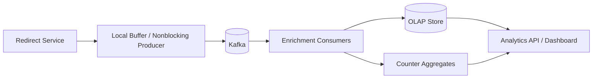

# URL Shortener System Design

## TL;DR

A URL shortener maps a long URL to a compact code such as `sho.rt/aB7x91k`, stores that mapping durably, and serves redirects at very low latency. The write path creates and validates links. The read path is the business-critical hot path: resolve `code -> long_url`, return a redirect, and record analytics without slowing the user down.

The hardest parts are:

- generating globally unique short codes across many service instances;
- keeping redirects fast during high read traffic;
- scaling storage as mappings grow into hundreds of billions of rows;
- collecting analytics asynchronously;
- protecting the platform from spam, abuse, phishing, and enumeration.

---

## Scope

### In scope

- Create a short URL from a long URL.
- Redirect short-code requests to the original URL.
- Support optional custom aliases.
- Support link expiration.
- Track basic click analytics.
- Rate-limit link creation and abusive redirect traffic.

### Out of scope unless requested

- Full marketing campaign management.
- Branded domains for every customer.
- Deep user segmentation and real-time analytics dashboards.
- Malware scanning engines built in-house.
- Payment, billing, and enterprise account management.

---

## Functional Requirements

- `POST /v1/links` accepts a long URL and returns a short URL.
- `GET /{code}` redirects the caller to the original URL.
- Users can optionally provide a custom alias, such as `/summer-sale`.
- Users can optionally set `expires_at`.
- Users can view basic analytics: total clicks, referrers, countries, devices, and time buckets.
- The system rejects invalid, unsafe, blocked, or unsupported URLs.
- The system returns a clear `404` or `410` for missing or expired links.

---

## Non-Functional Requirements

- **Low redirect latency:** p95 under 100 ms end-to-end; cache hits should be much faster.
- **High availability:** target 99.99% for redirect traffic.
- **Read-heavy scale:** redirects usually exceed link creation by 100:1 or more.
- **Durability:** once created, a short link must resolve correctly until deleted or expired.
- **Horizontal scalability:** stateless application services behind load balancers.
- **Eventual analytics:** click analytics may lag by seconds or minutes.
- **Abuse resistance:** rate limits, bot controls, safe browsing checks, and suspicious-domain blocking.
- **Privacy:** avoid storing raw IP addresses long-term; hash or truncate sensitive analytics data.

---

## Capacity Estimation

Use concrete numbers before choosing code length, storage, cache size, and database strategy.

### Assumptions

| Metric | Assumption |
|---|---:|
| New links per day | 100 million |
| Redirect ratio | 100 redirects per created link |
| Average long URL size | 2 KB |
| Metadata per link | 200 B |
| Short code size | 7-10 chars |
| Retention | 10 years |

### Write throughput

```text
100,000,000 links/day / 86,400 seconds/day ~= 1,160 writes/sec
```

Peak traffic can be 5-10x average:

```text
Peak writes ~= 6,000-12,000 writes/sec
```

### Read throughput

```text
100,000,000 links/day * 100 redirects/link / 86,400 ~= 116,000 reads/sec
```

At 10x peak:

```text
Peak redirects ~= 1.1 million reads/sec
```

### Storage

Approximate row size:

```text
short_code + long_url + metadata + indexes ~= 2.2 KB
```

Ten-year storage:

```text
100M/day * 365 days/year * 10 years * 2.2 KB ~= 800 TB
```

Analytics can be larger than the URL mapping store because every redirect may generate an event. Store raw click events in append-only analytics storage with retention policies, and keep aggregated counters separately.

### Short code cardinality

Base62 uses `A-Z`, `a-z`, and `0-9`.

| Length | Combinations |
|---:|---:|
| 6 | 62^6 ~= 56 billion |
| 7 | 62^7 ~= 3.5 trillion |
| 8 | 62^8 ~= 218 trillion |

For 100 million links/day over 10 years, total links are roughly 365 billion. A 7-character Base62 code has enough theoretical capacity, but an 8-character default gives more room for reserved codes, deleted codes, custom aliases, multi-region allocation, and future growth.

---

## Public APIs

### Create link

```http
POST /v1/links
Content-Type: application/json
Authorization: Bearer <token>

{
  "long_url": "https://example.com/products/123?utm_source=newsletter",
  "custom_alias": "summer-sale",
  "expires_at": "2027-01-01T00:00:00Z"
}
```

Response:

```json
{
  "id": "link_123",
  "short_code": "aB7x91k",
  "short_url": "https://sho.rt/aB7x91k",
  "long_url": "https://example.com/products/123?utm_source=newsletter",
  "expires_at": "2027-01-01T00:00:00Z",
  "created_at": "2026-08-18T10:00:00Z"
}
```

### Redirect

```http
GET /aB7x91k
```

Response:

```http
302 Found
Location: https://example.com/products/123?utm_source=newsletter
Cache-Control: no-store
```

Use `302` or `307` when analytics and dynamic policy checks matter. Use `301` only when permanent browser caching is acceptable, because a browser-cached `301` may bypass the shortener on later visits.

### Analytics

```http
GET /v1/links/{id}/analytics?from=2026-08-01&to=2026-08-18
Authorization: Bearer <token>
```

Response:

```json
{
  "total_clicks": 153920,
  "unique_clicks_estimate": 98211,
  "top_referrers": [
    {"referrer": "twitter.com", "clicks": 64210}
  ],
  "countries": [
    {"country": "US", "clicks": 47112}
  ]
}
```

---

## High-Level Architecture




```mermaid
graph TD
    Client([Client / Browser])
    DNS[DNS / CDN / Edge]
    LB[Load Balancer]
    API[URL Shortener API]
    Redirect[Redirect Service]
    Token[Token Range Service]
    TokenDB[(Token Allocation DB)]
    Cache[(Redis / Memcached Cluster)]
    URLDB[(URL Mapping Store)]
    Abuse[Abuse & Safety Service]
    Queue[(Kafka / PubSub)]
    Consumers[Analytics Consumers]
    OLAP[(ClickHouse / BigQuery / Redshift)]
    Metrics[(Aggregates Store)]

    Client --> DNS --> LB
    LB --> API
    LB --> Redirect
    API --> Abuse
    API --> Token
    Token --> TokenDB
    API --> URLDB
    API --> Cache
    Redirect --> Cache
    Redirect --> URLDB
    Redirect --> Queue
    Queue --> Consumers
    Consumers --> OLAP
    Consumers --> Metrics
```

### Main components

- **DNS/CDN/Edge:** routes users to the nearest healthy region; may cache very popular permanent redirects.
- **Load balancer:** distributes requests across stateless services.
- **URL Shortener API:** validates URLs, authenticates users, creates mappings, handles custom aliases.
- **Redirect Service:** optimized for `GET /{code}` lookup and redirect.
- **Token Range Service:** allocates unique numeric ID ranges to API instances.
- **URL Mapping Store:** durable source of truth for `short_code -> long_url`.
- **Cache:** stores hot mappings and negative lookups.
- **Abuse & Safety Service:** checks blocked domains, malware signals, rate limits, and policy decisions.
- **Event Queue:** decouples click analytics from redirect latency.
- **Analytics Consumers:** enrich, aggregate, and store click events.

---

## Core Data Model

### URL mappings

```sql
CREATE TABLE urls (
    short_code      VARCHAR(16) PRIMARY KEY,
    long_url        TEXT NOT NULL,
    url_hash        BINARY(32),
    user_id         BIGINT,
    domain          VARCHAR(255),
    is_custom       BOOLEAN NOT NULL DEFAULT FALSE,
    status          VARCHAR(20) NOT NULL DEFAULT 'active',
    created_at      TIMESTAMP NOT NULL DEFAULT CURRENT_TIMESTAMP,
    updated_at      TIMESTAMP NOT NULL DEFAULT CURRENT_TIMESTAMP,
    expires_at      TIMESTAMP NULL,
    last_accessed_at TIMESTAMP NULL,
    INDEX idx_user_created (user_id, created_at),
    INDEX idx_expires_at (expires_at),
    INDEX idx_url_hash (url_hash)
);
```

### Token allocation

```sql
CREATE TABLE token_ranges (
    id              BIGINT PRIMARY KEY AUTO_INCREMENT,
    range_start     BIGINT NOT NULL,
    range_end       BIGINT NOT NULL,
    assigned_to     VARCHAR(128) NOT NULL,
    assigned_at     TIMESTAMP NOT NULL DEFAULT CURRENT_TIMESTAMP,
    status          VARCHAR(20) NOT NULL DEFAULT 'assigned'
);
```

### Click events

Raw click events should be append-only and analytics-oriented, not stored in the same OLTP table as URL mappings.

```json
{
  "event_id": "evt_123",
  "short_code": "aB7x91k",
  "occurred_at": "2026-08-18T10:30:00Z",
  "referrer": "https://social.example",
  "user_agent": "Mozilla/5.0 ...",
  "ip_hash": "hash-or-truncated-value",
  "country": "US",
  "device_type": "mobile"
}
```

---

## Write Path: Creating a Short Link


```mermaid
sequenceDiagram
    participant C as Client
    participant API as Shortener API
    participant A as Abuse/Safety
    participant T as Token Range Service
    participant DB as URL Store
    participant R as Cache

    C->>API: POST /v1/links
    API->>API: Validate URL and auth
    API->>A: Check domain and policy
    A-->>API: Allowed
    API->>T: Get local token or range
    T-->>API: Numeric ID
    API->>API: Base62 encode ID
    API->>DB: Insert mapping
    DB-->>API: Success
    API->>R: Warm cache
    API-->>C: 201 Created + short URL
```

### Creation steps

1. Authenticate user if the product requires accounts.
2. Normalize and validate the long URL.
3. Reject blocked schemes such as `file://`, internal IP ranges, or suspicious domains.
4. Apply rate limits per user, IP, domain, and organization.
5. Generate or reserve a short code.
6. Insert mapping into the primary store with a uniqueness constraint.
7. Warm the cache for immediate redirect performance.
8. Return the short URL.

### URL normalization

Normalization improves deduplication and safety checks, but it must be conservative because URL semantics can be application-specific.

Common normalization:

- lowercase scheme and host;
- remove default ports such as `:80` for HTTP and `:443` for HTTPS;
- remove fragments because browsers do not send fragments to servers;
- punycode-decode or canonicalize international domains carefully;
- preserve path, query parameter order, and query values unless product rules say otherwise.

---

## Read Path: Redirecting


```mermaid
sequenceDiagram
    participant C as Client
    participant E as Edge/LB
    participant S as Redirect Service
    participant R as Cache
    participant DB as URL Store
    participant Q as Analytics Queue

    C->>E: GET /aB7x91k
    E->>S: Route request
    S->>R: GET code
    alt Cache hit
        R-->>S: long_url + metadata
    else Cache miss
        S->>DB: Read mapping by short_code
        DB-->>S: long_url + metadata
        S->>R: SET code -> mapping with TTL
    end
    S--)Q: publish click event async
    S-->>C: 302 Location: long_url
```

### Redirect behavior

- Return `302 Found` for most analytics-aware products.
- Return `307 Temporary Redirect` when preserving HTTP method matters.
- Return `301 Moved Permanently` only when permanent browser and CDN caching is acceptable.
- Return `404 Not Found` for unknown codes.
- Return `410 Gone` for expired or deleted codes.
- Negative-cache missing codes for a short TTL to protect the database from repeated misses.

### Hot path principle

The redirect path should do the minimum necessary work:

- parse the code;
- lookup mapping;
- enforce basic status/expiration checks;
- enqueue analytics without waiting on the queue;
- return redirect.

Do not perform slow malware scans, synchronous analytics writes, or heavy user-profile reads in the redirect path.

---

## Short Code Generation

### Option 1: Random code generation

Generate a random Base62 string and insert it with a unique constraint.

Pros:

- simple to implement;
- hard to enumerate if codes are long enough;
- no centralized ID allocator.

Cons:

- collisions become more likely as the keyspace fills;
- every collision needs retry logic;
- capacity planning is less predictable;
- custom aliases still need uniqueness checks.

Good for smaller systems or when using 8-10 character codes with a very large keyspace.

### Option 2: Hash long URL and truncate

Hash the long URL with SHA-256, Base62-encode it, and take the first N characters.

Pros:

- deterministic;
- repeated shortening of the same URL can return the same code;
- no ID service needed.

Cons:

- truncation creates collision risk;
- deterministic codes can leak that two users shortened the same URL;
- custom aliases and per-user links complicate deduplication.

This can work if paired with collision resolution, but it is rarely the cleanest large-scale answer.

### Option 3: Global atomic counter

Use a centralized counter, then Base62-encode the integer.

Pros:

- simple;
- guarantees uniqueness while the counter is correct;
- compact codes.

Cons:

- the counter can become a single point of failure;
- every create request depends on a central service;
- sequential codes are easy to enumerate.

Redis `INCR` is fine for small systems, but production designs need persistence, failover, and allocation safeguards.

### Option 4: Token range service

The Token Range Service allocates blocks of numeric IDs to shortener instances. Each instance generates codes locally until its range is exhausted.

Example:

```text
svc-a owns IDs 1,000,000 - 1,099,999
svc-b owns IDs 1,100,000 - 1,199,999
svc-c owns IDs 1,200,000 - 1,299,999
```

Pros:

- no network call per URL creation;
- globally unique IDs;
- easy to scale horizontally;
- range assignments are durable and auditable.

Cons:

- unused IDs are wasted if an instance dies;
- still needs a highly available allocator;
- sequential IDs may be guessable unless transformed.

This is the recommended interview design. To reduce enumeration risk, encode IDs with a reversible permutation, salt-based bijection, or skip-ahead sequence before Base62 encoding.

### Base62 encoding

```text
id = 125
alphabet = 0123456789ABCDEFGHIJKLMNOPQRSTUVWXYZabcdefghijklmnopqrstuvwxyz
125 / 62 = 2 remainder 1
2 / 62 = 0 remainder 2
Base62(id) = 21
```

The exact alphabet order is a product choice, but it must be stable forever. Changing it breaks old links unless you version the code format.

---

## Custom Aliases

Custom aliases are user-provided codes such as `sho.rt/acme`.

Design rules:

- store custom aliases in the same `urls` table with `is_custom = true`;
- enforce a unique constraint on `short_code`;
- reserve platform paths such as `/api`, `/admin`, `/login`, and `/health`;
- validate length and allowed characters;
- rate-limit attempts to claim high-value aliases;
- require stronger abuse checks for custom aliases because they are more human-readable and phishing-friendly.

Conflict behavior:

- If alias exists and belongs to the same user, return existing link or a conflict depending on product semantics.
- If alias exists and belongs to another user, return `409 Conflict`.
- Do not reveal sensitive ownership details in the response.

---

## Storage Design

### SQL option

Use sharded MySQL or PostgreSQL when you need:

- strong uniqueness constraints;
- transactions for custom alias reservation;
- flexible admin queries;
- mature backups and operational tooling.

Shard by `short_code` hash. Keep each shard replicated with one primary and multiple read replicas.

### NoSQL option

Use Cassandra, DynamoDB, or another distributed key-value store when you need:

- massive write/read scale;
- simple primary-key lookup by short code;
- multi-region replication;
- predictable horizontal scaling.

The access pattern is almost perfect for a key-value model:

```text
key: short_code
value: long_url + metadata + status + expires_at
```

Trade-off: custom alias uniqueness, secondary indexes, and ad hoc queries need careful design.

### Recommended storage split

- **URL mapping store:** OLTP database or distributed KV store for `short_code -> mapping`.
- **Analytics event store:** append-only queue plus OLAP database.
- **Aggregate store:** Redis, DynamoDB, Cassandra, or ClickHouse materialized views for counters.
- **Search/admin index:** optional Elasticsearch/OpenSearch for internal operations.

---

## Caching Strategy

The cache is the main reason redirects stay fast.

### Cache-aside flow

1. Redirect service checks cache by `short_code`.
2. On hit, return redirect.
3. On miss, read from URL store.
4. Populate cache with TTL.
5. Return redirect.

### What to cache

- active mappings for hot links;
- missing-code sentinels for short TTLs;
- expired/deleted markers for short TTLs;
- domain safety decisions if they are safe to cache.

### TTL choices

- Popular active mappings: hours to days.
- Negative cache entries: seconds to minutes.
- Suspicious or policy-blocked links: short TTL unless policy data is strongly consistent.

### Invalidation

If links can be edited, deleted, or disabled:

- update the database first;
- delete or update the cache key;
- publish invalidation events for regional caches;
- keep TTLs as a backstop in case invalidation is missed.

If links are immutable after creation, caching becomes much simpler.

---

## Sharding and Partitioning

### URL mapping store

Shard by a hash of `short_code`, not by creation time. Redirect traffic is keyed by code, and hash sharding distributes hot and cold links more evenly.

```text
shard_id = hash(short_code) % number_of_shards
```

Use consistent hashing or a shard map service to reduce movement when adding shards.

### Analytics events

Partition the event stream by `short_code` or `link_id` when per-link ordering matters. Partition by time when batch analytics and retention are more important.

Common Kafka topic design:

```text
topic: click-events
key: short_code
value: click metadata
```

### Hot links

A celebrity, campaign, or breaking-news link can create a hotspot.

Mitigations:

- cache hot mappings in every region;
- use CDN or edge caching for permanent redirects;
- replicate hot keys across cache nodes if the cache supports it;
- pre-warm cache for large campaigns;
- protect analytics consumers from skew with separate aggregation strategies.

---

## Multi-Region Design

### Active-passive

One primary write region, one or more read/redirect regions.

Pros:

- simpler consistency model;
- easier uniqueness guarantees;
- fewer conflict scenarios.

Cons:

- higher write latency for distant users;
- failover may be slower;
- primary region outage affects link creation.

### Active-active

Multiple regions accept writes and serve redirects.

Pros:

- lower latency globally;
- better regional availability;
- link creation survives a single-region outage.

Cons:

- harder uniqueness guarantees;
- replication lag can cause newly created links to 404 in another region;
- custom alias conflicts need global coordination.

### Practical recommendation

For interviews, start with active-passive writes and active-active reads. Add active-active writes only after clarifying global latency and availability requirements.

For active-active code generation:

- allocate region-specific ID ranges;
- include region bits in generated IDs;
- use a globally consistent reservation service for custom aliases;
- replicate mappings asynchronously and use read repair for misses.

---

## Analytics Pipeline

Redirect latency should not depend on analytics durability.


```mermaid
graph LR
    Redirect[Redirect Service]
    Buffer[Local Buffer / Nonblocking Producer]
    Kafka[(Kafka)]
    Enrich[Enrichment Consumers]
    OLAP[(OLAP Store)]
    Agg[Counter Aggregates]
    UI[Analytics API / Dashboard]

    Redirect --> Buffer --> Kafka --> Enrich
    Enrich --> OLAP
    Enrich --> Agg
    OLAP --> UI
    Agg --> UI
```

### Event handling

- The redirect service emits a click event asynchronously.
- The producer batches events to Kafka or Pub/Sub.
- Consumers enrich events with geolocation, device type, and referrer classification.
- Raw events are stored in an OLAP system.
- Aggregates are maintained for dashboard queries.

### Delivery semantics

For analytics, at-least-once delivery is usually enough. Duplicate events can happen, so include an `event_id` and deduplicate downstream when accuracy matters.

If analytics are used for billing or compliance, the durability requirements change: use a persistent local queue, stronger producer acknowledgements, and explicit replay handling.

---

## Abuse, Security, and Privacy

URL shorteners are attractive to spammers and phishers, so abuse controls are core system design, not an afterthought.

### Abuse controls

- Rate-limit by IP, user, organization, API key, and destination domain.
- Block private network targets such as `localhost`, `127.0.0.1`, `10.0.0.0/8`, and cloud metadata IPs.
- Reject unsupported schemes such as `javascript:`, `file:`, and `data:`.
- Check domains against malware/phishing lists.
- Add CAPTCHA or email verification for suspicious creation behavior.
- Provide abuse reporting and takedown workflows.
- Use interstitial warning pages for risky destinations instead of direct redirects.

### Enumeration protection

Sequential Base62 codes are easy to crawl.

Mitigations:

- use longer codes;
- permute numeric IDs before encoding;
- rate-limit redirect misses;
- monitor high-cardinality scanning patterns;
- avoid exposing creation order through short codes.

### Privacy

- Hash or truncate IP addresses.
- Keep raw click events for limited retention.
- Avoid logging full query strings when they may contain tokens or personal data.
- Respect deletion and privacy requests.
- Separate operational logs from analytics data.

---

## Reliability and Failure Modes

| Failure | Impact | Mitigation |
|---|---|---|
| Cache outage | More DB reads, higher latency | autoscale DB read replicas, degrade gracefully, protect DB with circuit breakers |
| DB primary outage | link creation unavailable or degraded | failover primary, queue writes only if product accepts delayed creation |
| DB replica lag | new links may miss in read path | read-your-writes cache warmup, fallback to primary for very new codes |
| Token service outage | new random/custom links may fail | prefetch ranges, keep emergency ranges, run allocator HA |
| Kafka outage | analytics delayed or dropped | local buffering, bounded queues, backpressure policy |
| Abuse service outage | unsafe links may slip through or creation may fail closed | define fail-open vs fail-closed by risk tier |
| Regional outage | users routed to unhealthy region | DNS/edge health checks and regional failover |

### Graceful degradation

Redirects should be more available than link creation. During partial outages:

- continue serving cached redirects;
- disable analytics temporarily if queues are unhealthy;
- reject new link creation before risking duplicate codes;
- show warning pages when safety state is unknown for risky links.

---

## Consistency Guarantees

### URL creation

Creation requires strong consistency for `short_code` uniqueness. Enforce uniqueness at the database layer even if the application believes the code is unique.

### Redirects

Redirects can tolerate eventual consistency in some cases, but newly created links should work immediately for the creator. Cache warming and routing the first read to the write region help provide read-your-writes behavior.

### Analytics

Analytics are eventually consistent. Dashboards should communicate freshness, such as "updated 2 minutes ago."

---

## Observability

Track separate SLIs for creation, redirect, and analytics. A healthy analytics pipeline does not matter if redirects are slow.

### Key metrics

- Redirect request rate, p50/p95/p99 latency, and error rate.
- Cache hit ratio.
- URL store read/write latency.
- Creation success and collision/retry rate.
- Token range exhaustion and allocator latency.
- Kafka producer error rate and consumer lag.
- Abuse block rate and false-positive reports.
- 404/410 rate and redirect miss patterns.

### Alerts

- p95 redirect latency above target.
- Cache hit rate drops sharply.
- DB read QPS spikes unexpectedly.
- Token ranges near exhaustion.
- Kafka lag grows beyond the freshness SLO.
- Sudden increase in short-code scanning or suspicious domain creation.

---

## Design Trade-Offs

| Decision | Option A | Option B | Recommendation |
|---|---|---|---|
| Redirect status | `301` permanent | `302/307` temporary | Use `302` unless permanent caching is desired |
| Code generation | random strings | token ranges | Token ranges for predictable uniqueness; random for smaller systems |
| Storage | SQL shards | distributed KV | SQL for constraints/admin; KV for massive simple lookups |
| Analytics | synchronous write | async event pipeline | Async pipeline |
| Links | mutable | immutable | Immutable simplifies caching; mutable improves product flexibility |
| Multi-region writes | active-passive | active-active | Start active-passive writes; add active-active only if needed |

---

## Common Pitfalls

- Using random codes without collision handling.
- Relying only on Redis `INCR` without durable counter recovery.
- Making Kafka or analytics writes synchronous in the redirect path.
- Using `301` while expecting every click to be counted.
- Forgetting negative caching for repeated unknown-code requests.
- Sharding by creation time instead of lookup key.
- Allowing private IPs or dangerous URL schemes.
- Ignoring custom alias reservation and reserved words.
- Treating analytics counters as strongly consistent.
- Not planning for hot links and cache-key hotspots.

---

## Interview Walkthrough

1. Clarify scale, custom aliases, expiration, analytics, and abuse requirements.
2. Establish that the system is read-heavy and redirect latency is the top priority.
3. Estimate write QPS, redirect QPS, storage, and code-space size.
4. Define APIs for create, redirect, and analytics.
5. Draw stateless services behind load balancers, cache, URL store, token service, and async analytics pipeline.
6. Deep dive on short-code generation and uniqueness.
7. Deep dive on redirect cache-aside flow.
8. Discuss storage choice and sharding by `short_code`.
9. Cover analytics as an asynchronous event pipeline.
10. Address abuse, privacy, observability, and failure modes.

---

## Interview Questions

1. **How do you guarantee short-code uniqueness across many service instances?**
   Use a Token Range Service that assigns durable numeric ranges to instances. Each instance generates locally within its assigned range, then Base62-encodes the ID. Keep a database uniqueness constraint as the final guard.

2. **Why not just use random strings?**
   Random strings can work with enough entropy, but collisions require retries and become more likely as the keyspace fills. They also make capacity less deterministic.

3. **When would you choose `301` over `302`?**
   Use `301` for permanent redirects when browser/CDN caching is desired and losing some analytics visibility is acceptable. Use `302` for most shorteners that want every click to hit the service.

4. **How do you scale to 1 million redirects per second?**
   Keep redirect services stateless, use regional load balancing, cache hot mappings aggressively, shard the URL store by code hash, use read replicas or distributed KV storage, and make analytics fully asynchronous.

5. **How do you handle expired links?**
   Store `expires_at`, check it during redirect, return `410 Gone`, evict or overwrite cache entries, and run background cleanup for storage hygiene.

6. **How do you protect against phishing and malware?**
   Validate schemes, block internal targets, check reputation feeds, rate-limit creation, monitor abuse patterns, and show warning interstitials for risky links.

7. **What happens if Kafka is down?**
   Redirects should continue. Buffer events locally up to a bounded limit, drop or sample analytics if the buffer fills, and alert on producer failures.

8. **How do custom aliases change the design?**
   They require strong uniqueness checks, reserved-word lists, stricter validation, rate limits, and often stronger abuse review.

---

## Key Takeaways

- URL shorteners are read-heavy; optimize the redirect path first.
- Use cache-aside for `short_code -> long_url` lookups.
- Use durable uniqueness guarantees for code generation.
- Keep analytics off the hot path with queues and batch consumers.
- Shard by lookup key, not by time.
- Treat abuse prevention as a first-class requirement.
- Make redirect availability higher priority than link creation during partial outages.

---

## Cross-References

- [Architecting Framework](../framework.md)
- [System Design Components](../components.md)
- [Observability](../../sre/observability.md)
- [Kafka](../../kafka/overview.md)
