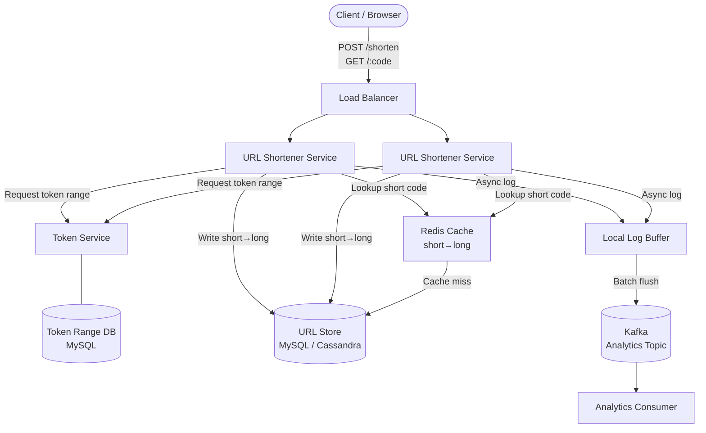
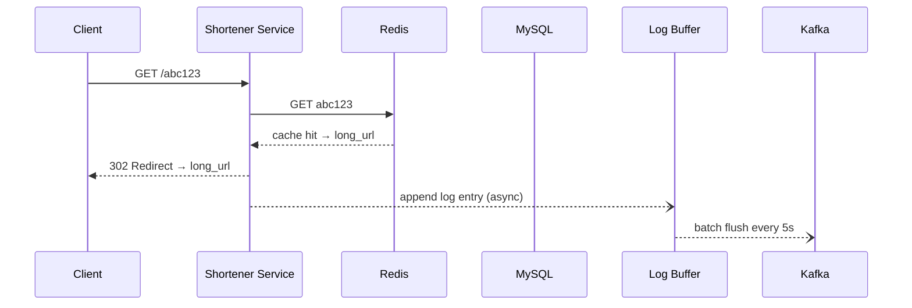

# URL Shortener — System Design

## TL;DR

A URL shortener maps a long URL to a compact alias (e.g. `bit.ly/abc123`) and redirects users to the original when they visit it. The core design challenge is generating **globally unique, collision-free short codes at high write throughput**, serving redirects at **very low latency**, and capturing **analytics asynchronously** without affecting the hot path.

---

## Functional Requirements

- Accept a long URL and return a shortened alias.
- Redirect any request to a short URL back to the original long URL.
- (Optional) Support custom aliases (e.g. `bit.ly/my-sale`).
- (Optional) Short URLs expire after a configurable TTL.

## Non-Functional Requirements

- **Low latency**: redirect path must be sub-100 ms end-to-end.
- **High availability**: no single point of failure; target 99.99% uptime.
- **High read throughput**: read:write ratio is typically 100:1 or higher — far more redirects than URL creations.
- **Durability**: a short URL once created must reliably resolve for its lifetime.
- **Scalability**: system must handle tens of thousands of redirects per second.

---

## Capacity Estimation

Before picking storage or code length, anchor the design with concrete numbers.

**Writes (URL creation)**

Assume 100 million new URLs created per day:

```
100,000,000 / 86,400 ≈ 1,160 writes/sec
```

**Reads (redirects)** at 100:1 read:write ratio:

```
100,000,000 * 100 / 86,400 ≈ 116,000 reads/sec
```

**Short code length**

Using Base62 (`A-Z`, `a-z`, `0-9` = 62 characters):

| Length | Combinations        |
|--------|---------------------|
| 5      | 62^5 ≈ 916 million  |
| 6      | 62^6 ≈ 56 billion   |
| 7      | 62^7 ≈ 3.5 trillion |

For a 10-year horizon at 100 M URLs/day → ~365 billion URLs total; **7 characters** provides comfortable headroom.

**Storage**

Each record: `short_code (7B) + long_url (2KB avg) + metadata (~100B)` ≈ 2.2 KB per row.

```
100M URLs/day * 365 days * 10 years * 2.2 KB ≈ ~800 TB over 10 years
```

This is manageable with sharded MySQL or a distributed KV store.

---

## High-Level Architecture


```mermaid
graph TD
    Client([Client / Browser])
    LB[Load Balancer]
    US1[URL Shortener Service]
    US2[URL Shortener Service]
    TS[Token Service]
    TokenDB[(Token Range DB\nMySQL)]
    Cache[Redis Cache\nshort→long]
    MainDB[(URL Store\nMySQL / Cassandra)]
    LogBuf[Local Log Buffer]
    Kafka[(Kafka\nAnalytics Topic)]
    Analytics[Analytics Consumer]

    Client -->|POST /shorten\nGET /:code| LB
    LB --> US1
    LB --> US2
    US1 & US2 -->|Request token range| TS
    TS --- TokenDB
    US1 & US2 -->|Write short→long| MainDB
    US1 & US2 -->|Lookup short code| Cache
    Cache -->|Cache miss| MainDB
    US1 & US2 -->|Async log| LogBuf
    LogBuf -->|Batch flush| Kafka
    Kafka --> Analytics
```

---

## Component Deep Dive

### 1. API Layer

Two primary endpoints:

- `POST /shorten` — accepts a long URL, returns a short code.
- `GET /{code}` — looks up the code and responds with HTTP `301 Permanent Redirect` or `302 Temporary Redirect`.

Use `302` if you want clicks to always hit your servers (for analytics); use `301` if you want browsers to cache and skip your servers (lower load, fewer analytics hits). This is a product decision worth surfacing in interviews.

### 2. Short Code Generation — The Core Problem

With multiple service instances behind a load balancer, naive random generation risks collisions. Three common strategies:

**Option A — Hashing (MD5/SHA256 + truncation)**
Hash the long URL, take the first 7 Base62 characters. Fast, deterministic, but collision-prone for identical URLs and requires a collision-check DB round trip.

**Option B — Redis atomic counter**
A single Redis `INCR` generates a globally unique integer which is then Base62-encoded. Simple, but Redis becomes a SPOF and loses state on restart.

**Option C — Token Range Service (recommended)**
A lightweight Token Service pre-allocates *ranges* of integers (e.g. 1–10,000) to each shortener instance. Each instance burns through its range locally — no network call per URL — then requests a fresh range when exhausted. The range assignments are persisted in MySQL, so a service restart simply requests a new range.

```
Token Service DB:
  node_id | range_start | range_end | assigned_at
  svc-01  | 1           | 10000     | 2024-01-01
  svc-02  | 10001       | 20000     | 2024-01-01
```

This is the approach shown in the original diagram — it eliminates both the Redis SPOF and per-URL network round trips.

### 3. Redirect Path (Read-Heavy, Latency Critical)

This is the hot path. The sequence:

1. Client hits `GET /{code}`.
2. Service checks **Redis cache** (TTL-based, e.g. 24h).
3. On cache hit → return redirect immediately (sub-10 ms).
4. On cache miss → query MySQL, populate cache, return redirect.

Since reads vastly outnumber writes, the cache absorbs ~99% of traffic. Use **read replicas** on MySQL for cache-miss fallback so the primary is not hammered.

### 4. URL Storage

Schema (MySQL or Cassandra):

```sql
CREATE TABLE urls (
    short_code  VARCHAR(10)  PRIMARY KEY,
    long_url    TEXT         NOT NULL,
    user_id     BIGINT,
    created_at  DATETIME     DEFAULT CURRENT_TIMESTAMP,
    expires_at  DATETIME,
    INDEX idx_user (user_id)
);
```

For scale beyond a single MySQL instance, shard by `short_code` (consistent hashing) or use Cassandra, which distributes naturally by partition key.

---

## Analytics & Logging

Every redirect carries metadata worth capturing: country of origin, platform/user-agent, referrer, IP (hashed for privacy). The challenge is doing this **without adding latency to the redirect path**.

**Naive approach — synchronous Kafka write**: adds I/O latency to every redirect. Violates the low-latency NFR.

**Better approach — local log buffer + batch flush**:

1. On each redirect, append a log entry to an in-memory buffer (or local file) — nanoseconds.
2. A background thread flushes the buffer to Kafka in batches every N seconds or M records.
3. Kafka consumers aggregate and write to a data warehouse (e.g. Redshift, ClickHouse).

The trade-off: if the service crashes before a flush, buffered logs are lost. For analytics (not billing), this is an acceptable data loss window — but confirm with the customer. If stronger durability is required, write-ahead log (WAL) to local disk before Kafka.


```mermaid
sequenceDiagram
    participant C as Client
    participant S as Shortener Service
    participant R as Redis
    participant DB as MySQL
    participant BUF as Log Buffer
    participant K as Kafka

    C->>S: GET /abc123
    S->>R: GET abc123
    R-->>S: cache hit → long_url
    S-->>C: 302 Redirect → long_url
    S--)BUF: append log entry (async)
    BUF--)K: batch flush every 5s
```

---

## Common Pitfalls

- **Using pure random generation** without a uniqueness guarantee — always leads to eventual collisions at scale.
- **301 vs 302 redirect confusion** — 301 is cached by browsers, reducing analytics visibility; 302 always hits your servers.
- **Single Redis counter as SPOF** — if Redis restarts, the counter resets and generates duplicate codes. Use Token Ranges persisted in MySQL instead.
- **No TTL on cache entries** — stale entries if a URL is updated or deleted; always set a TTL.
- **Synchronous logging on the hot path** — even a fast Kafka write adds ms-level latency. Always log asynchronously.
- **Not rate-limiting the shorten endpoint** — without limits, a single user can exhaust the token space or flood storage.

---

## Interview Questions

1. **How do you guarantee uniqueness of short codes across multiple service instances without a centralized lock?**
   *Token Range Service — each instance owns a pre-allocated range, eliminating per-URL coordination.*

2. **When would you choose 301 over 302 redirect, and what are the trade-offs?**
   *301 reduces load (browser-cached), 302 preserves analytics visibility. Usually 302 for analytics-heavy products.*

3. **How would you handle custom aliases (e.g. `bit.ly/my-brand`)?**
   *Store them in the same table with a flag; check for conflicts before creation; rate-limit per user.*

4. **What happens if a short URL is requested that doesn't exist?**
   *Return 404. Consider negative caching in Redis (cache a sentinel value) to prevent DB hammering for non-existent codes.*

5. **How would you scale this to 1 million redirects/sec?**
   *Horizontal scaling of stateless service nodes, Redis cluster for cache, read replicas for DB, CDN-level caching for the most popular URLs.*

6. **How do you handle URL expiration?**
   *Store `expires_at` in DB; check at redirect time; run a background sweeper to purge and evict from cache.*

---

## Key Takeaways

- The **redirect path is read-heavy** — design around cache-first; the DB is a fallback.
- **Token Range allocation** elegantly solves distributed unique ID generation without a per-request lock or SPOF.
- **Analytics must be async** — any synchronous I/O on the hot path will blow your latency budget.
- **301 vs 302** is a product decision with significant implications for analytics accuracy and infrastructure load.
- **Capacity estimation** drives every downstream choice: code length, storage engine, sharding strategy.

---

## Cross-References

- [System Design Components](../components.md)
- [Observability](../../sre/observability.md)
- [Kafka](../../kafka/index.md)

