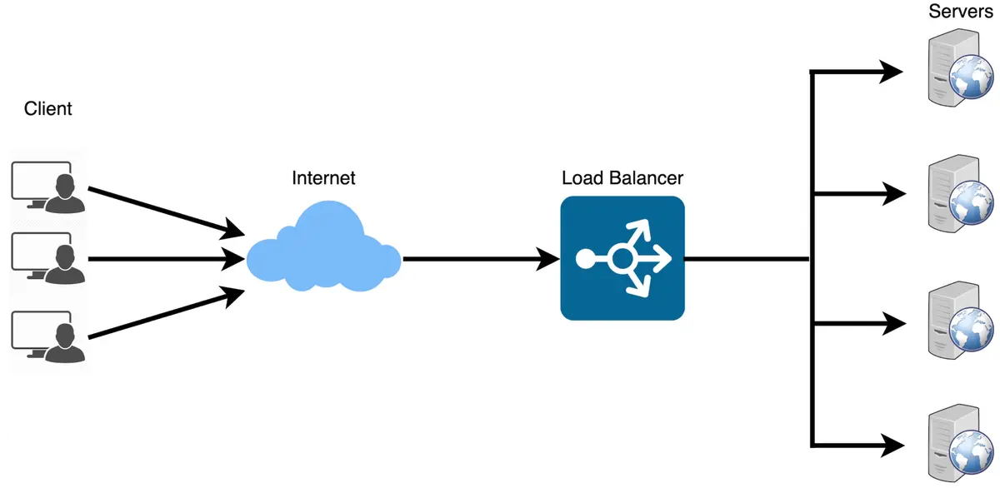
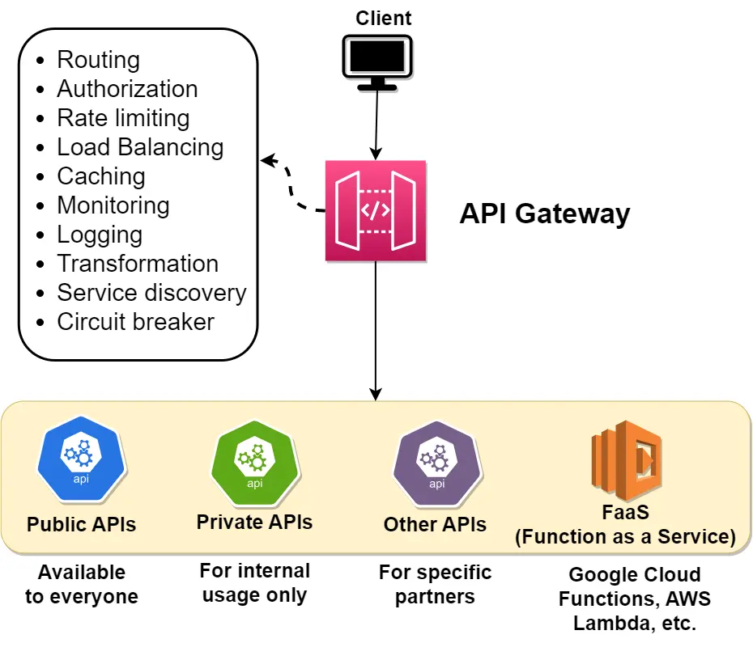

# Compenents for system design architecting

## Load Balancing

### Working principle 

Load balancers work by distributing incoming network traffic across multiple servers or resources to ensure efficient utilization of computing resources and prevent overload. Here are the general steps that a load balancer follows to distribute traffic:

The load balancer receives a request from a client or user.
The load balancer evaluates the incoming request and determines which server or resource should handle the request. This is done based on a predefined load-balancing algorithm that takes into account factors such as server capacity, server response time, number of active connections, and geographic location.

The load balancer forwards the incoming traffic to the selected server or resource.
The server or resource processes the request and sends a response back to the load balancer.
The load balancer receives the response from the server or resource and sends it to the client or user who made the request.



Typically a load balancer sits between the **client and the server accepting incoming network and application traffic and distributing the traffic** across multiple backend servers using various algorithms. By balancing application requests across multiple servers, a **load balancer reduces the load** on individual servers and prevents any **one server from becoming a single point of failure**, thus improving overall application availability and responsiveness.

To utilize **full scalability and redundancy**, we can try to balance the load at each layer of the system. We can add LBs at three places:

Between the user and the web server
Between web servers and an internal platform layer, like application servers or cache servers
Between internal platform layer and database.


### Key terminology and concepts

Load Balancer: A device or software that distributes network traffic across multiple servers based on predefined rules or algorithms.

Backend Servers: The servers that receive and process requests forwarded by the load balancer. Also referred to as the server pool or server farm.

Load Balancing Algorithm: The method used by the load balancer to determine how to distribute incoming traffic among the backend servers.

Health Checks: Periodic tests performed by the load balancer to determine the availability and performance of backend servers. Unhealthy servers are removed from the server pool until they recover.

Session Persistence: A technique used to ensure that subsequent requests from the same client are directed to the same backend server, maintaining session state and providing a consistent user experience.

SSL/TLS Termination: The process of decrypting SSL/TLS-encrypted traffic at the load balancer level, offloading the decryption burden from backend servers and allowing for centralized SSL/TLS management.

## Load Balancing Algorithms

### RR

It assigns a request to the first server, then moves to the second, third, and so on .. 

Pros:

- equal distribution among servers.
- easy implementation and understand
- works well when server has similar capabilities

Cons:

- no load awareness: does not take into account the current load or capacity of each servers. all are treated equally regardless of their current state. 
- no sesstion affinity: prob for staeful servers as request may reach to other server. 
- performace issue with different capacities.
- Predictable Distribution Pattern: Round Robin is predictable in its request distribution pattern, which could potentially be exploited by attackers who can observe traffic patterns and might find vulnerabilities in specific servers by predicting which server will handle their requests.

**Good usecases**

Homogeneous Environments: Suitable for environments where all servers have similar capacity and performance.
Stateless Applications: Works well for stateless applications where each request can be handled independently.

### least connections

The Least Connections algorithm is a dynamic load balancing technique that assigns incoming requests to the server with the fewest active connections at the time of the request
useful especially in environments where traffic patterns are unpredictable and request processing times vary.

Pros:

- Load Awareness: Takes into account the current load on each server by considering the number of active connections, leading to better utilization of server resources.
- Dynamic Distribution: Adapts to changing traffic patterns and server loads, ensuring no single server becomes a bottleneck.
- Efficiency in Heterogeneous Environments: Performs well when servers have varying capacities and workloads, as it dynamically allocates requests to less busy servers.

Cons:

- Higher Complexity: More complex to implement compared to simpler algorithms like Round Robin, as it requires real-time monitoring of active connections.
- State Maintenance: Requires the load balancer to maintain the state of active connections, which can increase overhead.
- Potential for Connection Spikes: In scenarios where connection duration is short, servers can experience rapid spikes in connection counts, leading to frequent rebalancing.

Use Cases
- Heterogeneous Environments: Suitable for environments where servers have different capacities and workloads, and the load needs to be dynamically distributed.
- Variable Traffic Patterns: Works well for applications with unpredictable or highly variable traffic patterns, ensuring that no single server is overwhelmed.
- Stateful Applications: Effective for applications where maintaining session state is important, as it helps distribute active sessions more evenly.

### Weighted RR

It assigns weights to each server based on their capacity or performance, distributing incoming requests proportionally according to these weights. This ensures that more powerful servers handle a larger share of the load, while less powerful servers handle a smaller share.

Pros

- Load Distribution According to Capacity: Servers with higher capacities handle more requests, leading to better utilization of resources.
- Flexibility: Easily adjustable to accommodate changes in server capacities or additions of new servers.
- Improved Performance: Helps in optimizing overall system performance by preventing overloading of less powerful servers.

Cons

- Complexity in Weight Assignment: Determining appropriate weights for each server can be challenging and requires accurate performance metrics.
- Increased Overhead: Managing and updating weights can introduce additional overhead, especially in dynamic environments where server performance fluctuates.
- Not Ideal for Highly Variable Loads: In environments with highly variable load patterns, WRR may not always provide optimal load balancing as it doesn't consider real-time server load.

Use Cases
- Heterogeneous Server Environments: Ideal for environments where servers have different processing capabilities, ensuring efficient use of resources.
- Scalable Web Applications: Suitable for web applications where different servers may have varying performance characteristics.
- Database Clusters: Useful in database clusters where some nodes have higher processing power and can handle more queries.

### weighted least connections

combines the principles of the Least Connections and Weighted Round Robin algorithms. It takes into account both the current load (number of active connections) on each server and the relative capacity of each server (weight)

Pros
Dynamic Load Balancing: Adjusts to the real-time load on each server, ensuring a more balanced distribution of requests.
Capacity Awareness: Takes into account the relative capacity of each server, leading to better utilization of resources.
Flexibility: Can handle environments with heterogeneous servers and variable load patterns effectively.
Cons
Complexity: More complex to implement compared to simpler algorithms like Round Robin and Least Connections.
State Maintenance: Requires the load balancer to keep track of both active connections and server weights, increasing overhead.
Weight Assignment: Determining appropriate weights for each server can be challenging and requires accurate performance metrics.
Use Cases
Heterogeneous Server Environments: Ideal for environments where servers have different processing capacities and workloads.
High Traffic Web Applications: Suitable for web applications with variable traffic patterns, ensuring no single server becomes a bottleneck.
Database Clusters: Useful in database clusters where nodes have varying performance capabilities and query loads.

### IP Hash

The load balancer uses a hash function to convert the client's IP address into a hash value, which is then used to determine which server should handle the request. This method ensures that requests from the same client IP address are consistently routed to the same server, providing session persistence.

Pros
Session Persistence: Ensures that requests from the same client IP address are consistently routed to the same server, which is beneficial for stateful applications.
Simplicity: Easy to implement and does not require the load balancer to maintain the state of connections.
Deterministic: Predictable and consistent routing based on the client's IP address.
Cons
Uneven Distribution: If client IP addresses are not evenly distributed, some servers may receive more requests than others, leading to an uneven load.
Dynamic Changes: Adding or removing servers can disrupt the hash mapping, causing some clients to be routed to different servers.
Limited Flexibility: Does not take into account the current load or capacity of servers, which can lead to inefficiencies.
Use Cases
Stateful Applications: Ideal for applications where maintaining session persistence is important, such as online shopping carts or user sessions.
Geographically Distributed Clients: Useful when clients are distributed across different regions and consistent routing is required.

### least response time

TODO

## Usea of load balancing

### HA and Fault tolerance: 

A load balancer performs Health Checks. It acts as the heartbeat monitor for your cluster. It constantly pings your backend servers ("Are you alive? Can you take a request?"). If a server fails to answer or returns a 5xx error, the LB cuts it off instantly. It stops sending traffic to the corpse and reroutes it to the living.

### Horizontal Scalability

The LB acts as the Unified Entry Point (Virtual IP). Clients only know the LB's address. When traffic spikes, you spin up more backend instances, register them with the LB, and boom, you have more capacity.


### Blue/Green deployments

Load balancers allow for Connection Draining and strategies like Blue-Green Deployment. You can signal the LB to stop sending new connections to a specific server while allowing existing connections to finish naturally, then take it offline for patching.

### Shield

A Load Balancer acts as a **Reverse Proxy**. It terminates the connection. The client talks to the LB; the LB talks to the server. The internet never touches your backend. Furthermore, the LB can absorb DDoS attacks (Distributed Denial of Service) and filter malicious traffic before it even reaches your expensive application logic.

### SSL Termination (The "Offloader")

Encryption is expensive. Handshaking SSL/TLS (decrypting HTTPS traffic) takes significant CPU power. You can offload this to the Load Balancer. This is called **SSL Termination**. The client speaks HTTPS to the Load Balancer. The Load Balancer decrypts it and speaks HTTP (or lighter encryption) to your backend servers inside your secure private network.


### DNS Load Balancing and High Availability

DNS load balancing and high availability techniques, such as round-robin DNS, geographically distributed servers, anycast routing, and Content Delivery Networks (CDNs), help distribute the load among multiple servers, reduce latency for end-users, and maintain uninterrupted service, even in the face of server failures or network outages.

## LB types

### Hardware Load Balancing

They use specialized hardware components, such as Application-Specific Integrated Circuits (ASICs) or Field-Programmable Gate Arrays (FPGAs), to efficiently distribute network traffic

Use case: A large e-commerce company uses a hardware load balancer to distribute incoming web traffic among multiple web servers, ensuring fast response times and a smooth shopping experience for customers.

### Software Load Balancing

Software load balancers are applications that run on general-purpose servers or virtual machines. They use software algorithms to distribute incoming traffic among multiple servers or resources.

Use case: A startup with a growing user base deploys a software load balancer on a cloud-based virtual machine, distributing incoming requests among multiple application servers to handle increased traffic.

### Cloud-based Load Balancing

Cloud-based load balancers are provided as a service by cloud providers. They offer load balancing capabilities as part of their infrastructure, allowing users to easily distribute traffic among resources within the cloud environment.

Use case: A mobile app developer uses a cloud-based load balancer provided by their cloud provider to distribute incoming API requests among multiple backend servers, ensuring smooth app performance and quick response times.

### DNS Load Balancing

DNS (Domain Name System) load balancing relies on the DNS infrastructure to distribute incoming traffic among multiple servers or resources. It works by resolving a domain name to multiple IP addresses, effectively directing clients to different servers based on various policies.

Use case: A content delivery network (CDN) uses DNS load balancing to direct users to the closest edge server based on their geographical location, ensuring faster content delivery and reduced latency.

### Global Server Load Balancing 

GSLB is a technique used to distribute traffic across geographically dispersed data centers. It combines DNS load balancing with health checks and other advanced features to provide a more intelligent and efficient traffic distribution method.

Use case: A multinational corporation uses GSLB to distribute incoming requests for its web applications among several data centers around the world, ensuring high availability and optimal performance for users in different regions.

### Hybrid Load Balancing

Hybrid load balancing combines the features and capabilities of multiple load balancing techniques to achieve the best possible performance, scalability, and reliability. It typically involves a mix of hardware, software, and cloud-based solutions to provide the most effective and flexible load balancing strategy for a given scenario.

Use case: A large-scale online streaming platform uses a hybrid load balancing strategy, combining hardware load balancers in their data centers for high-performance traffic distribution, cloud-based load balancers for scalable content delivery, and DNS load balancing for global traffic management. This approach ensures optimal performance, scalability, and reliability for their millions of users worldwide.

### Layer 4 Load Balancing

Layer 4 load balancing, also known as transport layer load balancing, operates at the transport layer of the OSI model (the fourth layer). It distributes incoming traffic based on information from the TCP or UDP header, such as source and destination IP addresses and port numbers.

Use case: An online gaming platform uses Layer 4 load balancing to distribute game server traffic based on IP addresses and port numbers, ensuring that players are evenly distributed among available game servers for smooth gameplay.

### Layer 7 Load Balancing

Layer 7 load balancing, also known as application layer load balancing, operates at the application layer of the OSI model (the seventh layer). It takes into account application-specific information, such as HTTP headers, cookies, and URL paths, to make more informed decisions about how to distribute incoming traffic.

Use case: A web application with multiple microservices uses Layer 7 load balancing to route incoming API requests based on the URL path, ensuring that each microservice receives only the requests it is responsible for handling.

#### RR DNS

Round-robin DNS is a simple load balancing technique in which multiple IP addresses are associated with a single domain name. When a resolver queries the domain name, the DNS server responds with one of the available IP addresses, rotating through them in a round-robin fashion. This distributes the load among multiple servers or resources, improving the performance and availability of the website or service.

However, **round-robin DNS does not take into account the actual load** on each server or the geographic location of the client, which can lead to uneven load distribution or increased latency in some cases.

#### Geographically distributed DNS servers

By distributing DNS servers across different regions, they can provide faster and more reliable DNS resolution for users located closer to a server.

Geographically distributed servers also offer increased redundancy, reducing the impact of server failures or network outages. If one server becomes unreachable, users can still access the service through other available servers in different locations.

#### Anycast routing

Anycast routing is a networking technique that allows multiple servers to share the same IP address. When a resolver sends a query to an anycast IP address, the network routes the query to the nearest server, based on factors like network latency and server availability.

Anycast provides several benefits for DNS:

Load balancing: Anycast distributes DNS queries among multiple servers, preventing any single server from becoming a bottleneck.
Reduced latency: By directing users to the nearest server, anycast can significantly reduce the time it takes for DNS resolution.
High availability: If a server fails or becomes unreachable, anycast automatically redirects queries to the next closest server, ensuring uninterrupted service.

#### CDN && DNS

A Content Delivery Network (CDN) is a network of distributed servers that cache and deliver web content to users based on their geographic location. CDNs help improve the performance, reliability, and security of websites and web services by distributing the load among multiple servers and serving content from the server closest to the user.

When a user requests content from a website using a CDN, the CDN's DNS server determines the best server to deliver the content based on the user's location and other factors. The DNS server then responds with the IP address of the chosen server, allowing the user to access the content quickly and efficiently.

## Stateless and stateful load balancing

Stateless load balancers operate without maintaining any information about the clients' session or connection state. They make routing decisions based solely on the incoming request data, such as the client's IP address, request URL, or other headers.

stateful load balancing preserves session information between requests. The load balancer assigns a client to a specific server and ensures that all subsequent requests from the same client are directed to that server.

Stateful load balancing can be further categorized into two types:

- Source IP Affinity: This form of stateful load balancing assigns a client to a specific server based on the client's IP address.
- Session Affinity: In this type of stateful load balancing, the load balancer allocates a client to a specific server based on a session identifier, such as a cookie or URL parameter. This method ensures that requests from the same client consistently reach the same server, regardless of the client's IP address.

Stateless load balancing is useful for applications capable of processing requests independently, while stateful load balancing is more appropriate for applications that depend on session data.

## load balancing terminology

### Availability & Realibility
availability is about whether a system is "up," while reliability is about whether it "works correctly" once it’s up

A Car: If you have a car in your driveway ready to drive, it is available. However, if that car stalls every time you hit 60 mph, it is unreliable.
A Website: A site that loads but gives you an error every time you click "Checkout" has high availability (it's online) but low reliability (it fails to perform its function).

### Upstream and Downstream
The exact meaning depends on the point of reference in the architecture
e.g 

```User requests → Load Balancer → App Server → Database```

**Upstream** = Traffic **going OUT(moving away)** from your system to another system/service. 
**Downstream** = Traffic **coming INTO(coming into)** your system from another system/service.

From the App Server’s perspective:

Downstream → User requests / Load Balancer (requests coming in)
Upstream → Database (requests going out)

From the Load Balancer perspective:

Downstream -> User requests
upstream -> App server(backend servers) 

### High Availability and Fault Tolerance

To ensure high availability and fault tolerance, load balancers should be designed and deployed with redundancy in mind. 

**Active-passive configuration:** one load balancer (the active instance) handles all incoming traffic while the other (the passive instance) remains on standby. If the active load balancer fails, the passive instance takes over and starts processing requests.

**Active-active configuration:** In this setup, multiple load balancer instances actively process incoming traffic simultaneously. Traffic is distributed among the instances using methods such as DNS load balancing or an additional load balancer layer

**Health checks and monitoring:** Health checks are periodic tests performed by the load balancer to determine the availability and performance of backend servers. load balancers can automatically remove unhealthy servers from the server pool and avoid sending traffic to them

**Synchronization and State Sharing** 

**Centralized configuration management:** Using a centralized configuration store (e.g., etcd, Consul, or ZooKeeper) to maintain and distribute configuration data among load balancer instances ensures that all instances are using the same settings and are aware of changes.

**State sharing and replication:** In scenarios where load balancers must maintain session data or other state information, it is crucial to ensure that this data is synchronized and replicated across instances. This can be achieved through database replication, distributed caching systems (e.g., Redis or Memcached), or built-in state-sharing mechanisms provided by the load balancer software or hardware.

### Scalability and Performance

**Horizontal scaling:** This involves adding more load balancer instances to distribute traffic among them. Horizontal scaling is particularly effective for **active-active configurations**, where each load balancer instance actively processes traffic.

**Vertical scaling:** This involves increasing the resources (e.g., CPU, memory, and network capacity) of the existing load balancer instance(s) to handle increased traffic.

**Connection and request rate limits:** Overloading a load balancer or backend servers can result in **decreased performance or even service outages**. Implementing rate limiting(such as IP addresses, client domains, or URL patterns) and connection limits at the load balancer level can help prevent overloading and ensure consistent performance.

**Caching and content optimization:** Load balancers can cache static content, such as images, CSS, and JavaScript files, to reduce the load on backend servers and improve response times. Additionally, some load balancers support content optimization features like compression or minification, which can further improve performance and reduce bandwidth consumption.

### Impact of load balancers on latency

While the impact is typically minimal, it is important to consider the potential latency introduced by the load balancer and optimize its performance accordingly.

**Geographical distribution:** Deploying load balancers and backend servers in geographically distributed locations can help reduce latency for users by ensuring that their requests are processed by a nearby instance.

**Connection reuse**: Many load balancers support connection reuse or keep-alive connections, which reduce the overhead of establishing new connections between the load balancer and backend servers for each request

**Protocol optimizations:** Some load balancers support protocol optimizations, such as HTTP/2 or QUIC, which can improve performance by reducing latency and increasing throughput.

### Challenges of Load Balancers

**Single Point of Failure:** If not designed with redundancy and fault tolerance in mind, a load balancer can become a single point of failure in the system

**Configuration Complexity:** Load balancers often come with a wide range of configuration options, including algorithms, timeouts, and health checks. Misconfigurations can lead to poor performance, uneven traffic distribution, or even service outages.

**Scalability Limitations:** As traffic increases, the load balancer itself might become a performance bottleneck, especially if it is not configured to scale horizontally or vertically.

**Latency:** Introducing a load balancer into the request-response path adds an additional network hop, which could lead to increased latency. While the impact is typically minimal, it is essential to consider the potential latency introduced by the load balancer and optimize its performance accordingly.

**Sticky Sessions** Some applications rely on maintaining session state or user context between requests. In such cases, load balancers must be configured to use session persistence or "sticky sessions" to ensure subsequent requests from the same user are directed to the same backend server. However, this can lead to uneven load distribution and negate some of the benefits of load balancing.

**Cost:** Deploying and managing load balancers, especially in high-traffic scenarios, can add to the overall cost of your infrastructure. This may include hardware or software licensing costs, as well as fees associated with managed load balancing services provided by cloud providers.

**Health Checks and Monitoring:** Implementing effective health checks for backend servers is essential to ensure that the load balancer accurately directs traffic to healthy instances. Misconfigured or insufficient health checks can lead to the load balancer sending traffic to failed or underperforming servers, resulting in a poor user experience


## API Gateway

An API Gateway is a server-side architectural component in a software system that acts as an intermediary between clients (such as web browsers, mobile apps, or other services) and backend services, microservices, or APIs.

Its main purpose is to provide a single entry point for external consumers to access the services and functionalities of the backend system. It receives client requests, forwards them to the appropriate microservice, and then returns the server’s response to the client.

The API gateway is responsible for tasks such as routing, authentication, and rate limiting. This enables microservices to focus on their individual tasks and improves the overall performance and scalability of the system.



### Differences between API Gateway and Load Balancer

| Feature | API Gateway | Load Balancer |
|----------|-------------|---------------|
| Primary Purpose | Manages, secures, and routes API requests | Distributes incoming network traffic across multiple servers |
| OSI Layer | Typically Layer 7 (Application Layer) | Layer 4 (Transport) and/or Layer 7 |
| Protocol Handling | HTTP, HTTPS, WebSocket, REST, gRPC | TCP, UDP, HTTP, HTTPS |
| Traffic Distribution | Routes based on API path, headers, authentication, version | Routes based on IP, port, protocol |
| Authentication | Built-in authentication (OAuth, JWT, API keys) | No built-in authentication |
| Rate Limiting | Supports throttling and rate limiting | Not typically supported |
| Request Transformation | Can modify headers, payloads, and responses | Cannot modify request/response content |
| Caching | Supports response caching | No caching |
| SSL Termination | Yes | Yes |
| Monitoring & Analytics | Detailed API-level metrics | Basic traffic-level metrics |
| Use Case | Microservices architecture, external API exposure | High availability, horizontal scaling |
| Example | AWS API Gateway, Kong, Apigee | AWS ALB, NLB, HAProxy |


### Key Usages of API Gateways

**Request Routing:** Directing incoming client requests to the appropriate backend service.

**Aggregation of Multiple Services:** Combining responses from multiple backend services into a single response to the client.

**Security Enforcement:** Implementing security measures such as authentication, authorization, and rate limiting.

**Load Balancing:** Distributing incoming requests evenly across multiple instances of backend services to ensure no single service becomes a bottleneck

**Caching Responses:** Storing frequently requested data to reduce latency and decrease the load on backend services.

**Protocol Translation:** Converting requests and responses between different protocols used by clients and backend services.

**Monitoring and Logging:** Tracking and recording request and response data for analysis, debugging, and performance monitoring.

**Transformation of Requests and Responses:** Modifying the data format or structure of requests and responses to meet the needs of clients or services.

**API Versioning:** Managing different versions of APIs to ensure backward compatibility and smooth transitions when updates are made.

**Rate Limiting and Throttling:** Controlling the number of requests a client can make in a given time frame to protect backend services from being overwhelmed.

**API Monetization:** Enabling businesses to monetize their APIs by controlling access, usage tiers, and billing.

**Service Discovery Integration:** Facilitating dynamic discovery of backend services, especially in environments where services are frequently scaled up or down.

**Circuit Breaker Pattern Implementation:** Preventing cascading failures by detecting when a backend service is failing and stopping requests to it temporarily.

**Content-Based Routing:** Routing requests to different backend services based on the content of the request, such as headers, body, or query parameters.

**SSL Termination:** Handling SSL/TLS encryption and decryption at the gateway level to offload this resource-intensive task from backend services.

**Policy Enforcement:** Applying organizational policies consistently across all API traffic, such as data validation, request formatting, and access controls.

**Multi-Tenancy Support:** Supporting multiple clients or tenants within a single API infrastructure while ensuring data isolation and customized configurations.

**A/B Testing and Canary Releases:** Facilitating controlled testing of new features or services by directing a subset of traffic to different backend versions.

**Localization and Internationalization Support:** Adapting responses based on the client's locale, such as language preferences or regional settings.

**Reducing Client Complexity:** Simplifying the client-side logic by handling complex operations on the server side through the gateway.


### Advantages of using API Gateway
- Improved performance - cache responses, rate limit requests, and optimize communication between clients and backend services
- Simplified system design - provides a single entry point for all API requests, making it easier to manage, monitor, and maintain APIs across multiple backend services.
- Enhanced security - can enforce authentication and authorization policies, helping protect backend services from unauthorized access or abuse
- Improved scalability - can distribute incoming requests among multiple instances of a microservice, enabling the system to scale more easily and handle a larger number of requests
- Better monitoring and visibility - can collect metrics and other data about the requests and responses, providing valuable insights into the performance and behavior of the system
- Simplified Client Integration - By providing a consistent and unified interface for clients to access multiple backend services, the API Gateway simplifies client-side development and reduces the need for clients to manage complex service interactions
- Protocol and Data Format Transformation - can convert requests and responses between different protocols (e.g., HTTP to gRPC) or data formats (e.g., JSON to XML), enabling greater flexibility in how clients and services communicate
- API Versioning and Backward Compatibility - can manage multiple versions of an API, allowing developers to introduce new features or make changes without breaking existing clients
- Enhanced Error Handling - can provide a consistent way to handle errors and generate error responses
- Load Balancing and Fault Tolerance - can distribute incoming traffic evenly among multiple instances of a backend service, improving performance and fault tolerance

### Disadvantages of using API Gateway

- Additional Complexity - adds an extra layer of complexity to your architecture
- Single Point of Failure - If not configured correctly, the API Gateway could become a single point of failure in your system. If the gateway experiences an outage or performance issues, it can affect the entire system
- Latency - adds an extra hop in the request-response path, which could introduce some latency, especially if the gateway is responsible for performing complex tasks like request/response transformation or authentication
- Vendor Lock-in - managed API Gateway service provided by a specific cloud provider or vendor, you may become dependent on their infrastructure, pricing, and feature set. This could make it more challenging to migrate your APIs to a different provider
- Cost - Running an API Gateway, especially in high-traffic scenarios, can add to the overall cost of your infrastructure
- Maintenance Overhead - API Gateway requires monitoring, maintenance, and regular updates to ensure its security and reliability
- Configuration Complexity - API Gateways often come with a wide range of features and configuration options. Setting up and managing these configurations can be complex and time-consuming, especially when dealing with multiple environments or large-scale deployments.

# Network essentials

Differences Between HTTP and HTTPS

## HTTP vs HTTPS Comparison

| Feature        | HTTP                                                   | HTTPS                                                   |
|----------------|--------------------------------------------------------|---------------------------------------------------------|
| **Security**   | No encryption; data is sent in plain text             | Encrypted using SSL/TLS protocols                        |
| **Port**       | 80                                                    | 443                                                      |
| **Performance**| Slightly faster due to lack of encryption overhead    | Slightly slower due to encryption processes              |
| **SEO Ranking**| Lower search engine ranking                           | Higher search engine ranking                             |
| **Use Cases**  | Non-sensitive data transmission                       | Sensitive transactions (e.g., banking, e-commerce)       |


## TCP vs UDP

these two of the main protocols used for transmitting data over the internet.


**TCP (Transmission Control Protocol)**

TCP is a connection-oriented protocol that ensures reliable, ordered, and error-checked delivery of a stream of bytes between applications.

**Characteristics**
- Reliability: TCP ensures that data is delivered accurately and in order, retransmitting lost or corrupted packets.
- Connection-Oriented: Establishes a connection between sender and receiver before transmitting data.
- Flow Control: Manages data transmission rate to prevent network congestion.
- Congestion Control: Adjusts the transmission rate based on network traffic conditions.
- Acknowledgements and Retransmissions: Uses acknowledgments to confirm receipt of data and retransmits if necessary.

e.g: Loading a webpage: TCP is used to ensure all web content is loaded correctly and in the right order.


**UDP(User Datagram Protocol)**

UDP is a connectionless protocol that sends messages, called **datagrams**, without establishing a prior connection and without guaranteeing reliability or order.

**Characteristics**
- Low Overhead: Does not establish a connection, leading to lower overhead and latency.
- Unreliable Delivery: Does not guarantee message delivery, order, or error checking.
- Speed: Faster than TCP due to its simplicity and lack of retransmission mechanisms.
- No Congestion Control: Does not reduce transmission rates under network congestion.

e.g: Streaming a live sports event: UDP is used for faster transmission, even if it means occasional pixelation or minor video artifacts.

**TCP vs UDP Comparison**

| Feature | TCP | UDP |
|----------|------|------|
| **Reliability** | Reliable transmission, ensuring data is delivered accurately and in order | Unreliable transmission; data may be lost or arrive out of order |
| **Connection** | Connection-oriented; establishes a connection before transmitting data | Connectionless; sends data without establishing a connection |
| **Speed and Overhead** | Slower due to handshaking, acknowledgments, and congestion control | Faster with minimal overhead, suitable for real-time applications |
| **Data Integrity** | High data integrity, suitable for applications like file transfers and web browsing | Lower data integrity, acceptable for applications like streaming where perfect accuracy is less critical |
| **Use Case Suitability** | Used when data accuracy is more critical than speed | Used when speed is more critical than accuracy |

# HTTP/1.0 vs HTTP/1.1 vs HTTP/2 vs HTTP/3

## 📌 Executive Summary

HTTP has evolved to improve:
- ⚡ Performance (faster loading)
- 🔐 Security (stronger encryption)
- 📡 Efficiency (better bandwidth usage)
- 🌍 Scalability (handling modern traffic)

Each version builds upon the previous one to address web scalability challenges.

---

# 🔎 High-Level Comparison

| Feature | HTTP/1.0 | HTTP/1.1 | HTTP/2 | HTTP/3 |
|----------|-----------|-----------|---------|---------|
| **Release Year** | 1996 | 1997 | 2015 | 2020 |
| **Connection Model** | New TCP connection per request | Persistent connections (Keep-Alive) | Multiplexed streams over single TCP connection | Multiplexed streams over QUIC (UDP) |
| **Protocol Format** | Text | Text | Binary | Binary |
| **Multiplexing** | ❌ No | ❌ No | ✅ Yes | ✅ Yes |
| **Header Compression** | ❌ No | ❌ Limited | ✅ HPACK | ✅ QPACK |
| **Head-of-Line Blocking** | Yes | Yes | Yes (TCP-level) | No |
| **Transport Protocol** | TCP | TCP | TCP | UDP (QUIC) |
| **Security** | Optional | Optional | Usually HTTPS | Mandatory TLS 1.3 |
| **Latency** | High | Medium | Low | Very Low |
| **Packet Loss Handling** | Poor | Poor | Better | Excellent |
| **Typical Use Case** | Static websites | Dynamic web apps | High-traffic apps | Real-time applications |

---

# 📚 Version-by-Version Summary

---

## 🚀 HTTP/1.0 (1996)

### Characteristics
- One request = one TCP connection
- Stateless
- Basic headers
- High latency

### Limitations
- Connection overhead
- Slow page loads
- Not suitable for modern resource-heavy websites

### Best Used For
- Simple static websites
- Early web applications

---

## 🚀 HTTP/1.1 (1997)

### Improvements Over 1.0
- Persistent connections (Keep-Alive)
- Chunked transfer encoding
- Host header (virtual hosting)
- Better caching

### Benefits
- Reduced latency
- Efficient resource usage
- Enabled shared hosting

### Still Has
- Head-of-line blocking
- Text-based inefficiencies

### Best Used For
- Dynamic websites
- E-commerce platforms
- APIs

---

## 🚀 HTTP/2 (2015)

### Major Enhancements
- Binary protocol
- Multiplexing (multiple requests over one connection)
- Header compression (HPACK)
- Server Push

### Benefits
- Significant performance improvement
- Faster page loads
- Efficient bandwidth usage

### Limitation
- Still uses TCP → TCP-level head-of-line blocking

### Best Used For
- Social media platforms
- Streaming services
- Large web applications

---

## 🚀 HTTP/3 (2020)

### Built On
- QUIC protocol (UDP-based)

### Major Advantages
- Eliminates TCP head-of-line blocking
- 0-RTT handshake (faster connection setup)
- Better packet loss handling
- Built-in TLS 1.3 (mandatory encryption)

### Benefits
- Lower latency
- More resilient on unstable networks
- Better mobile performance

### Best Used For
- Video conferencing (Zoom, Teams)
- Online gaming
- Live streaming
- Real-time apps

---

# 📊 Evolution Summary

| Improvement Area | 1.0 | 1.1 | 2 | 3 |
|------------------|------|------|------|------|
| Connection Efficiency | ❌ | ✅ | ✅ | ✅ |
| Multiplexing | ❌ | ❌ | ✅ | ✅ |
| Header Compression | ❌ | ❌ | ✅ | ✅ |
| TCP Head-of-Line Fix | ❌ | ❌ | ❌ | ✅ |
| Built-in Encryption | ❌ | ❌ | ❌ | ✅ |

---

## 🎯 Why Upgrade to Newer Versions?

- ⚡ Faster performance
- 🔐 Better security
- 📉 Reduced latency
- 📈 Improved scalability
- 🌐 Better real-world network handling

---

## 🧠 Quick Memory Trick

- **HTTP/1.0** → One request, one connection  
- **HTTP/1.1** → Keep connection alive  
- **HTTP/2** → Multiplex everything  
- **HTTP/3** → Replace TCP with QUIC (UDP)

---

# 🏁 Final Conclusion

The evolution from HTTP/1.0 to HTTP/3 represents:

> From simple request-response communication  
> ➜ to high-performance, encrypted, multiplexed, real-time web communication.

Modern web applications should use:
- **HTTP/2 or HTTP/3** whenever possible.
- HTTP/3 is ideal for mobile-heavy and real-time workloads.

## URL vs. URI vs. URN

URL: Specifies both the identity and the location of a resource (How and Where). (https://www.example.com/path?query=term#section)
URI: A more comprehensive term covering both URLs (identifying and locating) and URNs (just identifying). (https://www.example.com/path?query=term#section)
URN: Focuses only on uniquely identifying a resource, not on where it is located or how to access it. (urn:isbn:0451450523)

