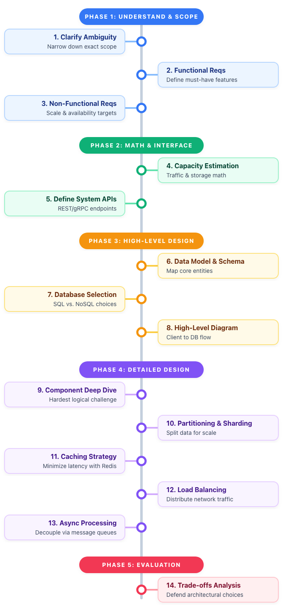

# Architecting Framework

## Q & A



Step 1: Clarify Ambiguity. Never assume. Narrow down the exact scope.

Step 2: Define Functional Requirements. Core features the system must have.

Step 3: Define Non-Functional Requirements. Scale, latency, and availability baselines.

Step 4: Capacity Estimation. Calculate Read/Write ratios, QPS, and storage needs.

Step 5: Define System APIs. Establish REST/gRPC endpoints and payloads.

**Numbers Everyone Should Know (Latency)**
```
Interviewers expect you to know these back-of-the-envelope numbers to justify your caching and database decisions:

L1 cache reference: 0.5 ns
Main memory read: 100 ns
Read 1MB sequentially from memory: 250 us
Read 1MB sequentially from network: 10 ms
Read 1MB sequentially from SSD: 1 ms
Packet roundtrip CA to Netherlands: 150 ms
```

Step 6: Data Model & Schema. Map out core entities and relationships.

Step 7: Database Selection. Justify SQL vs. NoSQL choices.

Step 8: High-Level Diagram. Draw components from client to databases.

Step 9: Component Deep Dive. Zoom in on the hardest logical challenge.

Step 10: Partitioning & Sharding. Split data to handle massive scale.

Step 11: Caching Strategy. Implement Redis/Memcached to minimize latency.

Step 12: Load Balancing. Eliminate single points of failure.

Step 13: Asynchronous Processing. Use queues for heavy background tasks.

Step 14: Trade-offs Analysis. Proactively point out the weaknesses in your own design.

## Functional Requirements

**what a system should do**. It should describe various system functions that must perform
e.g
- auth system: validate user and provide access
- e-commerce website: allow user to browse products, add them to cart and purchase. 
- report generation: collect data, process and generate

## Non-Functional Requirements

**How the system should do it.**

- Scalability: The system should handle growth in users or data.
- Performance: The system should process transactions within a specified time.
- Availability: The system should be up and running a defined percentage of time.
- Security: The system must protect sensitive data and resist unauthorized access.

##  Back-of-the-Envelope Estimations

Its a technique used to quickly approximate values and make rough calculations using simple arithmetic and basic assumptions. estimations is essential for several reasons

- Scalability: Highlights your understanding of how the system can grow or adapt
- proposed solutions: Estimation helps you ensure that your proposed architecture meets the requirements and can handle the expected load.
- Identify bottlenecks: Quick calculations help you identify potential performance bottlenecks and make necessary adjustments to your design.
- Demonstrate your thought process: Estimation showcases your ability to make informed decisions and trade-offs based on a set of assumptions and constraints
- Communicate effectively: Providing estimates helps you effectively communicate your design choices and their implications to the interviewer.
- Quick Decision Making: Reflects your ability to make swift estimations to guide your design decisions.

## Estimation Techniques

- Rule of thumb: based on experience and observation e.g user will generate 1 MB of data per day on a social media platform can serve as a starting point for capacity planning.
- Approximation: complex calculations by rounding numbers or using easier-to-compute values e.g For instance, assuming 1,000 users instead of 1,024 when estimating storage requirements
- Breakdown and aggregation: Breaking down a problem into smaller components and estimating each separately can make it easier to derive an overall estimate e.g For example, estimating the storage needs for user data, multimedia content, and metadata separately can help in determining the overall storage requirements
- Sanity check: estimate to ensure its plausibility and reasonableness.

Types of estimations 

- Load estimation: Predict the expected number of requests per second, data volume, or user traffic for the system.
- Storage estimation: Estimate the amount of storage required to handle the data generated by the system.
- Bandwidth estimation: Determine the network bandwidth needed to support the expected traffic and data transfer.
- Latency estimation: Predict the response time and latency of the system based on its architecture and components.
- Resource estimation: Estimate the number of servers, CPUs, or memory required to handle the load and maintain desired performance levels.
