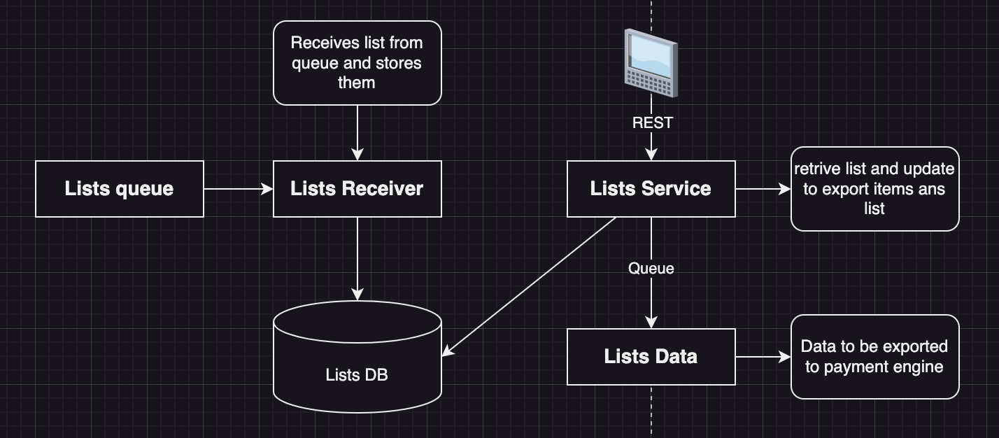
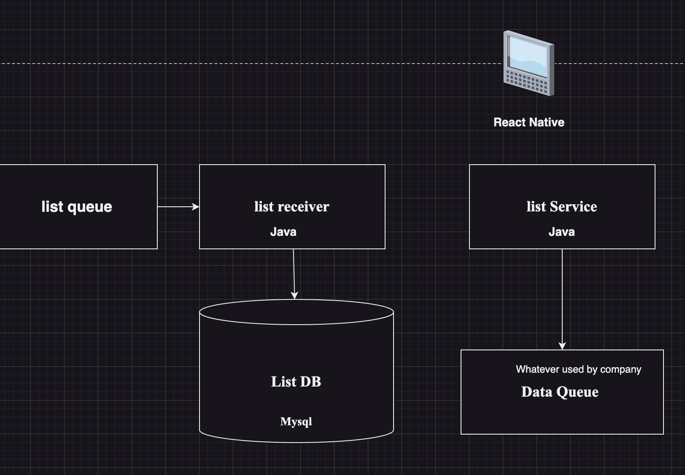
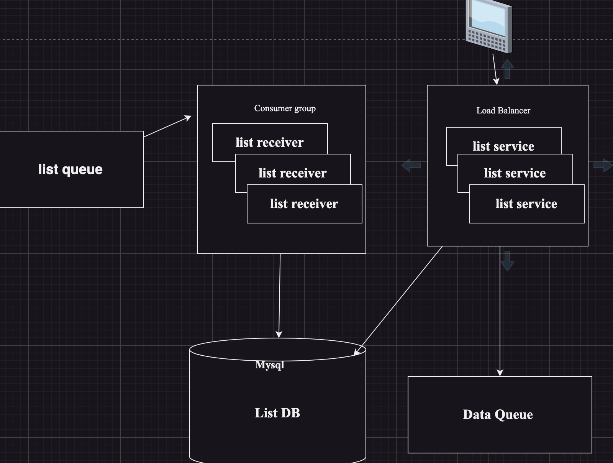

In this case study, we are allowing customer to create shopping lists that get collected and delivered by grosscoll employees. It already available all oever world.  
Employees have dedicated tables and displaying the list

Design the **collection side** of the system. Cutomer side is already developed,

## System Requirements

### functional 

What should system do ?

- Web based 
- tablets receive the list to be called 
- Employees can mark items as collected or unavailable.
- When collection is done, list must be transferred to payment engine
- offline support is a must

### non-functional

What should system deal with ?

1. is it data intrinsic ?
2. Users ?
3. How much of data ?
4. Performance ?

Questions to ask customers ?

1. How many concurrent users ?
sol: 200

2. How many list processed/day ?
sol: 10000

3. whats the avg size of the shopping list?
sol: 500KB

4. Do we need offline support ?
sol: yes

5. What's the SLA ?
sol: highest possible

6. Since we already know that customer shopping is already developed, then how do lists arrive to the system ?
sol: Queue - which means we know that all the meg arrive in queue and we need to pull the msg and process the data. 

**Data volume**

1 list = 500KB
10000 list/per day =  ~5GB/per day
monthly = ~150GB/month
yearly = ~1800GB/year = ~2TB/year

## Map the components

**Components**

- Employee have tablets
- offline support
- retrive lists
- mark items
- export list to payment engine




we keep list receiver and service differently, because in future if there is any change in the database we don't have to work completely modifying the service..

## list receiver

- receives the shopping list to handle queue
- stores the list in the db

### Application Type

- Web App & Web API - No
- Mobile App - No
- Console - Yes
- Service - Yes
- Desktop App - No


### Technology stack 

Should be able to connect to queue and nothing else

we would ask for the customer about the skill expertise that they use as we only consume the queue.

Solution from customer: Java. 

**Java** is a best solution for the queue solution and hence we go with it. 

Now, we need to use the **database for storing the values** as our data is relational we use relational DB also the expected volume of data is around 2TB/year which is a lot. We can use **paritioning** for this

### Architecture

- Queue receiver: yes
- Business logic : yes
- Data Access: yes 
- Data store: yes

**Redunancy**

We will need to use the **kafka** where we have **consumer group** and all the instances of list receiver would be grouped.

## list service

- allow employees to query list
- marks items in list
- export payment type

### Application Type

- Web App & Web API - yes
- Mobile App - no
- Console - no
- Service - no
- Desktop App - No

### Technology stack 

You can use **Java**

### Architecture

- User/interface: yes
- Business logic : yes
- Data Access: yes
- Data store: yes

Any service that exposes, we need to use API

### Design API component

- Get list to be processed(by location)

```
GET /api/v1/lists/next?location= ..

200 OK / 400 Bad Request
```

- mark item as collected/unavailable

```
PUT /api/v1/lists/{listId}/item/{itemId}

200 OK / 404 Not Found
```
- export payment list data

```
POST /api/v1/list/{listId}/export

200 OK / 404 Not Found
```

**Reduancy**

place the list service behind the Load balancer(3 instances) - scale across traffic and regions as the data will be high.

## front end

- Displays shopping list
- marks items as unavailble / collected
- send list to payment system
- support offline mode

### Application Type 

- Web App & Web API - No
- Mobile App - yes
- Console - no
- Service - no
- Desktop App - yes

### Technology stack 

Desktop, window based

- support all OS applications
- utilizes other app on the machine(db)
- requires setup, windows

Web based 

- limited functionality
- cannot use other apps
- fully compactible with other form factors
- no setup required
- cheaper hardware

We don't need any redenacy for front end as there is no load. 

## exporter list

- used to send the shopping data to payment system
- it should be queue 

since its queue, we must ask question to customer

- do we already have a queue in the company ?
soln: yes

since there is already a list queue, we use the same for data queue to store or export data..

- do we need to use any third party ?
soln: Nil

## Technical diagram



## physical diagram

