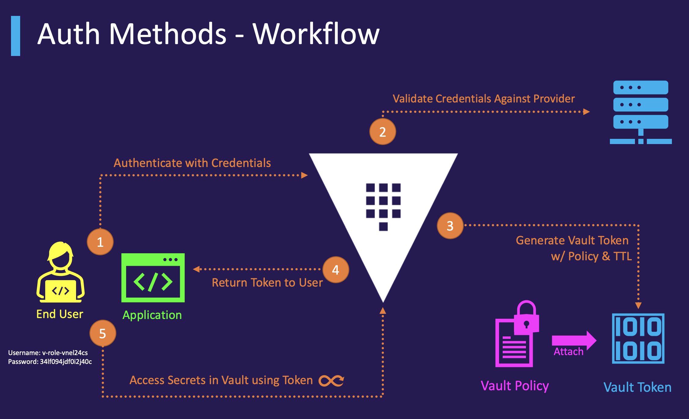
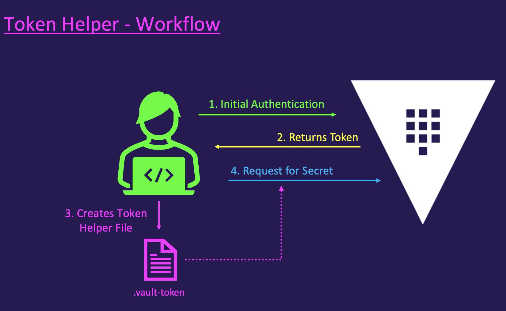
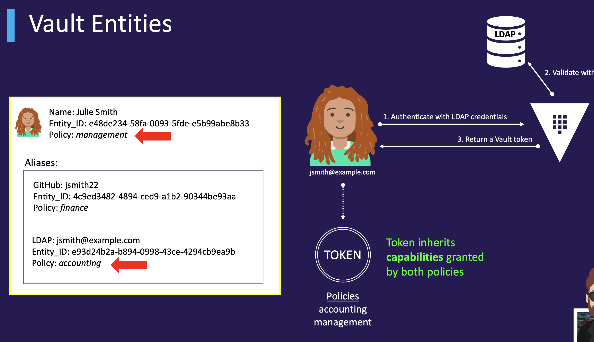

## Introduction

- vault components that perform authentication and manage identities.
- Responsible for assigning identity and policies to a user.
- Multiple authentication methods can be enabled depending on your use case.
- Auth methods can be differentiated by human vs. system methods.
- Once authenticated, vault will issue a client token used to make all subsequent vault
requests (read/write).
- The fundamental goal of all auth methods is to obtain a token.
- Each token has an associated policy (or policies) and a TTL.

fundamental goal of **auth method is to get token**, which are core method for auth within vault.

**token method** is responsible for creating and storing token, which can't be disabled.
Authenticating with external identity (LDAP, OIDC) will generate a token. if you are not supplying token for auth, you would get 403 error. 



## Working with auth methods

few auth methods which are valid and must be enabled before use..

- okta
- Github
- kubenetes
- kerberos
- username/password
- TLS certs

The **token auth method is enabled by default**, and you cannot enable another nor
disable the tokens auth method
- New vault deployment will use a token for authentication
- Only method of authentication for a new vault deployment is a **root token**. you can later change your auth once root token login. 

Auth methods can be enabled/disabled and configured using the UI, API, or CLI. You must provide a valid token to **enable, disable, or modify auth methods** in vault. The token must also have the **proper privileges**.

Each auth method is enabled at a path. You can choose the path name when (and only when) you enable the
auth method. If you do not provide a name, the auth method will be enabled at its **default path**

[auth methods](https://developer.hashicorp.com/vault/docs/concepts/auth#auth-methods)

## auth using CLI

```
vault auth enable approle or userpass
vault auth disable approle or userpass
vault auth list

vault auth enable –path=vault-course –description=MyApps approle
```
vault auth -  Type of vault object you want to work with 
enable  - Subcommand 
–path=vault-course - Customize the Path Name 
–description=MyApps - Add a description
approle - Type of Auth Method
 
After the auth method has been enabled, use the auth prefix to configure the auth method:

```
vault write auth/<path name>/<option> 
<options> = "users" for userpass or "role" for approle
```

[auth methods using cli reference docs](https://developer.hashicorp.com/vault/docs/auth/approle#authentication)


There are a few ways to authenticate to vault when using the CLI
- Use the **vault login** command
   - Authenticate using a token or another auth method
   - Makes use of a token helper
  
- Use the **vault_TOKEN** Environment Variable
   - Used if you already have a token

```
vault login  <root token> # uses token method
vault login -method=userpass username=sunil # Once your username/password is correct, you would get the token. 

–method=userpass - Type of Auth Method Used to Authenticate (not the enabled path)
```

**Token Helper:** Caches the token after authentication. Stores the token in a local file(.vault-token)so it can be
referenced for subsequent requests.



HTTP API Response: 

Parsing the JSON Response to Obtain the vault Token

```
$ export vault_ADDR="https://vault.example.com:8200"
$ export vault_FORMAT=json
$ OUTPUT=$(vault write auth/approle/login role_id="12345657" secret_id="1nv84nd3821s")
$ vault_TOKEN=$(echo $OUTPUT | jq '.auth.client_token' -j)
$ vault login $vault_TOKEN
```

## auth using API

Create a new json object and save the file.

```
curl --header "X-vault-Token: $vault_TOKEN" --request POST --data '{"type": "approle"}' \
http://127.0.0.1:8200/v1/sys/auth/approle

# The following command specifies that the tokens issued under the AppRole my-role should be associated with my-policy.

curl --header "X-vault-Token: $vault_TOKEN" --request POST --data '{"policies": ["my-policy"]}' \
http://127.0.0.1:8200/v1/auth/approle/role/my-role


# fetches the RoleID of the role named my-role

curl --header "X-vault-Token: $vault_TOKEN" \
http://127.0.0.1:8200/v1/auth/approle/role/my-role/role-id | jq -r ".data"

```

[auth method using api reference docs](https://developer.hashicorp.com/vault/docs/auth/approle#via-the-api-1)


Authentication requests to the vault HTTP API return a JSON response that include:
- the token
- the token accessor
- information about attached policies

It is up to the user to parse the response for the token and use that token for any subsequent requests 
to vault.

Autheticate to the vault server

```
curl --request POST --data @auth.json https://vault.example.com:8200/v1/auth/approle/login
```

If your **role id and secret id** are correct, then you would have below response where you have your token i.e 
**client_token**. 

```
{
"request_id": "0f874bea-16a6-c3da-8f20-1f2ef9cb5d22",
"lease_id": "",
"renewable": false,
"lease_duration": 0,
"data": null,
"wrap_info": null,
"warnings": null,
    "auth": {
    "client_token": "s.wjkffdrqM9QYTOYrUnUxXyX6", -> this is the user token
    "accessor": "Hbhmd3OfVTXnukBv7WxMrWld",
        "policies": [
        "admin",
        "default"
        ],
    }
}
```

## API explorer

login to vault UI and to the right top corner, open an terminal and type "API". This will open a swagger which has all the API methods of the vault. You can try to send an request, if its authenticated correctly, it would response back.

## vault entities

- vault creates an entity and attaches an alias to it if a corresponding entity doesn't already exist.

- This is done using the **Identity secrets engine**, which manages internal identities that are recognized by vault

- An entity is a representation of a single person(userpass or LDAP) or system used(approle) to log into vault. Each has a unique value. Each entity is made up of zero or more aliases

- Alias is a combination of the **auth method plus some identification**. It is a mapping between an entity and auth method(s)

e.g let's say I am Sunil, I have to login to vault using to validate my creds to get the token.
so I would be associated with different policies to get the different tokens, so I would always need to logout when requited to get secrets from different roles, which is cumbersome process... what if we have all policies grouped with single entity and provide entiry_id etc, so when I get creds it would use the entityy id to get the tokens for all the roles(Token inherits capabilities granted by both policies), so that I don't have to logout each and every time.



## vault identity groups

• A group can contain multiple entities as its members.
• A group can also have subgroups.
• Policies can be set on the group and the permissions will be granted
to all members of the group.

### vault groups

**Internal:**

Groups created in vault to group entities to propagate identical permissions, manually created

Internal groups can be used to easily manage permissions for entities

- Frequently used when using vault Namespaces to propagate permissions down to child namespaces
- Helpful when you don't want to configure an identical auth method on
every single namespace

**External:**

Groups which vault infers and creates based on group associations coming from auth methods, created manually or automatically.

External groups are used to set permissions based on group membership from an external identity provider, such as LDAP, Okta, or OIDC provider.
- Allows you to set up once in vault and continue manage permissions in the identity provider.
- Note that the group name must match the group name in your identity provider

## Choosing auth methods


