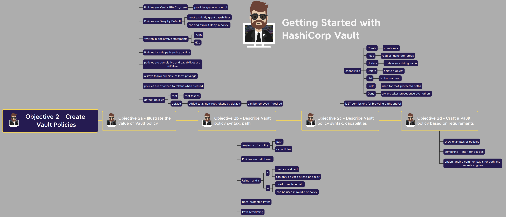

## Overview

Vault policies provide operators a way to **permit or deny access to certain paths or actions** within Vault (RBAC).

- Gives us the ability to **provide granular control** over who gets access to secrets.
- Policies are written in declarative statements and can be written using JSON or HCL.
- When writing policies, always **follow the principal of least privilege**, in other words, give users/applications only the permissions they need.
- Policies are **Deny by Default (implicit deny)** - therefore you must explicitly grant to paths and related capabilities to Vault clients(No policy = no authorization).
- Policies support an **explicit DENY** that takes precedence over any other permission.
- Policies are **attached to a token**. A token can have multiple policies

### policy types

**root policy** is created by default – superuser with all permissions.
- You cannot change nor delete this policy
- Attached to all root tokens

Note: The root policy does not contain any rules but can do anything within Vault. It should be used with **extreme care**.

**default policy** is created by **default** – provides common permissions.
- You can change this policy but it **cannot be deleted**
- **Attached to all non-root tokens** by default (can be removed if needed)

```
vault policy list
valut policy read root
vault policy read default
vault policy write admin-policy /tmp/admin.hcl where, 

policy - type of object you want to work with 
write - sub command
admin-policy - define the name of the policy you want to create
/tmp/admin.hcl - location of the file containing pre-written policy.
```

## Manage vault policies

### cli

Use the vault **policy command** has the below methods to perform management

- delete
- fmt
- list
- read
- write

```
vault policy list
vault policy write webapp /tmp/webapp.hcl
vault policy write packer /tmp/packer.hcl
```

### http API

```
vim payload.json
{"policy": "path \"kv/apps/webapp\" { capabilities… " }}

# curl --header "X-Vault-Token: s.bCEo8HFNIIR8wRGAzwXwkqUk" --request PUT --data @payload.json \
http://127.0.0.1:8200/v1/sys/policy/webapp
```



### permission

You know everything in vault is path based, hence you need to provide access or forbid access to these paths and operations.

```
path "<path>" {
    capabilities = [ "<list of permissions>"]
}

e.g: 

path "kv/data/apps/jenkns" {
    capabilities = [ "read", "update", "delete"]
}
```

## Paths

These are some of the standard paths that are defined in the vault.

```
sys/policy/vault-admin
kv/apps/app01/web
auth/ldap/group/developers
database/creds/prod-db
secrets/data/platform/aws/tools/ansible/app01
sys/rekey
```

### root-protected

- Many paths in Vault require a root token or sudo capability to use
- These paths focus on important/critical paths for Vault or plugins

e.g of root-protected paths:

- auth/token/create-orphan (create an orphan token)
- pki/root/sign-self-issued (sign a self-issued certificate)
- sys/rotate (rotate the encryption key)
- sys/seal (manually seal Vault)
- sys/step-down (force the leader to give up active status)
- sys/rotate (rotate the encryption key)
- sys/seal (manually seal Vault)
- sys/step-down (force the leader to give up active status)

### capabilities

Capabilities define what can we do?
Capabilities are specified as a list of strings (yes, even if there's just one)

|Capability | HTTP Verb |    
|-----------| ----------|
|create | POST/PUT|
|read |GET|
|update |POST/PUT|
|delete |DELETE|
|list |LIST|

|Capability |Description|
|-----------|------------|
|sudo |Allows access to paths that are root-protected |
|deny |Disallows access regardless of any other defined capabilities |

- Create – create a new entry
- Read – read credentials, configurations, etc
- Update – overwrite the existing value of a secret or configuration
- Delete – delete something
- List – view what's there (doesn't allow you to read)
- Sudo – used for root-protected paths
- Deny – deny access – always takes presedence over any other capability

example of deny polict in vault


### customization

The glob (*) is a wildcard and can only be used at the end of a path, can be used to signify anything "after" a path or as part of a pattern.

e.g

secret/apps/application1/* - allows any path after application1
kv/platform/db-* - would match kv/platform/db-2 but not kv/platform/db2

i.e 
secret - Path where the secrets engine is mounted
apps/application1 - Path created on the secrets engine called secret
* - Apply capabilities on anything AFTER application1

```
path "secret/apps/application1/*" {
capabilities = ["read"]
} 
```

Can I read from the following path?
No, because the policy only permits read access for anything AFTER application1, not the path secret/apps/application1 itself.

if you wanted to read, then change the policy...

```
path "secret/apps/application1/*" {
capabilities = ["read"]
}

path "secret/apps/application1" {
capabilities = ["read"]
}
```

The plus (+) supports wildcard matching for a single directory in the path, can be used in multiple path segments (i.e., secret/+/+/db)

e.g
- secret/+/db - matches secret/db2/db or secret/app/db
- kv/data/apps/+/webapp – matches the following:
- kv/data/apps/dev/webapp
- kv/data/apps/qa/webapp
- kv/data/apps/prod/webapp

**secret/data/+/apps/webapp**

secret - Path where the secrets engineis mounted\
data - Used for KV V2 Secrets Engine 
+ - Can be ANY Remaining path value 
apps/webapp - Remaining path

e.g combining + and * in policy. 

```
path "secret/+/+/webapp" {
capabilities = ["read", "list"]
}

path "secret/apps/+/team-*" {
capabilities = ["create", "read"]
}
```