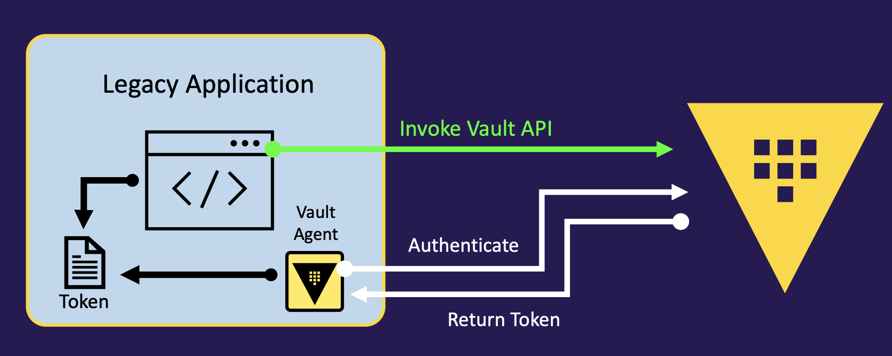
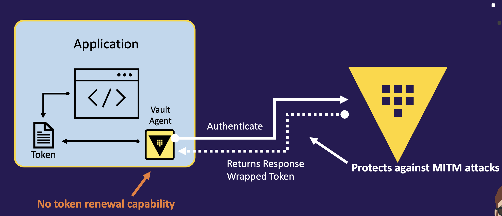
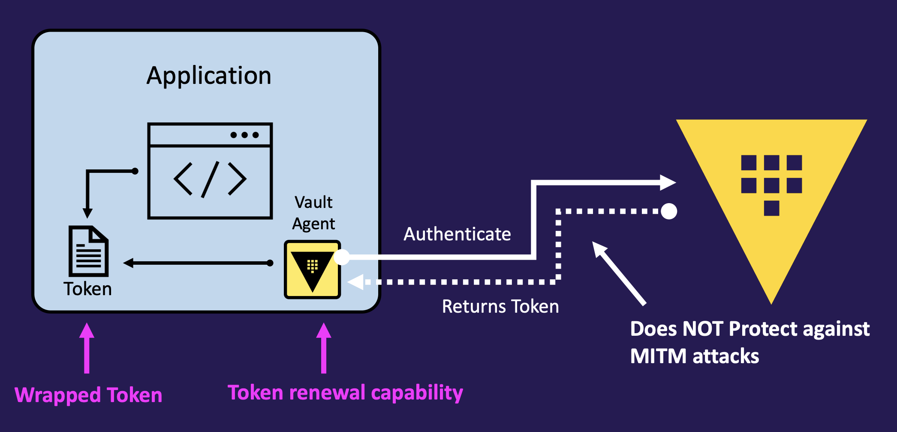
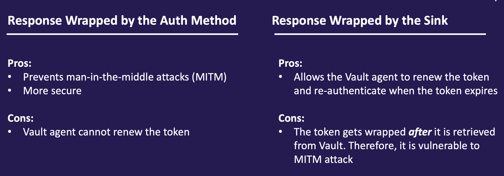
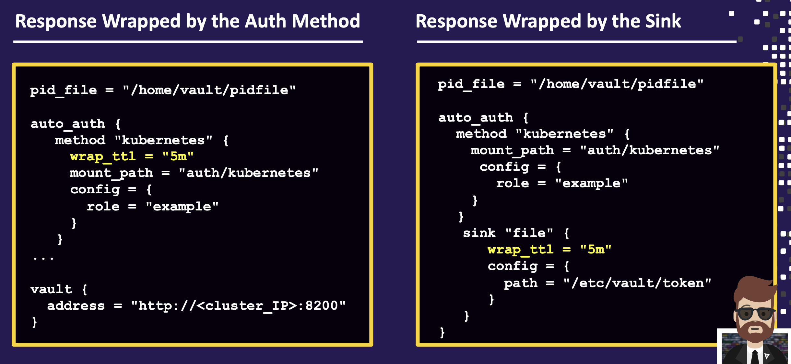
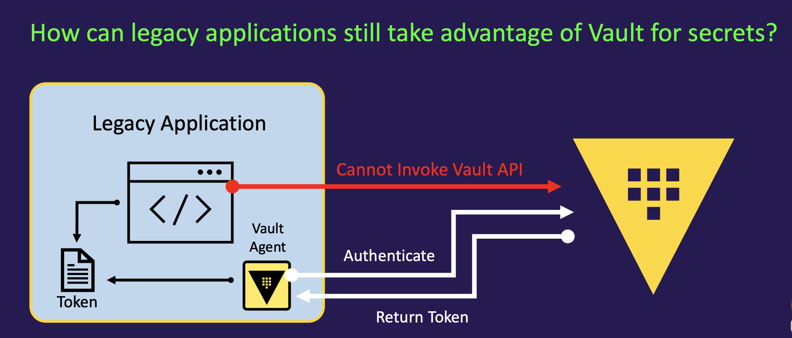
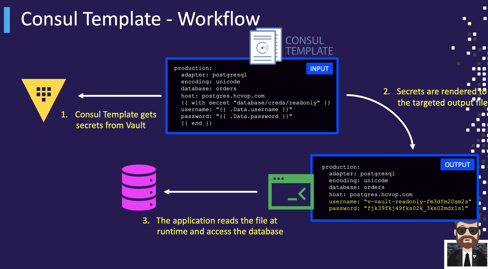
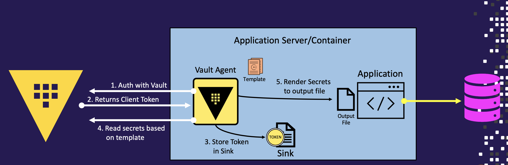
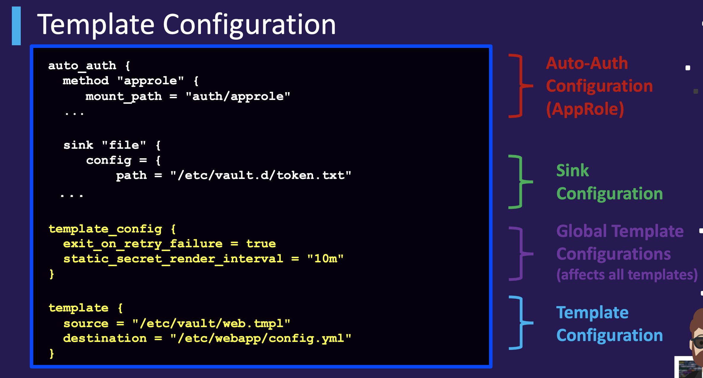

The Vault Agent is a client daemon that runs alongside an application to enable legacy applications to interact and consume secrets.

Vault Agent provides several different features:
- Automatic authentication including renewal
- Secure delivery/storage of tokens (response wrapping)
- Local caching of secrets
- Templating

## auto-auth

- The Vault Agent uses a pre-defined auth method to authenticate to Vault and obtain a token
- The token is stored in the "sink", which is essentially just a flat file on a local file system that contains 
the Vault token
- The application can read this token and invoke the Vault API directly
- This strategy allows the Vault Agent to manage the token and guarantee a valid token is always available to the application



Vault Agent supports many types of auth methods to authenticate and obtain a token. 

Auth methods are generally the methods you'd associate with "machine-oriented" auth methods
- AliCloud
- AppRole
- AWS
- Azure
- Certificate
- CloudFoundary
- GCP
- JWT
- Kerberos
- Kubernetes
- LDAP

**Vault Agent Configuration File**

```
auto_auth {
    method "approle" {
        mount_path = "auth/approle"
        config = {
        role_id_file_path = "<path-to-file>"
        secret_id_file_path = "<path-to-file>"
        }
    }
    sink "file" {
        config = {
        path = "/etc/vault.d/token.txt"
        }
    }
}

vault {
address = "http://<cluster_IP>:8200"
}
```
file is the only supported method of storing the auto-auth token

Common configuration parameters include:
• type – what type of sink to use (again, only file is available)
• path – location of the file
• mode – change the file permissions of the sink file (default is 640)
• wrap_ttl = retrieve the token using response wrapping

### protecting auto-auth

To help secure tokens when using Auth-Auth, you can have Vault response wrap the token when the Vault Agent authenticates
• Response wrapped by the auth method
• Response wrapped by the token sink

The placement of the wrap_ttl in the Vault Agent configuration file determines where the response wrapping happens.









## vault templating



### Consul Template

A standalone application that renders data from Consul or Vault onto the target file system
• https://github.com/hashicorp/consul-template
• Despite its name, Consul Template does not require a Consul cluster to operate

Consul Template retrieves secrets from Vault
• Manages the acquisition and renewal lifecycle
• Requires a valid Vault token to operate

**Consule template workflow**



### vault agent templating

To further extend the functionality of the Vault Agent, a subset of the Consul-Template functionality is directly embedded into the Vault Agent. i.e No need to install the Consul-Template binary on the application server

Vault secrets can be rendered to destination file(s) using the ConsulTemplate markup language, Uses the client token acquired by the auto-auth configuration.



