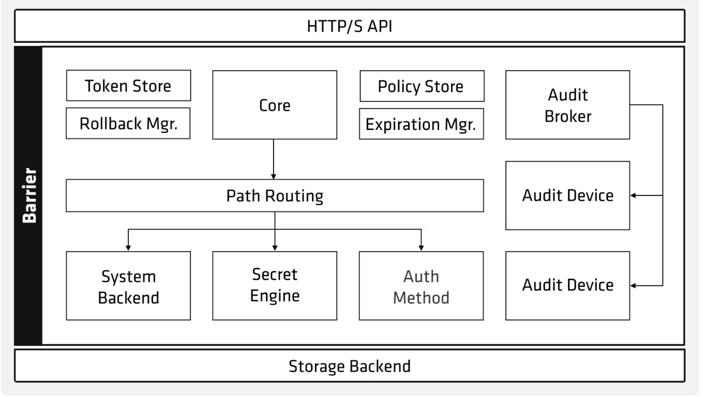

## vault components

### storage backends

The storage stanza configures the storage backend, which represents the location for the durable storage of Vault's information. These are configured in the file and encryted in transit. 

There is only 1 storage backend/cluster

https://developer.hashicorp.com/vault/docs/configuration/storage

### secrets engine 

Secrets engines are components which **store, generate, or encrypt data**. Secrets engines are incredibly flexible, so it is easiest to think about them in terms of their function. Secrets engines are provided some set of data, they take some action on that data, and they return a result.

Some secrets engines simply store and read data - like encrypted Redis/Memcached. Other secrets engines connect to **other services and generate dynamic credentials on demand**(GCP, AWS Secrets etc). Other secrets engines provide encryption as a service, totp generation, certificates, and much more.

Secrets engines are enabled at a **path in Vault**. When a request comes to Vault, the router automatically routes anything with the route prefix to the secrets engine

(secret engine life cycle)[https://developer.hashicorp.com/vault/docs/secrets#secrets-engines-lifecycle]

https://developer.hashicorp.com/vault/docs/secrets


### auth methods

Auth methods are the components in Vault that perform authentication and are responsible for **assigning identity and a set of policies to a user**. In all cases, Vault will enforce authentication as part of the request processing. In most cases, Vault will delegate the authentication administration and decision to the relevant configured external auth method (e.g., Amazon Web Services, GitHub, Google Cloud Platform, Kubernetes, Microsoft Azure, Okta ...).

Once authenticated, vault will issue a client token used to make all subsequent vault requests. 
- The main goal of all auth methods is to obtain a token.
- each token has an associated policy(or policies) and a TTL(token validity)

https://developer.hashicorp.com/vault/docs/auth


### audit devices

Audit devices are the components in Vault that **collectively keep a detailed log of all requests to Vault**, **and their responses**. Because every operation with Vault is an API request/response, when using a single audit device, the audit log contains every interaction with the Vault API, including errors - except for a few paths which do not go via the audit system. 

Each line in the audit log is a JSON object and any sensitive information are hashed before logging.

vault requires at least one audit device to write the log before completing the vault request. - if enabled.

## vault architecture



[vault architecture document](https://developer.hashicorp.com/vault/docs/internals/architecture)

## vault path structure

- Everything in vault is path-based
- path prefix tells vault which component a request should be routed
- secret engines, auth methods, audit devices are "mounts" at a specified path referred as mount
- system backend is default backend in vault which is mounted at the /sys endpoint
- vault components can be enabled at ANY path using --path flag or it does by default path
- vault has few system paths what are resrved and you cannot use it. 
    - auth/  - endpoint for auth methods configs
    - cubbyhole - endpoint for cubbyhole secrets engine
    - identity/ - endpoint for config vault identity
    - secret/  - endpoint used by key/vaulut v2 secrets engine if running in dev mode
    - sys/ - system endpoint for config vault

## vault data protection

How data is stored in vault...

**master key:** 
- used to decrypt the encryption key
- created during vault init or rekey ops
- never written to storage when using traditional **unseal** mechanism
- written to core/master(storage backend) when using **auto unseal**

**encryption key:**
- used to encrypt/decrypt data written to storage backend.
- encrypted by the master key.
- stored alongside the data in a keyring on the storage backend.
- can be easily rotated(manual ops).

### seal/unseal

- vault starts in a **sealed** state, meaning it knows where to access the data and how **but can't decrypt it**, which means there is no read or write etc.. i.e almost no ops are possible when vault in a sealed state.
- unsealing vault means that a node can reconstruct the master key in order to decrypt the encryption key and untilmately read the data, after **unsealing the encryption key is stored in the memory**, it can be unsealed using CLI/UI options
- incase you need to **seal vault** i.e "throw away" the encrytpion key, it requires another **unseal to perform** any further ops. When I need to seal vault ?
  - key shars are exposed
  - detecting of compromise or netwrom intrustions
  - spyware/malware on the vault nodes

### unseal using key shards

We know, by now that master key is required to encrypt "encryption key" to store the data in the backend.. so how do we protect the "master key". It is done by "key shards". In this key shards, vault expects alteast 3 keys to provide to unseal the master key. These key shards would be available to min of 5 members when we init the vault using diff encryption alogrithms. when you are unsealing you will provide equal number of employees to provide their key which is equal to threshold.

As part of security, no single person should have all the key shards, and it should never be stored online.

```
vault status
vault operator init
<vault status set to initialized>
<displays 5 keys along with root token>

vault status
vault operator unseal
<enter any of 3/5 keys from above until status of thershold is met>

vault status

vault login <root-token> # you would authenticate the cluster

vault secrets list
```

### unsealing using auto-unseal

When we have an vault mainteance, or restart of service, vault would seal itself. so we need a place so that it would unseal itself.. 

instead of key shards being with 5 ppl, you would have a key stored in the **cloud services**(KMS) to **encrypt/decrypt the master key**. encrypted master key is stored in the backend in core using KMS, so incase if vault restarts, it would read the encrypted master key using KMS then decrypt the master key which would then decrypt encryption key which will store in the memory to read/write secrets on the vault node.

You can find in the config file `/etc/vault/vault.hcl`

Create a new KMS key and provide an endpoint for `kms_key_id`. That would be sufficient when vault restarts or so, it would use the KMS key to get it unsealed.. 

```
seal "awskms" {
    region = REGION
    kms_key_id = "KMSKEY"
}
```

### unsealing with transit auto-unseal

### pros and cons of unsealing

## vault initialization

### vault configs

## storage backends

## audit devices

## vault interfaces


