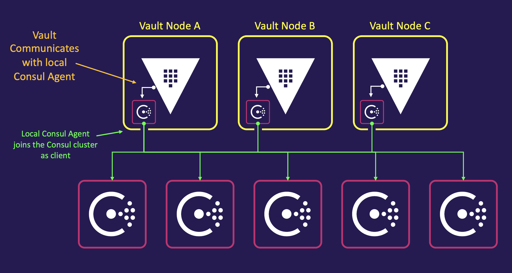
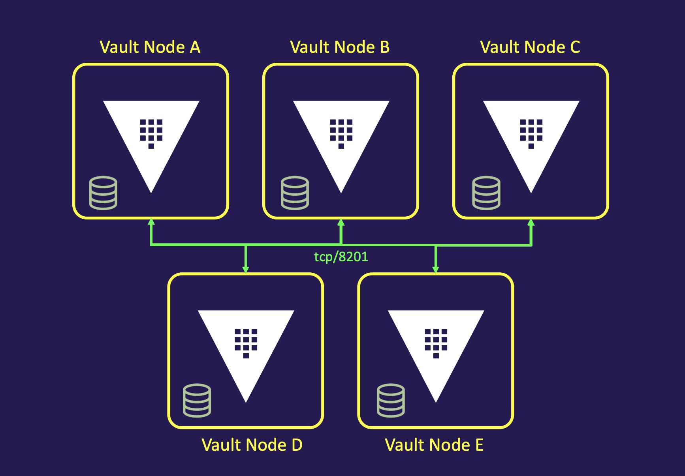

Manage Secrets and Protect Sensitive Data and provides a Single Source of Secrets for both Humans and Machines

**Secret**

- Anything your organization deems sensitive:
- Usernames and passwords
- API keys
- Certificates
- Encryption Keys

**Lifecycle Management for Secrets**

- Eliminates secret sprawl
- Securely store any secret
- Provide governance for access to secrets

Vault has mainly 3 ways you can interact, **CLI, UI and API**

As a human, you would authenticate to vault server with credentials(**username/password | roleid | secretid| tls certs | cloud creds.**.etc), which gives you an **generated token **to carry out certain taks that you need for like (**read/write/delete//list**) to perform some actions(**writing to path or reading from path**) on the applications with certain time limit(TTL).

When we want to retrive the data from path, we would proivde the token generated from auth and vault would validate the below tokens

1. token provided is correct/valid
2. token is not expired
3. token has permission

Once above are successful, you would be retrived the data from th path.

## Benefits

- Store Long-Lived, Static Secrets
- Dynamically Generate Secrets, upon Request
- Fully-Featured API
- Identity-based Access Across different Clouds and Systems
- Provide Encryption as a Service(secret engine)
- Act as a Root or Intermediate Certificate Authority 

## Usecases

- Centralize The Storage Of Secrets  
    - Chef 
    - Jenkins 
    - AWS secrets
    - Azure key

- Migrate to Dynamically Generated Secrets 
    - short-lived
    - follows principle of least priv 
    - auotmatically revoked
    - each system can retrive unique creds
    - prog retrived
    - no human interactions

- Secure Data with a centralized workflow for Encryption Operations (secret engine)
    - transit
    - KMIP
    - Key mgmt
    - transform
  
- Automate the Generation of X.509 Certificates ( can work like PKI)
you would provide an Certificate Request, in which valut would sign and provide the certtficate and key returned

- Migrate to IdentityBased Access

    - Quickly Scale Up and Down
    - Reduce/Eliminate Ticket-based Access
    - Increase Time to Value
  
## Installations

Choose your OS and download the vault server from the below link
https://releases.hashicorp.com/vault/1.15.1/

- Install vault
- Create Configuration file 
- Initialize vault 
- Unseal vault

## Development vault

**features** of development vault server

- Quickly run Vault without configuration
- Automatically initialized and unsealed
- Enables the UI – available at localhost
- Provides an Unseal Key
- AutomaBcally logs in as root
- Non-Persistent – Runs in memory
- Insecure – doesn’t use TLS 
- Sets the listener to 127.0.0.1:8200
- Mounts a K/V v2 Secret Engine
- Provides a root token

**benefits** of development vault server

- POC
- New dev integrations
- testing new vault features
- experiment new features

```
vault server -dev
```

Open another terminal and set the env vars

```
➜  ~ export VAULT_ADDR='http://127.0.0.1:8200'
➜  ~ vault status
Key             Value
---             -----
Seal Type       shamir
Initialized     true
Sealed          false
Total Shares    1
Threshold       1
Version         1.15.1
Build Date      2023-10-20T19:16:11Z
Storage Type    inmem
Cluster Name    vault-cluster-49bd9ee3
Cluster ID      e5a97669-5d1d-386f-5eb3-a72d5b72f744
HA Enabled      false

➜  ~ vault kv put secret/vault/sunil sunil=sunil
```

## Production vault

**features** of production vault server

- Deploy one or more persistent nodes via configuration file
- Use a storage backend that meets the requirements
- Multiple Vault nodes will be configured as a cluster
- Deploy close to your applications
- Most likely, you’ll automate the provisioning of Vault

To start Vault, run the vault `server –config=<file>` command

- In a production environment, you'll have a service manager executing and managing the Vault service (systemctl, Windows Service Manager, etc.)

- For Linux, you also need a systemd file to manage the service for Vault (and Consul if you're running Consul)

follow manual install process for vault incase you need to deploy locally or in cloud.

- Download Vault from HashiCorp
- Unpackage Vault to a Directory
- Set Path to Executable
- Add ConfiguraBon File & Customize
- Create Systemd Service File
- Download Consul from HashiCorp
- Configure and Join Consul Cluster
- Launch Vault Service

## Consul as backend

You can use the two of the storage backends for using vault(storing key/value(KV) pairs) ..
**Consul** is one of them and and then **integrated** storage..

Consule storage uses spearte consul cluster to store key-value pairs for vault, which would store all its key-value pairs on that backend KV store.


**benefits** of consul as backend

|   |   |
|---|---|
|Provides Durable K/V Storage For Vault|Supports High Availability|
|Can Independently Scale Backend| Distributed System |
|Easy To Automate| Built-in Snapshots For Data Retention |
|Built-in Integration Between Consul/Vault|HashiCorp Supported|

They would mainly be 3-5 nodes for HA, but good news from consul is that you can independently scale the backend from vault. incase you want to increase the backend resouces(RAM, CPU ..etc) you never had to touch the vault nodes.

- Consul is deployed using **multiple nodes**(3-5) and configured as a cluster.
- Clusters are deployed in odd numbers (for voting members)
- All data is replicated among all nodes in the cluster, 
- A leader election promotes a single Consul node as the leader
- The leader accepts new logs entries and replicates to all other nodes
- Consul cluster for Vault storage backend shouldn’t be used for Consul functions in a production setting

Note: Consul cluster for vault should not be used for other consul functions like (service discovery, service mesh and network automations etc because you would get **resource constraints**.. )

### Consul deployment



Now, its always recommended that you have **3 vault nodes** you would atleast have **5 consul nodes**. Within the vault we would have **consul agents** listening on vault locally which **join to consul clusters** and it will communicate with consul backend clusters. 

**example consul configs**

```
storage "consul" {
 address = "127.0.0.1:8500"
 path = "vault/"
 token = "1a2b3c4d-1234-abdc-1234-1a2b3c4d5e6a"
}
listener "tcp" {
address = "0.0.0.0:8200"
cluster_address = "0.0.0.0:8201"
tls_disable = 0
tls_cert_file = "/etc/vault.d/client.pem"
tls_key_file = "/etc/vault.d/cert.key"
tls_disable_client_certs = "true"
}
seal "awskms" {
 region = "us-east-1"
 kms_key_id = "12345678-abcd-1234-abcd-123456789101",
 endpoint = "example.kms.us-east-1.vpce.amazonaws.com"
}
api_addr = "https://vault-us-east-1.example.com:8200"
cluster_addr = " https://node-a-us-east-1.example.com:8201"
cluster_name = "vault-prod-us-east-1"
ui = true
log_level = "INFO"
```

```
{
 "log_level": "INFO",
 "server": true,
 "key_file": "/etc/consul.d/cert.key",
 "cert_file": "/etc/consul.d/client.pem",
 "ca_file": "/etc/consul.d/chain.pem",
 "verify_incoming": true,
 "verify_outgoing": true,
 "verify_server_hostname": true,
 "ui": true,
 "encrypt": "xxxxxxxxxxxxxx",
 "leave_on_terminate": true,
 "data_dir": "/opt/consul/data",
 "datacenter": "us-east-1",
 "client_addr": "0.0.0.0",
 "bind_addr": "10.11.11.11",
 "advertise_addr": "10.11.11.11",
 "bootstrap_expect": 5,
 "retry_join": ["provider=aws tag_key=Environment-Name tag_value=consul-cluster region=us-east-1"],
 "enable_syslog": true,
 "acl": {
 "enabled": true,
 "default_policy": "deny",
 "down_policy": "extend-cache",
 "tokens": {
 "agent": "xxxxxxxx-xxxx-xxxx-xxxx-xxxxxxxxxxxx"
 }
},
 "performance": {
 "raft_multiplier": 1
 }
}
```

## local storage as backend

|   |   |
|---|---|
|Vault Internal Storage Option | Supports High Availability|
|Leverages RaG Consensus Protocol|Only need to troubleshoot Vault|
|All Vault nodes have copy of Vault's Data|Built-in Snapshots For Data Retention|
|Eliminates Network Hop to Consul|HashiCorp Supported|

### local deployment 

- Integrated Storage (aka Raft) allows Vault nodes to provide its own replicated storage across the Vault nodes within a cluster.
- Define a **local path to store** replicated data.
- All data is replicated among all nodes in the cluster.
- Eliminates the need to also run a Consul cluster and manage it.



You would have 1 leader and rest other followers, but make sure to proivde the **node_id** uniquely so that you won't mess up the data. you would see the **raft** as storage

```
storage "raft" {
 path = "/opt/vault/data"
 node_id = "node-a-us-east-1.example.com"
 retry_join {
 auto_join = "provider=aws region=us-east-1 tag_key=vault tag_value=us-east-1"
 }
}
listener "tcp" {
address = "0.0.0.0:8200"
cluster_address = "0.0.0.0:8201"
tls_disable = 0
tls_cert_file = "/etc/vault.d/client.pem"
tls_key_file = "/etc/vault.d/cert.key"
tls_disable_client_certs = "true"
}
seal "awskms" {
 region = "us-east-1"
 kms_key_id = "12345678-abcd-1234-abcd-123456789101",
 endpoint = "example.kms.us-east-1.vpce.amazonaws.com"
}
api_addr = "https://vault-us-east-1.example.com:8200"
cluster_addr = " https://node-a-us-east-1.example.com:8201"
cluster_name = "vault-prod-us-east-1"
ui = true
log_level = "INFO"
```

Manually join the standby ndoes to the cluster

```
vault operator raft join https://active_node.example.com:8200
vault operator raft list-peers
```

**References:**

- https://hashicorp.com/certification/vault-associate
- https://learn.hashicorp.com/tutorials/vault/associate-study
- https://vaultproject.io/docs
- https://vaultproject.io/api-docs